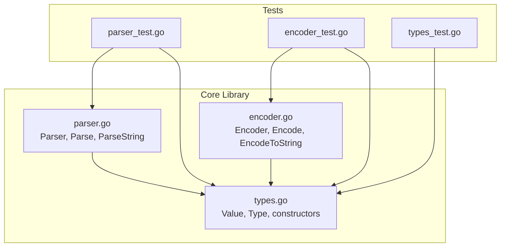
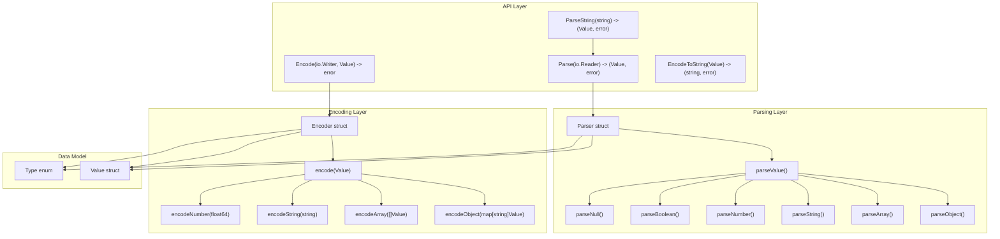
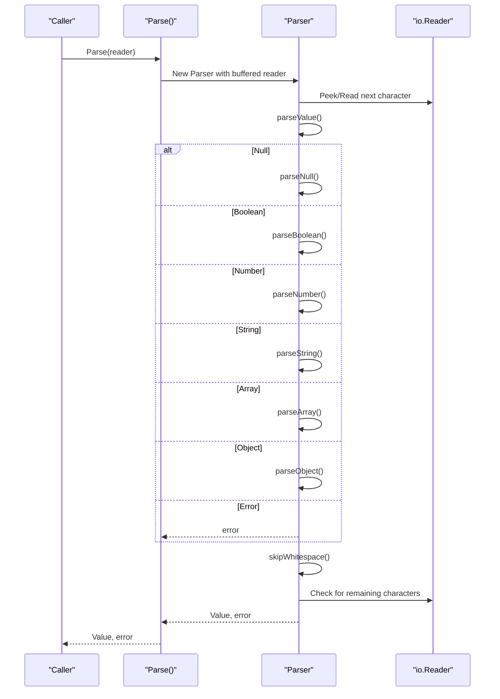
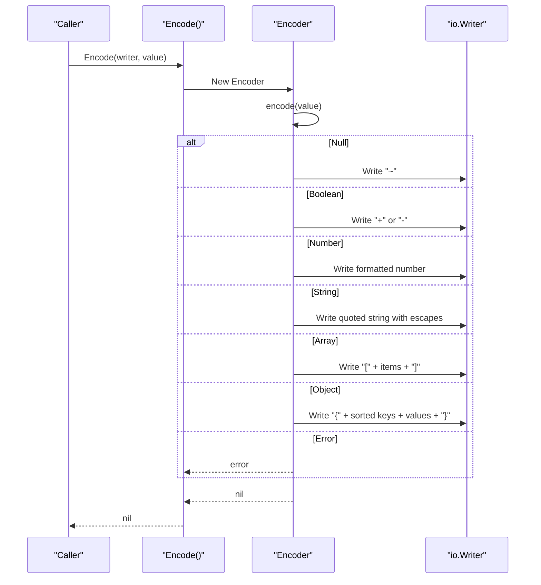
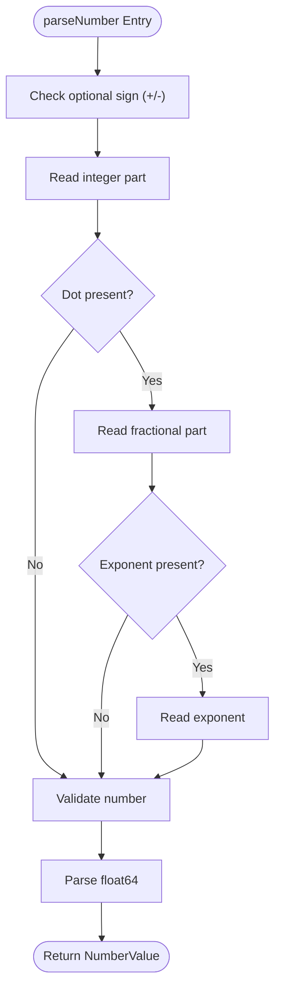
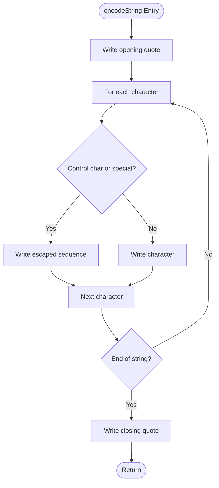
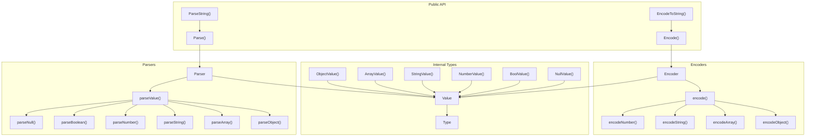

# API Reference

<cite>
**Referenced Files in This Document**
- [parser.go](file://parser.go)
- [encoder.go](file://encoder.go)
- [types.go](file://types.go)
- [parser_test.go](file://parser_test.go)
- [encoder_test.go](file://encoder_test.go)
- [types_test.go](file://types_test.go)
- [go.mod](file://go.mod)
</cite>

## Table of Contents
1. [Introduction](#introduction)
2. [Project Structure](#project-structure)
3. [Core Components](#core-components)
4. [Architecture Overview](#architecture-overview)
5. [Detailed Component Analysis](#detailed-component-analysis)
6. [Dependency Analysis](#dependency-analysis)
7. [Performance Considerations](#performance-considerations)
8. [Troubleshooting Guide](#troubleshooting-guide)
9. [Conclusion](#conclusion)

## Introduction
This document provides comprehensive API documentation for the go-toon library, a high-performance Token-Oriented Object Notation (TOON) implementation for Go. TOON is designed to save up to 40% LLM tokens compared to JSON, offering a compact textual format for structured data with a simple grammar and efficient parsing/encoding.

The library exposes three primary APIs:
- Core parsing API: Parse() and ParseString() for converting TOON data into strongly-typed Value instances
- Encoding API: Encode() and EncodeToString() for serializing Value instances back to TOON format
- Advanced unmarshaling API: Value methods for accessing nested data structures and performing type-safe conversions

The documentation covers function signatures, parameters, return values, error handling, usage examples, and performance considerations.

## Project Structure
The repository consists of four main source files and associated tests:
- parser.go: Implements the TOON parser with streaming support and robust error reporting
- encoder.go: Implements the TOON encoder with streaming capabilities and deterministic output
- types.go: Defines the Value type system and constructors for all supported types
- Tests: Comprehensive coverage validating parsing, encoding, round-trip behavior, and error conditions



**Diagram sources**
- [parser.go](file://parser.go#L1-L411)
- [encoder.go](file://encoder.go#L1-L192)
- [types.go](file://types.go#L1-L209)
- [parser_test.go](file://parser_test.go#L1-L414)
- [encoder_test.go](file://encoder_test.go#L1-L376)
- [types_test.go](file://types_test.go#L1-L197)

**Section sources**
- [parser.go](file://parser.go#L1-L411)
- [encoder.go](file://encoder.go#L1-L192)
- [types.go](file://types.go#L1-L209)
- [parser_test.go](file://parser_test.go#L1-L414)
- [encoder_test.go](file://encoder_test.go#L1-L376)
- [types_test.go](file://types_test.go#L1-L197)
- [go.mod](file://go.mod#L1-L4)

## Core Components
This section documents the fundamental types and their roles in the TOON ecosystem.

### Type System
The Type enumeration defines the six supported value categories:
- Null: Represents absence of value
- Boolean: True/false values
- Number: Numeric values (integers and floats)
- String: Text values with full Unicode support
- Array: Ordered sequences of values
- Object: Key-value mappings with string keys

Each Type has a String() method returning human-readable names for debugging and logging.

### Value Representation
The Value struct encapsulates a single TOON value with:
- Type discriminant
- Primitive fields for boolean, number, and string values
- Complex fields for arrays and objects

Value provides type-safe getters (Bool(), Number(), String(), Array(), Object()) and convenience methods (IsNull(), IsBool(), IsNumber(), IsString(), IsArray(), IsObject(), Get(), Index(), Len()).

### Constructors
Factory functions create Value instances for each type:
- NullValue(): Creates a null value
- BoolValue(bool): Creates a boolean value
- NumberValue(float64): Creates a numeric value
- StringValue(string): Creates a string value
- ArrayValue(...Value): Creates an array value
- ObjectValue(map[string]Value): Creates an object value

These constructors enable programmatic construction of TOON data structures.

**Section sources**
- [types.go](file://types.go#L9-L45)
- [types.go](file://types.go#L47-L59)
- [types.go](file://types.go#L61-L176)
- [types.go](file://types.go#L178-L209)

## Architecture Overview
The TOON library follows a layered architecture:
- Data Model Layer: Value and Type define the in-memory representation
- Parsing Layer: Parser consumes io.Reader streams and produces Value instances
- Encoding Layer: Encoder converts Value instances to TOON text via io.Writer
- API Layer: Public functions provide convenient entry points for common operations



**Diagram sources**
- [parser.go](file://parser.go#L12-L16)
- [parser.go](file://parser.go#L18-L38)
- [parser.go](file://parser.go#L40-L70)
- [encoder.go](file://encoder.go#L10-L13)
- [encoder.go](file://encoder.go#L15-L29)
- [encoder.go](file://encoder.go#L31-L51)
- [types.go](file://types.go#L9-L25)
- [types.go](file://types.go#L47-L59)

## Detailed Component Analysis

### Core Parsing API

#### Parse(r io.Reader) -> (Value, error)
Parses TOON data from an io.Reader stream and returns a Value plus any parsing error encountered.

Parameters:
- r io.Reader: Stream containing TOON-formatted data

Returns:
- Value: The parsed TOON value
- error: Error if parsing fails (e.g., invalid syntax, unexpected EOF)

Behavior:
- Wraps the reader in a buffered reader for efficient parsing
- Parses a single top-level value
- Validates that only whitespace remains after parsing the value
- Supports all TOON constructs: null, booleans, numbers, strings, arrays, and objects

Common errors:
- Unexpected token after value: Indicates trailing non-whitespace characters
- Unexpected EOF: Indicates incomplete input
- Invalid number format: Malformed numeric literals
- Unescaped string terminators: Unterminated strings or invalid escape sequences
- Unbalanced brackets: Missing closing delimiters for arrays/objects

Example usage patterns:
- Reading from files, network connections, or in-memory buffers
- Streaming parsing of large TOON documents
- Integration with existing io.Reader-based systems

**Section sources**
- [parser.go](file://parser.go#L18-L33)

#### ParseString(s string) -> (Value, error)
Convenience wrapper around Parse() that accepts a string directly.

Parameters:
- s string: TOON-formatted string

Returns:
- Value: The parsed TOON value
- error: Error if parsing fails

Behavior:
- Converts the string to a strings.Reader and delegates to Parse()

Example usage:
- Testing and quick prototyping
- Working with string literals in code

**Section sources**
- [parser.go](file://parser.go#L35-L38)

### Encoding API

#### Encode(w io.Writer, v Value) -> error
Encodes a Value to TOON format and writes it to an io.Writer.

Parameters:
- w io.Writer: Destination for TOON output
- v Value: Value to encode

Returns:
- error: Error if encoding fails

Behavior:
- Recursively encodes values based on their Type
- Writes deterministically formatted output
- Handles special characters and control characters in strings
- Uses identifier syntax for object keys when possible

Output format specifications:
- Null: "~"
- Boolean: "+" for true, "-" for false
- Number: Integers written without decimal point; floats include fractional part
- String: Enclosed in double quotes with proper escaping
- Array: "[item1 item2 ...]"
- Object: "{key1 value1 key2 value2 ...}" with sorted keys

Streaming capabilities:
- Supports any io.Writer, enabling streaming to files, network sockets, or memory buffers
- Encodes values incrementally without buffering entire documents

**Section sources**
- [encoder.go](file://encoder.go#L15-L19)

#### EncodeToString(v Value) -> (string, error)
Encodes a Value to a TOON string.

Parameters:
- v Value: Value to encode

Returns:
- string: TOON-formatted string
- error: Error if encoding fails

Behavior:
- Uses a strings.Builder internally
- Delegates to Encode() for actual encoding

Example usage:
- Building TOON messages for logging or testing
- Converting Value instances to string for transport

**Section sources**
- [encoder.go](file://encoder.go#L21-L29)

### Advanced Unmarshaling API

#### Value Methods for Struct/Slice Binding
While the library does not provide a direct Unmarshal() function, Value offers methods that enable safe and ergonomic access to nested data:

- Type() Type: Returns the value's type discriminator
- IsNull(), IsBool(), IsNumber(), IsString(), IsArray(), IsObject(): Type predicates
- Bool(), Number(), String(), Array(), Object(): Type-safe getters (panic if type mismatch)
- Get(key string) Value: Access object properties safely (returns null for missing keys)
- Index(i int) Value: Access array elements safely (returns null for invalid indices)
- Len() int: Length of arrays and objects (0 for primitives)

Usage patterns:
- Check type with IsX() methods before calling X() getters
- Use Get() and Index() for safe navigation of nested structures
- Combine with constructors to build new Value instances programmatically

**Section sources**
- [types.go](file://types.go#L61-L176)

### Parser Internals

#### Parser struct and Methods
The Parser type manages state during parsing:
- r *bufio.Reader: Buffered input stream
- pos int: Current position for error reporting

Key internal methods:
- parseValue(): Dispatches to appropriate parser based on lookahead
- parseNull(), parseBoolean(), parseNumber(), parseString(), parseArray(), parseObject(): Parse specific value types
- parseKey(): Parses object keys (identifiers or quoted strings)
- parseUnicodeEscape(): Handles Unicode escape sequences
- skipWhitespace(), peek(), peekAhead(n), read(): Low-level stream manipulation

Error handling:
- Comprehensive error messages with context
- Position tracking for precise error reporting
- Graceful handling of EOF and malformed input

**Section sources**
- [parser.go](file://parser.go#L12-L16)
- [parser.go](file://parser.go#L40-L70)
- [parser.go](file://parser.go#L366-L410)

### Encoder Internals

#### Encoder struct and Methods
The Encoder type manages state during encoding:
- w io.Writer: Output destination

Key internal methods:
- encode(): Dispatches to appropriate encoder based on value type
- encodeNumber(): Formats numbers (integers vs floats)
- encodeString(): Escapes strings and handles control characters
- encodeArray(): Encodes arrays with space-separated items
- encodeObject(): Encodes objects with sorted keys and identifier syntax when possible
- isIdentifier(): Determines if a string can be used as an identifier

Deterministic output:
- Object keys are sorted to produce consistent output
- Numbers are formatted for minimal representation
- Strings use shortest valid escape sequences

**Section sources**
- [encoder.go](file://encoder.go#L10-L13)
- [encoder.go](file://encoder.go#L31-L51)
- [encoder.go](file://encoder.go#L170-L191)

## Architecture Overview

### Parsing Workflow


**Diagram sources**
- [parser.go](file://parser.go#L18-L33)
- [parser.go](file://parser.go#L40-L70)

### Encoding Workflow


**Diagram sources**
- [encoder.go](file://encoder.go#L15-L19)
- [encoder.go](file://encoder.go#L31-L51)

## Detailed Component Analysis

### Error Types and Handling

#### Parser Errors
The parser returns descriptive errors for various failure modes:
- Unexpected token after value: Indicates trailing non-whitespace after top-level value
- Unexpected EOF: Indicates incomplete input
- Invalid number: Malformed numeric literal (e.g., empty, only sign)
- Expected X: Mismatched delimiters or missing tokens
- Unterminated string/escape sequence: Incomplete string or escape sequence
- Invalid escape sequence: Unsupported escape sequence
- Unbalanced brackets: Missing closing delimiter for arrays/objects
- Unexpected EOF while parsing key: Incomplete object key

#### Encoder Errors
The encoder primarily propagates underlying io.Writer errors:
- Write failures: Errors from the destination writer
- Unknown type: Internal error if Value.Type() returns unexpected value

#### Value Getter Panics
Type-specific getters (Bool(), Number(), String(), Array(), Object()) panic if called on incompatible types. This design choice enables:
- Clear contract violations at runtime
- Efficient access without error checking in hot paths
- Safe usage when types are known beforehand

Best practices:
- Use IsX() predicates before calling X() getters
- Wrap panicking calls in defer/recover when interfacing with external code
- Prefer Get() and Index() for safe navigation of unknown structures

**Section sources**
- [parser.go](file://parser.go#L26-L32)
- [parser.go](file://parser.go#L44-L46)
- [parser.go](file://parser.go#L76-L78)
- [parser.go](file://parser.go#L93-L95)
- [parser.go](file://parser.go#L164-L167)
- [parser.go](file://parser.go#L181-L183)
- [parser.go](file://parser.go#L266-L268)
- [parser.go](file://parser.go#L296-L298)
- [parser.go](file://parser.go#L330-L331)
- [parser.go](file://parser.go#L359-L361)
- [parser.go](file://parser.go#L381-L384)
- [parser.go](file://parser.go#L389-L392)
- [parser.go](file://parser.go#L398-L401)
- [encoder.go](file://encoder.go#L48-L50)
- [types.go](file://types.go#L98-L103)
- [types.go](file://types.go#L107-L112)
- [types.go](file://types.go#L116-L121)
- [types.go](file://types.go#L124-L130)
- [types.go](file://types.go#L133-L139)

### Practical Usage Examples

#### Basic Parsing
```go
// From string
val, err := ParseString(`{"name":"Alice","age":30}`)
if err != nil {
    // handle error
}

// From file
file, _ := os.Open("data.toon")
defer file.Close()
val, err = Parse(file)
if err != nil {
    // handle error
}
```

#### Safe Navigation
```go
// Safe property access
name := val.Get("name")
if name.IsString() {
    fmt.Println(name.String())
}

// Safe array access
users := val.Get("users")
if users.IsArray() {
    first := users.Index(0)
    if first.IsObject() {
        fmt.Println(first.Get("name").String())
    }
}
```

#### Encoding Values
```go
// Build a complex structure
obj := ObjectValue(map[string]Value{
    "users": ArrayValue(
        ObjectValue(map[string]Value{
            "name": StringValue("Alice"),
            "age":  NumberValue(30),
        }),
        ObjectValue(map[string]Value{
            "name": StringValue("Bob"),
            "age":  NumberValue(25),
        }),
    ),
    "count": NumberValue(2),
})

// Encode to string
toonStr, err := EncodeToString(obj)
if err != nil {
    // handle error
}
fmt.Println(toonStr) // "{users [[name Alice age 30] [name Bob age 25]] count 2}"
```

#### Round-trip Validation
```go
original := ParseString(`{"test":true,"values":[1,2,3]}`)
encoded, _ := EncodeToString(original)
decoded, _ := ParseString(encoded)
// original and decoded should be equivalent
```

**Section sources**
- [parser_test.go](file://parser_test.go#L357-L399)
- [encoder_test.go](file://encoder_test.go#L244-L303)
- [encoder_test.go](file://encoder_test.go#L322-L375)
- [types_test.go](file://types_test.go#L109-L135)

### Data Flow and Processing Logic

#### Number Parsing Algorithm


**Diagram sources**
- [parser.go](file://parser.go#L98-L170)

#### String Encoding Algorithm


**Diagram sources**
- [encoder.go](file://encoder.go#L61-L94)

## Dependency Analysis



**Diagram sources**
- [parser.go](file://parser.go#L18-L38)
- [parser.go](file://parser.go#L40-L70)
- [encoder.go](file://encoder.go#L15-L29)
- [encoder.go](file://encoder.go#L31-L51)
- [types.go](file://types.go#L47-L59)
- [types.go](file://types.go#L178-L209)

**Section sources**
- [parser.go](file://parser.go#L1-L411)
- [encoder.go](file://encoder.go#L1-L192)
- [types.go](file://types.go#L1-L209)

## Performance Considerations

### Memory Efficiency
- Parser uses a buffered reader to minimize system calls
- Encoder uses strings.Builder for efficient string building
- Value stores primitive values inline, avoiding unnecessary allocations
- Arrays and objects store references to child values, enabling shared ownership

### CPU Optimization
- Single-pass parsing with minimal branching
- Direct character classification using helper functions
- Deterministic object key ordering for consistent hashing
- Specialized number parsing avoiding expensive conversions

### Streaming Capabilities
- Both Parse() and Encode() accept io.Reader/io.Writer, enabling streaming
- No intermediate buffering for large documents
- Suitable for network protocols and real-time data processing

### Best Practices
- Use ParseString() for small, known strings; Parse() for large streams
- Prefer EncodeToString() for small values; Encode() for streaming large outputs
- Reuse Value instances when building complex structures
- Use Get() and Index() for safe navigation to avoid repeated type checks

## Troubleshooting Guide

### Common Parsing Errors
- "Unexpected token after value": Remove trailing characters or whitespace
- "Unexpected EOF": Ensure complete input; check for premature stream closure
- "Invalid number": Verify numeric format; remove extra characters
- "Unterminated string": Check for missing closing quotes
- "Unbalanced brackets": Ensure all arrays and objects are properly closed

### Common Encoding Errors
- Write failures: Check destination writer availability and permissions
- Unknown type: Verify Value.Type() returns a supported type

### Debugging Strategies
- Enable logging around Parse() and Encode() calls
- Use small test cases to isolate issues
- Leverage round-trip testing to validate correctness
- Inspect Value.Type() and individual field access patterns

### Error Recovery Patterns
- Wrap external IO operations with retry logic
- Validate input before parsing to fail fast
- Use defer/recover when interfacing with untrusted code
- Implement circuit breakers for high-throughput scenarios

**Section sources**
- [parser_test.go](file://parser_test.go#L8-L42)
- [parser_test.go](file://parser_test.go#L44-L82)
- [parser_test.go](file://parser_test.go#L84-L126)
- [parser_test.go](file://parser_test.go#L128-L169)
- [parser_test.go](file://parser_test.go#L171-L246)
- [parser_test.go](file://parser_test.go#L248-L355)
- [parser_test.go](file://parser_test.go#L401-L413)
- [encoder_test.go](file://encoder_test.go#L9-L18)
- [encoder_test.go](file://encoder_test.go#L20-L42)
- [encoder_test.go](file://encoder_test.go#L44-L70)
- [encoder_test.go](file://encoder_test.go#L72-L100)
- [encoder_test.go](file://encoder_test.go#L102-L147)
- [encoder_test.go](file://encoder_test.go#L149-L242)
- [encoder_test.go](file://encoder_test.go#L244-L303)
- [encoder_test.go](file://encoder_test.go#L305-L320)
- [encoder_test.go](file://encoder_test.go#L322-L375)

## Conclusion
The go-toon library provides a robust, high-performance implementation of TOON for Go applications. Its clean API design, comprehensive error handling, and streaming capabilities make it suitable for a wide range of use cases from simple configuration files to high-throughput data interchange protocols.

Key strengths:
- Minimal memory footprint with streaming support
- Deterministic output for consistent hashing and caching
- Comprehensive type safety with clear error messages
- Easy integration with existing Go codebases

The library's design prioritizes performance and reliability while maintaining simplicity and readability. By following the best practices outlined in this documentation, developers can effectively leverage TOON's advantages in token efficiency and parsing speed for their applications.