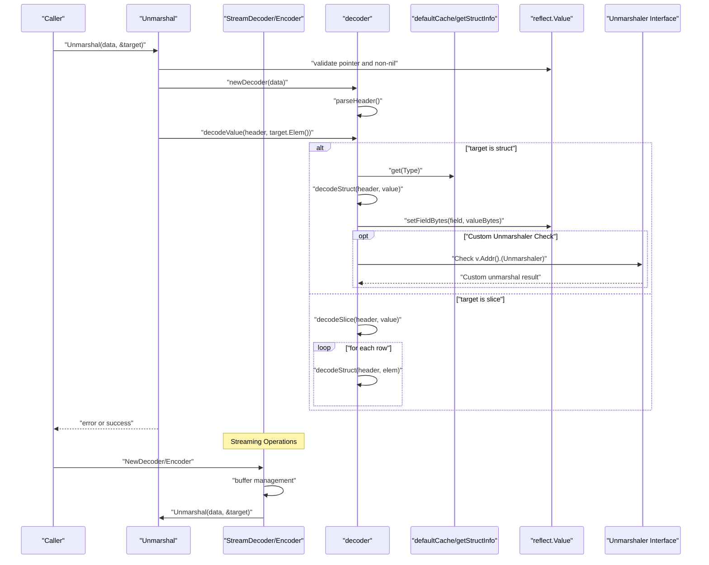
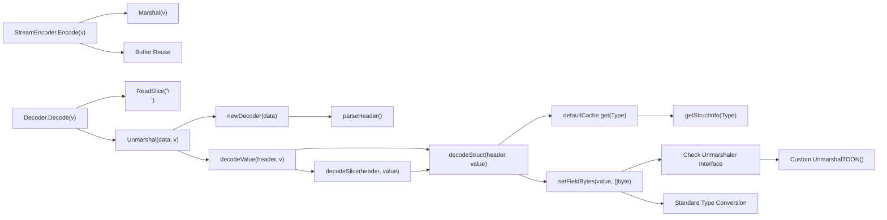

# Advanced Unmarshaling API

<cite>
**Referenced Files in This Document**
- [toon.go](file://toon.go)
- [decoder.go](file://decoder.go)
- [stream.go](file://stream.go)
- [cache.go](file://cache.go)
- [marshal.go](file://marshal.go)
- [custom_test.go](file://custom_test.go)
- [decoder_test.go](file://decoder_test.go)
- [stream_test.go](file://stream_test.go)
- [cache_test.go](file://cache_test.go)
- [marshal_test.go](file://marshal_test.go)
- [go.mod](file://go.mod)
- [example/_toon.go](file://example/_toon.go)
- [cmd/toongen/main.go](file://cmd/toongen/main.go)
</cite>

## Update Summary
**Changes Made**
- Added comprehensive documentation for the new Unmarshaler interface capability
- Updated the setFieldBytes function documentation to reflect custom unmarshaling logic
- Added practical examples of implementing custom unmarshaling logic
- Documented the toongen tool's automatic UnmarshalTOON method generation
- Enhanced error handling documentation to cover custom unmarshaler errors

## Table of Contents
1. [Introduction](#introduction)
2. [Project Structure](#project-structure)
3. [Core Components](#core-components)
4. [Architecture Overview](#architecture-overview)
5. [Detailed Component Analysis](#detailed-component-analysis)
6. [Streaming Decoder Implementation](#streaming-decoder-implementation)
7. [Custom Unmarshaler Interface](#custom-unmarshaler-interface)
8. [Dependency Analysis](#dependency-analysis)
9. [Performance Considerations](#performance-considerations)
10. [Troubleshooting Guide](#troubleshooting-guide)
11. [Conclusion](#conclusion)
12. [Appendices](#appendices)

## Introduction
This document provides comprehensive API documentation for the advanced unmarshaling functionality in the go-toon library. It focuses on the Unmarshal() function that binds TOON v3.0 data to Go structs and slices using reflection, as well as the new streaming decoder implementation for high-performance IO operations. It explains the struct field mapping system, TOON v3.0 specification compliance, and field tagging mechanisms. 

**Updated** The documentation now includes the new Unmarshaler interface capability, which allows developers to implement custom deserialization logic for their types. This enhancement provides fine-grained control over how specific fields are parsed from TOON data, enabling complex data transformations and validation.

It also covers the struct field mapping cache for performance optimization, including cache invalidation and memory management, reflection-based binding patterns, type conversion rules, and error handling for malformed data. Practical examples demonstrate struct embedding, pointer handling, slice binding, and custom field mappings. Finally, it provides performance considerations, cache utilization strategies, and best practices for high-throughput applications, along with common pitfalls and debugging techniques.

## Project Structure
The go-toon library is organized around a small set of focused packages:
- Core constants, errors, and interfaces including the new Unmarshaler interface
- Decoder implementation for parsing TOON v3.0 and binding to Go values with custom unmarshaler support
- Streaming decoder/encoder for high-performance IO operations
- Struct field mapping cache for reflection metadata
- Encoder implementation for TOON v3.0 serialization (complementary to unmarshaling)
- Tests validating behavior and performance, including custom unmarshaler examples
- Command-line tool for generating TOON methods automatically

```mermaid
graph TB
subgraph "Package toon"
T["toon.go<br/>constants, errors, interfaces<br/>Unmarshaler interface"]
D["decoder.go<br/>Unmarshal, decoder, setFieldBytes<br/>Custom Unmarshaler support"]
S["stream.go<br/>StreamEncoder, Decoder"]
C["cache.go<br/>structInfo, fieldMap, cache"]
M["marshal.go<br/>Marshal, encoder"]
CT["custom_test.go<br/>Custom Unmarshaler examples"]
DT["decoder_test.go<br/>decoder tests"]
ST["stream_test.go<br/>streaming tests"]
CTEST["cache_test.go<br/>cache tests"]
MT["marshal_test.go<br/>marshal tests"]
END
subgraph "Command-line Tools"
TG["cmd/toongen/main.go<br/>Automatic UnmarshalTOON generation"]
EX["_toon.go<br/>Generated examples"]
END
T --> D
D --> C
S --> D
M --> C
CT --> T
DT --> D
ST --> S
CTEST --> C
MT --> D
MT --> M
TG --> EX
```

**Diagram sources**
- [toon.go](file://toon.go#L1-L29)
- [decoder.go](file://decoder.go#L1-L424)
- [stream.go](file://stream.go#L1-L117)
- [cache.go](file://cache.go#L1-L112)
- [marshal.go](file://marshal.go#L1-L172)
- [custom_test.go](file://custom_test.go#L1-L162)
- [decoder_test.go](file://decoder_test.go#L1-L163)
- [stream_test.go](file://stream_test.go#L1-L136)
- [cache_test.go](file://cache_test.go#L1-L86)
- [marshal_test.go](file://marshal_test.go#L1-L147)
- [cmd/toongen/main.go](file://cmd/toongen/main.go#L55-L90)
- [example/_toon.go](file://example/_toon.go#L1-L163)

**Section sources**
- [go.mod](file://go.mod#L1-L4)
- [toon.go](file://toon.go#L1-L29)
- [decoder.go](file://decoder.go#L1-L424)
- [stream.go](file://stream.go#L1-L117)
- [cache.go](file://cache.go#L1-L112)
- [marshal.go](file://marshal.go#L1-L172)
- [custom_test.go](file://custom_test.go#L1-L162)
- [decoder_test.go](file://decoder_test.go#L1-L163)
- [stream_test.go](file://stream_test.go#L1-L136)
- [cache_test.go](file://cache_test.go#L1-L86)
- [marshal_test.go](file://marshal_test.go#L1-L147)
- [cmd/toongen/main.go](file://cmd/toongen/main.go#L55-L90)
- [example/_toon.go](file://example/_toon.go#L1-L163)

## Core Components
- Unmarshal(): Entry point to parse TOON v3.0 data into a Go value. It validates the target, parses the header, and delegates decoding to the appropriate branch.
- decoder: A streaming parser that reads TOON tokens without allocations, supporting header parsing, size parsing, field lists, and whitespace skipping. **Updated** Now includes custom Unmarshaler interface detection.
- StreamEncoder: High-performance encoder that writes TOON-encoded values to an output stream with buffer reuse.
- Decoder: High-performance decoder that reads TOON-encoded values from an input stream with line-based parsing.
- setFieldBytes(): Converts string values to Go types and assigns them to reflect.Value instances. **Updated** Checks for Unmarshaler interface before standard type conversion.
- structInfo and fieldMap: Reflection metadata built from struct tags and field names, cached via a concurrent map.
- cache: Thread-safe cache for structInfo keyed by reflect.Type, enabling fast field mapping lookups.
- marshal.go: Complementary TOON v3.0 encoder that demonstrates field mapping semantics and tag usage.
- Unmarshaler interface: **New** Interface allowing types to implement custom deserialization logic.

Key API surfaces:
- Unmarshal(data []byte, v interface{}) error
- StreamEncoder.Encode(v interface{}) error
- Decoder.Decode(v interface{}) error
- decoder.parseHeader(), parseSize(), parseFields()
- setFieldBytes(v reflect.Value, b []byte) error **Updated** with Unmarshaler support
- getStructInfo(t reflect.Type) *structInfo
- defaultCache.get(t reflect.Type) fieldMap
- Unmarshaler.UnmarshalTOON(data []byte) error **New**

**Section sources**
- [decoder.go](file://decoder.go#L7-L21)
- [decoder.go](file://decoder.go#L277-L317)
- [toon.go](file://toon.go#L25-L28)
- [stream.go](file://stream.go#L8-L37)
- [stream.go](file://stream.go#L39-L103)
- [cache.go](file://cache.go#L24-L38)
- [cache.go](file://cache.go#L76-L112)
- [marshal.go](file://marshal.go#L17-L38)
- [marshal.go](file://marshal.go#L45-L65)
- [marshal.go](file://marshal.go#L67-L93)
- [marshal.go](file://marshal.go#L95-L137)
- [marshal.go](file://marshal.go#L139-L171)

## Architecture Overview
The unmarshaling pipeline follows a clean separation of concerns with dual implementations and enhanced custom unmarshaler support:
- Input validation ensures the target is a pointer to a struct or slice.
- Header parsing extracts the type name, optional size, and field list.
- Decoding branches into struct or slice handling.
- Struct decoding uses cached field mappings to locate fields by name and convert values.
- **Updated** Custom unmarshaler detection occurs before standard type conversion.
- Slice decoding iterates rows, instantiating elements and decoding each into a struct.
- Streaming implementation adds high-performance IO capabilities with buffer management.



**Diagram sources**
- [decoder.go](file://decoder.go#L7-L21)
- [decoder.go](file://decoder.go#L69-L111)
- [decoder.go](file://decoder.go#L166-L178)
- [decoder.go](file://decoder.go#L180-L225)
- [decoder.go](file://decoder.go#L227-L275)
- [decoder.go](file://decoder.go#L277-L317)
- [cache.go](file://cache.go#L24-L38)
- [cache.go](file://cache.go#L76-L112)
- [stream.go](file://stream.go#L39-L103)

## Detailed Component Analysis

### Unmarshal API
Purpose:
- Parse TOON v3.0 data and bind it into a Go value that must be a pointer to a struct or slice.

Behavior:
- Validates that the target is a non-nil pointer.
- Parses the header to extract type name, optional size, and field list.
- Delegates decoding to either struct or slice logic.

Errors:
- Returns ErrInvalidTarget if the target is not a pointer or is nil.
- Propagates ErrMalformedTOON for malformed headers or values.

Usage notes:
- Callers must pass a pointer to a struct or slice.
- Unknown fields in the TOON header are ignored during struct decoding.

**Section sources**
- [decoder.go](file://decoder.go#L7-L21)
- [toon.go](file://toon.go#L5-L8)

### decoder: Streaming Parser and Value Decoder
Responsibilities:
- Token-level parsing of TOON v3.0 syntax.
- Header extraction: name, size, and field list.
- Whitespace handling and boundary detection.
- Struct and slice decoding loops.

Key methods:
- next(), peek(), skipWhitespace(): Low-level stream navigation.
- parseHeader(): Builds a header object from the stream.
- parseSize(): Reads numeric size inside brackets.
- parseFields(): Collects field names inside braces.
- decodeValue(): Dispatches to struct or slice decoding.
- decodeStruct(): Iterates header fields, reads values, and sets struct fields.
- decodeSlice(): Iterates rows, instantiates elements, and decodes each.

Error handling:
- Returns ErrMalformedTOON on unexpected EOF or invalid syntax.
- decodeStruct continues on unknown fields; decodeSlice stops on conversion errors.

**Section sources**
- [decoder.go](file://decoder.go#L23-L31)
- [decoder.go](file://decoder.go#L33-L60)
- [decoder.go](file://decoder.go#L69-L111)
- [decoder.go](file://decoder.go#L113-L134)
- [decoder.go](file://decoder.go#L136-L164)
- [decoder.go](file://decoder.go#L166-L178)
- [decoder.go](file://decoder.go#L180-L225)
- [decoder.go](file://decoder.go#L227-L275)

### setFieldBytes: Type Conversion and Assignment with Custom Unmarshaler Support
**Updated** Rules:
- String: Assigns directly.
- Integers: Parses decimal strings; returns ErrMalformedTOON on failure.
- Unsigned integers: Parses decimal strings; returns ErrMalformedTOON on failure.
- Floats: Parses decimal strings; returns ErrMalformedTOON on failure.
- Booleans: Parses "true"/"false" variants; returns ErrMalformedTOON on failure.
- **New** Custom types: If the field implements Unmarshaler interface, calls UnmarshalTOON(data []byte) error.
- Other kinds: Returns ErrInvalidTarget.

**Updated** Custom Unmarshaler Detection:
- The function checks if the field value can be addressed (pointer) and implements Unmarshaler interface.
- If a custom unmarshaler is found, it takes precedence over standard type conversion.
- This allows complex types to handle their own parsing logic, including validation and transformation.

Notes:
- The decoder relies on setFieldBytes to convert textual values into the appropriate Go types.
- Unknown fields in the TOON header are skipped during struct decoding, avoiding conversion errors.
- Custom unmarshalers receive the raw []byte data after header parsing, allowing for precise control over parsing.

**Section sources**
- [decoder.go](file://decoder.go#L277-L317)
- [toon.go](file://toon.go#L25-L28)

### Struct Field Mapping Cache
Design:
- structInfo caches the lowercase struct name and exported field metadata.
- fieldInfo stores field name and index for each exported field.
- cache is a sync.Map keyed by reflect.Type storing structInfo.
- defaultCache provides a compatibility wrapper for legacy decoder usage.

Tagging mechanism:
- Fields with tag "toon:'value'" override the field name used for mapping.
- Tag "toon:'-'" excludes the field from mapping.
- Untagged exported fields are mapped using their lowercase field names.

Concurrency:
- getStructInfo uses LoadOrStore to avoid redundant computation under contention.
- The cache is effectively immutable after creation, preventing races.

Memory management:
- No explicit eviction; cache grows with unique struct types encountered.
- Reuse of structInfo across goroutines is safe due to immutability.

**Section sources**
- [cache.go](file://cache.go#L9-L19)
- [cache.go](file://cache.go#L21-L23)
- [cache.go](file://cache.go#L24-L38)
- [cache.go](file://cache.go#L40-L74)
- [cache.go](file://cache.go#L76-L112)

### TOON v3.0 Specification Compliance
Compliance highlights:
- Header format: name[size]{field1,field2,...}:
- Size: Optional integer in brackets indicating row count for slices.
- Fields: Optional list of field names in braces.
- Values: Comma-separated values per row for structs; newline-separated rows for slices.
- Whitespace: Spaces, tabs, and newlines are treated as separators or ignorable as needed.

Parser behavior:
- parseHeader() recognizes size and fields blocks and requires a trailing colon.
- parseSize() enforces numeric digits only.
- parseFields() splits comma-separated names and trims trailing commas.
- decodeStruct() reads values up to separators or end-of-row.
- decodeSlice() supports newline-separated rows and optional carriage return.

**Section sources**
- [decoder.go](file://decoder.go#L69-L111)
- [decoder.go](file://decoder.go#L113-L134)
- [decoder.go](file://decoder.go#L136-L164)
- [decoder.go](file://decoder.go#L180-L225)
- [decoder.go](file://decoder.go#L227-L275)
- [toon.go](file://toon.go#L10-L18)

### Reflection-Based Binding Patterns
Patterns demonstrated:
- Struct embedding: Embedded anonymous fields are reflected as regular fields; mapping depends on exported status and tags.
- Pointer handling: The decoder operates on reflect.Value of the pointed-to type; pointers in data are handled by the encoder (not part of unmarshaling).
- Slice binding: Each row is decoded into a new element of the slice; elements are appended after decoding.
- Custom field mappings: Tags override default lowercase field names; excluded fields are omitted.
- **New** Custom unmarshaler integration: Fields implementing Unmarshaler interface bypass standard type conversion.

Validation:
- Only exported struct fields are considered for mapping.
- Unknown fields in the TOON header are safely ignored.
- Custom unmarshalers must handle their own validation and error reporting.

**Section sources**
- [cache.go](file://cache.go#L40-L74)
- [decoder.go](file://decoder.go#L227-L275)
- [decoder.go](file://decoder.go#L180-L225)
- [decoder.go](file://decoder.go#L277-L317)

### Error Handling for Malformed Data
Common scenarios:
- Invalid target: Non-pointer or nil pointer passed to Unmarshal.
- Malformed header: Missing colon, invalid size, or unclosed blocks.
- Type conversion failures: Values that cannot be parsed into the target field type.
- **New** Custom unmarshaler errors: Errors returned by custom UnmarshalTOON implementations.
- Unexpected EOF: Stream ends prematurely during parsing.

Resolution:
- Prefer explicit checks for ErrInvalidTarget and ErrMalformedTOON.
- Log the offending header or value for debugging.
- Validate input data against the TOON v3.0 grammar before calling Unmarshal.
- **New** Custom unmarshalers should return meaningful errors for invalid data formats.

**Section sources**
- [toon.go](file://toon.go#L5-L8)
- [decoder.go](file://decoder.go#L69-L111)
- [decoder.go](file://decoder.go#L113-L134)
- [decoder.go](file://decoder.go#L277-L317)

### Practical Examples
Examples are validated by tests in the repository. They illustrate:
- Basic struct unmarshaling with two fields.
- Slice unmarshaling with multiple rows.
- Invalid target handling.
- Field mapping with struct tags.
- Concurrency-safe cache behavior.
- Round-trip marshaling/unmarshaling.
- Streaming encoder/decoder operations.
- **New** Custom unmarshaler implementations with Status and UnixTime types.
- **New** Automatic UnmarshalTOON method generation via toongen tool.

Reference paths:
- Struct unmarshal: [decoder_test.go](file://decoder_test.go#L100-L121)
- Slice unmarshal: [decoder_test.go](file://decoder_test.go#L123-L149)
- Invalid target: [decoder_test.go](file://decoder_test.go#L151-L162)
- Field mapping with tags: [cache_test.go](file://cache_test.go#L8-L53)
- Cache concurrency: [cache_test.go](file://cache_test.go#L55-L71)
- Round-trip: [marshal_test.go](file://marshal_test.go#L88-L117)
- Streaming encode: [stream_test.go](file://stream_test.go#L9-L32)
- Streaming decode: [stream_test.go](file://stream_test.go#L34-L58)
- Streaming round-trip: [stream_test.go](file://stream_test.go#L60-L99)
- **New** Custom unmarshaler examples: [custom_test.go](file://custom_test.go#L65-L128)
- **New** Generated UnmarshalTOON methods: [example/_toon.go](file://example/_toon.go#L34-L99)

**Section sources**
- [decoder_test.go](file://decoder_test.go#L100-L162)
- [cache_test.go](file://cache_test.go#L8-L86)
- [marshal_test.go](file://marshal_test.go#L88-L117)
- [stream_test.go](file://stream_test.go#L9-L136)
- [custom_test.go](file://custom_test.go#L65-L128)
- [example/_toon.go](file://example/_toon.go#L34-L99)

## Streaming Decoder Implementation

### StreamEncoder: High-Performance Stream Writer
The StreamEncoder provides efficient streaming capabilities for writing TOON-encoded data to any io.Writer:

**Purpose:**
- Write TOON-encoded values to an output stream with minimal allocations.
- Support buffer reuse for improved performance in high-throughput scenarios.

**Key Features:**
- Automatic buffer management with optional buffer reuse.
- Line-delimited output format compatible with the Decoder.
- Zero-copy marshaling when possible.

**API Surface:**
- NewEncoder(w io.Writer) *StreamEncoder: Creates a new encoder writing to the specified writer.
- Encode(v interface{}) error: Encodes and writes the value to the stream with newline delimiter.

**Buffer Management Strategy:**
- Reuses internal buffer when available to avoid allocations.
- Uses marshalTo function for zero-copy marshaling into existing buffers.
- Appends newline character as stream delimiter.

**Performance Characteristics:**
- Single allocation per Encode operation (buffer growth if needed).
- Efficient buffer reuse reduces GC pressure.
- Compatible with bufio.Writer for optimal IO performance.

**Section sources**
- [stream.go](file://stream.go#L8-L17)
- [stream.go](file://stream.go#L19-L37)
- [stream.go](file://stream.go#L107-L116)

### Decoder: High-Performance Stream Reader
The Decoder provides efficient streaming capabilities for reading TOON-encoded data from any io.Reader:

**Purpose:**
- Read TOON-encoded values from an input stream with minimal allocations.
- Support line-based parsing for streaming scenarios.

**Key Features:**
- Automatic bufio.Reader wrapping for optimal IO performance.
- Line-by-line parsing with header/body separation.
- Dynamic buffer construction for multi-row slices.

**API Surface:**
- NewDecoder(r io.Reader) *Decoder: Creates a new decoder reading from the specified reader.
- Decode(v interface{}) error: Reads the next TOON value from the stream into the target.

**Parsing Algorithm:**
- Reads header line ending with newline or EOF.
- Locates colon to separate header from body.
- Parses header to determine size and field information.
- Constructs full data buffer by appending remaining rows.
- Delegates to Unmarshal for final parsing.

**Buffer Management Strategy:**
- Uses ReadSlice('\n') for efficient line reading.
- Pre-allocates buffer with estimated capacity.
- Grows buffer dynamically as needed for multi-row data.
- Handles EOF gracefully without error.

**Performance Characteristics:**
- Minimal allocations during parsing.
- Efficient line-based IO with bufio.Reader.
- Supports streaming scenarios with continuous data ingestion.

**Section sources**
- [stream.go](file://stream.go#L39-L52)
- [stream.go](file://stream.go#L54-L103)

### Streaming API Usage Examples
The streaming implementation enables efficient processing of continuous data streams:

**Basic Streaming Operations:**
- Create StreamEncoder with any io.Writer (bytes.Buffer, file, network connection).
- Create Decoder with any io.Reader (strings.Reader, file, network connection).
- Process multiple TOON records in a loop.

**Performance Benefits:**
- Reduced memory allocations compared to in-memory parsing.
- Suitable for large datasets and continuous data streams.
- Compatible with standard Go IO interfaces.

**Section sources**
- [stream_test.go](file://stream_test.go#L9-L32)
- [stream_test.go](file://stream_test.go#L34-L58)
- [stream_test.go](file://stream_test.go#L60-L99)

## Custom Unmarshaler Interface
**New Section** The go-toon library provides a powerful extension mechanism through the Unmarshaler interface, allowing developers to implement custom deserialization logic for their types.

### Interface Definition
The Unmarshaler interface consists of a single method:
```go
type Unmarshaler interface {
    UnmarshalTOON(data []byte) error
}
```

### Implementation Pattern
Types can implement UnmarshalTOON to handle their own parsing logic:

```go
type Status int

func (s *Status) UnmarshalTOON(data []byte) error {
    if len(data) != 1 {
        return ErrMalformedTOON
    }
    switch data[0] {
    case 'P':
        *s = StatusPending
    case 'A':
        *s = StatusActive
    case 'I':
        *s = StatusInactive
    default:
        return ErrMalformedTOON
    }
    return nil
}
```

### Integration with Reflection
The setFieldBytes function automatically detects and invokes custom unmarshalers:
1. Checks if the field value can be addressed (pointer)
2. Verifies if it implements Unmarshaler interface
3. Calls UnmarshalTOON(data []byte) error if found
4. Skips standard type conversion when custom implementation exists

### Generated Implementations
The toongen command-line tool can automatically generate UnmarshalTOON methods for structs:
- Scans source files for `//toon:generate` comments
- Generates UnmarshalTOON methods that parse TOON data according to field types
- Supports int, string, bool, and float64 field types
- Provides efficient parsing without allocations

### Best Practices
- Return meaningful errors for invalid data formats
- Handle edge cases and malformed input gracefully
- Consider performance implications for complex parsing logic
- Ensure thread safety if the type is shared across goroutines
- Validate input length and format before parsing

**Section sources**
- [toon.go](file://toon.go#L25-L28)
- [decoder.go](file://decoder.go#L277-L317)
- [custom_test.go](file://custom_test.go#L31-L47)
- [cmd/toongen/main.go](file://cmd/toongen/main.go#L60-L90)
- [example/_toon.go](file://example/_toon.go#L34-L99)

## Dependency Analysis
The unmarshaling stack exhibits low coupling and clear boundaries with enhanced streaming support and custom unmarshaler integration:
- decoder depends on cache for field mapping.
- decoder depends on setFieldBytes for type conversion, including custom unmarshaler detection.
- StreamEncoder depends on decoder for parsing.
- Decoder depends on Unmarshal for final processing.
- cache depends on reflect and strings for metadata building.
- marshal.go complements unmarshaling by demonstrating field mapping semantics.
- **New** custom_test.go demonstrates Unmarshaler interface usage.
- **New** cmd/toongen/main.go generates UnmarshalTOON methods automatically.



**Diagram sources**
- [decoder.go](file://decoder.go#L7-L21)
- [decoder.go](file://decoder.go#L69-L111)
- [decoder.go](file://decoder.go#L166-L178)
- [decoder.go](file://decoder.go#L180-L225)
- [decoder.go](file://decoder.go#L227-L275)
- [decoder.go](file://decoder.go#L277-L317)
- [cache.go](file://cache.go#L24-L38)
- [decoder.go](file://decoder.go#L277-L317)
- [stream.go](file://stream.go#L19-L37)
- [stream.go](file://stream.go#L54-L103)

**Section sources**
- [decoder.go](file://decoder.go#L7-L21)
- [decoder.go](file://decoder.go#L69-L111)
- [decoder.go](file://decoder.go#L166-L178)
- [decoder.go](file://decoder.go#L180-L225)
- [decoder.go](file://decoder.go#L227-L275)
- [decoder.go](file://decoder.go#L277-L317)
- [cache.go](file://cache.go#L24-L38)
- [cache.go](file://cache.go#L76-L112)
- [stream.go](file://stream.go#L19-L37)
- [stream.go](file://stream.go#L54-L103)

## Performance Considerations
- Zero-allocation parsing: The decoder uses a position-based scanner and avoids intermediate allocations for tokens.
- Field mapping cache: structInfo is computed once per struct type and reused concurrently via sync.Map.
- Buffer pooling: StreamEncoder employs buffer reuse to reduce allocation overhead during encoding.
- Type conversion: setField performs minimal allocations and leverages standard library parsing functions.
- **Updated** Custom unmarshaler optimization: Custom implementations bypass standard conversion overhead for complex types.
- Slice decoding: Elements are allocated and decoded in-place; appending to the slice is amortized O(1).
- Streaming operations: StreamEncoder and Decoder minimize allocations through buffer reuse and efficient IO operations.
- Memory management: Both streaming implementations use pre-allocated buffers with dynamic growth strategies.
- **New** Interface detection: Custom unmarshaler checks use pointer addressability to avoid unnecessary interface conversions.

Recommendations:
- Reuse struct types across requests to maximize cache hits.
- Prefer preallocating slices when the size is known to minimize reallocations.
- Avoid excessive struct types with many fields; consider flattening or grouping data.
- Monitor GC pressure in high-throughput scenarios; consider connection pooling and object reuse.
- Use StreamEncoder/Decoder for continuous data streams to reduce memory allocations.
- Leverage buffer reuse in StreamEncoder for high-frequency encoding operations.
- **New** Implement Unmarshaler for complex types to optimize parsing performance.
- **New** Consider using toongen tool to generate efficient UnmarshalTOON methods for custom types.

## Troubleshooting Guide
Common issues and resolutions:
- Unknown fields in TOON header: The decoder ignores them; verify field names match the struct tags or defaults.
- Type conversion errors: Ensure values conform to expected types (integers, floats, booleans). ErrMalformedTOON indicates invalid values.
- Invalid target errors: Ensure the argument to Unmarshal is a non-nil pointer to a struct or slice.
- Missing colon in header: Headers must end with ":"; malformed headers produce ErrMalformedTOON.
- Concurrency concerns: The cache is thread-safe; repeated calls to Unmarshal with the same struct type are efficient.
- Streaming-specific issues: Ensure proper newline delimitation in stream data; handle EOF conditions appropriately.
- Buffer management: Monitor buffer growth in StreamEncoder; consider pre-sizing for predictable performance.
- IO performance: Use bufio.Reader/Writer with StreamEncoder/Decoder for optimal throughput.
- **New** Custom unmarshaler issues: Verify UnmarshalTOON implementation handles all valid input formats and returns appropriate errors.
- **New** Interface detection problems: Ensure the field is addressable (pointer) for Unmarshaler interface to be detected.

Debugging tips:
- Print the header fields and values to confirm alignment with struct fields.
- Temporarily disable unknown field skipping to surface mismatches.
- Validate TOON data against the v3.0 grammar before parsing.
- For streaming operations, verify line-based parsing by examining delimiter handling.
- Monitor buffer usage and allocation patterns in high-throughput scenarios.
- **New** Test custom unmarshalers with various input formats to ensure robustness.
- **New** Use toongen-generated methods as reference for implementing custom UnmarshalTOON logic.

**Section sources**
- [decoder.go](file://decoder.go#L180-L225)
- [decoder.go](file://decoder.go#L277-L317)
- [toon.go](file://toon.go#L5-L8)
- [stream.go](file://stream.go#L54-L103)

## Conclusion
The go-toon library's unmarshaling API provides a robust, TOON v3.0-compliant mechanism for binding structured data to Go values. Its design emphasizes correctness, performance, and simplicity: strict header parsing, a concurrent field mapping cache, and reflection-based assignment with clear error signaling. 

**Updated** The addition of the Unmarshaler interface significantly enhances the library's extensibility by allowing developers to implement custom deserialization logic for their types. This capability enables complex data transformations, validation, and optimization for specialized use cases while maintaining seamless integration with the existing reflection-based binding system.

The new streaming decoder implementation enhances the library's capabilities by providing high-performance IO operations with efficient buffer management and minimal allocations. By leveraging struct tags, the system supports flexible field naming while maintaining safety and performance. The included tests demonstrate typical usage patterns and serve as a guide for integrating the API into production systems, including streaming scenarios for continuous data processing and custom unmarshaler implementations for complex data types.

## Appendices

### API Reference: Unmarshal
- Function: Unmarshal(data []byte, v interface{}) error
- Parameters:
  - data: TOON v3.0 encoded bytes.
  - v: Pointer to a struct or slice to decode into.
- Returns:
  - nil on success; otherwise ErrInvalidTarget or ErrMalformedTOON.
- Behavior:
  - Validates target pointer.
  - Parses header and decodes values into the target.

**Section sources**
- [decoder.go](file://decoder.go#L7-L21)
- [toon.go](file://toon.go#L5-L8)

### API Reference: decoder
- Methods:
  - next() (byte, bool): Advance and return next byte.
  - peek() (byte, bool): Peek next byte without advancing.
  - skipWhitespace(): Skip whitespace characters.
  - parseHeader() (*header, error): Parse header including name, size, and fields.
  - parseSize() (int, error): Parse numeric size.
  - parseFields() ([]string, error): Parse field list.
  - decodeValue(*header, reflect.Value) error: Dispatch to struct or slice decoding.
  - decodeStruct(*header, reflect.Value) error: Decode fields into struct.
  - decodeSlice(*header, reflect.Value) error: Decode rows into slice.
- Types:
  - header: name string, size int (-1 if unspecified), fields []string.
  - decoder: data []byte, pos int.

**Section sources**
- [decoder.go](file://decoder.go#L23-L31)
- [decoder.go](file://decoder.go#L33-L60)
- [decoder.go](file://decoder.go#L69-L111)
- [decoder.go](file://decoder.go#L113-L134)
- [decoder.go](file://decoder.go#L136-L164)
- [decoder.go](file://decoder.go#L166-L178)
- [decoder.go](file://decoder.go#L180-L225)
- [decoder.go](file://decoder.go#L227-L275)

### API Reference: StreamEncoder
- Methods:
  - NewEncoder(w io.Writer) *StreamEncoder: Create new encoder.
  - Encode(v interface{}) error: Encode and write value to stream.
- Buffer Management:
  - Reuses internal buffer when available.
  - Uses marshalTo for zero-copy marshaling.
  - Appends newline as stream delimiter.

**Section sources**
- [stream.go](file://stream.go#L8-L17)
- [stream.go](file://stream.go#L19-L37)
- [stream.go](file://stream.go#L107-L116)

### API Reference: Decoder
- Methods:
  - NewDecoder(r io.Reader) *Decoder: Create new decoder.
  - Decode(v interface{}) error: Decode next value from stream.
- Parsing Algorithm:
  - Reads header line with ReadSlice('\n').
  - Parses header to determine size and fields.
  - Constructs full data buffer for multi-row slices.
  - Delegates to Unmarshal for final processing.

**Section sources**
- [stream.go](file://stream.go#L39-L52)
- [stream.go](file://stream.go#L54-L103)

### API Reference: setFieldBytes
- Function: setFieldBytes(v reflect.Value, b []byte) error
- Supported kinds: String, Int family, Uint family, Float family, Bool.
- **Updated** Custom unmarshaler support: If v implements Unmarshaler interface, calls UnmarshalTOON(data []byte) error.
- Behavior:
  - Converts string to target kind; returns ErrMalformedTOON on failure.
  - Returns ErrInvalidTarget for unsupported kinds.
  - **New** Custom unmarshalers handle their own parsing and validation.

**Section sources**
- [decoder.go](file://decoder.go#L277-L317)
- [toon.go](file://toon.go#L25-L28)

### API Reference: Cache
- Functions:
  - getStructInfo(t reflect.Type) *structInfo: Retrieve or compute struct metadata.
  - defaultCache.get(t reflect.Type) fieldMap: Compatibility wrapper returning field name to index map.
- Types:
  - structInfo: name string, fields []fieldInfo.
  - fieldInfo: name string, index int.
  - fieldMap: map[string]int.
- Notes:
  - Cache is thread-safe and immutable after creation.

**Section sources**
- [cache.go](file://cache.go#L24-L38)
- [cache.go](file://cache.go#L40-L74)
- [cache.go](file://cache.go#L76-L112)

### API Reference: Unmarshaler Interface
**New Section**
- Interface: Unmarshaler
- Method: UnmarshalTOON(data []byte) error
- Purpose: Allows types to implement custom deserialization logic.
- Implementation requirements:
  - Must be addressable (pointer receiver) to be detected by setFieldBytes.
  - Should validate input data and return appropriate errors.
  - Can handle complex parsing logic beyond standard type conversion.
- Integration: Automatically detected and invoked by setFieldBytes before standard type conversion.

**Section sources**
- [toon.go](file://toon.go#L25-L28)
- [decoder.go](file://decoder.go#L277-L317)

### TOON v3.0 Constants
- BlockStart: '{'
- BlockEnd: '}'
- SizeStart: '['
- SizeEnd: ']'
- HeaderEnd: ':'
- Separator: ','

**Section sources**
- [toon.go](file://toon.go#L10-L18)

### Streaming Performance Benchmarks
- StreamEncoder benchmark: Measures encoding performance with buffer reuse.
- StreamDecoder benchmark: Measures decoding performance with line-based parsing.
- Both benchmarks demonstrate the efficiency of streaming operations.

**Section sources**
- [stream_test.go](file://stream_test.go#L101-L136)

### Custom Unmarshaler Examples
**New Section**
- Status type with three-state enum values ('P', 'A', 'I').
- UnixTime wrapper for Unix timestamp parsing.
- Generated UnmarshalTOON methods via toongen tool.
- Performance benchmarks for custom unmarshalers.

**Section sources**
- [custom_test.go](file://custom_test.go#L9-L47)
- [custom_test.go](file://custom_test.go#L49-L63)
- [custom_test.go](file://custom_test.go#L130-L161)
- [example/_toon.go](file://example/_toon.go#L34-L99)
- [cmd/toongen/main.go](file://cmd/toongen/main.go#L60-L90)