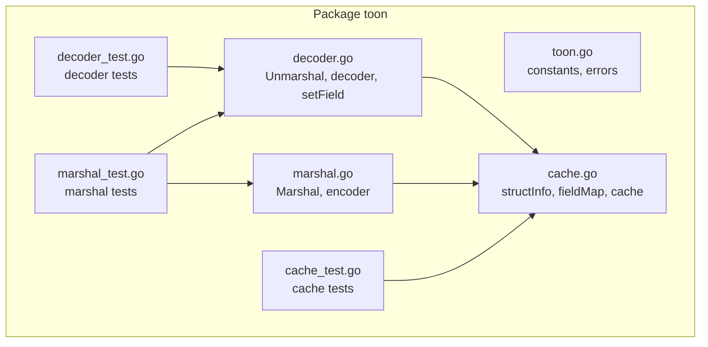
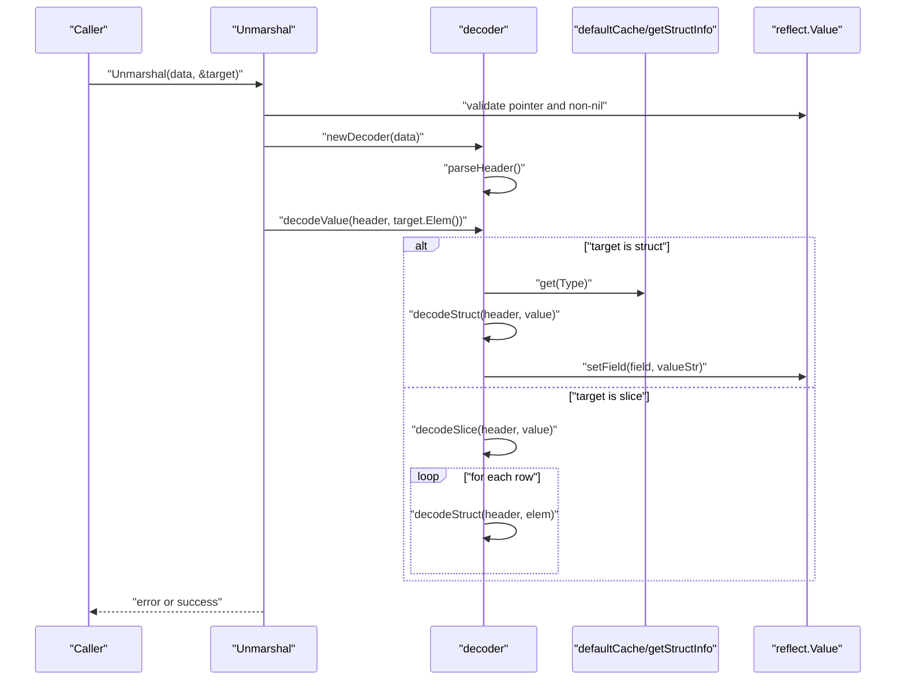
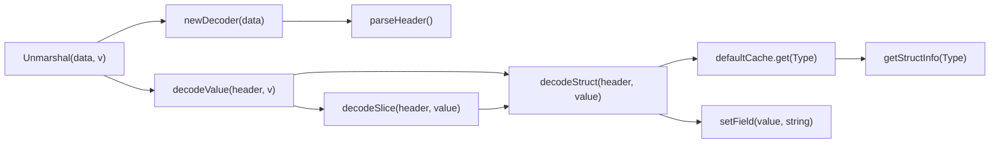

# Advanced Unmarshaling API

<cite>
**Referenced Files in This Document**
- [toon.go](file://toon.go)
- [decoder.go](file://decoder.go)
- [cache.go](file://cache.go)
- [marshal.go](file://marshal.go)
- [decoder_test.go](file://decoder_test.go)
- [cache_test.go](file://cache_test.go)
- [marshal_test.go](file://marshal_test.go)
- [go.mod](file://go.mod)
</cite>

## Table of Contents
1. [Introduction](#introduction)
2. [Project Structure](#project-structure)
3. [Core Components](#core-components)
4. [Architecture Overview](#architecture-overview)
5. [Detailed Component Analysis](#detailed-component-analysis)
6. [Dependency Analysis](#dependency-analysis)
7. [Performance Considerations](#performance-considerations)
8. [Troubleshooting Guide](#troubleshooting-guide)
9. [Conclusion](#conclusion)
10. [Appendices](#appendices)

## Introduction
This document provides comprehensive API documentation for the advanced unmarshaling functionality in the go-toon library. It focuses on the Unmarshal() function that binds TOON v3.0 data to Go structs and slices using reflection. It explains the struct field mapping system, TOON v3.0 specification compliance, and field tagging mechanisms. It also covers the struct field mapping cache for performance optimization, including cache invalidation and memory management, reflection-based binding patterns, type conversion rules, and error handling for malformed data. Practical examples demonstrate struct embedding, pointer handling, slice binding, and custom field mappings. Finally, it provides performance considerations, cache utilization strategies, and best practices for high-throughput applications, along with common pitfalls and debugging techniques.

## Project Structure
The go-toon library is organized around a small set of focused packages:
- Core constants and error definitions
- Decoder implementation for parsing TOON v3.0 and binding to Go values
- Struct field mapping cache for reflection metadata
- Encoder implementation for TOON v3.0 serialization (complementary to unmarshaling)
- Tests validating behavior and performance

**Diagram sources**
- [toon.go](file://toon.go#L1-L19)
- [decoder.go](file://decoder.go#L1-L303)
- [cache.go](file://cache.go#L1-L92)
- [marshal.go](file://marshal.go#L1-L172)
- [decoder_test.go](file://decoder_test.go#L1-L157)
- [cache_test.go](file://cache_test.go#L1-L86)
- [marshal_test.go](file://marshal_test.go#L1-L147)

**Section sources**
- [go.mod](file://go.mod#L1-L4)
- [toon.go](file://toon.go#L1-L19)
- [decoder.go](file://decoder.go#L1-L303)
- [cache.go](file://cache.go#L1-L92)
- [marshal.go](file://marshal.go#L1-L172)
- [decoder_test.go](file://decoder_test.go#L1-L157)
- [cache_test.go](file://cache_test.go#L1-L86)
- [marshal_test.go](file://marshal_test.go#L1-L147)

## Core Components
- Unmarshal(): Entry point to parse TOON v3.0 data into a Go value. It validates the target, parses the header, and delegates decoding to the appropriate branch.
- decoder: A streaming parser that reads TOON tokens without allocations, supporting header parsing, size parsing, field lists, and whitespace skipping.
- setField(): Converts string values to Go types and assigns them to reflect.Value instances.
- structInfo and fieldMap: Reflection metadata built from struct tags and field names, cached via a concurrent map.
- cache: Thread-safe cache for structInfo keyed by reflect.Type, enabling fast field mapping lookups.
- marshal.go: Complementary TOON v3.0 encoder that demonstrates field mapping semantics and tag usage.

Key API surfaces:
- Unmarshal(data []byte, v interface{}) error
- decoder.parseHeader(), parseSize(), parseFields()
- setField(v reflect.Value, s string) error
- getStructInfo(t reflect.Type) *structInfo
- defaultCache.get(t reflect.Type) fieldMap

**Section sources**
- [decoder.go](file://decoder.go#L8-L22)
- [decoder.go](file://decoder.go#L24-L32)
- [decoder.go](file://decoder.go#L71-L115)
- [decoder.go](file://decoder.go#L118-L139)
- [decoder.go](file://decoder.go#L142-L173)
- [decoder.go](file://decoder.go#L176-L187)
- [decoder.go](file://decoder.go#L190-L229)
- [decoder.go](file://decoder.go#L232-L267)
- [decoder.go](file://decoder.go#L270-L302)
- [cache.go](file://cache.go#L9-L19)
- [cache.go](file://cache.go#L21-L23)
- [cache.go](file://cache.go#L24-L38)
- [cache.go](file://cache.go#L40-L74)
- [cache.go](file://cache.go#L76-L92)
- [marshal.go](file://marshal.go#L17-L38)
- [marshal.go](file://marshal.go#L45-L65)
- [marshal.go](file://marshal.go#L67-L93)
- [marshal.go](file://marshal.go#L95-L137)
- [marshal.go](file://marshal.go#L139-L171)

## Architecture Overview
The unmarshaling pipeline follows a clean separation of concerns:
- Input validation ensures the target is a pointer to a struct or slice.
- Header parsing extracts the type name, optional size, and field list.
- Decoding branches into struct or slice handling.
- Struct decoding uses cached field mappings to locate fields by name and convert values.
- Slice decoding iterates rows, instantiating elements and decoding each into a struct.

**Diagram sources**
- [decoder.go](file://decoder.go#L8-L22)
- [decoder.go](file://decoder.go#L71-L115)
- [decoder.go](file://decoder.go#L176-L187)
- [decoder.go](file://decoder.go#L190-L229)
- [decoder.go](file://decoder.go#L232-L267)
- [cache.go](file://cache.go#L24-L38)
- [cache.go](file://cache.go#L76-L92)

## Detailed Component Analysis

### Unmarshal API
Purpose:
- Parse TOON v3.0 data and bind it into a Go value that must be a pointer to a struct or slice.

Behavior:
- Validates that the target is a non-nil pointer.
- Parses the header to extract type name, optional size, and field list.
- Delegates decoding to either struct or slice logic.

Errors:
- Returns ErrInvalidTarget if the target is not a pointer or is nil.
- Propagates ErrMalformedTOON for malformed headers or values.

Usage notes:
- Callers must pass a pointer to a struct or slice.
- Unknown fields in the TOON header are ignored during struct decoding.

**Section sources**
- [decoder.go](file://decoder.go#L8-L22)
- [toon.go](file://toon.go#L5-L8)

### decoder: Streaming Parser and Value Decoder
Responsibilities:
- Token-level parsing of TOON v3.0 syntax.
- Header extraction: name, size, and field list.
- Whitespace handling and boundary detection.
- Struct and slice decoding loops.

Key methods:
- next(), peek(), skipWhitespace(): Low-level stream navigation.
- parseHeader(): Builds a header object from the stream.
- parseSize(): Reads numeric size inside brackets.
- parseFields(): Collects field names inside braces.
- decodeValue(): Dispatches to struct or slice decoding.
- decodeStruct(): Iterates header fields, reads values, and sets struct fields.
- decodeSlice(): Iterates rows, instantiates elements, and decodes each.

Error handling:
- Returns ErrMalformedTOON on unexpected EOF or invalid syntax.
- decodeStruct continues on unknown fields; decodeSlice stops on conversion errors.

**Section sources**
- [decoder.go](file://decoder.go#L24-L32)
- [decoder.go](file://decoder.go#L34-L50)
- [decoder.go](file://decoder.go#L52-L61)
- [decoder.go](file://decoder.go#L71-L115)
- [decoder.go](file://decoder.go#L118-L139)
- [decoder.go](file://decoder.go#L142-L173)
- [decoder.go](file://decoder.go#L176-L187)
- [decoder.go](file://decoder.go#L190-L229)
- [decoder.go](file://decoder.go#L232-L267)

### setField: Type Conversion and Assignment
Rules:
- String: Assigns directly.
- Integers: Parses decimal strings; returns ErrMalformedTOON on failure.
- Unsigned integers: Parses decimal strings; returns ErrMalformedTOON on failure.
- Floats: Parses decimal strings; returns ErrMalformedTOON on failure.
- Booleans: Parses "true"/"false" variants; returns ErrMalformedTOON on failure.
- Other kinds: Returns ErrInvalidTarget.

Notes:
- The decoder relies on setField to convert textual values into the appropriate Go types.
- Unknown fields in the TOON header are skipped during struct decoding, avoiding conversion errors.

**Section sources**
- [decoder.go](file://decoder.go#L270-L302)

### Struct Field Mapping Cache
Design:
- structInfo caches the lowercase struct name and exported field metadata.
- fieldInfo stores field name and index for each exported field.
- cache is a sync.Map keyed by reflect.Type storing structInfo.
- defaultCache provides a compatibility wrapper for legacy decoder usage.

Tagging mechanism:
- Fields with tag "toon:'value'" override the field name used for mapping.
- Tag "toon:'-'" excludes the field from mapping.
- Untagged exported fields are mapped using their lowercase field names.

Concurrency:
- getStructInfo uses LoadOrStore to avoid redundant computation under contention.
- The cache is effectively immutable after creation, preventing races.

Memory management:
- No explicit eviction; cache grows with unique struct types encountered.
- Reuse of structInfo across goroutines is safe due to immutability.

**Section sources**
- [cache.go](file://cache.go#L9-L19)
- [cache.go](file://cache.go#L21-L23)
- [cache.go](file://cache.go#L24-L38)
- [cache.go](file://cache.go#L40-L74)
- [cache.go](file://cache.go#L76-L92)

### TOON v3.0 Specification Compliance
Compliance highlights:
- Header format: name[size]{field1,field2,...}:
- Size: Optional integer in brackets indicating row count for slices.
- Fields: Optional list of field names in braces.
- Values: Comma-separated values per row for structs; newline-separated rows for slices.
- Whitespace: Spaces, tabs, and newlines are treated as separators or ignorable as needed.

Parser behavior:
- parseHeader() recognizes size and fields blocks and requires a trailing colon.
- parseSize() enforces numeric digits only.
- parseFields() splits comma-separated names and trims trailing commas.
- decodeStruct() reads values up to separators or end-of-row.
- decodeSlice() supports newline-separated rows and optional carriage return.

**Section sources**
- [decoder.go](file://decoder.go#L71-L115)
- [decoder.go](file://decoder.go#L118-L139)
- [decoder.go](file://decoder.go#L142-L173)
- [decoder.go](file://decoder.go#L190-L229)
- [decoder.go](file://decoder.go#L232-L267)
- [toon.go](file://toon.go#L10-L18)

### Reflection-Based Binding Patterns
Patterns demonstrated:
- Struct embedding: Embedded anonymous fields are reflected as regular fields; mapping depends on exported status and tags.
- Pointer handling: The decoder operates on reflect.Value of the pointed-to type; pointers in data are handled by the encoder (not part of unmarshaling).
- Slice binding: Each row is decoded into a new element of the slice; elements are appended after decoding.
- Custom field mappings: Tags override default lowercase field names; excluded fields are omitted.

Validation:
- Only exported struct fields are considered for mapping.
- Unknown fields in the TOON header are safely ignored.

**Section sources**
- [cache.go](file://cache.go#L40-L74)
- [decoder.go](file://decoder.go#L190-L229)
- [decoder.go](file://decoder.go#L232-L267)

### Error Handling for Malformed Data
Common scenarios:
- Invalid target: Non-pointer or nil pointer passed to Unmarshal.
- Malformed header: Missing colon, invalid size, or unclosed blocks.
- Type conversion failures: Values that cannot be parsed into the target field type.
- Unexpected EOF: Stream ends prematurely during parsing.

Resolution:
- Prefer explicit checks for ErrInvalidTarget and ErrMalformedTOON.
- Log the offending header or value for debugging.
- Validate input data against the TOON v3.0 grammar before calling Unmarshal.

**Section sources**
- [toon.go](file://toon.go#L5-L8)
- [decoder.go](file://decoder.go#L71-L115)
- [decoder.go](file://decoder.go#L118-L139)
- [decoder.go](file://decoder.go#L270-L302)

### Practical Examples
Examples are validated by tests in the repository. They illustrate:
- Basic struct unmarshaling with two fields.
- Slice unmarshaling with multiple rows.
- Invalid target handling.
- Field mapping with struct tags.
- Concurrency-safe cache behavior.
- Round-trip marshaling/unmarshaling.

Reference paths:
- Struct unmarshal: [decoder_test.go](file://decoder_test.go#L96-L116)
- Slice unmarshal: [decoder_test.go](file://decoder_test.go#L118-L143)
- Invalid target: [decoder_test.go](file://decoder_test.go#L145-L156)
- Field mapping with tags: [cache_test.go](file://cache_test.go#L8-L53)
- Cache concurrency: [cache_test.go](file://cache_test.go#L55-L71)
- Round-trip: [marshal_test.go](file://marshal_test.go#L88-L117)

**Section sources**
- [decoder_test.go](file://decoder_test.go#L96-L156)
- [cache_test.go](file://cache_test.go#L8-L86)
- [marshal_test.go](file://marshal_test.go#L88-L117)

## Dependency Analysis
The unmarshaling stack exhibits low coupling and clear boundaries:
- decoder depends on cache for field mapping.
- decoder depends on setField for type conversion.
- cache depends on reflect and strings for metadata building.
- marshal.go complements unmarshaling by demonstrating field mapping semantics.

**Diagram sources**
- [decoder.go](file://decoder.go#L8-L22)
- [decoder.go](file://decoder.go#L71-L115)
- [decoder.go](file://decoder.go#L176-L187)
- [decoder.go](file://decoder.go#L190-L229)
- [decoder.go](file://decoder.go#L232-L267)
- [cache.go](file://cache.go#L24-L38)
- [decoder.go](file://decoder.go#L270-L302)

**Section sources**
- [decoder.go](file://decoder.go#L8-L22)
- [decoder.go](file://decoder.go#L71-L115)
- [decoder.go](file://decoder.go#L176-L187)
- [decoder.go](file://decoder.go#L190-L229)
- [decoder.go](file://decoder.go#L232-L267)
- [cache.go](file://cache.go#L24-L38)
- [cache.go](file://cache.go#L76-L92)

## Performance Considerations
- Zero-allocation parsing: The decoder uses a position-based scanner and avoids intermediate allocations for tokens.
- Field mapping cache: structInfo is computed once per struct type and reused concurrently via sync.Map.
- Buffer pooling: While not used in Unmarshal, the encoder employs a buffer pool to reduce allocation overhead during encoding.
- Type conversion: setField performs minimal allocations and leverages standard library parsing functions.
- Slice decoding: Elements are allocated and decoded in-place; appending to the slice is amortized O(1).

Recommendations:
- Reuse struct types across requests to maximize cache hits.
- Prefer preallocating slices when the size is known to minimize reallocations.
- Avoid excessive struct types with many fields; consider flattening or grouping data.
- Monitor GC pressure in high-throughput scenarios; consider connection pooling and object reuse.

[No sources needed since this section provides general guidance]

## Troubleshooting Guide
Common issues and resolutions:
- Unknown fields in TOON header: The decoder ignores them; verify field names match the struct tags or defaults.
- Type conversion errors: Ensure values conform to expected types (integers, floats, booleans). ErrMalformedTOON indicates invalid values.
- Invalid target errors: Ensure the argument to Unmarshal is a non-nil pointer to a struct or slice.
- Missing colon in header: Headers must end with ":"; malformed headers produce ErrMalformedTOON.
- Concurrency concerns: The cache is thread-safe; repeated calls to Unmarshal with the same struct type are efficient.

Debugging tips:
- Print the header fields and values to confirm alignment with struct fields.
- Temporarily disable unknown field skipping to surface mismatches.
- Validate TOON data against the v3.0 grammar before parsing.

**Section sources**
- [decoder.go](file://decoder.go#L190-L229)
- [decoder.go](file://decoder.go#L270-L302)
- [toon.go](file://toon.go#L5-L8)

## Conclusion
The go-toon library’s unmarshaling API provides a robust, TOON v3.0-compliant mechanism for binding structured data to Go values. Its design emphasizes correctness, performance, and simplicity: strict header parsing, a concurrent field mapping cache, and reflection-based assignment with clear error signaling. By leveraging struct tags, the system supports flexible field naming while maintaining safety and performance. The included tests demonstrate typical usage patterns and serve as a guide for integrating the API into production systems.

[No sources needed since this section summarizes without analyzing specific files]

## Appendices

### API Reference: Unmarshal
- Function: Unmarshal(data []byte, v interface{}) error
- Parameters:
  - data: TOON v3.0 encoded bytes.
  - v: Pointer to a struct or slice to decode into.
- Returns:
  - nil on success; otherwise ErrInvalidTarget or ErrMalformedTOON.
- Behavior:
  - Validates target pointer.
  - Parses header and decodes values into the target.

**Section sources**
- [decoder.go](file://decoder.go#L8-L22)
- [toon.go](file://toon.go#L5-L8)

### API Reference: decoder
- Methods:
  - next() (byte, bool): Advance and return next byte.
  - peek() (byte, bool): Peek next byte without advancing.
  - skipWhitespace(): Skip whitespace characters.
  - parseHeader() (*header, error): Parse header including name, size, and fields.
  - parseSize() (int, error): Parse numeric size.
  - parseFields() ([]string, error): Parse field list.
  - decodeValue(*header, reflect.Value) error: Dispatch to struct or slice decoding.
  - decodeStruct(*header, reflect.Value) error: Decode fields into struct.
  - decodeSlice(*header, reflect.Value) error: Decode rows into slice.
- Types:
  - header: name string, size int (-1 if unspecified), fields []string.
  - decoder: data []byte, pos int.

**Section sources**
- [decoder.go](file://decoder.go#L24-L32)
- [decoder.go](file://decoder.go#L34-L50)
- [decoder.go](file://decoder.go#L52-L61)
- [decoder.go](file://decoder.go#L71-L115)
- [decoder.go](file://decoder.go#L118-L139)
- [decoder.go](file://decoder.go#L142-L173)
- [decoder.go](file://decoder.go#L176-L187)
- [decoder.go](file://decoder.go#L190-L229)
- [decoder.go](file://decoder.go#L232-L267)

### API Reference: setField
- Function: setField(v reflect.Value, s string) error
- Supported kinds: String, Int family, Uint family, Float family, Bool.
- Behavior:
  - Converts string to target kind; returns ErrMalformedTOON on failure.
  - Returns ErrInvalidTarget for unsupported kinds.

**Section sources**
- [decoder.go](file://decoder.go#L270-L302)

### API Reference: Cache
- Functions:
  - getStructInfo(t reflect.Type) *structInfo: Retrieve or compute struct metadata.
  - defaultCache.get(t reflect.Type) fieldMap: Compatibility wrapper returning field name to index map.
- Types:
  - structInfo: name string, fields []fieldInfo.
  - fieldInfo: name string, index int.
  - fieldMap: map[string]int.
- Notes:
  - Cache is thread-safe and immutable after creation.

**Section sources**
- [cache.go](file://cache.go#L24-L38)
- [cache.go](file://cache.go#L40-L74)
- [cache.go](file://cache.go#L76-L92)

### TOON v3.0 Constants
- BlockStart: '{'
- BlockEnd: '}'
- SizeStart: '['
- SizeEnd: ']'
- HeaderEnd: ':'
- Separator: ','

**Section sources**
- [toon.go](file://toon.go#L10-L18)