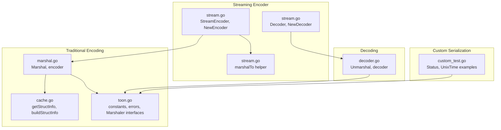
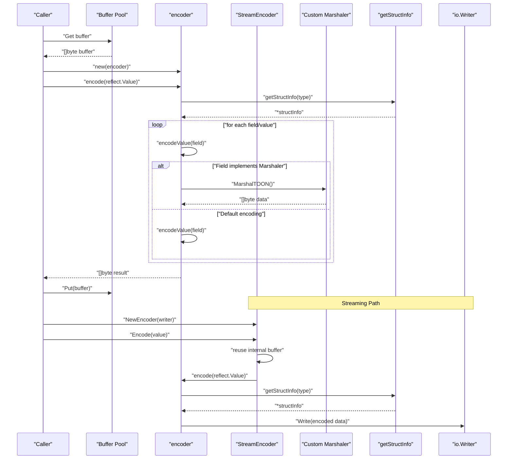
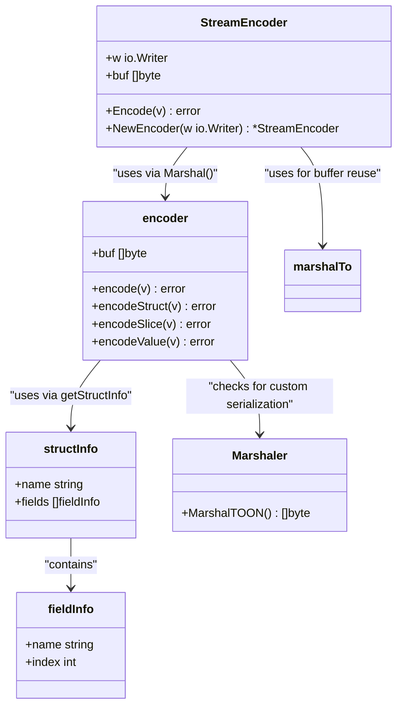
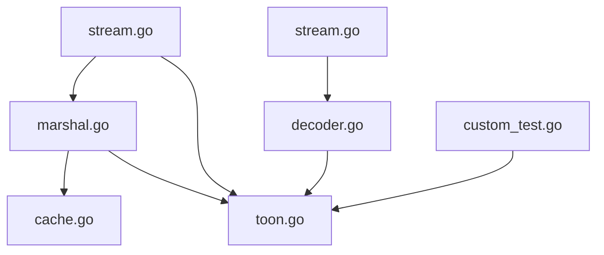

# Core Encoding API

<cite>
**Referenced Files in This Document**
- [marshal.go](file://marshal.go)
- [stream.go](file://stream.go)
- [toon.go](file://toon.go)
- [cache.go](file://cache.go)
- [decoder.go](file://decoder.go)
- [marshal_test.go](file://marshal_test.go)
- [stream_test.go](file://stream_test.go)
- [custom_test.go](file://custom_test.go)
</cite>

## Update Summary
**Changes Made**
- Added comprehensive documentation for the new Marshaler interface capability
- Updated encoding architecture to include custom serialization behavior
- Enhanced data type handling section with custom marshaler integration
- Added practical examples of custom marshaler implementations
- Updated error handling patterns to include custom marshaler errors
- Expanded component analysis to cover custom serialization interfaces

## Table of Contents
1. [Introduction](#introduction)
2. [Project Structure](#project-structure)
3. [Core Components](#core-components)
4. [Architecture Overview](#architecture-overview)
5. [Detailed Component Analysis](#detailed-component-analysis)
6. [Custom Serialization Interfaces](#custom-serialization-interfaces)
7. [Streaming Encoder Implementation](#streaming-encoder-implementation)
8. [Dependency Analysis](#dependency-analysis)
9. [Performance Considerations](#performance-considerations)
10. [Troubleshooting Guide](#troubleshooting-guide)
11. [Conclusion](#conclusion)

## Introduction
This document provides comprehensive API documentation for the core encoding functionality in the go-toon library. It focuses on the streaming encoder architecture, deterministic output generation, and key ordering strategies. The documentation covers how the encoder handles different data types (null, boolean, number, string, array, object) with their compact representations, string escaping mechanisms, Unicode handling, and identifier optimization. It also specifies function signatures, parameter descriptions, return value specifications, error handling patterns, and compatibility with the TOON v3.0 specification. Practical examples demonstrate encoding of complex nested structures, performance considerations for large datasets, and integration with existing Go I/O streams.

**Updated** Added comprehensive coverage of the new Marshaler interface capability that extends the core encoding API with support for custom serialization behavior, enabling types to implement their own TOON representation logic.

## Project Structure
The go-toon library exposes a compact set of APIs for encoding and decoding TOON v3.0 data. The core encoding logic resides in marshal.go, while constants and error types are defined in toon.go. Struct metadata caching is implemented in cache.go, and decoding logic is provided in decoder.go. The new streaming encoder implementation is located in stream.go. Tests in marshal_test.go, stream_test.go, and custom_test.go illustrate usage and correctness across both traditional and streaming APIs, as well as custom marshaler implementations.

**Diagram sources**
- [marshal.go](file://marshal.go#L17-L38)
- [stream.go](file://stream.go#L8-L37)
- [cache.go](file://cache.go#L24-L74)
- [toon.go](file://toon.go#L5-L18)
- [decoder.go](file://decoder.go#L8-L22)
- [custom_test.go](file://custom_test.go#L18-L63)

**Section sources**
- [marshal.go](file://marshal.go#L1-L184)
- [stream.go](file://stream.go#L1-L117)
- [toon.go](file://toon.go#L1-L29)
- [cache.go](file://cache.go#L1-L112)
- [decoder.go](file://decoder.go#L1-L424)
- [custom_test.go](file://custom_test.go#L1-L162)

## Core Components
This section documents the primary encoding APIs and their behavior, including the new streaming encoder capabilities and custom serialization interfaces.

### Traditional Encoding APIs

- **Marshal(v interface{}) ([]byte, error)**
  - Purpose: Encodes a pointer to a struct or slice into TOON v3.0 format and returns a newly allocated byte slice.
  - Parameters:
    - v: interface{}, must be a pointer to a struct or slice; otherwise returns ErrInvalidTarget.
  - Returns:
    - ([]byte, error): The encoded TOON data and any error encountered during encoding.
  - Behavior:
    - Uses a pooled buffer to avoid repeated allocations.
    - Constructs an encoder and delegates to encoder.encode.
    - Copies the resulting buffer to a fresh slice before returning.
  - Errors:
    - ErrInvalidTarget if v is not a pointer or points to a non-struct/slice type.
  - Deterministic output:
    - Struct field order is derived from struct metadata and cached for performance.
  - Compatibility:
    - Output conforms to TOON v3.0 specification.

- **Marshaler interface**
  - Purpose: Enables types to implement custom TOON serialization behavior.
  - Method signature:
    - MarshalTOON() ([]byte, error)
  - Behavior:
    - Allows custom types to return their own TOON-encoded representation as a byte slice.
    - Called automatically during encoding when a field implements this interface.
  - Integration:
    - Checked during encodeValue before default encoding logic.

- **MarshalerTo interface**
  - Purpose: Enables types to write their TOON representation directly to an io.Writer.
  - Method signature:
    - MarshalTOON(w io.Writer) error
  - Behavior:
    - Allows custom types to implement efficient streaming serialization to any io.Writer.
    - Used by the MarshalTo function for direct writer integration.

### Streaming Encoder APIs

- **StreamEncoder struct and methods**
  - Purpose: Streaming encoder that writes TOON data directly to an io.Writer with buffer reuse capabilities.
  - Constructor:
    - NewEncoder(w io.Writer) *StreamEncoder
  - Methods:
    - Encode(v interface{}) error - Writes encoded data to the underlying writer
  - Buffer management:
    - Reuses internal buffer to minimize allocations.
    - Falls back to Marshal() for initial encoding when no buffer is available.

- **Decoder struct and methods**
  - Purpose: Streaming decoder that reads TOON data from an io.Reader with buffered I/O.
  - Constructor:
    - NewDecoder(r io.Reader) *Decoder
  - Methods:
    - Decode(v interface{}) error - Reads and decodes the next TOON value from the stream
  - Buffer management:
    - Uses bufio.Reader internally for efficient streaming I/O.
    - Handles line-by-line parsing with automatic buffering.

- **marshalTo helper function**
  - Purpose: Internal function that marshals to a provided buffer for StreamEncoder reuse.
  - Signature: marshalTo(v interface{}, buf []byte) ([]byte, error)
  - Behavior:
    - Currently wraps Marshal() but designed for future zero-copy implementation.

**Section sources**
- [marshal.go](file://marshal.go#L17-L38)
- [marshal.go](file://marshal.go#L40-L48)
- [marshal.go](file://marshal.go#L46-L65)
- [marshal.go](file://marshal.go#L140-L150)
- [toon.go](file://toon.go#L20-L28)
- [stream.go](file://stream.go#L8-L37)
- [stream.go](file://stream.go#L39-L103)
- [stream.go](file://stream.go#L107-L117)

## Architecture Overview
The encoding pipeline is designed around a streaming encoder that writes directly to an internal buffer, minimizing memory allocations via a buffer pool. Struct metadata is cached to ensure deterministic field ordering and efficient lookups. The encoder supports both struct and slice encodings, with slices emitting headers containing the element type, size, and field names. The new streaming encoder extends this architecture with buffer reuse capabilities and direct io.Writer integration. Custom serialization interfaces enable types to implement their own TOON representation logic, providing flexibility for complex data types.

**Diagram sources**
- [marshal.go](file://marshal.go#L10-L15)
- [marshal.go](file://marshal.go#L25-L37)
- [marshal.go](file://marshal.go#L46-L65)
- [marshal.go](file://marshal.go#L140-L150)
- [stream.go](file://stream.go#L14-L37)
- [cache.go](file://cache.go#L24-L38)

## Detailed Component Analysis

### Streaming Encoder Architecture
The streaming encoder writes TOON v3.0 data directly to an internal buffer, avoiding intermediate copies where possible. It uses a sync.Pool to recycle buffers and reduce GC pressure. The StreamEncoder extends this architecture by adding buffer reuse capabilities and direct io.Writer integration.

Key characteristics:
- Zero-allocation header construction for structs and slices.
- Deterministic field ordering via cached struct metadata.
- Efficient numeric and boolean encoding using strconv helpers.
- Compact array representation with explicit size and field list.
- Buffer reuse for subsequent Encode() calls.
- Direct streaming to any io.Writer without intermediate copies.
- Automatic detection and handling of custom marshaler interfaces.

**Diagram sources**
- [stream.go](file://stream.go#L8-L37)
- [marshal.go](file://marshal.go#L46-L65)
- [marshal.go](file://marshal.go#L67-L93)
- [marshal.go](file://marshal.go#L95-L137)
- [marshal.go](file://marshal.go#L139-L183)
- [marshal.go](file://marshal.go#L140-L150)
- [cache.go](file://cache.go#L9-L19)
- [toon.go](file://toon.go#L20-L23)

**Section sources**
- [marshal.go](file://marshal.go#L10-L15)
- [marshal.go](file://marshal.go#L46-L65)
- [marshal.go](file://marshal.go#L67-L93)
- [marshal.go](file://marshal.go#L95-L137)
- [marshal.go](file://marshal.go#L139-L183)
- [marshal.go](file://marshal.go#L140-L150)
- [stream.go](file://stream.go#L8-L37)
- [cache.go](file://cache.go#L24-L74)
- [toon.go](file://toon.go#L20-L23)

### Deterministic Output Generation and Key Ordering
Determinism is achieved by:
- Building struct metadata once per type and caching it.
- Using field indices to iterate fields in a consistent order.
- Converting field names to lowercase by default and honoring explicit tags.

Behavior highlights:
- Exported fields only; unexported fields are skipped.
- Tag precedence: "-" excludes a field; other tags override names.
- Field order preserved as declared in the struct.

**Section sources**
- [cache.go](file://cache.go#L40-L74)

### Data Type Handling and Compact Representations
The encoder supports the following Go types and maps them to TOON v3.0 representations:

- **Null**
  - Pointer to nil is encoded as a single null marker in the value position.
  - Empty slice is encoded as a null marker in the value position.

- **Boolean**
  - True is represented by a positive marker.
  - False is represented by a negative marker.

- **Number**
  - Integers and unsigned integers are encoded as decimal strings.
  - Floating-point numbers are encoded using a compact float representation.

- **String**
  - Strings are written directly without additional delimiters.
  - Unicode handling follows Go's string semantics; no special escaping is applied by the encoder.

- **Array (slice)**
  - Encoded with a header containing the element type, size, and field list.
  - Values are separated by commas; rows are separated by newlines.

- **Object (struct)**
  - Encoded with a header containing the type name and field list.
  - Values are separated by commas.

- **Custom Types with Marshaler Interface**
  - Types implementing Marshaler interface are encoded using their custom TOON representation.
  - Custom marshalers take precedence over default encoding logic.

Notes:
- The encoder does not escape special characters within strings; consumers should treat raw string bytes as-is.
- Numeric precision follows strconv conventions.
- Custom marshalers must return valid TOON-encoded data or an error.

**Section sources**
- [marshal.go](file://marshal.go#L56-L64)
- [marshal.go](file://marshal.go#L139-L183)
- [marshal.go](file://marshal.go#L95-L137)
- [marshal.go](file://marshal.go#L67-L93)
- [marshal.go](file://marshal.go#L140-L150)

### Function Signatures, Parameters, and Return Values
- **Marshal(v interface{}) ([]byte, error)**
  - v: pointer to struct or slice; otherwise ErrInvalidTarget.
  - Returns: encoded TOON data and error if any.

- **Marshaler interface**
  - MarshalTOON() ([]byte, error)
  - Returns: custom TOON-encoded representation and error if any.

- **MarshalerTo interface**
  - MarshalTOON(w io.Writer) error
  - w: io.Writer to which the TOON data is written.
  - Returns: error if writing fails or if the type cannot be encoded.

- **StreamEncoder methods**
  - NewEncoder(w io.Writer) *StreamEncoder - Creates a new streaming encoder.
  - Encode(v interface{}) error - Encodes and writes data to the underlying writer.
  - Returns: error if encoding fails or if writing to the writer fails.

- **Decoder methods**
  - NewDecoder(r io.Reader) *Decoder - Creates a new streaming decoder.
  - Decode(v interface{}) error - Reads and decodes the next TOON value from the stream.
  - Returns: error if reading fails or if the data is malformed.

- **Internal encoder methods**
  - encode(v reflect.Value) error
  - encodeStruct(v reflect.Value) error
  - encodeSlice(v reflect.Value) error
  - encodeValue(v reflect.Value) error

- **getStructInfo(t reflect.Type) *structInfo**
  - t: reflect.Type of the struct.
  - Returns: cached or built struct metadata.

- **Constants and errors**
  - Constants define separators and markers for TOON v3.0.
  - Errors indicate invalid targets or malformed input.

**Section sources**
- [marshal.go](file://marshal.go#L17-L38)
- [marshal.go](file://marshal.go#L40-L48)
- [marshal.go](file://marshal.go#L46-L65)
- [marshal.go](file://marshal.go#L67-L93)
- [marshal.go](file://marshal.go#L95-L137)
- [marshal.go](file://marshal.go#L139-L183)
- [stream.go](file://stream.go#L8-L37)
- [stream.go](file://stream.go#L39-L103)
- [cache.go](file://cache.go#L24-L38)
- [toon.go](file://toon.go#L5-L8)
- [toon.go](file://toon.go#L20-L28)

### Error Handling Patterns
- **ErrInvalidTarget**
  - Emitted when the target is not a pointer or points to a non-struct/slice type.
  - Applies to both Marshal and Unmarshal.

- **ErrMalformedTOON**
  - Emitted by the decoder when encountering invalid syntax.
  - Also returned by custom marshalers when they encounter malformed data.

- **Writing failures**
  - MarshalTOON returns errors from the underlying writer.
  - Marshal returns errors from the encoding process.
  - StreamEncoder.Encode returns errors from both encoding and writing.
  - Decoder.Decode returns errors from reading and parsing.

- **Custom marshaler errors**
  - Marshaler interface returns errors from custom serialization logic.
  - MarshalerTo interface returns errors from direct writer operations.

**Section sources**
- [toon.go](file://toon.go#L5-L8)
- [marshal.go](file://marshal.go#L20-L22)
- [decoder.go](file://decoder.go#L11-L13)
- [stream.go](file://stream.go#L19-L37)
- [marshal.go](file://marshal.go#L140-L150)

### Output Format Specifications and Compatibility
- **Headers**
  - Struct: type name followed by field list and a colon.
  - Slice: type name, size, field list, and a colon.
- **Separators**
  - Fields within a row are separated by a comma.
  - Rows in a slice are separated by a newline.
- **Markers**
  - Null: a dedicated marker for nil pointers and empty slices.
  - Boolean: distinct markers for true and false.
- **Custom Types**
  - Types implementing Marshaler interface output their custom TOON representation.
  - Custom representations must conform to TOON v3.0 specification.
- **Compatibility**
  - Output conforms to TOON v3.0 specification with the defined separators and markers.
  - Custom marshalers must produce valid TOON-encoded data.

**Section sources**
- [marshal.go](file://marshal.go#L67-L93)
- [marshal.go](file://marshal.go#L95-L137)
- [toon.go](file://toon.go#L10-L18)
- [marshal.go](file://marshal.go#L140-L150)

## Custom Serialization Interfaces

### Marshaler Interface
The Marshaler interface enables types to implement custom TOON serialization behavior. When the encoder encounters a field whose type implements Marshaler, it automatically uses the custom serialization logic instead of the default encoding.

#### Interface Definition
- **MarshalTOON() ([]byte, error)**
  - Purpose: Return a TOON-encoded representation of the type instance.
  - Returns: Byte slice containing TOON-encoded data and error if any.
  - Behavior: Must return valid TOON-encoded data that conforms to the specification.

#### Implementation Pattern
Custom marshalers should:
- Return valid TOON-encoded data for their type.
- Handle all possible states of the type.
- Return appropriate errors for invalid states.
- Be efficient and avoid unnecessary allocations.

#### Practical Examples
The library includes several examples of custom marshaler implementations:

- **Status enum with single-character encoding**
  - StatusPending → "P"
  - StatusActive → "A" 
  - StatusInactive → "I"

- **UnixTime wrapper with timestamp encoding**
  - Encodes time as Unix timestamp string.
  - Supports round-trip serialization/deserialization.

**Section sources**
- [toon.go](file://toon.go#L20-L23)
- [custom_test.go](file://custom_test.go#L18-L63)
- [custom_test.go](file://custom_test.go#L65-L92)
- [custom_test.go](file://custom_test.go#L94-L128)

### MarshalerTo Interface
The MarshalerTo interface provides a streaming alternative for custom serialization, allowing types to write their TOON representation directly to an io.Writer.

#### Interface Definition
- **MarshalTOON(w io.Writer) error**
  - Purpose: Write TOON-encoded representation directly to the provided writer.
  - Parameters: io.Writer to receive the encoded data.
  - Returns: Error if writing fails or if the type cannot be encoded.

#### Use Cases
- Large data types that benefit from streaming output.
- Memory-constrained environments where intermediate buffers are undesirable.
- Integration with existing io.Writer-based systems.

#### Integration with MarshalTo
The MarshalTo function uses MarshalerTo for direct writer integration, bypassing the standard buffer pool mechanism.

**Section sources**
- [marshal.go](file://marshal.go#L40-L43)
- [marshal.go](file://marshal.go#L40-L48)

### Unmarshaler Interface
The Unmarshaler interface complements the Marshaler interface by enabling custom deserialization behavior. When decoding TOON data, the decoder checks for Unmarshaler implementations on target fields.

#### Interface Definition
- **UnmarshalTOON(data []byte) error**
  - Purpose: Decode TOON-encoded data into the type instance.
  - Parameters: Byte slice containing TOON-encoded data.
  - Returns: Error if decoding fails or if data is malformed.

#### Integration Points
- Checked during field assignment in setFieldBytes.
- Provides custom deserialization logic for complex types.
- Supports validation and transformation during decoding.

**Section sources**
- [toon.go](file://toon.go#L25-L28)
- [decoder.go](file://decoder.go#L279-L284)
- [decoder.go](file://decoder.go#L278-L317)

## Streaming Encoder Implementation

### StreamEncoder Architecture
The StreamEncoder provides streaming capabilities for TOON encoding with optimized buffer reuse. It extends the traditional encoder architecture by adding direct io.Writer integration and intelligent buffer management.

Key features:
- **Buffer Reuse**: Maintains an internal buffer that grows as needed and is reused across Encode() calls.
- **Zero-Copy Integration**: Uses the existing Marshal() infrastructure while adding minimal overhead.
- **Direct I/O**: Writes directly to the underlying io.Writer without intermediate copies.
- **Automatic Buffer Management**: Grows buffer capacity as needed and resets position for reuse.
- **Custom Marshaler Support**: Respects custom marshaler implementations during streaming encoding.

### Buffer Management Strategy
The StreamEncoder employs a sophisticated buffer management strategy:

1. **Initial State**: buf is nil, indicating no buffer is allocated yet.
2. **First Use**: Calls Marshal() to generate initial encoded data and stores it in buf.
3. **Subsequent Uses**: Reuses the existing buffer by resetting its length to 0.
4. **Growth Strategy**: Automatically grows buffer capacity as needed using Go's slice growth algorithm.
5. **Memory Efficiency**: Avoids repeated allocations by reusing the same underlying array.

### Streaming Decoder Implementation
The Decoder complements the StreamEncoder with streaming deserialization capabilities:

- **Buffered Reading**: Uses bufio.Reader for efficient line-by-line parsing.
- **Header Parsing**: Parses TOON headers to determine data structure and size.
- **Multi-row Processing**: Handles slice data by reading multiple rows until EOF.
- **Error Propagation**: Properly propagates errors from both reading and parsing stages.
- **Custom Unmarshaler Support**: Respects custom unmarshaler implementations during streaming decoding.

### Practical Streaming Examples
Examples below demonstrate streaming usage patterns. Replace the placeholders with your own types and data.

- **Streaming to an io.Writer**
  - Create StreamEncoder with any io.Writer (bytes.Buffer, network connection, file).
  - Call Encode() multiple times to stream multiple TOON values.
  - Handle errors returned by the writer.

- **Streaming from an io.Reader**
  - Create Decoder with any io.Reader (strings.Reader, network connection, file).
  - Call Decode() in a loop to read multiple TOON values.
  - Handle io.EOF when reaching end of stream.

- **Network Streaming**
  - Use net.Conn as both writer and reader for real-time streaming.
  - Combine StreamEncoder and Decoder for bidirectional communication.

- **File Streaming**
  - Use os.File as writer for persistent storage.
  - Use file reader for batch processing of stored data.

**Section sources**
- [stream.go](file://stream.go#L8-L37)
- [stream.go](file://stream.go#L39-L103)
- [stream_test.go](file://stream_test.go#L9-L32)
- [stream_test.go](file://stream_test.go#L34-L58)
- [stream_test.go](file://stream_test.go#L60-L99)

## Dependency Analysis
The encoding subsystem exhibits low coupling and high cohesion:
- marshal.go depends on cache.go for struct metadata and toon.go for constants and errors.
- stream.go depends on marshal.go for core encoding logic and provides wrapper APIs.
- The decoder module (decoder.go) defines the error types consumed by both encoding and decoding paths.
- Custom marshaler interfaces are defined in toon.go and used throughout the encoding/decoding pipeline.
- There is no circular dependency between encoding and decoding.

**Diagram sources**
- [marshal.go](file://marshal.go#L1-L8)
- [stream.go](file://stream.go#L1-L6)
- [cache.go](file://cache.go#L1-L7)
- [toon.go](file://toon.go#L1-L8)
- [decoder.go](file://decoder.go#L1-L6)
- [custom_test.go](file://custom_test.go#L1-L7)

**Section sources**
- [marshal.go](file://marshal.go#L1-L8)
- [stream.go](file://stream.go#L1-L6)
- [cache.go](file://cache.go#L1-L7)
- [toon.go](file://toon.go#L1-L8)
- [decoder.go](file://decoder.go#L1-L6)
- [custom_test.go](file://custom_test.go#L1-L7)

## Performance Considerations
- **Buffer pooling**
  - A sync.Pool reuses buffers to minimize allocations during encoding.
- **Metadata caching**
  - Struct metadata is cached to avoid repeated reflection work.
- **Streaming writes**
  - The encoder writes directly to an internal buffer, reducing intermediate copies.
- **Buffer reuse**
  - StreamEncoder reuses internal buffers across multiple Encode() calls.
  - Reduces memory allocation overhead for streaming scenarios.
- **Custom marshaler optimization**
  - Custom marshalers can implement efficient serialization logic.
  - Avoids reflection overhead for complex types.
- **Numeric encoding**
  - Uses strconv helpers for efficient integer and floating-point conversion.
- **Recommendations**
  - Prefer Marshal for small to medium payloads.
  - Implement MarshalTOON for large datasets or when streaming to network I/O to avoid extra copies.
  - Use StreamEncoder for continuous data streams to minimize allocation overhead.
  - Reuse writers and buffers where appropriate to reduce overhead.
  - Consider implementing custom marshalers for frequently serialized complex types.

**Section sources**
- [marshal.go](file://marshal.go#L10-L15)
- [stream.go](file://stream.go#L20-L37)
- [cache.go](file://cache.go#L21-L38)
- [marshal.go](file://marshal.go#L140-L150)

## Troubleshooting Guide
Common issues and resolutions:
- **Unexpected ErrInvalidTarget**
  - Ensure the argument to Marshal is a pointer to a struct or slice.
  - Verify that the pointer is not nil.
- **Incorrect field ordering or missing fields**
  - Confirm that fields are exported and not excluded by tags.
  - Check that struct tags are correctly formatted.
- **Unexpected output format**
  - Validate that the emitted header includes the correct type name, size, and field list.
  - Ensure that values are separated by commas and rows by newlines for slices.
- **Custom marshaler not being called**
  - Ensure the type implements the Marshaler interface correctly.
  - Verify that the MarshalTOON method signature matches the interface definition.
  - Check that the method is exported (capitalized).
- **Unicode and string handling**
  - Strings are written as-is; if escaping is required, handle it upstream.
- **Decoder compatibility**
  - Ensure the decoder is used with the same version of the TOON specification.
  - Verify that custom marshaler outputs conform to the specification.
- **Streaming Issues**
  - For StreamEncoder, ensure the underlying writer supports Write() operations.
  - For Decoder, ensure the underlying reader supports ReadSlice() operations.
  - Handle io.EOF appropriately when reading from streams.
- **Buffer reuse problems**
  - StreamEncoder automatically manages buffer reuse; avoid manual buffer manipulation.
  - Reset buffers manually only if you need to clear accumulated data.
- **Custom marshaler errors**
  - Ensure custom marshalers return valid TOON-encoded data.
  - Handle edge cases and invalid states appropriately.
  - Return meaningful errors for debugging purposes.

**Section sources**
- [toon.go](file://toon.go#L5-L8)
- [cache.go](file://cache.go#L40-L74)
- [marshal.go](file://marshal.go#L56-L64)
- [marshal.go](file://marshal.go#L140-L150)
- [decoder_test.go](file://decoder_test.go#L145-L156)
- [stream_test.go](file://stream_test.go#L1-L136)
- [custom_test.go](file://custom_test.go#L65-L92)

## Conclusion
The go-toon library provides a compact, efficient, and deterministic encoder for TOON v3.0 data. Its streaming architecture, buffer pooling, and metadata caching deliver strong performance characteristics suitable for large datasets. The new StreamEncoder implementation extends this capability with buffer reuse and direct io.Writer integration, enabling efficient streaming serialization without additional allocations. The addition of custom serialization interfaces (Marshaler and MarshalerTo) significantly enhances the library's flexibility, allowing types to implement their own TOON representation logic. This extension maintains backward compatibility while providing powerful customization capabilities for complex data types. The encoder supports essential data types with compact representations, maintains deterministic field ordering, and integrates seamlessly with Go's I/O interfaces. By following the guidelines and examples in this document, developers can reliably encode complex nested structures, implement custom serialization logic, and integrate the library into existing applications, leveraging both traditional and streaming APIs as appropriate for their use case.