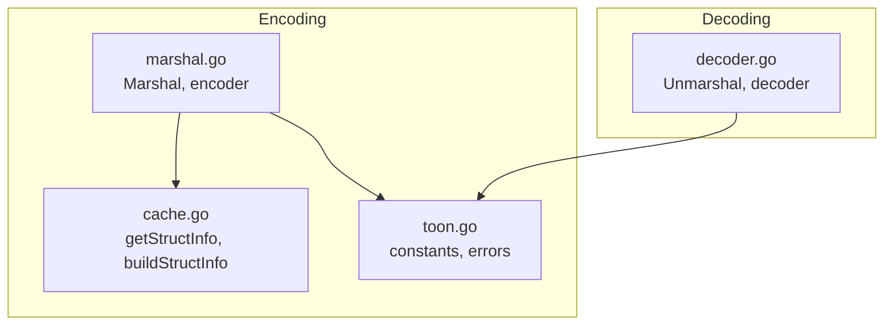
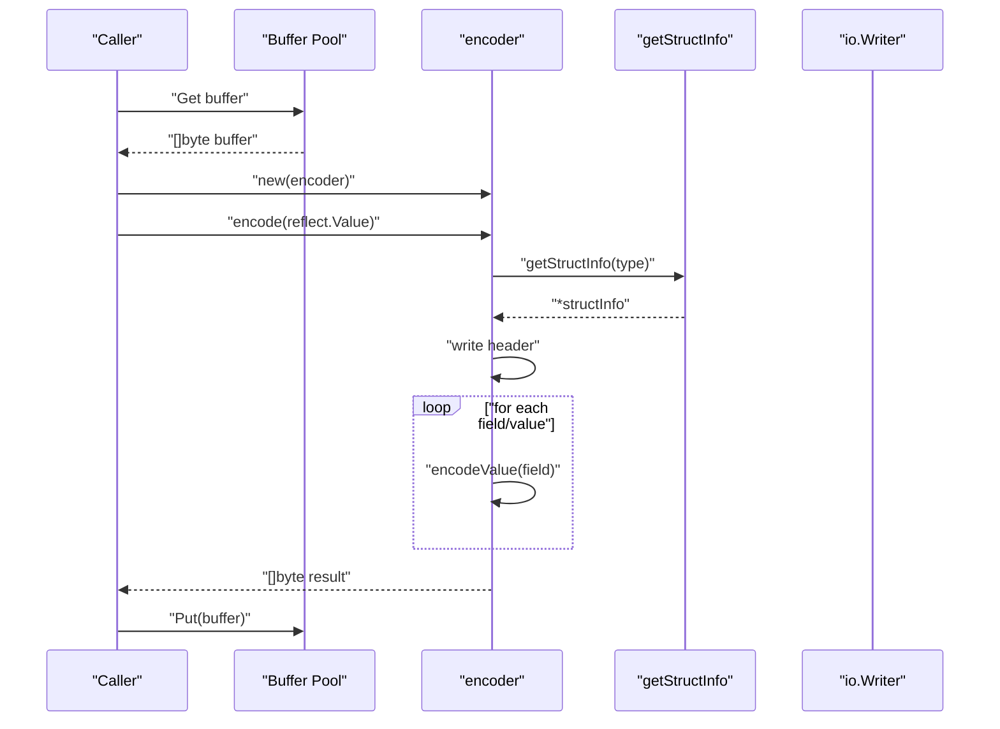
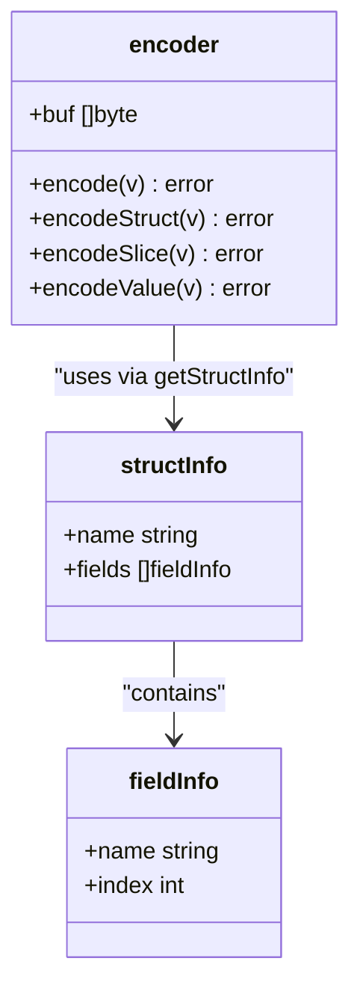
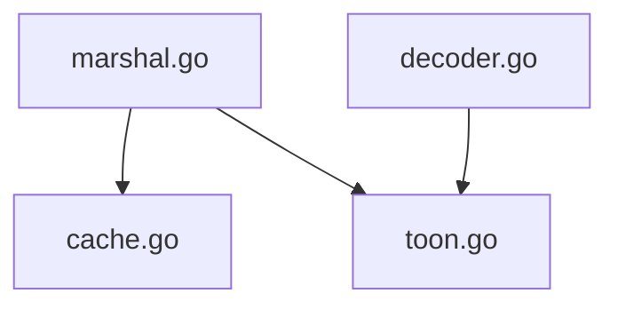

# Core Encoding API

<cite>
**Referenced Files in This Document**
- [marshal.go](file://marshal.go)
- [toon.go](file://toon.go)
- [cache.go](file://cache.go)
- [decoder.go](file://decoder.go)
- [marshal_test.go](file://marshal_test.go)
- [decoder_test.go](file://decoder_test.go)
</cite>

## Table of Contents
1. [Introduction](#introduction)
2. [Project Structure](#project-structure)
3. [Core Components](#core-components)
4. [Architecture Overview](#architecture-overview)
5. [Detailed Component Analysis](#detailed-component-analysis)
6. [Dependency Analysis](#dependency-analysis)
7. [Performance Considerations](#performance-considerations)
8. [Troubleshooting Guide](#troubleshooting-guide)
9. [Conclusion](#conclusion)

## Introduction
This document provides comprehensive API documentation for the core encoding functionality in the go-toon library. It focuses on the streaming encoder architecture, deterministic output generation, and key ordering strategies. The documentation covers how the encoder handles different data types (null, boolean, number, string, array, object) with their compact representations, string escaping mechanisms, Unicode handling, and identifier optimization. It also specifies function signatures, parameter descriptions, return value specifications, error handling patterns, and compatibility with the TOON v3.0 specification. Practical examples demonstrate encoding of complex nested structures, performance considerations for large datasets, and integration with existing Go I/O streams.

## Project Structure
The go-toon library exposes a compact set of APIs for encoding and decoding TOON v3.0 data. The core encoding logic resides in marshal.go, while constants and error types are defined in toon.go. Struct metadata caching is implemented in cache.go, and decoding logic is provided in decoder.go. Tests in marshal_test.go and decoder_test.go illustrate usage and correctness.

**Diagram sources**
- [marshal.go](file://marshal.go#L17-L38)
- [cache.go](file://cache.go#L24-L74)
- [toon.go](file://toon.go#L5-L18)
- [decoder.go](file://decoder.go#L8-L22)

**Section sources**
- [marshal.go](file://marshal.go#L1-L172)
- [toon.go](file://toon.go#L1-L19)
- [cache.go](file://cache.go#L1-L92)
- [decoder.go](file://decoder.go#L1-L303)

## Core Components
This section documents the primary encoding APIs and their behavior.

- Marshal(v interface{}) ([]byte, error)
  - Purpose: Encodes a pointer to a struct or slice into TOON v3.0 format and returns a newly allocated byte slice.
  - Parameters:
    - v: interface{}, must be a pointer to a struct or slice; otherwise returns ErrInvalidTarget.
  - Returns:
    - ([]byte, error): The encoded TOON data and any error encountered during encoding.
  - Behavior:
    - Uses a pooled buffer to avoid repeated allocations.
    - Constructs an encoder and delegates to encoder.encode.
    - Copies the resulting buffer to a fresh slice before returning.
  - Errors:
    - ErrInvalidTarget if v is not a pointer or points to a non-struct/slice type.
  - Deterministic output:
    - Struct field order is derived from struct metadata and cached for performance.
  - Compatibility:
    - Output conforms to TOON v3.0 specification.

- MarshalTo(w io.Writer) interface
  - Purpose: An interface that enables types to write their TOON representation directly to an io.Writer.
  - Method signature:
    - MarshalTOON(w io.Writer) error
  - Behavior:
    - Allows custom types to implement efficient streaming serialization to any io.Writer.

- encoder struct and methods
  - Purpose: Internal streaming encoder that writes TOON data directly to an internal byte buffer.
  - Methods:
    - encode(v reflect.Value) error
    - encodeStruct(v reflect.Value) error
    - encodeSlice(v reflect.Value) error
    - encodeValue(v reflect.Value) error
  - Buffer management:
    - Uses a sync.Pool to reuse buffers and minimize allocations.

- getStructInfo(t reflect.Type) *structInfo
  - Purpose: Retrieves or builds cached metadata for a struct type, including field names and indices.
  - Behavior:
    - Skips unexported fields.
    - Respects toon struct tags; "-" excludes a field; other tags override field names.
    - Converts field names to lowercase by default.

- Constants and errors
  - Constants (from toon.go):
    - BlockStart = '{'
    - BlockEnd = '}'
    - SizeStart = '['
    - SizeEnd = ']'
    - HeaderEnd = ':'
    - Separator = ','
  - Errors:
    - ErrInvalidTarget: Returned when the target is not a pointer to struct or slice.
    - ErrMalformedTOON: Returned by the decoder when encountering invalid syntax.

**Section sources**
- [marshal.go](file://marshal.go#L17-L38)
- [marshal.go](file://marshal.go#L40-L48)
- [marshal.go](file://marshal.go#L46-L65)
- [marshal.go](file://marshal.go#L67-L93)
- [marshal.go](file://marshal.go#L95-L137)
- [marshal.go](file://marshal.go#L139-L171)
- [cache.go](file://cache.go#L24-L74)
- [toon.go](file://toon.go#L5-L18)

## Architecture Overview
The encoding pipeline is designed around a streaming encoder that writes directly to an internal buffer, minimizing memory allocations via a buffer pool. Struct metadata is cached to ensure deterministic field ordering and efficient lookups. The encoder supports both struct and slice encodings, with slices emitting headers containing the element type, size, and field names.

**Diagram sources**
- [marshal.go](file://marshal.go#L11-L15)
- [marshal.go](file://marshal.go#L25-L37)
- [marshal.go](file://marshal.go#L46-L65)
- [cache.go](file://cache.go#L24-L38)

## Detailed Component Analysis

### Streaming Encoder Architecture
The streaming encoder writes TOON v3.0 data directly to an internal buffer, avoiding intermediate copies where possible. It uses a sync.Pool to recycle buffers and reduce GC pressure.

Key characteristics:
- Zero-allocation header construction for structs and slices.
- Deterministic field ordering via cached struct metadata.
- Efficient numeric and boolean encoding using strconv helpers.
- Compact array representation with explicit size and field list.

**Diagram sources**
- [marshal.go](file://marshal.go#L46-L65)
- [marshal.go](file://marshal.go#L67-L93)
- [marshal.go](file://marshal.go#L95-L137)
- [marshal.go](file://marshal.go#L139-L171)
- [cache.go](file://cache.go#L9-L19)

**Section sources**
- [marshal.go](file://marshal.go#L10-L15)
- [marshal.go](file://marshal.go#L46-L65)
- [marshal.go](file://marshal.go#L67-L93)
- [marshal.go](file://marshal.go#L95-L137)
- [marshal.go](file://marshal.go#L139-L171)
- [cache.go](file://cache.go#L24-L74)

### Deterministic Output Generation and Key Ordering
Determinism is achieved by:
- Building struct metadata once per type and caching it.
- Using field indices to iterate fields in a consistent order.
- Converting field names to lowercase by default and honoring explicit tags.

Behavior highlights:
- Exported fields only; unexported fields are skipped.
- Tag precedence: "-" excludes a field; other tags override names.
- Field order preserved as declared in the struct.

**Section sources**
- [cache.go](file://cache.go#L40-L74)

### Data Type Handling and Compact Representations
The encoder supports the following Go types and maps them to TOON v3.0 representations:

- Null
  - Pointer to nil is encoded as a single null marker in the value position.
  - Empty slice is encoded as a null marker in the value position.

- Boolean
  - True is represented by a positive marker.
  - False is represented by a negative marker.

- Number
  - Integers and unsigned integers are encoded as decimal strings.
  - Floating-point numbers are encoded using a compact float representation.

- String
  - Strings are written directly without additional delimiters.
  - Unicode handling follows Go’s string semantics; no special escaping is applied by the encoder.

- Array (slice)
  - Encoded with a header containing the element type, size, and field list.
  - Values are separated by commas; rows are separated by newlines.

- Object (struct)
  - Encoded with a header containing the type name and field list.
  - Values are separated by commas.

Notes:
- The encoder does not escape special characters within strings; consumers should treat raw string bytes as-is.
- Numeric precision follows strconv conventions.

**Section sources**
- [marshal.go](file://marshal.go#L56-L64)
- [marshal.go](file://marshal.go#L139-L171)
- [marshal.go](file://marshal.go#L95-L137)
- [marshal.go](file://marshal.go#L67-L93)

### Function Signatures, Parameters, and Return Values
- Marshal(v interface{}) ([]byte, error)
  - v: pointer to struct or slice; otherwise ErrInvalidTarget.
  - Returns: encoded TOON data and error if any.

- MarshalTOON(w io.Writer) error
  - w: io.Writer to which the TOON data is written.
  - Returns: error if writing fails or if the type cannot be encoded.

- Internal encoder methods
  - encode(v reflect.Value) error
  - encodeStruct(v reflect.Value) error
  - encodeSlice(v reflect.Value) error
  - encodeValue(v reflect.Value) error

- getStructInfo(t reflect.Type) *structInfo
  - t: reflect.Type of the struct.
  - Returns: cached or built struct metadata.

- Constants and errors
  - Constants define separators and markers for TOON v3.0.
  - Errors indicate invalid targets or malformed input.

**Section sources**
- [marshal.go](file://marshal.go#L17-L38)
- [marshal.go](file://marshal.go#L40-L48)
- [marshal.go](file://marshal.go#L46-L65)
- [marshal.go](file://marshal.go#L67-L93)
- [marshal.go](file://marshal.go#L95-L137)
- [marshal.go](file://marshal.go#L139-L171)
- [cache.go](file://cache.go#L24-L38)
- [toon.go](file://toon.go#L5-L18)

### Error Handling Patterns
- ErrInvalidTarget
  - Emitted when the target is not a pointer or points to a non-struct/slice type.
  - Applies to both Marshal and Unmarshal.

- ErrMalformedTOON
  - Emitted by the decoder when encountering invalid syntax.
  - Not thrown by the encoder itself.

- Writing failures
  - MarshalTOON returns errors from the underlying writer.
  - Marshal returns errors from the encoding process.

**Section sources**
- [toon.go](file://toon.go#L5-L8)
- [marshal.go](file://marshal.go#L20-L22)
- [decoder.go](file://decoder.go#L11-L13)

### Output Format Specifications and Compatibility
- Headers
  - Struct: type name followed by field list and a colon.
  - Slice: type name, size, field list, and a colon.
- Separators
  - Fields within a row are separated by a comma.
  - Rows in a slice are separated by a newline.
- Markers
  - Null: a dedicated marker for nil pointers and empty slices.
  - Boolean: distinct markers for true and false.
- Compatibility
  - Output conforms to TOON v3.0 specification with the defined separators and markers.

**Section sources**
- [marshal.go](file://marshal.go#L67-L93)
- [marshal.go](file://marshal.go#L95-L137)
- [toon.go](file://toon.go#L10-L18)

### Practical Examples
Examples below demonstrate typical usage patterns. Replace the placeholders with your own types and data.

- Encoding a struct
  - Use Marshal with a pointer to a struct.
  - Verify the output against expected TOON v3.0 format.

- Encoding a slice of structs
  - Use Marshal with a pointer to a slice of structs.
  - Confirm the emitted header includes the element type, size, and field list.

- Streaming to an io.Writer
  - Implement MarshalTOON on a custom type to write directly to an io.Writer.
  - Handle errors returned by the writer.

- Round-trip encoding and decoding
  - Marshal a slice to TOON data.
  - Unmarshal the data back into a slice of structs.
  - Compare lengths and field values to ensure fidelity.

For concrete test-driven examples, refer to the test files.

**Section sources**
- [marshal_test.go](file://marshal_test.go#L18-L47)
- [marshal_test.go](file://marshal_test.go#L88-L117)
- [decoder_test.go](file://decoder_test.go#L96-L143)

## Dependency Analysis
The encoding subsystem exhibits low coupling and high cohesion:
- marshal.go depends on cache.go for struct metadata and toon.go for constants and errors.
- The decoder module (decoder.go) defines the error types consumed by both encoding and decoding paths.
- There is no circular dependency between encoding and decoding.

**Diagram sources**
- [marshal.go](file://marshal.go#L1-L8)
- [cache.go](file://cache.go#L1-L7)
- [toon.go](file://toon.go#L1-L8)
- [decoder.go](file://decoder.go#L1-L6)

**Section sources**
- [marshal.go](file://marshal.go#L1-L8)
- [cache.go](file://cache.go#L1-L7)
- [toon.go](file://toon.go#L1-L8)
- [decoder.go](file://decoder.go#L1-L6)

## Performance Considerations
- Buffer pooling
  - A sync.Pool reuses buffers to minimize allocations during encoding.
- Metadata caching
  - Struct metadata is cached to avoid repeated reflection work.
- Streaming writes
  - The encoder writes directly to an internal buffer, reducing intermediate copies.
- Numeric encoding
  - Uses strconv helpers for efficient integer and floating-point conversion.
- Recommendations
  - Prefer Marshal for small to medium payloads.
  - Implement MarshalTOON for large datasets or when streaming to network I/O to avoid extra copies.
  - Reuse writers and buffers where appropriate to reduce overhead.

**Section sources**
- [marshal.go](file://marshal.go#L10-L15)
- [cache.go](file://cache.go#L21-L38)

## Troubleshooting Guide
Common issues and resolutions:
- Unexpected ErrInvalidTarget
  - Ensure the argument to Marshal is a pointer to a struct or slice.
  - Verify that the pointer is not nil.
- Incorrect field ordering or missing fields
  - Confirm that fields are exported and not excluded by tags.
  - Check that struct tags are correctly formatted.
- Unexpected output format
  - Validate that the emitted header includes the correct type name, size, and field list.
  - Ensure that values are separated by commas and rows by newlines for slices.
- Unicode and string handling
  - Strings are written as-is; if escaping is required, handle it upstream.
- Decoder compatibility
  - Ensure the decoder is used with the same version of the TOON specification.

**Section sources**
- [toon.go](file://toon.go#L5-L8)
- [cache.go](file://cache.go#L40-L74)
- [marshal.go](file://marshal.go#L56-L64)
- [decoder_test.go](file://decoder_test.go#L145-L156)

## Conclusion
The go-toon library provides a compact, efficient, and deterministic encoder for TOON v3.0 data. Its streaming architecture, buffer pooling, and metadata caching deliver strong performance characteristics suitable for large datasets. The encoder supports essential data types with compact representations, maintains deterministic field ordering, and integrates seamlessly with Go’s I/O interfaces. By following the guidelines and examples in this document, developers can reliably encode complex nested structures and integrate the library into existing applications.