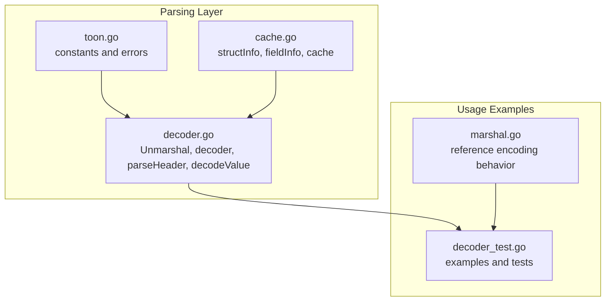
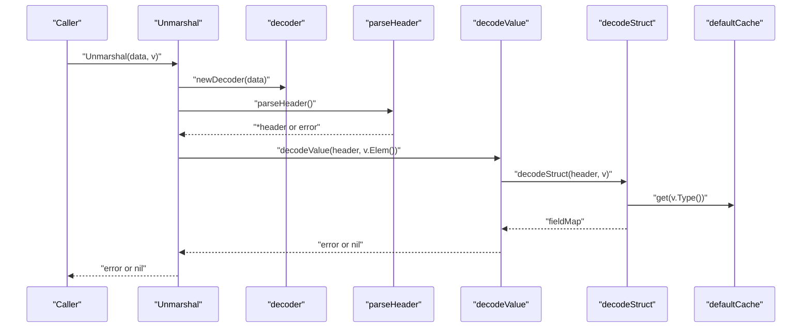
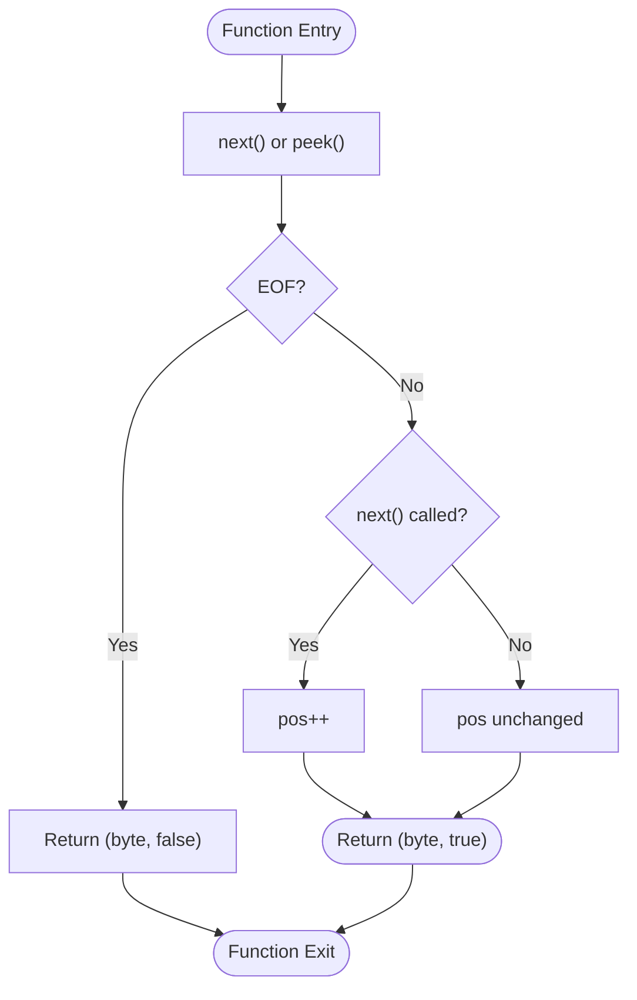
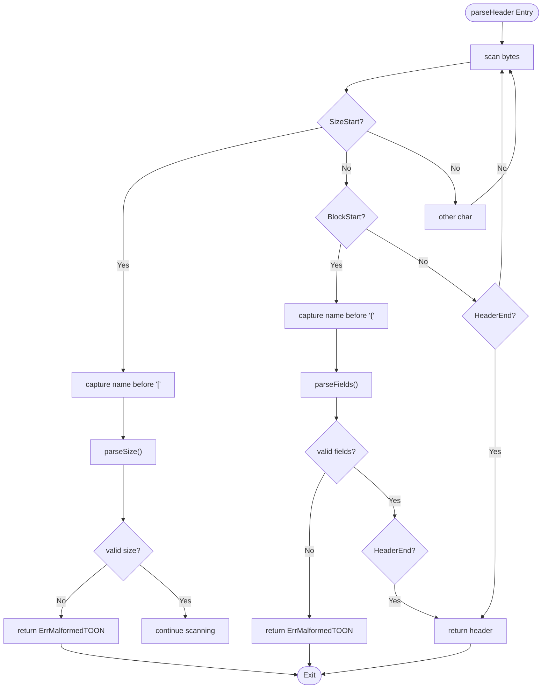
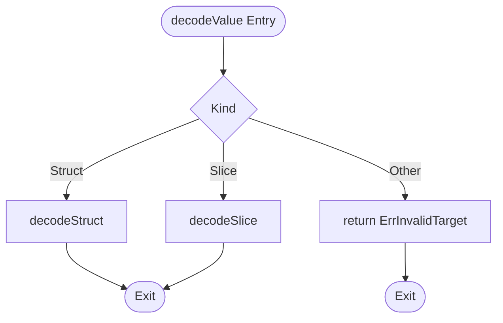
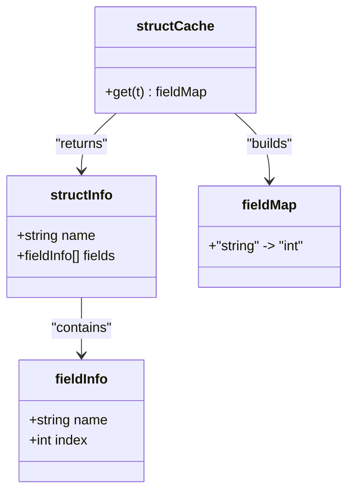
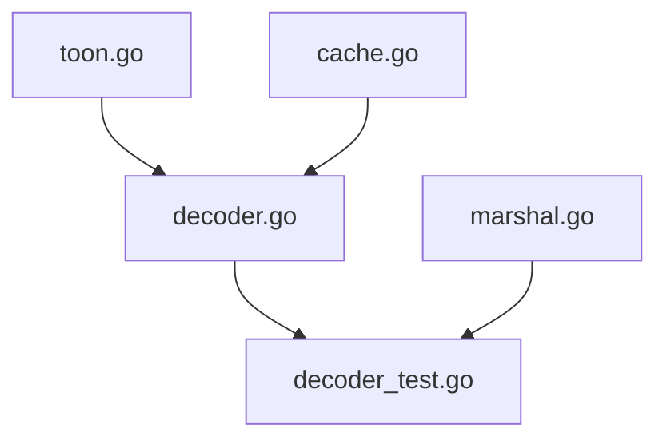

# Core Parsing API

<cite>
**Referenced Files in This Document**
- [toon.go](file://toon.go)
- [decoder.go](file://decoder.go)
- [cache.go](file://cache.go)
- [decoder_test.go](file://decoder_test.go)
- [marshal.go](file://marshal.go)
</cite>

## Table of Contents
1. [Introduction](#introduction)
2. [Project Structure](#project-structure)
3. [Core Components](#core-components)
4. [Architecture Overview](#architecture-overview)
5. [Detailed Component Analysis](#detailed-component-analysis)
6. [Dependency Analysis](#dependency-analysis)
7. [Performance Considerations](#performance-considerations)
8. [Troubleshooting Guide](#troubleshooting-guide)
9. [Conclusion](#conclusion)

## Introduction
This document provides comprehensive API documentation for the core parsing functions in the go-toon library. It focuses on the decoding API that parses TOON v3.0 data from bytes into Go values. The primary entry point is the Unmarshal function, which internally uses a streaming decoder to parse headers and values without allocations. The documentation covers function signatures, parameters, return values, error types, internal parser mechanics (position tracking, lookahead, whitespace handling), and practical usage patterns for structs and slices. Streaming capabilities and performance characteristics are also explained.

## Project Structure
The relevant parts of the project for parsing are organized as follows:
- Public constants and error definitions for TOON syntax and invalid targets
- Decoder implementation for streaming parsing of TOON v3.0
- Reflection-based field mapping and caching for efficient struct decoding
- Tests demonstrating usage and error conditions

**Diagram sources**
- [toon.go](file://toon.go#L1-L19)
- [decoder.go](file://decoder.go#L1-L303)
- [cache.go](file://cache.go#L1-L92)
- [decoder_test.go](file://decoder_test.go#L1-L157)
- [marshal.go](file://marshal.go#L1-L172)

**Section sources**
- [toon.go](file://toon.go#L1-L19)
- [decoder.go](file://decoder.go#L1-L303)
- [cache.go](file://cache.go#L1-L92)
- [decoder_test.go](file://decoder_test.go#L1-L157)
- [marshal.go](file://marshal.go#L1-L172)

## Core Components
This section documents the primary parsing APIs and their behavior.

- Unmarshal(data []byte, v interface{}) error
  - Purpose: Parses TOON v3.0 data into a destination that must be a pointer to a struct or a slice.
  - Parameters:
    - data: byte slice containing the TOON document
    - v: pointer to a struct or slice to decode into
  - Returns:
    - error: nil on success, otherwise ErrInvalidTarget or ErrMalformedTOON
  - Behavior:
    - Validates that v is a non-nil pointer
    - Creates a decoder and parses the header
    - Decodes values into the target reflect.Value according to the header
  - Errors:
    - ErrInvalidTarget: if v is not a pointer or is nil, or if the pointed-to type is neither struct nor slice
    - ErrMalformedTOON: if the TOON syntax is invalid (e.g., missing colon, invalid size, unexpected EOF)

- decoder struct
  - Purpose: Internal streaming parser that maintains position and provides lookahead.
  - Fields:
    - data: []byte — entire TOON byte stream
    - pos: int — current position in data
  - Methods:
    - next() (byte, bool): consumes and returns the next byte; false if EOF
    - peek() (byte, bool): returns next byte without consuming; false if EOF
    - skipWhitespace(): advances pos past spaces, tabs, newlines, carriage returns
    - parseHeader() (*header, error): parses the header portion (name, optional size, optional fields)
    - parseSize() (int, error): parses numeric size inside brackets
    - parseFields() ([]string, error): parses field list inside braces
    - decodeValue(h *header, v reflect.Value) error: dispatches to struct or slice decoding
    - decodeStruct(h *header, v reflect.Value) error: decodes CSV values into struct fields
    - decodeSlice(h *header, v reflect.Value) error: decodes multiple rows into a slice
    - setField(v reflect.Value, s string) error: converts string to typed value and sets field

- header struct
  - Purpose: Captures parsed header metadata
  - Fields:
    - name: string — type name
    - size: int — -1 if unspecified, otherwise the count
    - fields: []string — nil if unspecified, otherwise the ordered field names

- Constants and errors
  - Constants: BlockStart, BlockEnd, SizeStart, SizeEnd, HeaderEnd, Separator
  - Errors: ErrMalformedTOON, ErrInvalidTarget

Practical usage examples are demonstrated in tests for struct and slice decoding.

**Section sources**
- [decoder.go](file://decoder.go#L8-L22)
- [decoder.go](file://decoder.go#L24-L32)
- [decoder.go](file://decoder.go#L34-L61)
- [decoder.go](file://decoder.go#L63-L68)
- [decoder.go](file://decoder.go#L70-L115)
- [decoder.go](file://decoder.go#L117-L139)
- [decoder.go](file://decoder.go#L141-L173)
- [decoder.go](file://decoder.go#L175-L187)
- [decoder.go](file://decoder.go#L189-L229)
- [decoder.go](file://decoder.go#L231-L267)
- [decoder.go](file://decoder.go#L269-L302)
- [toon.go](file://toon.go#L5-L18)
- [decoder_test.go](file://decoder_test.go#L96-L143)

## Architecture Overview
The decoding pipeline is a streaming recursive descent parser built around a small set of primitives:
- Position tracking via decoder.pos
- Lookahead via next() and peek()
- Whitespace skipping via skipWhitespace()
- Header parsing to extract name, size, and fields
- Struct and slice decoding using reflection and cached field mapping

**Diagram sources**
- [decoder.go](file://decoder.go#L8-L22)
- [decoder.go](file://decoder.go#L30-L32)
- [decoder.go](file://decoder.go#L70-L115)
- [decoder.go](file://decoder.go#L175-L187)
- [decoder.go](file://decoder.go#L189-L229)
- [cache.go](file://cache.go#L21-L38)

## Detailed Component Analysis

### Unmarshal API
- Function signature: Unmarshal(data []byte, v interface{}) error
- Responsibilities:
  - Validate destination pointer
  - Parse header
  - Dispatch to decodeValue
- Error handling:
  - Returns ErrInvalidTarget for invalid destinations
  - Propagates ErrMalformedTOON from header and value parsing

**Section sources**
- [decoder.go](file://decoder.go#L8-L22)

### decoder struct internals
- Position tracking:
  - pos advances only on next()
  - peek() does not advance pos
- Lookahead:
  - next() returns false at EOF
  - peek() returns false at EOF
- Whitespace handling:
  - skipWhitespace() consumes all leading whitespace characters

**Diagram sources**
- [decoder.go](file://decoder.go#L34-L61)

**Section sources**
- [decoder.go](file://decoder.go#L24-L32)
- [decoder.go](file://decoder.go#L34-L61)

### Header parsing (recursive descent)
- parseHeader():
  - Scans forward until encountering SizeStart, BlockStart, or HeaderEnd
  - Extracts name, size, and fields accordingly
  - Returns ErrMalformedTOON on unexpected EOF
- parseSize():
  - Reads digits between SizeStart and SizeEnd
  - Returns ErrMalformedTOON if invalid or EOF
- parseFields():
  - Splits comma-separated identifiers between BlockStart and BlockEnd
  - Returns ErrMalformedTOON on unexpected EOF

**Diagram sources**
- [decoder.go](file://decoder.go#L70-L115)
- [decoder.go](file://decoder.go#L117-L139)
- [decoder.go](file://decoder.go#L141-L173)

**Section sources**
- [decoder.go](file://decoder.go#L70-L115)
- [decoder.go](file://decoder.go#L117-L139)
- [decoder.go](file://decoder.go#L141-L173)

### Value decoding (struct and slice)
- decodeValue():
  - Dispatches based on reflect.Kind
  - Returns ErrInvalidTarget for unsupported kinds
- decodeStruct():
  - Uses cached field mapping to set fields by name
  - Reads values until separator or newline
  - Skips separators and handles unknown fields gracefully
- decodeSlice():
  - Iterates rows until EOF
  - Creates new element per row and appends to slice
  - Handles optional newline separators

**Diagram sources**
- [decoder.go](file://decoder.go#L175-L187)
- [decoder.go](file://decoder.go#L189-L229)
- [decoder.go](file://decoder.go#L231-L267)

**Section sources**
- [decoder.go](file://decoder.go#L175-L187)
- [decoder.go](file://decoder.go#L189-L229)
- [decoder.go](file://decoder.go#L231-L267)

### Field mapping and caching
- structInfo and fieldInfo capture type metadata once per type
- getStructInfo caches structInfo in a sync.Map
- defaultCache provides a fieldMap keyed by field name to reflect index

**Diagram sources**
- [cache.go](file://cache.go#L9-L19)
- [cache.go](file://cache.go#L21-L38)
- [cache.go](file://cache.go#L76-L92)

**Section sources**
- [cache.go](file://cache.go#L9-L19)
- [cache.go](file://cache.go#L21-L38)
- [cache.go](file://cache.go#L76-L92)

### Practical usage examples
- Struct decoding:
  - Example input: "user{ID,Name}:42,John"
  - Expected result: struct with ID=42, Name="John"
- Slice decoding:
  - Example input: "users[2]{ID,Name}:42,John\n43,Jane"
  - Expected result: slice of two users
- Error conditions:
  - Invalid target (non-pointer or non-struct/slice)
  - Malformed header (missing colon, invalid size)

These examples are validated by tests.

**Section sources**
- [decoder_test.go](file://decoder_test.go#L96-L143)
- [decoder_test.go](file://decoder_test.go#L145-L156)

## Dependency Analysis
The parsing API depends on:
- toon.go for constants and error types
- cache.go for struct metadata and field mapping
- decoder.go for the streaming parser and decoding logic

**Diagram sources**
- [toon.go](file://toon.go#L1-L19)
- [decoder.go](file://decoder.go#L1-L303)
- [cache.go](file://cache.go#L1-L92)
- [decoder_test.go](file://decoder_test.go#L1-L157)
- [marshal.go](file://marshal.go#L1-L172)

**Section sources**
- [toon.go](file://toon.go#L1-L19)
- [decoder.go](file://decoder.go#L1-L303)
- [cache.go](file://cache.go#L1-L92)
- [decoder_test.go](file://decoder_test.go#L1-L157)
- [marshal.go](file://marshal.go#L1-L172)

## Performance Considerations
- Zero-allocation decoding:
  - The decoder operates directly on the input byte slice and uses minimal intermediate allocations
  - Field mapping is cached to avoid repeated reflection overhead
- Buffer pooling:
  - Encoding uses a buffer pool to reduce allocation churn during Marshal operations
- Streaming:
  - The decoder is designed for streaming; it does not require loading the entire document into memory
- Memory efficiency:
  - decodeSlice grows the slice incrementally; consider pre-sizing if the size is known
  - decodeStruct reads values lazily and stops at separators/newlines

[No sources needed since this section provides general guidance]

## Troubleshooting Guide
Common issues and resolutions:
- ErrInvalidTarget:
  - Occurs when the destination is not a pointer or is nil, or when the pointed-to type is neither struct nor slice
  - Ensure the argument to Unmarshal is a pointer to a struct or slice
- ErrMalformedTOON:
  - Occurs on invalid syntax such as missing HeaderEnd, invalid size, or unexpected EOF
  - Verify the TOON header format and ensure balanced brackets and braces
- Unknown fields:
  - decodeStruct skips unknown fields; confirm field names match the header exactly
- Whitespace:
  - The decoder ignores standard whitespace; ensure values themselves do not contain unintended whitespace

**Section sources**
- [decoder.go](file://decoder.go#L8-L22)
- [decoder.go](file://decoder.go#L70-L115)
- [decoder.go](file://decoder.go#L189-L229)
- [decoder_test.go](file://decoder_test.go#L145-L156)

## Conclusion
The go-toon decoding API provides a fast, streaming, and memory-efficient way to parse TOON v3.0 data into Go structs and slices. Its design centers on a small set of primitives (next/peek, skipWhitespace) and a recursive descent parser that captures header metadata and decodes values using reflection and caching. The API surfaces clear error semantics and is validated by comprehensive tests covering typical usage patterns and error conditions.