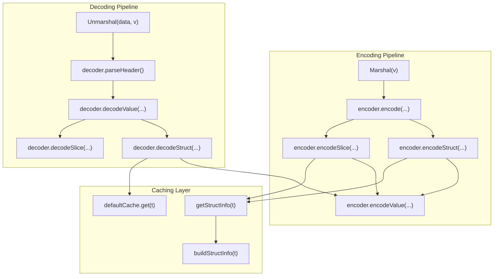
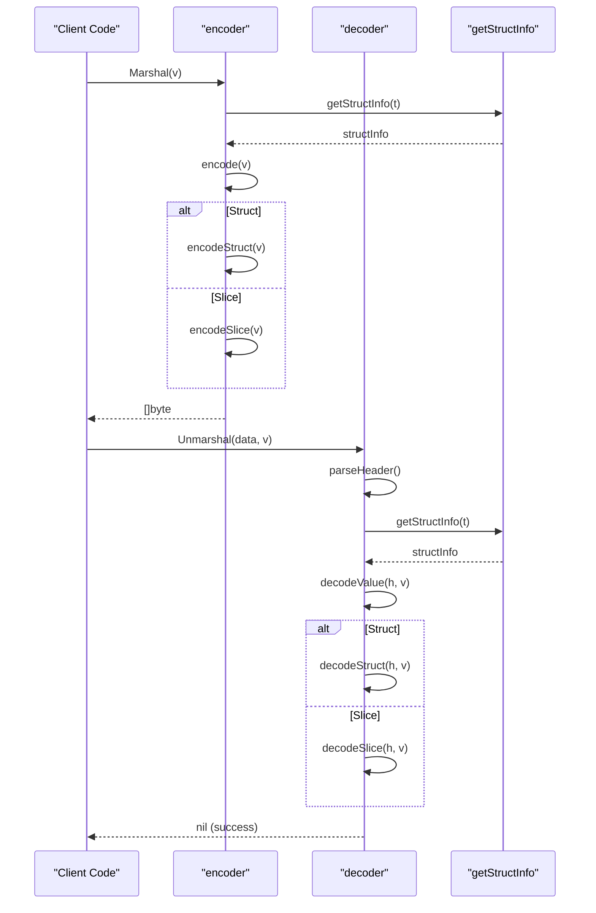
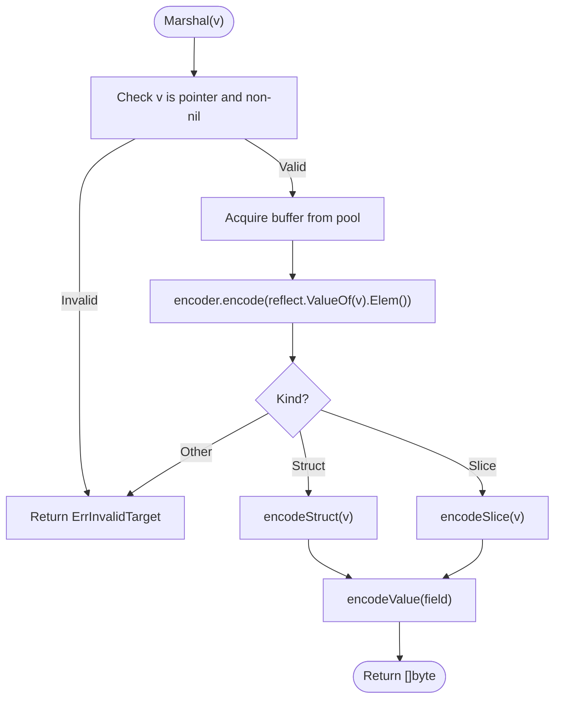
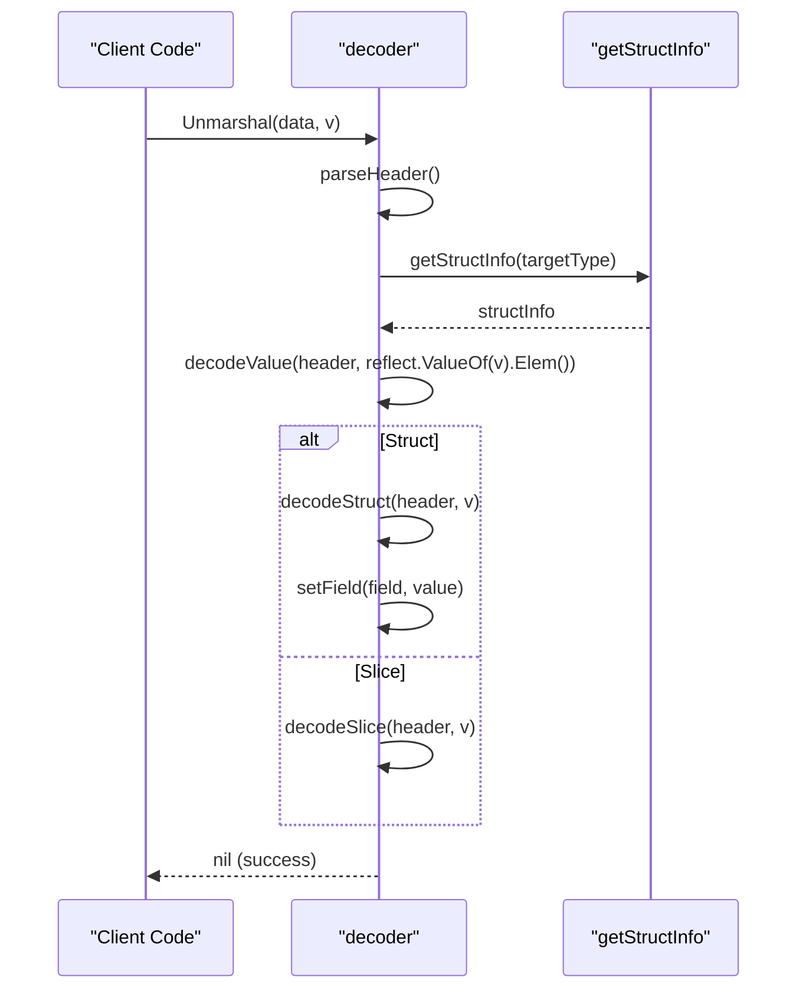
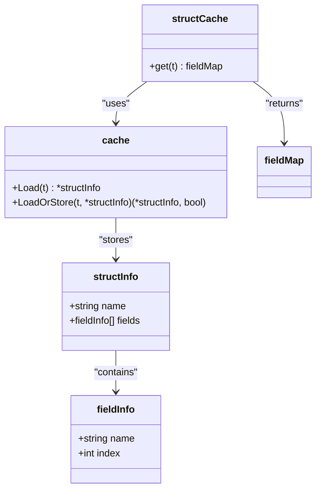
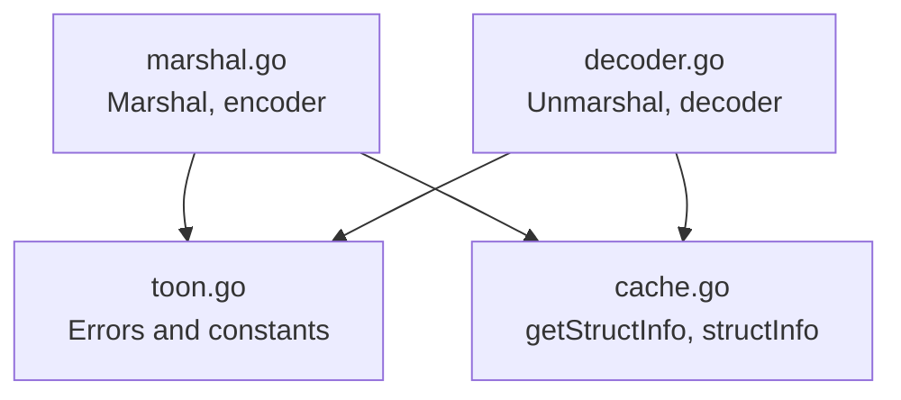

# Value System API

<cite>
**Referenced Files in This Document**
- [toon.go](file://toon.go)
- [marshal.go](file://marshal.go)
- [decoder.go](file://decoder.go)
- [cache.go](file://cache.go)
- [marshal_test.go](file://marshal_test.go)
- [decoder_test.go](file://decoder_test.go)
- [cache_test.go](file://cache_test.go)
</cite>

## Table of Contents
1. [Introduction](#introduction)
2. [Project Structure](#project-structure)
3. [Core Components](#core-components)
4. [Architecture Overview](#architecture-overview)
5. [Detailed Component Analysis](#detailed-component-analysis)
6. [Dependency Analysis](#dependency-analysis)
7. [Performance Considerations](#performance-considerations)
8. [Troubleshooting Guide](#troubleshooting-guide)
9. [Conclusion](#conclusion)

## Introduction
This document describes the Value system and type definitions used by the go-toon library. The library provides a compact binary serialization format called TOON v3.0 and exposes a high-performance encoder and decoder built around reflection. The Value system enables efficient marshaling and unmarshaling of structured data with minimal allocations and strong type safety guarantees during encoding and decoding.

## Project Structure
The go-toon package centers around three primary modules:
- Encoding pipeline: transforms Go values into TOON v3.0 format
- Decoding pipeline: reconstructs Go values from TOON v3.0 data
- Reflection metadata caching: optimizes repeated struct field lookups

**Diagram sources**
- [marshal.go](file://marshal.go#L18-L38)
- [marshal.go](file://marshal.go#L50-L65)
- [marshal.go](file://marshal.go#L67-L93)
- [marshal.go](file://marshal.go#L95-L137)
- [marshal.go](file://marshal.go#L139-L171)
- [decoder.go](file://decoder.go#L9-L22)
- [decoder.go](file://decoder.go#L71-L115)
- [decoder.go](file://decoder.go#L175-L187)
- [decoder.go](file://decoder.go#L189-L229)
- [decoder.go](file://decoder.go#L231-L267)
- [cache.go](file://cache.go#L24-L38)
- [cache.go](file://cache.go#L40-L74)
- [cache.go](file://cache.go#L76-L84)

**Section sources**
- [marshal.go](file://marshal.go#L1-L172)
- [decoder.go](file://decoder.go#L1-L303)
- [cache.go](file://cache.go#L1-L92)
- [toon.go](file://toon.go#L1-L19)

## Core Components
This section documents the Value system and type definitions used by the library’s encoding and decoding mechanisms.

- Type enumeration
  - Null: represented by a sentinel marker in the TOON format; during encoding, nil pointers are encoded as a specific null token. During decoding, string values that represent null are skipped or handled according to target type semantics.
  - Boolean: encoded as a single-character indicator; decoding converts string tokens to Go bool values.
  - Number: supports signed and unsigned integers and floating-point numbers; encoding uses numeric conversions; decoding parses numeric strings into appropriate Go types.
  - String: encoded as raw text; decoding assigns string values directly.
  - Array: encoded as a header followed by a sequence of rows; decoding reconstructs slices of structs by parsing rows and fields.
  - Object: encoded as a header with field names and values; decoding maps CSV-like values onto struct fields.

- Value representation
  - The Value system is implemented implicitly via reflection-driven encoding and decoding. There is no dedicated Value struct in the analyzed files; instead, values are represented as:
    - Structs: encoded with a header containing the struct name, optional size, field names, and a colon separator, followed by comma-separated values.
    - Slices: encoded similarly but include a size in brackets after the struct name.
    - Primitive scalars: encoded directly as their textual representations.

- Constructor functions
  - The library does not expose explicit constructor functions for individual values. Instead, values are constructed naturally in Go and marshaled/unmarshaled through the provided APIs.

- Type-safe access methods
  - Access is type-safe through reflection during marshal/unmarshal. The decoder enforces that targets must be pointers to structs or slices; otherwise, an invalid-target error is returned.

- Navigation methods
  - The library does not provide generic navigation methods like Get, Index, or Len. Instead:
    - Object field access is performed by mapping field names to indices using cached metadata.
    - Array/slice element access occurs during iteration over rows during decoding.
    - Length retrieval is implicit from the size specified in the TOON header for arrays.

- Type checking and conversion utilities
  - Type checking is implicit via reflect.Kind during encoding and decoding.
  - Conversion utilities are implemented in the decoder’s field setter, which parses strings into the appropriate Go types.

- Comparison operations
  - The library does not expose explicit comparison functions for values. Equality checks are performed by comparing decoded Go values directly.

- Function signatures and guarantees
  - Marshal(v interface{}) ([]byte, error): Encodes a pointer to a struct or slice into TOON v3.0. Returns ErrInvalidTarget if the target is invalid.
  - Unmarshal(data []byte, v interface{}) error: Decodes TOON data into a pointer to a struct or slice. Returns ErrInvalidTarget or ErrMalformedTOON on errors.
  - Constants define separators and error conditions for robust parsing and encoding.

Practical examples
- Creating and marshaling a struct:
  - See [marshal_test.go](file://marshal_test.go#L18-L30) for struct marshaling.
- Marshaling a slice:
  - See [marshal_test.go](file://marshal_test.go#L32-L47) for slice marshaling.
- Round-trip encoding/decoding:
  - See [marshal_test.go](file://marshal_test.go#L88-L117) for round-trip verification.
- Unmarshaling a struct:
  - See [decoder_test.go](file://decoder_test.go#L96-L117) for struct unmarshaling.
- Unmarshaling a slice:
  - See [decoder_test.go](file://decoder_test.go#L119-L145) for slice unmarshaling.

**Section sources**
- [marshal.go](file://marshal.go#L18-L38)
- [decoder.go](file://decoder.go#L9-L22)
- [decoder.go](file://decoder.go#L269-L302)
- [toon.go](file://toon.go#L5-L18)
- [marshal_test.go](file://marshal_test.go#L18-L117)
- [decoder_test.go](file://decoder_test.go#L96-L159)

## Architecture Overview
The Value system is embedded within the encoder and decoder. The encoder traverses reflect.Value instances to produce TOON bytes, while the decoder reconstructs reflect.Value instances from TOON bytes. Caching accelerates repeated struct metadata lookups.

**Diagram sources**
- [marshal.go](file://marshal.go#L18-L38)
- [marshal.go](file://marshal.go#L50-L65)
- [marshal.go](file://marshal.go#L67-L93)
- [marshal.go](file://marshal.go#L95-L137)
- [decoder.go](file://decoder.go#L9-L22)
- [decoder.go](file://decoder.go#L71-L115)
- [decoder.go](file://decoder.go#L175-L187)
- [decoder.go](file://decoder.go#L189-L229)
- [decoder.go](file://decoder.go#L231-L267)
- [cache.go](file://cache.go#L24-L38)

## Detailed Component Analysis

### Encoding Pipeline
The encoder transforms Go values into TOON v3.0 format:
- Validates that the input is a non-nil pointer.
- Uses a buffer pool to avoid allocations.
- Encodes structs with a header containing the struct name, optional size, field names, and a colon separator, followed by comma-separated values.
- Encodes slices with a header containing the struct name, size, field names, and a colon separator, followed by newline-separated rows of values.
- Encodes primitive values directly as their textual representations.

**Diagram sources**
- [marshal.go](file://marshal.go#L18-L38)
- [marshal.go](file://marshal.go#L50-L65)
- [marshal.go](file://marshal.go#L67-L93)
- [marshal.go](file://marshal.go#L95-L137)
- [marshal.go](file://marshal.go#L139-L171)

**Section sources**
- [marshal.go](file://marshal.go#L18-L38)
- [marshal.go](file://marshal.go#L50-L65)
- [marshal.go](file://marshal.go#L67-L93)
- [marshal.go](file://marshal.go#L95-L137)
- [marshal.go](file://marshal.go#L139-L171)

### Decoding Pipeline
The decoder reconstructs Go values from TOON v3.0 data:
- Validates that the target is a non-nil pointer.
- Parses the header to extract the struct name, optional size, and field names.
- Decodes struct fields by mapping field names to indices using cached metadata.
- Decodes slices by iterating rows and constructing elements.

**Diagram sources**
- [decoder.go](file://decoder.go#L9-L22)
- [decoder.go](file://decoder.go#L71-L115)
- [decoder.go](file://decoder.go#L175-L187)
- [decoder.go](file://decoder.go#L189-L229)
- [decoder.go](file://decoder.go#L231-L267)
- [decoder.go](file://decoder.go#L269-L302)
- [cache.go](file://cache.go#L24-L38)

**Section sources**
- [decoder.go](file://decoder.go#L9-L22)
- [decoder.go](file://decoder.go#L71-L115)
- [decoder.go](file://decoder.go#L175-L187)
- [decoder.go](file://decoder.go#L189-L229)
- [decoder.go](file://decoder.go#L231-L267)
- [decoder.go](file://decoder.go#L269-L302)
- [cache.go](file://cache.go#L24-L38)

### Caching Layer
The caching layer improves performance by memoizing struct metadata:
- getStructInfo caches structInfo for a given reflect.Type.
- buildStructInfo constructs structInfo by scanning exported fields, honoring toon tags.
- defaultCache.get provides a legacy-compatible field map lookup.

**Diagram sources**
- [cache.go](file://cache.go#L9-L19)
- [cache.go](file://cache.go#L21-L38)
- [cache.go](file://cache.go#L40-L74)
- [cache.go](file://cache.go#L76-L92)

**Section sources**
- [cache.go](file://cache.go#L9-L19)
- [cache.go](file://cache.go#L21-L38)
- [cache.go](file://cache.go#L40-L74)
- [cache.go](file://cache.go#L76-L92)

### Practical Examples
- Marshal a struct:
  - See [marshal_test.go](file://marshal_test.go#L18-L30).
- Marshal a slice:
  - See [marshal_test.go](file://marshal_test.go#L32-L47).
- Round-trip:
  - See [marshal_test.go](file://marshal_test.go#L88-L117).
- Unmarshal a struct:
  - See [decoder_test.go](file://decoder_test.go#L96-L117).
- Unmarshal a slice:
  - See [decoder_test.go](file://decoder_test.go#L119-L145).

**Section sources**
- [marshal_test.go](file://marshal_test.go#L18-L117)
- [decoder_test.go](file://decoder_test.go#L96-L159)

## Dependency Analysis
The following diagram shows key dependencies among components:

**Diagram sources**
- [toon.go](file://toon.go#L5-L18)
- [marshal.go](file://marshal.go#L1-L172)
- [decoder.go](file://decoder.go#L1-L303)
- [cache.go](file://cache.go#L1-L92)

**Section sources**
- [toon.go](file://toon.go#L5-L18)
- [marshal.go](file://marshal.go#L1-L172)
- [decoder.go](file://decoder.go#L1-L303)
- [cache.go](file://cache.go#L1-L92)

## Performance Considerations
- Buffer pooling: The encoder uses a sync.Pool to reuse buffers, minimizing allocations during encoding.
- Reflection caching: Struct metadata is cached to avoid repeated reflection overhead.
- Zero-copy decoding: The decoder operates directly on the input byte slice and uses minimal intermediate allocations.
- Memory efficiency: Arrays are encoded with an explicit size in the header, enabling efficient preallocation and decoding.

[No sources needed since this section provides general guidance]

## Troubleshooting Guide
Common issues and resolutions:
- Invalid target error: Occurs when Marshal or Unmarshal is called with a non-pointer or nil pointer, or with a non-struct/slice target. Ensure the target is a pointer to a struct or slice.
- Malformed TOON error: Occurs when the input data violates the TOON v3.0 specification (e.g., missing header terminator, invalid size). Validate input data against the format.

**Section sources**
- [marshal.go](file://marshal.go#L18-L22)
- [decoder.go](file://decoder.go#L9-L22)
- [decoder.go](file://decoder.go#L71-L115)
- [decoder.go](file://decoder.go#L118-L139)
- [decoder.go](file://decoder.go#L142-L173)
- [toon.go](file://toon.go#L5-L8)

## Conclusion
The go-toon library’s Value system is implemented through reflection-driven encoding and decoding with a focus on performance and correctness. While there is no dedicated Value struct, the system provides robust marshaling and unmarshaling of structs and slices with strong type safety and minimal allocations. The caching layer further enhances performance by memoizing struct metadata, and the error model ensures predictable handling of malformed inputs and invalid targets.