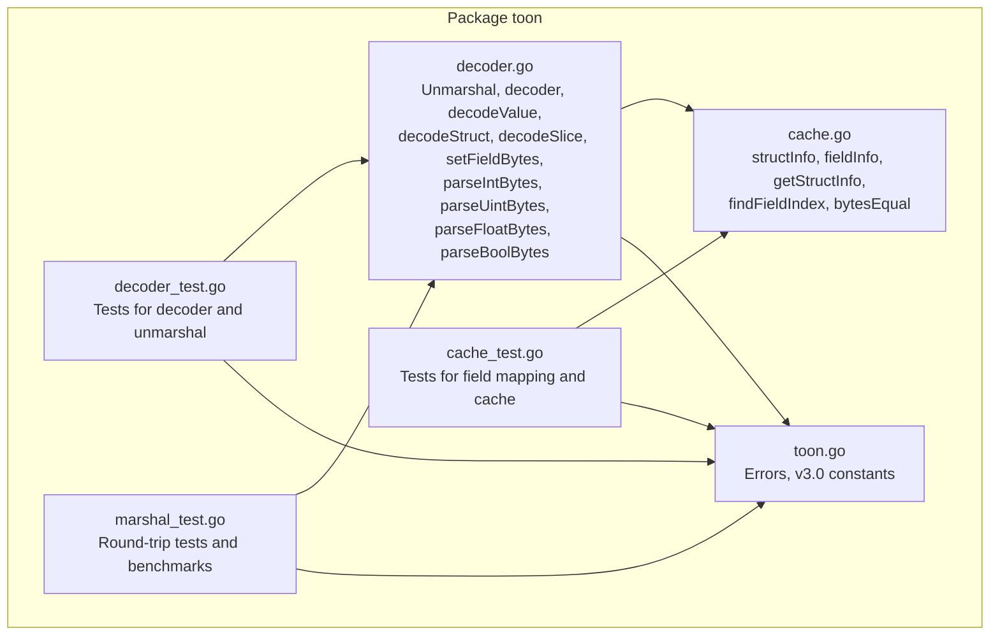
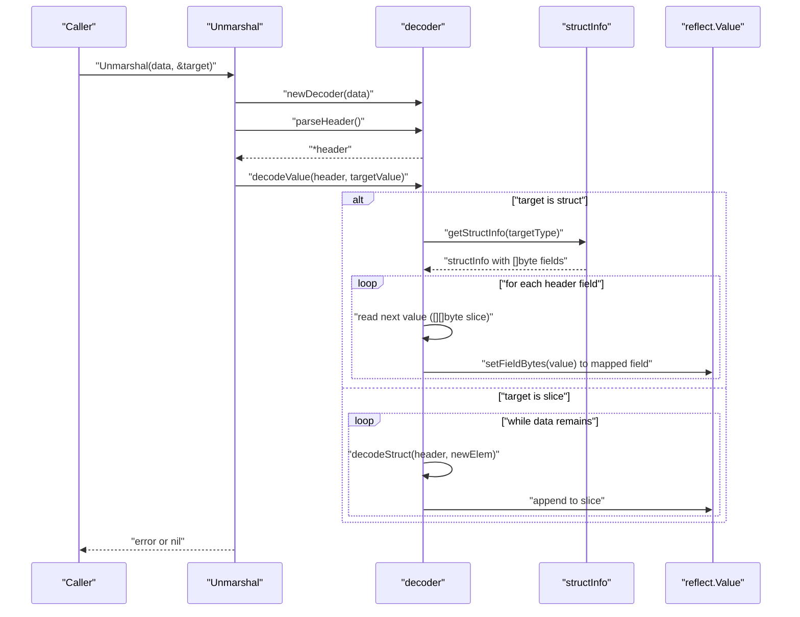
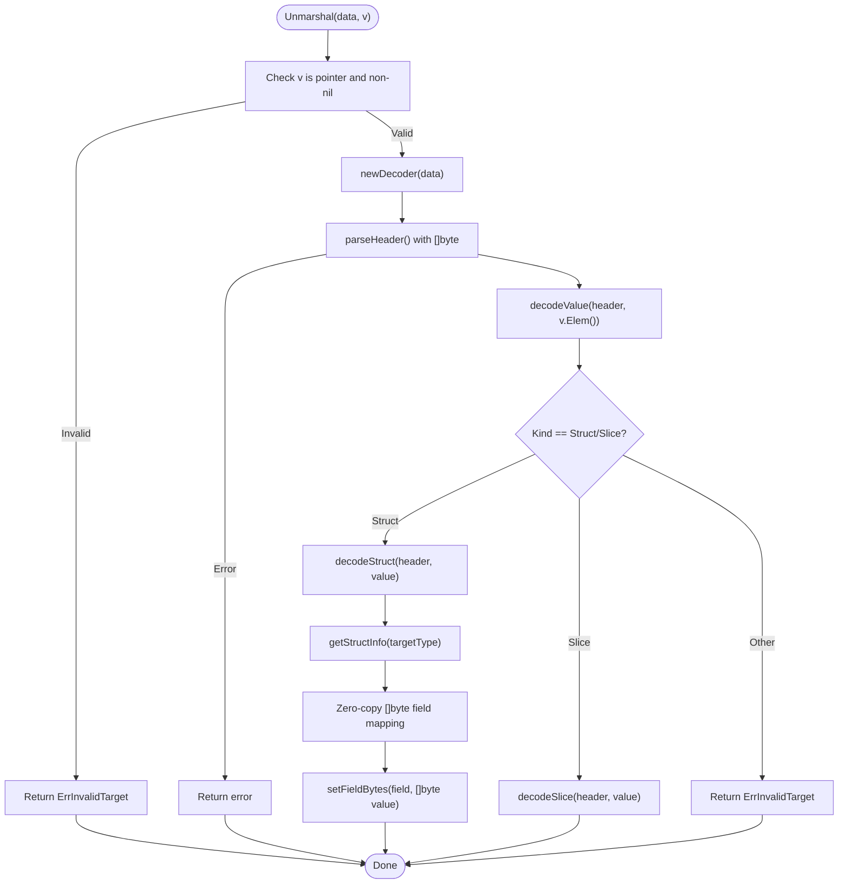
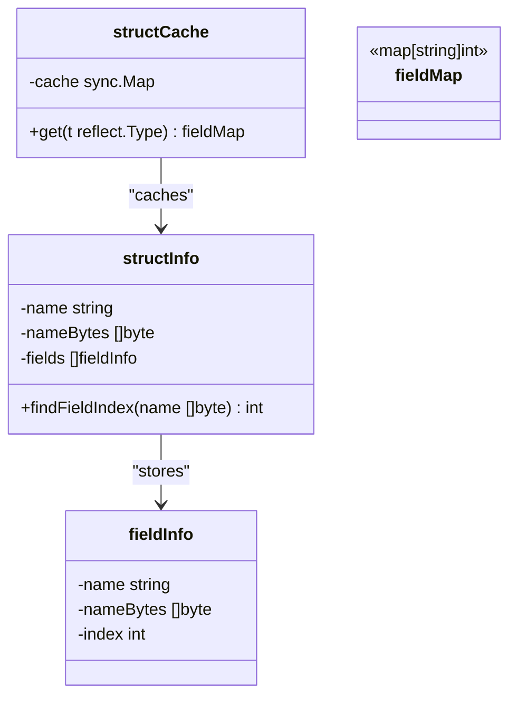
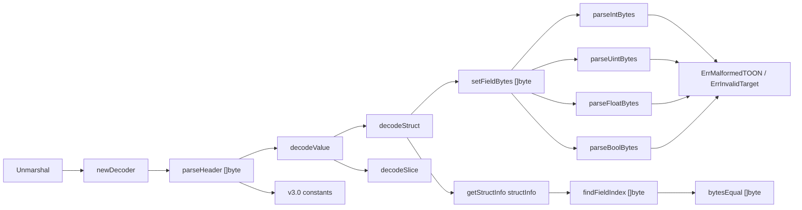

# Advanced Unmarshaling System

<cite>
**Referenced Files in This Document**
- [decoder.go](file://decoder.go)
- [cache.go](file://cache.go)
- [toon.go](file://toon.go)
- [decoder_test.go](file://decoder_test.go)
- [cache_test.go](file://cache_test.go)
- [marshal_test.go](file://marshal_test.go)
</cite>

## Update Summary
**Changes Made**
- Updated decoder implementation section to reflect new []byte parsing optimizations
- Added documentation for new specialized numeric parsing functions
- Enhanced field mapping performance section with zero-copy []byte comparison details
- Updated performance considerations to highlight new []byte-based optimizations
- Added new specialized parsing functions section with detailed implementation analysis

## Table of Contents
1. [Introduction](#introduction)
2. [Project Structure](#project-structure)
3. [Core Components](#core-components)
4. [Architecture Overview](#architecture-overview)
5. [Detailed Component Analysis](#detailed-component-analysis)
6. [Dependency Analysis](#dependency-analysis)
7. [Performance Considerations](#performance-considerations)
8. [Troubleshooting Guide](#troubleshooting-guide)
9. [Conclusion](#conclusion)

## Introduction
This document describes the advanced unmarshaling system that binds TOON v3.0-encoded data into Go structs and slices using reflection. It focuses on:
- Reflection-based decoding for dynamic struct and slice unmarshaling
- Field mapping cache for performance optimization with zero-copy []byte comparisons
- TOON v3.0 specification compliance for headers and separators
- Struct field tagging via the "toon" tag
- Enhanced []byte parsing optimizations with specialized numeric parsers
- Practical patterns for struct binding, error handling, and performance best practices

## Project Structure
The project consists of four primary packages:
- Decoder and parsing logic for TOON v3.0 streams with []byte optimizations
- Field mapping cache with concurrency-safe lazy initialization and zero-copy comparisons
- Constants and error definitions for TOON v3.0 semantics
- Tests validating parsing, caching, and unmarshaling behavior with performance benchmarks

**Diagram sources**
- [decoder.go](file://decoder.go#L1-L398)
- [cache.go](file://cache.go#L1-L112)
- [toon.go](file://toon.go#L1-L19)
- [decoder_test.go](file://decoder_test.go#L1-L159)
- [cache_test.go](file://cache_test.go#L1-L86)
- [marshal_test.go](file://marshal_test.go#L1-L147)

**Section sources**
- [decoder.go](file://decoder.go#L1-L398)
- [cache.go](file://cache.go#L1-L112)
- [toon.go](file://toon.go#L1-L19)
- [decoder_test.go](file://decoder_test.go#L1-L159)
- [cache_test.go](file://cache_test.go#L1-L86)
- [marshal_test.go](file://marshal_test.go#L1-L147)

## Core Components
- Unmarshal: Entry point that validates the target pointer and initiates decoding.
- decoder: Streaming parser that reads TOON v3.0 headers and values using []byte without allocations.
- structInfo: Enhanced field mapping cache with zero-copy []byte comparison for performance optimization.
- setFieldBytes: Specialized []byte to field converter that eliminates string allocations.
- Specialized numeric parsers: Direct []byte parsing functions for int, uint, float, and bool types.
- Error and constant definitions: TOON v3.0 semantics and error conditions.

Key responsibilities:
- Unmarshal ensures the target is a non-nil pointer and delegates to the optimized decoder.
- decoder parses headers and values using []byte operations, skipping whitespace efficiently.
- structInfo builds and caches field maps using []byte comparisons for zero-copy performance.
- setFieldBytes handles supported scalar types using specialized []byte parsers with minimal allocations.
- Specialized numeric parsers provide direct []byte to native type conversion without intermediate string processing.

**Section sources**
- [decoder.go](file://decoder.go#L7-L398)
- [cache.go](file://cache.go#L9-L112)
- [toon.go](file://toon.go#L5-L19)

## Architecture Overview
The unmarshaling pipeline integrates optimized []byte parsing, caching, and reflection-driven assignment with zero-copy []byte comparisons.

**Diagram sources**
- [decoder.go](file://decoder.go#L8-L21)
- [decoder.go](file://decoder.go#L69-L111)
- [decoder.go](file://decoder.go#L166-L178)
- [decoder.go](file://decoder.go#L180-L224)
- [decoder.go](file://decoder.go#L226-L256)
- [cache.go](file://cache.go#L26-L37)

## Detailed Component Analysis

### Enhanced Unmarshal and Decoder
- Validates that the target is a non-nil pointer.
- Parses the TOON v3.0 header to extract name, optional size, and field list using []byte operations.
- Dispatches to decodeValue which branches on struct vs slice.
- decodeStruct uses cached field mapping to assign values by field name with zero-copy []byte comparisons.
- decodeSlice iteratively decodes rows into new struct elements and appends to the slice.

**Diagram sources**
- [decoder.go](file://decoder.go#L8-L21)
- [decoder.go](file://decoder.go#L69-L111)
- [decoder.go](file://decoder.go#L166-L178)
- [decoder.go](file://decoder.go#L180-L224)
- [decoder.go](file://decoder.go#L226-L256)
- [cache.go](file://cache.go#L26-L37)

**Section sources**
- [decoder.go](file://decoder.go#L8-L21)
- [decoder.go](file://decoder.go#L69-L111)
- [decoder.go](file://decoder.go#L166-L178)
- [decoder.go](file://decoder.go#L180-L224)
- [decoder.go](file://decoder.go#L226-L256)

### Enhanced Field Mapping Cache
- structInfo stores fieldInfo entries with []byte representations for zero-copy comparisons.
- getStructInfo uses sync.Map for optimal concurrent performance with load-or-store pattern.
- buildStructInfo enumerates exported struct fields, preferring the "toon" tag for mapping keys when present.
- findFieldIndex performs zero-copy []byte comparison using bytesEqual for maximum performance.
- bytesEqual provides optimized comparison for small slices without allocations.

**Diagram sources**
- [cache.go](file://cache.go#L9-L14)
- [cache.go](file://cache.go#L16-L21)
- [cache.go](file://cache.go#L23-L37)
- [cache.go](file://cache.go#L40-L74)
- [cache.go](file://cache.go#L76-L84)
- [cache.go](file://cache.go#L86-L97)

**Section sources**
- [cache.go](file://cache.go#L9-L14)
- [cache.go](file://cache.go#L16-L21)
- [cache.go](file://cache.go#L23-L37)
- [cache.go](file://cache.go#L40-L74)
- [cache.go](file://cache.go#L76-L84)
- [cache.go](file://cache.go#L86-L97)

### Enhanced Field Tagging and Mapping Behavior
- Exported fields are included in the field map with []byte representations.
- If a field has a "toon" struct tag, the tag value becomes the mapping key; otherwise, the field name is used.
- Unexported fields are excluded from the mapping.
- Zero-copy []byte comparison eliminates string allocation overhead during field lookup.

Practical implications:
- Use "toon" tags to align struct fields with TOON field names differing from Go identifiers.
- Keep sensitive fields unexported to prevent accidental exposure during mapping.
- Zero-copy []byte comparisons provide significant performance benefits for large field sets.

**Section sources**
- [cache.go](file://cache.go#L40-L74)
- [cache.go](file://cache.go#L76-L84)
- [cache_test.go](file://cache_test.go#L15-L53)

### Enhanced Type Conversion and setFieldBytes
- Supported kinds: string, signed integers, unsigned integers, floats, and bool.
- Uses specialized []byte parsing functions to eliminate string allocations during conversion.
- Direct []byte to native type conversion for maximum performance.
- Malformed values produce ErrMalformedTOON with precise error reporting.

Common scenarios:
- CSV-like values separated by commas are assigned to struct fields using zero-copy []byte slicing.
- Slice targets expect newline-separated rows; each row is decoded into a new struct element.
- Specialized parsers handle numeric and boolean values directly from []byte without intermediate string processing.

**Section sources**
- [decoder.go](file://decoder.go#L257-L291)
- [decoder.go](file://decoder.go#L292-L397)
- [toon.go](file://toon.go#L5-L8)

### Specialized Numeric Parsing Functions
The system includes four specialized []byte parsing functions optimized for different numeric types:

#### parseIntBytes
- Direct []byte to int64 conversion without string allocation
- Handles negative numbers and validates digit ranges
- Returns ErrMalformedTOON for invalid input

#### parseUintBytes  
- Direct []byte to uint64 conversion without string allocation
- Validates digit ranges only (no negative handling)
- Returns ErrMalformedTOON for invalid input

#### parseFloatBytes
- Direct []byte to float64 conversion with decimal support
- Handles fractional numbers and validates digit ranges
- Returns ErrMalformedTOON for invalid input

#### parseBoolBytes
- Optimized []byte to bool conversion with multiple format support
- Supports "+"/"-" for true/false, "1"/"0", "true"/"false", "T"/"F", "TRUE"/"FALSE"
- Returns ErrMalformedTOON for unrecognized formats

**Section sources**
- [decoder.go](file://decoder.go#L292-L316)
- [decoder.go](file://decoder.go#L318-L332)
- [decoder.go](file://decoder.go#L334-L368)
- [decoder.go](file://decoder.go#L370-L397)

### TOON v3.0 Specification Compliance
- Header syntax: name[size]{field1,field2,...}:
- Separators: comma separates values; newline separates rows.
- Size brackets enclose an optional count; fields block encloses a list of field names.
- Whitespace is skipped around tokens using efficient []byte operations.

Validation behavior:
- Missing header terminator yields ErrMalformedTOON.
- Invalid size content yields ErrMalformedTOON.
- Unknown fields in headers are ignored safely.

**Section sources**
- [toon.go](file://toon.go#L10-L19)
- [decoder.go](file://decoder.go#L69-L111)
- [decoder.go](file://decoder.go#L113-L134)
- [decoder.go](file://decoder.go#L136-L164)

### Examples of Struct Binding Patterns
- Basic struct binding: header fields map to struct fields by name using zero-copy []byte comparisons.
- Tagged fields: "toon" tag overrides the mapping key for a field with []byte optimization.
- Slice binding: multiple rows are decoded into a slice of structs with []byte parsing.

These patterns are validated by tests covering:
- Header parsing with optional size and fields
- Struct unmarshaling with integer and string fields using specialized parsers
- Slice unmarshaling with two rows
- Error conditions for invalid targets
- Round-trip marshaling/unmarshaling validation

**Section sources**
- [decoder_test.go](file://decoder_test.go#L27-L94)
- [decoder_test.go](file://decoder_test.go#L96-L145)
- [decoder_test.go](file://decoder_test.go#L147-L159)
- [marshal_test.go](file://marshal_test.go#L18-L117)

## Dependency Analysis
The system exhibits low coupling and clear separation of concerns with enhanced []byte optimization:
- decoder depends on toon constants and error values
- decoder uses structInfo for field mapping with zero-copy []byte comparisons
- structInfo depends on reflect, strings, and sync primitives
- Specialized parsers provide direct []byte to native type conversion
- Tests exercise public APIs and internal helpers with performance benchmarks

**Diagram sources**
- [decoder.go](file://decoder.go#L8-L21)
- [decoder.go](file://decoder.go#L69-L111)
- [decoder.go](file://decoder.go#L166-L178)
- [decoder.go](file://decoder.go#L180-L224)
- [decoder.go](file://decoder.go#L226-L256)
- [decoder.go](file://decoder.go#L257-L291)
- [decoder.go](file://decoder.go#L292-L397)
- [cache.go](file://cache.go#L26-L37)
- [cache.go](file://cache.go#L76-L84)
- [cache.go](file://cache.go#L86-L97)
- [toon.go](file://toon.go#L5-L19)

**Section sources**
- [decoder.go](file://decoder.go#L1-L398)
- [cache.go](file://cache.go#L1-L112)
- [toon.go](file://toon.go#L1-L19)

## Performance Considerations
- Reflection overhead is minimized by:
  - Using a field mapping cache with zero-copy []byte comparisons to avoid repeated reflection lookups
  - Performing a single pass over the input stream with minimal allocations using []byte operations
  - Specialized numeric parsers eliminate string allocations during type conversion
- Concurrency:
  - structInfo uses sync.Map for optimal concurrent performance with load-or-store pattern
  - Double-checked locking reduced contention after initial cache population
- Memory:
  - No intermediate string buffers are allocated beyond the decoder and small temporary slices
  - Zero-copy []byte slicing eliminates string allocation overhead
  - Slice growth occurs via reflect.Append during decoding rows
- Specialized optimizations:
  - []byte parsing functions avoid string conversion overhead
  - Direct numeric parsing eliminates strconv dependency for performance-critical paths
  - bytesEqual provides optimized comparison for small slices

Recommendations:
- Reuse the same struct type across calls to benefit from cached field maps
- Prefer preallocating slices when the size is known to reduce reallocations
- Avoid frequent creation of new struct types to maximize cache hit rates
- Leverage []byte parsing for performance-critical applications requiring minimal allocations

**Updated** Enhanced performance considerations now include []byte optimizations and specialized numeric parsing functions

## Troubleshooting Guide
Common issues and resolutions:
- Target must be a pointer to struct or slice:
  - Symptom: ErrInvalidTarget returned
  - Cause: Passing a non-pointer or a non-struct/slice type
  - Fix: Ensure the argument to Unmarshal is a pointer to a struct or slice
- Malformed TOON syntax:
  - Symptom: ErrMalformedTOON returned
  - Causes: Missing header terminator, invalid size, or unexpected characters
  - Fix: Verify the input conforms to TOON v3.0 header and separator rules
- Type mismatch during assignment:
  - Symptom: ErrMalformedTOON returned from specialized parsers
  - Causes: Numeric or boolean values cannot be parsed from the []byte input
  - Fix: Ensure values match the expected kind and format for []byte parsing
- Unknown fields:
  - Behavior: Unknown header fields are ignored safely
  - Impact: No error; missing fields remain zero-valued
- Performance issues:
  - Symptom: Higher memory allocation than expected
  - Cause: Not utilizing []byte parsing optimizations
  - Fix: Ensure input data is []byte and rely on specialized parsers

Verification via tests:
- Header parsing edge cases with []byte operations
- Struct and slice unmarshaling correctness with specialized parsers
- Error conditions for invalid targets
- Round-trip marshaling/unmarshaling validation
- Performance benchmark validation

**Section sources**
- [decoder.go](file://decoder.go#L10-L12)
- [decoder.go](file://decoder.go#L76-L78)
- [decoder.go](file://decoder.go#L118-L120)
- [decoder.go](file://decoder.go#L296-L297)
- [decoder_test.go](file://decoder_test.go#L27-L94)
- [decoder_test.go](file://decoder_test.go#L96-L145)
- [decoder_test.go](file://decoder_test.go#L147-L159)
- [marshal_test.go](file://marshal_test.go#L88-L117)

## Conclusion
The advanced unmarshaling system combines a streaming TOON v3.0 parser with []byte optimizations, reflection-based decoder, and concurrent field mapping cache. It supports "toon" tags for flexible field mapping, enforces strict v3.0 semantics, and minimizes reflection overhead through caching and []byte-based optimizations. The new specialized numeric parsing functions and zero-copy []byte comparisons provide significant performance improvements while maintaining backward compatibility. The design enables robust, high-performance struct and slice unmarshaling suitable for performance-critical applications when paired with sound caching and input validation practices.

**Updated** Enhanced conclusion reflects the significant performance improvements achieved through []byte optimizations and specialized parsing functions.