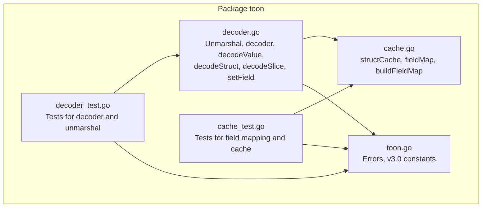
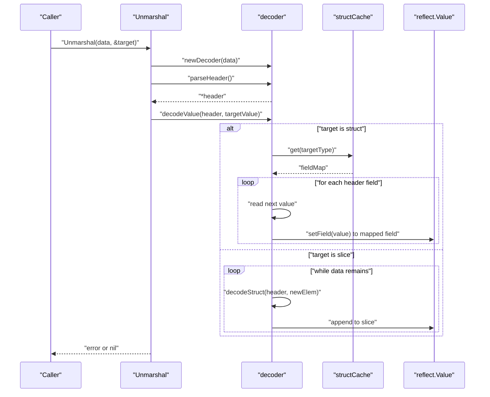
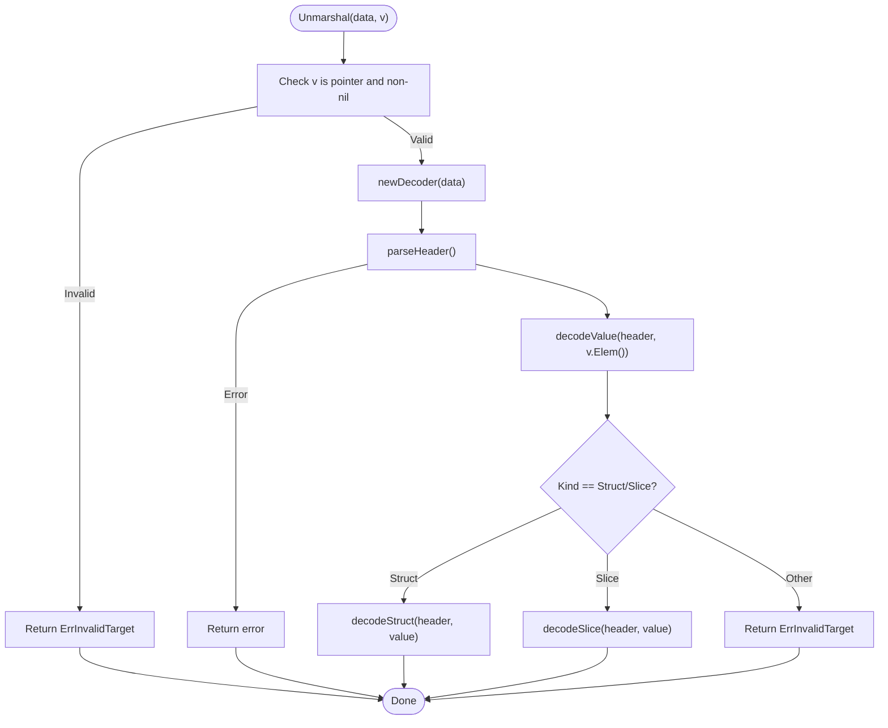
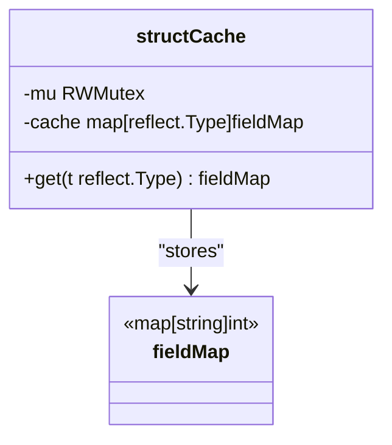
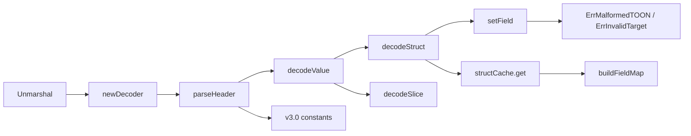

# Advanced Unmarshaling System

<cite>
**Referenced Files in This Document**
- [decoder.go](file://decoder.go)
- [cache.go](file://cache.go)
- [toon.go](file://toon.go)
- [decoder_test.go](file://decoder_test.go)
- [cache_test.go](file://cache_test.go)
</cite>

## Table of Contents
1. [Introduction](#introduction)
2. [Project Structure](#project-structure)
3. [Core Components](#core-components)
4. [Architecture Overview](#architecture-overview)
5. [Detailed Component Analysis](#detailed-component-analysis)
6. [Dependency Analysis](#dependency-analysis)
7. [Performance Considerations](#performance-considerations)
8. [Troubleshooting Guide](#troubleshooting-guide)
9. [Conclusion](#conclusion)

## Introduction
This document describes the advanced unmarshaling system that binds TOON v3.0-encoded data into Go structs and slices using reflection. It focuses on:
- Reflection-based decoding for dynamic struct and slice unmarshaling
- Field mapping cache for performance optimization
- TOON v3.0 specification compliance for headers and separators
- Struct field tagging via the "toon" tag
- Practical patterns for struct binding, error handling, and performance best practices

## Project Structure
The project consists of four primary packages:
- Decoder and parsing logic for TOON v3.0 streams
- Field mapping cache with concurrency-safe lazy initialization
- Constants and error definitions for TOON v3.0 semantics
- Tests validating parsing, caching, and unmarshaling behavior

**Diagram sources**
- [decoder.go](file://decoder.go#L1-L303)
- [cache.go](file://cache.go#L1-L68)
- [toon.go](file://toon.go#L1-L19)
- [decoder_test.go](file://decoder_test.go#L1-L157)
- [cache_test.go](file://cache_test.go#L1-L60)

**Section sources**
- [decoder.go](file://decoder.go#L1-L303)
- [cache.go](file://cache.go#L1-L68)
- [toon.go](file://toon.go#L1-L19)
- [decoder_test.go](file://decoder_test.go#L1-L157)
- [cache_test.go](file://cache_test.go#L1-L60)

## Core Components
- Unmarshal: Entry point that validates the target pointer and initiates decoding.
- decoder: Streaming parser that reads TOON v3.0 headers and values without allocations.
- structCache: Concurrent cache for struct field name to index mapping, built lazily.
- setField: Type-specific converter that writes parsed values into reflect.Value instances.
- Error and constant definitions: TOON v3.0 semantics and error conditions.

Key responsibilities:
- Unmarshal ensures the target is a pointer to a struct or slice and delegates to the decoder.
- decoder parses headers and values, skipping whitespace and respecting TOON v3.0 separators.
- structCache builds and caches field maps using the "toon" struct tag when present.
- setField handles supported scalar types and returns appropriate errors for malformed values.

**Section sources**
- [decoder.go](file://decoder.go#L8-L303)
- [cache.go](file://cache.go#L8-L68)
- [toon.go](file://toon.go#L5-L19)

## Architecture Overview
The unmarshaling pipeline integrates parsing, caching, and reflection-driven assignment.

**Diagram sources**
- [decoder.go](file://decoder.go#L9-L22)
- [decoder.go](file://decoder.go#L71-L115)
- [decoder.go](file://decoder.go#L176-L187)
- [decoder.go](file://decoder.go#L189-L229)
- [decoder.go](file://decoder.go#L231-L267)
- [cache.go](file://cache.go#L21-L43)

## Detailed Component Analysis

### Unmarshal and Decoder
- Validates that the target is a non-nil pointer.
- Parses the TOON v3.0 header to extract name, optional size, and field list.
- Dispatches to decodeValue which branches on struct vs slice.
- decodeStruct uses cached field mapping to assign values by field name.
- decodeSlice iteratively decodes rows into new struct elements and appends to the slice.

**Diagram sources**
- [decoder.go](file://decoder.go#L9-L22)
- [decoder.go](file://decoder.go#L71-L115)
- [decoder.go](file://decoder.go#L176-L187)
- [decoder.go](file://decoder.go#L189-L229)
- [decoder.go](file://decoder.go#L231-L267)

**Section sources**
- [decoder.go](file://decoder.go#L9-L22)
- [decoder.go](file://decoder.go#L71-L115)
- [decoder.go](file://decoder.go#L176-L187)
- [decoder.go](file://decoder.go#L189-L229)
- [decoder.go](file://decoder.go#L231-L267)

### Field Mapping Cache
- structCache stores fieldMap entries keyed by reflect.Type.
- get performs a read-then-write lock pattern with double-checked locking to avoid redundant computation.
- buildFieldMap enumerates exported struct fields, preferring the "toon" tag for mapping keys when present.
- Unexported fields are skipped; this ensures safe reflection writes.

**Diagram sources**
- [cache.go](file://cache.go#L9-L12)
- [cache.go](file://cache.go#L21-L43)
- [cache.go](file://cache.go#L45-L67)

**Section sources**
- [cache.go](file://cache.go#L9-L12)
- [cache.go](file://cache.go#L21-L43)
- [cache.go](file://cache.go#L45-L67)

### Field Tagging and Mapping Behavior
- Exported fields are included in the field map.
- If a field has a "toon" struct tag, the tag value becomes the mapping key; otherwise, the field name is used.
- Unexported fields are excluded from the mapping.

Practical implications:
- Use "toon" tags to align struct fields with TOON field names differing from Go identifiers.
- Keep sensitive fields unexported to prevent accidental exposure during mapping.

**Section sources**
- [cache.go](file://cache.go#L45-L67)
- [cache_test.go](file://cache_test.go#L15-L42)

### Type Conversion and setField
- Supported kinds: string, signed integers, unsigned integers, floats, and bool.
- Uses strconv to parse numeric and boolean values; malformed values produce ErrMalformedTOON.
- Unknown kinds return ErrInvalidTarget.

Common scenarios:
- CSV-like values separated by commas are assigned to struct fields in order of header fields.
- Slice targets expect newline-separated rows; each row is decoded into a new struct element.

**Section sources**
- [decoder.go](file://decoder.go#L269-L302)
- [toon.go](file://toon.go#L5-L8)

### TOON v3.0 Specification Compliance
- Header syntax: name[size]{field1,field2,...}:
- Separators: comma separates values; newline separates rows.
- Size brackets enclose an optional count; fields block encloses a list of field names.
- Whitespace is skipped around tokens.

Validation behavior:
- Missing header terminator yields ErrMalformedTOON.
- Invalid size content yields ErrMalformedTOON.
- Unknown fields in headers are ignored safely.

**Section sources**
- [toon.go](file://toon.go#L10-L19)
- [decoder.go](file://decoder.go#L71-L115)
- [decoder.go](file://decoder.go#L118-L139)
- [decoder.go](file://decoder.go#L142-L173)

### Examples of Struct Binding Patterns
- Basic struct binding: header fields map to struct fields by name.
- Tagged fields: "toon" tag overrides the mapping key for a field.
- Slice binding: multiple rows are decoded into a slice of structs.

These patterns are validated by tests covering:
- Header parsing with optional size and fields
- Struct unmarshaling with integer and string fields
- Slice unmarshaling with two rows
- Error conditions for invalid targets

**Section sources**
- [decoder_test.go](file://decoder_test.go#L27-L94)
- [decoder_test.go](file://decoder_test.go#L96-L116)
- [decoder_test.go](file://decoder_test.go#L118-L143)
- [decoder_test.go](file://decoder_test.go#L145-L156)

## Dependency Analysis
The system exhibits low coupling and clear separation of concerns:
- decoder depends on toon constants and error values
- decoder uses structCache for field mapping
- structCache depends on reflect and sync primitives
- Tests exercise public APIs and internal helpers

**Diagram sources**
- [decoder.go](file://decoder.go#L9-L22)
- [decoder.go](file://decoder.go#L71-L115)
- [decoder.go](file://decoder.go#L176-L187)
- [decoder.go](file://decoder.go#L189-L229)
- [decoder.go](file://decoder.go#L231-L267)
- [decoder.go](file://decoder.go#L269-L302)
- [cache.go](file://cache.go#L21-L43)
- [cache.go](file://cache.go#L45-L67)
- [toon.go](file://toon.go#L5-L19)

**Section sources**
- [decoder.go](file://decoder.go#L1-L303)
- [cache.go](file://cache.go#L1-L68)
- [toon.go](file://toon.go#L1-L19)

## Performance Considerations
- Reflection overhead is minimized by:
  - Using a field mapping cache to avoid repeated reflection lookups
  - Performing a single pass over the input stream with minimal allocations
- Concurrency:
  - structCache uses read-write locks to allow concurrent reads while serializing writes
  - Double-checked locking reduces contention after initial cache population
- Memory:
  - No intermediate buffers are allocated beyond the decoder and small temporary slices
  - Slice growth occurs via reflect.Append during decoding rows

Recommendations:
- Reuse the same struct type across calls to benefit from cached field maps
- Prefer preallocating slices when the size is known to reduce reallocations
- Avoid frequent creation of new struct types to maximize cache hit rates

[No sources needed since this section provides general guidance]

## Troubleshooting Guide
Common issues and resolutions:
- Target must be a pointer to struct or slice:
  - Symptom: ErrInvalidTarget returned
  - Cause: Passing a non-pointer or a non-struct/slice type
  - Fix: Ensure the argument to Unmarshal is a pointer to a struct or slice
- Malformed TOON syntax:
  - Symptom: ErrMalformedTOON returned
  - Causes: Missing header terminator, invalid size, or unexpected characters
  - Fix: Verify the input conforms to TOON v3.0 header and separator rules
- Type mismatch during assignment:
  - Symptom: ErrMalformedTOON returned from setField
  - Causes: Numeric or boolean values cannot be parsed from the input
  - Fix: Ensure values match the expected kind and format
- Unknown fields:
  - Behavior: Unknown header fields are ignored safely
  - Impact: No error; missing fields remain zero-valued

Verification via tests:
- Header parsing edge cases
- Struct and slice unmarshaling correctness
- Error conditions for invalid targets

**Section sources**
- [decoder.go](file://decoder.go#L11-L13)
- [decoder.go](file://decoder.go#L77-L79)
- [decoder.go](file://decoder.go#L122-L124)
- [decoder.go](file://decoder.go#L276-L278)
- [decoder_test.go](file://decoder_test.go#L27-L94)
- [decoder_test.go](file://decoder_test.go#L96-L143)
- [decoder_test.go](file://decoder_test.go#L145-L156)

## Conclusion
The advanced unmarshaling system combines a streaming TOON v3.0 parser with a reflection-based decoder and a concurrent field mapping cache. It supports "toon" tags for flexible field mapping, enforces strict v3.0 semantics, and minimizes reflection overhead through caching. The design enables robust, high-performance struct and slice unmarshaling suitable for performance-critical applications when paired with sound caching and input validation practices.