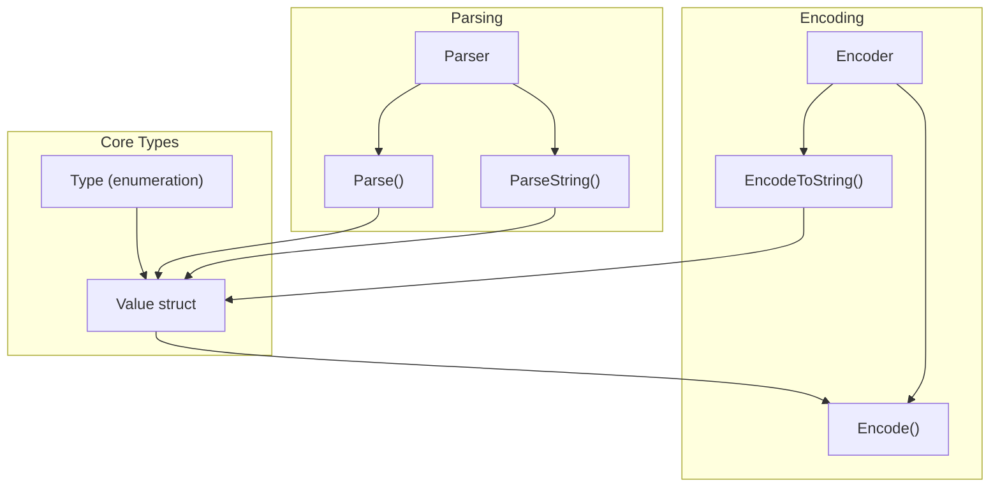
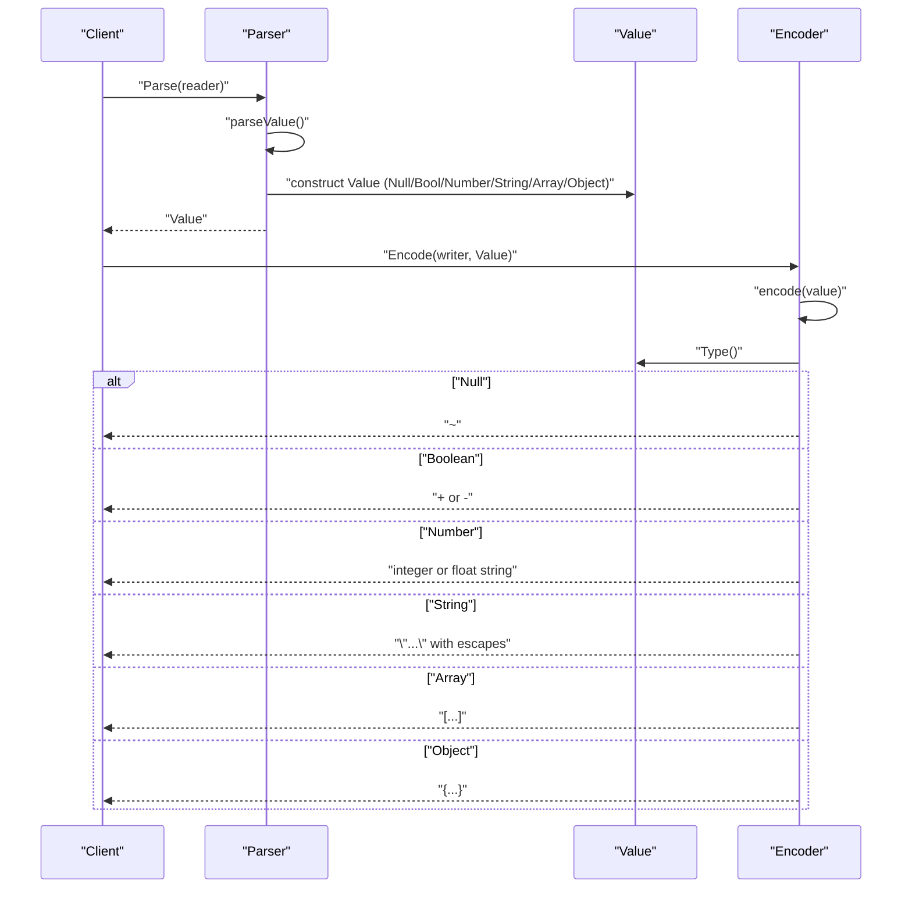
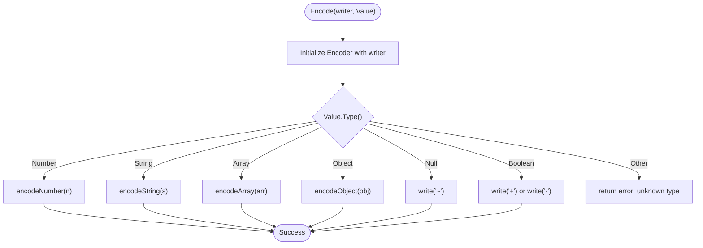
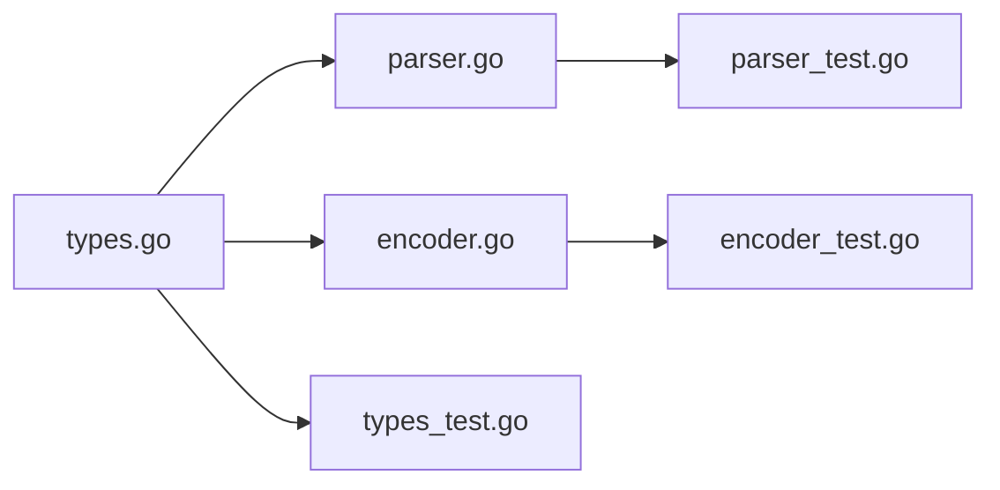

# Data Types and Value System

<cite>
**Referenced Files in This Document**
- [types.go](file://types.go)
- [types_test.go](file://types_test.go)
- [parser.go](file://parser.go)
- [parser_test.go](file://parser_test.go)
- [encoder.go](file://encoder.go)
- [encoder_test.go](file://encoder_test.go)
</cite>

## Table of Contents
1. [Introduction](#introduction)
2. [Project Structure](#project-structure)
3. [Core Components](#core-components)
4. [Architecture Overview](#architecture-overview)
5. [Detailed Component Analysis](#detailed-component-analysis)
6. [Dependency Analysis](#dependency-analysis)
7. [Performance Considerations](#performance-considerations)
8. [Troubleshooting Guide](#troubleshooting-guide)
9. [Conclusion](#conclusion)
10. [Appendices](#appendices)

## Introduction
This document describes the TOON data type system and Value object model. TOON is a compact, token-efficient serialization format designed to reduce LLM token usage compared to JSON. The core of the system is the Type enumeration representing six fundamental types and the Value struct that encapsulates typed values with navigation helpers for nested structures. This guide explains the type system, constructors, type checks, conversions, navigation methods, and encoding/decoding behavior, along with practical examples and best practices.

## Project Structure
The repository is organized around four primary files:
- types.go: Defines the Type enumeration and the Value struct with constructors, type checks, conversions, and navigation methods.
- parser.go: Implements TOON parsing from streams and strings into Value instances.
- encoder.go: Implements TOON encoding from Value instances to streams and strings.
- Tests: Comprehensive coverage validating parsing, encoding, and runtime behaviors across all types and navigation methods.



**Diagram sources**
- [types.go](file://types.go#L9-L59)
- [parser.go](file://parser.go#L12-L38)
- [encoder.go](file://encoder.go#L10-L29)

**Section sources**
- [types.go](file://types.go#L1-L209)
- [parser.go](file://parser.go#L1-L411)
- [encoder.go](file://encoder.go#L1-L192)

## Core Components
This section documents the Type enumeration and the Value struct, including constructors, type checks, conversions, and navigation methods.

- Type enumeration: Six fundamental types are defined with iota:
  - Null: represents a null value
  - Boolean: represents a boolean value
  - Number: represents a numeric value (stored internally as float64)
  - String: represents a string value
  - Array: represents an ordered list of Value items
  - Object: represents a key-value mapping of string keys to Value values

- Value struct: Holds the type discriminator and fields for primitive and complex values. It exposes:
  - Type(): returns the type of the value
  - IsNull(), IsBool(), IsNumber(), IsString(), IsArray(), IsObject(): type predicates
  - Bool(), Number(), String(), Array(), Object(): typed getters that panic if the type does not match
  - Get(key): retrieves a nested Value by key from an Object; returns Null for missing keys or non-objects
  - Index(i): retrieves a Value by index from an Array; returns Null for invalid indices or non-arrays
  - Len(): returns the length of Array or Object; returns 0 for other types

- Constructors: Factory functions create Values for each type:
  - NullValue(), BoolValue(bool), NumberValue(float64), StringValue(string), ArrayValue(...Value), ObjectValue(map[string]Value)

Examples of usage are validated by tests covering construction, type checks, conversions, and navigation.

**Section sources**
- [types.go](file://types.go#L12-L25)
- [types.go](file://types.go#L47-L59)
- [types.go](file://types.go#L61-L94)
- [types.go](file://types.go#L96-L139)
- [types.go](file://types.go#L141-L176)
- [types.go](file://types.go#L180-L208)
- [types_test.go](file://types_test.go#L30-L107)
- [types_test.go](file://types_test.go#L109-L167)
- [types_test.go](file://types_test.go#L169-L196)

## Architecture Overview
The TOON system centers on the Value abstraction that unifies all supported types. Parsing transforms TOON text into Value instances, and encoding converts Value instances back to TOON text. Navigation methods enable safe traversal of nested structures.



**Diagram sources**
- [parser.go](file://parser.go#L18-L33)
- [parser.go](file://parser.go#L40-L70)
- [encoder.go](file://encoder.go#L31-L51)

## Detailed Component Analysis

### Type Enumeration
The Type enumeration defines the six fundamental types used throughout the system. Each type has a String() method returning a human-readable label.

- Characteristics:
  - Null: sentinel value indicating absence
  - Boolean: two-state values represented by + and -
  - Number: floating-point numbers supporting integers, decimals, and scientific notation
  - String: UTF-8 sequences with robust escape handling
  - Array: ordered lists of Value items
  - Object: unordered key-value mappings with deterministic key ordering during encoding

Behavior is validated by tests ensuring correct stringification and type identification.

**Section sources**
- [types.go](file://types.go#L12-L25)
- [types.go](file://types.go#L27-L45)
- [types_test.go](file://types_test.go#L7-L28)

### Value Struct and Constructors
The Value struct encapsulates a type discriminator and storage for primitive and composite values. Constructors provide type-safe creation of Values.

- Storage layout:
  - Primitive: boolVal, numVal, strVal
  - Composite: arrVal []Value, objVal map[string]Value

- Constructors:
  - NullValue(): creates a Null Value
  - BoolValue(b): creates a Boolean Value
  - NumberValue(n): creates a Number Value
  - StringValue(s): creates a String Value
  - ArrayValue(items...): creates an Array Value
  - ObjectValue(pairs map[string]Value): creates an Object Value

- Type checks:
  - IsNull(), IsBool(), IsNumber(), IsString(), IsArray(), IsObject()

- Conversions:
  - Bool(), Number(), String(), Array(), Object() panic if the underlying type does not match

- Navigation:
  - Get(key): safe key lookup in Object
  - Index(i): safe indexing in Array
  - Len(): length for Array/Object, 0 otherwise

These behaviors are exercised and validated by extensive tests.

**Section sources**
- [types.go](file://types.go#L47-L59)
- [types.go](file://types.go#L180-L208)
- [types.go](file://types.go#L61-L94)
- [types.go](file://types.go#L96-L139)
- [types.go](file://types.go#L141-L176)
- [types_test.go](file://types_test.go#L30-L107)
- [types_test.go](file://types_test.go#L109-L167)
- [types_test.go](file://types_test.go#L169-L196)

### Parsing Behavior
The Parser reads TOON from an io.Reader or string and produces a Value. It supports:
- Null: represented by a single tilde (~)
- Boolean: + for true, - for false
- Number: integers, decimals, signed, and scientific notation
- String: double-quoted with escape sequences including Unicode
- Array: bracketed list of values separated by whitespace
- Object: brace-delimited key-value pairs; keys can be identifiers or quoted strings

Parsing enforces strict grammar rules and returns descriptive errors for malformed input. After top-level parsing, only whitespace is allowed.

```mermaid
flowchart TD
Start(["Parse(reader)"]) --> Init["Initialize Parser with buffered reader"]
Init --> SkipWS["Skip leading whitespace"]
SkipWS --> Peek["Peek next character"]
Peek --> Switch{"Character"}
Switch --> |"~"| ParseNull["parseNull() -> NullValue()"]
Switch --> |"+/-"| CheckNext["peekAhead(1)"]
CheckNext --> IsDigit{"Is digit or '.' ?"}
IsDigit --> |Yes| ParseNumber["parseNumber()"]
IsDigit --> |No| ParseBoolean["parseBoolean() -> BoolValue(+/-)"]
Switch --> |"\""| ParseString["parseString()"]
Switch --> |"["| ParseArray["parseArray()"]
Switch --> |"{ "| ParseObject["parseObject()"]
Switch --> |Digit| ParseNumber
Switch --> |". digit"| ParseNumber
Switch --> |Other| Error["Return error: unexpected token"]
ParseNull --> Done(["Return Value"])
ParseBoolean --> Done
ParseNumber --> Done
ParseString --> Done
ParseArray --> Done
ParseObject --> Done
```

**Diagram sources**
- [parser.go](file://parser.go#L18-L33)
- [parser.go](file://parser.go#L40-L70)
- [parser.go](file://parser.go#L74-L96)
- [parser.go](file://parser.go#L98-L170)
- [parser.go](file://parser.go#L172-L228)
- [parser.go](file://parser.go#L255-L283)
- [parser.go](file://parser.go#L285-L323)

**Section sources**
- [parser.go](file://parser.go#L18-L33)
- [parser.go](file://parser.go#L40-L70)
- [parser.go](file://parser.go#L74-L96)
- [parser.go](file://parser.go#L98-L170)
- [parser.go](file://parser.go#L172-L228)
- [parser.go](file://parser.go#L255-L283)
- [parser.go](file://parser.go#L285-L323)
- [parser_test.go](file://parser_test.go#L8-L42)
- [parser_test.go](file://parser_test.go#L44-L82)
- [parser_test.go](file://parser_test.go#L84-L126)
- [parser_test.go](file://parser_test.go#L128-L169)
- [parser_test.go](file://parser_test.go#L171-L246)
- [parser_test.go](file://parser_test.go#L248-L355)
- [parser_test.go](file://parser_test.go#L357-L399)
- [parser_test.go](file://parser_test.go#L401-L413)

### Encoding Behavior
The Encoder writes Values to an io.Writer or returns a TOON string. It applies:
- Null: "~"
- Boolean: "+" for true, "-" for false
- Number: integers formatted without decimal point; floats preserve precision
- String: double-quoted with escapes; control characters use Unicode escapes
- Array: "[item1 item2 ...]"
- Object: "{key value ...}" with sorted keys for deterministic output

Encoding validates types and returns errors for unknown types.



**Diagram sources**
- [encoder.go](file://encoder.go#L15-L19)
- [encoder.go](file://encoder.go#L31-L51)
- [encoder.go](file://encoder.go#L53-L59)
- [encoder.go](file://encoder.go#L61-L94)
- [encoder.go](file://encoder.go#L96-L113)
- [encoder.go](file://encoder.go#L115-L163)

**Section sources**
- [encoder.go](file://encoder.go#L15-L19)
- [encoder.go](file://encoder.go#L31-L51)
- [encoder.go](file://encoder.go#L53-L59)
- [encoder.go](file://encoder.go#L61-L94)
- [encoder.go](file://encoder.go#L96-L113)
- [encoder.go](file://encoder.go#L115-L163)
- [encoder_test.go](file://encoder_test.go#L9-L18)
- [encoder_test.go](file://encoder_test.go#L20-L42)
- [encoder_test.go](file://encoder_test.go#L44-L70)
- [encoder_test.go](file://encoder_test.go#L72-L100)
- [encoder_test.go](file://encoder_test.go#L102-L147)
- [encoder_test.go](file://encoder_test.go#L149-L242)
- [encoder_test.go](file://encoder_test.go#L244-L303)
- [encoder_test.go](file://encoder_test.go#L305-L320)
- [encoder_test.go](file://encoder_test.go#L322-L375)

### Navigation Methods
Navigation enables safe traversal of nested structures:
- Get(key): returns the Value for a key in an Object; returns Null for missing keys or non-objects
- Index(i): returns the Value at index in an Array; returns Null for out-of-bounds or non-arrays
- Len(): returns the length of Array or Object; returns 0 for other types

These methods are extensively tested for correctness and safety.

**Section sources**
- [types.go](file://types.go#L141-L176)
- [types_test.go](file://types_test.go#L109-L135)
- [types_test.go](file://types_test.go#L137-L167)

## Dependency Analysis
The system exhibits clean separation of concerns:
- types.go defines the core data model and navigation
- parser.go depends on types.go constructors and navigation to build Values
- encoder.go depends on types.go getters and navigation to serialize Values
- Tests validate all components independently and together



**Diagram sources**
- [types.go](file://types.go#L1-L209)
- [parser.go](file://parser.go#L1-L411)
- [encoder.go](file://encoder.go#L1-L192)
- [parser_test.go](file://parser_test.go#L1-L414)
- [encoder_test.go](file://encoder_test.go#L1-L376)
- [types_test.go](file://types_test.go#L1-L197)

**Section sources**
- [types.go](file://types.go#L1-L209)
- [parser.go](file://parser.go#L1-L411)
- [encoder.go](file://encoder.go#L1-L192)
- [parser_test.go](file://parser_test.go#L1-L414)
- [encoder_test.go](file://encoder_test.go#L1-L376)
- [types_test.go](file://types_test.go#L1-L197)

## Performance Considerations
- Numeric precision: Numbers are stored as float64. Integers that fit in int64 are encoded without decimal points for compactness.
- String encoding: Control characters are escaped using Unicode escapes to ensure validity and portability.
- Object encoding: Keys are sorted to produce deterministic output, which adds O(k log k) overhead for object encoding where k is the number of keys.
- Parsing: Uses a buffered reader and lookahead to disambiguate booleans from numbers, minimizing re-scans.
- Navigation: Get and Index return Null for invalid access, avoiding exceptions and enabling safe chaining.

[No sources needed since this section provides general guidance]

## Troubleshooting Guide
Common issues and resolutions:
- Panic on conversion: Calling Bool(), Number(), or String() on a Value of a different type panics. Use IsBool(), IsNumber(), IsString() to check before conversion.
- Invalid parsing input: Unexpected tokens, unterminated strings, or malformed arrays/objects produce descriptive errors. Ensure input conforms to TOON grammar.
- Safe navigation: Use Get() and Index() to traverse nested structures; they return Null for invalid access, preventing crashes.
- Round-trip verification: Encode a Value to a string and parse it back to confirm structural fidelity.

**Section sources**
- [types.go](file://types.go#L96-L139)
- [parser.go](file://parser.go#L18-L33)
- [parser.go](file://parser.go#L172-L228)
- [parser.go](file://parser.go#L255-L283)
- [parser.go](file://parser.go#L285-L323)
- [encoder.go](file://encoder.go#L31-L51)
- [encoder_test.go](file://encoder_test.go#L322-L375)
- [types_test.go](file://types_test.go#L169-L196)

## Conclusion
The TOON data type system provides a compact, efficient representation of structured data with a clear Value abstraction. The Type enumeration and Value struct offer strong typing, safe navigation, and straightforward conversion semantics. The Parser and Encoder implement robust, deterministic serialization with precise handling of numbers, strings, arrays, and objects. Extensive tests validate correctness across all operations, ensuring reliability for production use.

[No sources needed since this section summarizes without analyzing specific files]

## Appendices

### Practical Examples and Best Practices
- Creating Values:
  - Use constructors for each type: NullValue(), BoolValue(true), NumberValue(42.5), StringValue("text"), ArrayValue(...), ObjectValue(map).
- Type checking and conversion:
  - Always check the type with IsX() before calling X() to avoid panics.
- Navigating nested structures:
  - Chain Get() and Index() safely; handle Null returns gracefully.
- Encoding and decoding:
  - Use EncodeToString for quick conversions; verify round-trips for critical data.
- String encoding specifics:
  - Strings support standard escapes and Unicode; control characters become \uXXXX.
- Numeric precision:
  - Integers are encoded without decimals; floats preserve precision as needed.

[No sources needed since this section provides general guidance]