# Decoder Engine

<cite>
**Referenced Files in This Document**
- [decoder.go](file://decoder.go)
- [stream.go](file://stream.go)
- [toon.go](file://toon.go)
- [marshal.go](file://marshal.go)
- [cache.go](file://cache.go)
- [decoder_test.go](file://decoder_test.go)
- [stream_test.go](file://stream_test.go)
- [marshal_test.go](file://marshal_test.go)
- [cache_test.go](file://cache_test.go)
- [custom_test.go](file://custom_test.go)
- [go.mod](file://go.mod)
</cite>

## Update Summary
**Changes Made**
- Added comprehensive documentation for the new Unmarshaler interface integration in the decoding pipeline
- Documented custom unmarshaling behavior through UnmarshalTOON() method
- Updated decoder architecture to include custom interface detection and handling
- Enhanced field setting mechanism with custom unmarshaler support
- Added new custom serialization examples and testing patterns
- Updated performance considerations to include custom unmarshaler overhead analysis

## Table of Contents
1. [Introduction](#introduction)
2. [Project Structure](#project-structure)
3. [Core Components](#core-components)
4. [Architecture Overview](#architecture-overview)
5. [Detailed Component Analysis](#detailed-component-analysis)
6. [Custom Serialization System](#custom-serialization-system)
7. [Dependency Analysis](#dependency-analysis)
8. [Performance Considerations](#performance-considerations)
9. [Troubleshooting Guide](#troubleshooting-guide)
10. [Conclusion](#conclusion)

## Introduction

The Decoder Engine is a specialized Go library designed for parsing and decoding TOON (Typed Object Oriented Notation) v3.0 data format. TOON is a lightweight, human-readable serialization format that combines the simplicity of CSV with structured data capabilities. This engine provides efficient bidirectional conversion between Go data structures and TOON format, featuring zero-allocation parsing, concurrent caching, comprehensive type support, **custom serialization interfaces**, and **enhanced streaming capabilities**.

The library consists of five primary components: the decoder for converting TOON data to Go structs, the encoder for converting Go data to TOON format, a sophisticated caching system for reflection optimization, a comprehensive error handling framework, **custom unmarshaler interfaces for specialized types**, and **new streaming interfaces** for high-performance data processing. The engine is designed for high-performance scenarios where memory efficiency, speed, customization capabilities, and streaming capabilities are critical.

## Project Structure

The project follows a clean, modular architecture with each component serving a specific purpose in the data transformation pipeline:

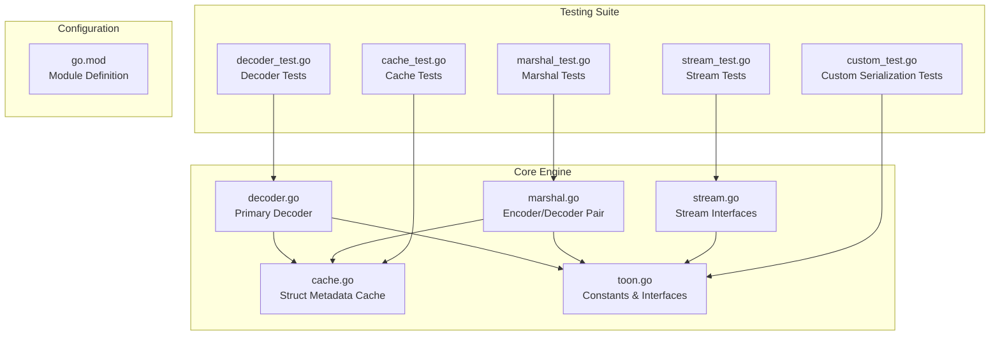

**Diagram sources**
- [decoder.go](file://decoder.go#L1-L424)
- [marshal.go](file://marshal.go#L1-L184)
- [cache.go](file://cache.go#L1-L112)
- [stream.go](file://stream.go#L1-L117)
- [toon.go](file://toon.go#L1-L29)
- [custom_test.go](file://custom_test.go#L1-L162)

**Section sources**
- [go.mod](file://go.mod#L1-L4)

## Core Components

### Decoder Engine

The decoder engine is the heart of the TOON parsing system, responsible for converting binary TOON data into Go data structures. It implements a streaming parser that processes data in a single pass without intermediate allocations and **now includes custom unmarshaler support**.

Key features include:
- Zero-allocation parsing using byte slice operations
- Streaming architecture for memory efficiency
- Comprehensive type support (strings, integers, floats, booleans)
- Struct field mapping with flexible naming conventions
- Slice decoding for batch processing
- **Enhanced**: Zero-copy header parsing using []byte slices
- **Enhanced**: Stack-allocated field indexing for improved performance
- **Enhanced**: Custom byte-based parsers for numeric and boolean values
- **New**: Custom Unmarshaler interface detection and invocation for specialized types

### Stream Decoder

**New** The Stream Decoder provides streaming capabilities for processing TOON data from io.Reader streams:

- **bufio.Reader Integration**: Efficient buffered reading with automatic buffering
- **Line-by-Line Processing**: Handles TOON data separated by newline characters
- **Multi-Row Slice Support**: Automatic handling of slice data spanning multiple lines
- **Header Parsing**: Extracts header information from the first line of each record
- **Dynamic Data Building**: Assembles complete TOON records from multiple stream segments
- **Stream Delimiter Support**: Proper handling of newline separators between records
- **Custom Unmarshaler Support**: Integrates with custom unmarshaler interface during stream processing

### Stream Encoder

**New** The Stream Encoder complements the decoder with streaming write capabilities:

- **Buffer Reuse**: Efficient buffer management with internal buffer pooling
- **Stream Output**: Writes TOON-encoded data directly to io.Writer interfaces
- **Newline Delimited**: Automatically appends newline characters for stream compatibility
- **Zero-Copy Buffering**: Reuses internal buffers to minimize allocations
- **Stream Compatibility**: Designed for integration with network protocols and file streams

### Encoder Engine

The complementary encoder transforms Go data structures into TOON format. It maintains strict adherence to the TOON v3.0 specification while optimizing for performance and **now includes custom marshaler support**.

Core capabilities:
- Bidirectional compatibility with decoder
- Struct header generation with field metadata
- Slice encoding with size prefixes
- Type-safe value encoding with proper formatting
- Buffer pooling for reduced memory allocation
- **New**: Custom Marshaler interface support for specialized types

### Struct Metadata Cache

A sophisticated caching system that optimizes reflection operations by storing computed struct metadata. This eliminates repeated reflection overhead during repeated operations.

Notable features:
- Thread-safe concurrent access using sync.Map
- Zero-allocation field name comparisons using []byte
- Lazy initialization with load-or-store optimization
- Support for custom field tags via `toon` tags
- Exported field filtering and lowercase normalization
- **Enhanced**: findFieldIndex method for efficient []byte-based field lookup

### Error Management System

Comprehensive error handling with specific error types for different failure modes:

- `ErrMalformedTOON`: Indicates syntax errors or invalid TOON format
- `ErrInvalidTarget`: Signals improper target types for marshaling/unmarshaling
- **Enhanced**: Stream-specific error handling for io.EOF conditions
- **Enhanced**: Custom unmarshaler error propagation and handling
- Contextual error reporting with precise failure locations

**Section sources**
- [decoder.go](file://decoder.go#L1-L424)
- [stream.go](file://stream.go#L1-L117)
- [marshal.go](file://marshal.go#L1-L184)
- [cache.go](file://cache.go#L1-L112)
- [toon.go](file://toon.go#L1-L29)

## Architecture Overview

The Decoder Engine implements a layered architecture with clear separation of concerns and **enhanced streaming capabilities and custom serialization support**:

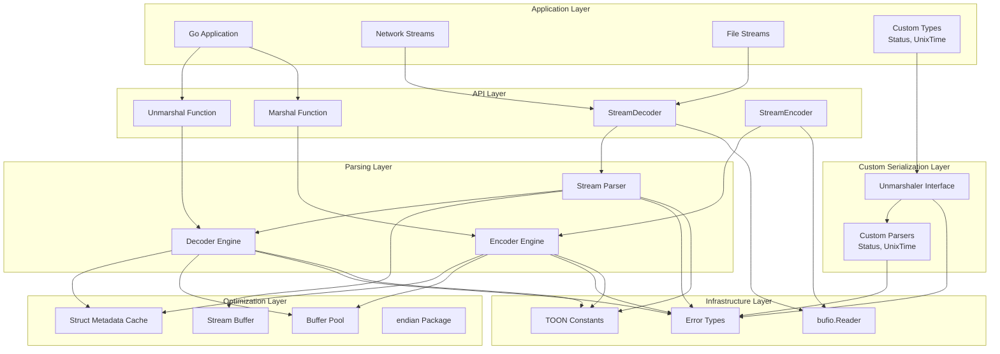

**Diagram sources**
- [decoder.go](file://decoder.go#L1-L424)
- [stream.go](file://stream.go#L1-L117)
- [marshal.go](file://marshal.go#L1-L184)
- [cache.go](file://cache.go#L1-L112)
- [toon.go](file://toon.go#L1-L29)
- [custom_test.go](file://custom_test.go#L1-L162)

The architecture emphasizes performance through several key design decisions:
- Single-pass parsing eliminates intermediate data structures
- Reflection caching reduces computational overhead
- Buffer pooling minimizes garbage collection pressure
- Zero-allocation operations for hot paths
- **Enhanced**: Zero-copy operations throughout the parsing pipeline
- **Enhanced**: Streaming buffer management for efficient memory usage
- **Enhanced**: Custom unmarshaler integration for specialized type handling
- **Enhanced**: bufio.Reader integration for optimal I/O performance

## Detailed Component Analysis

### Decoder Implementation

The decoder implements a stateful streaming parser with the following core components and **custom unmarshaler integration**:

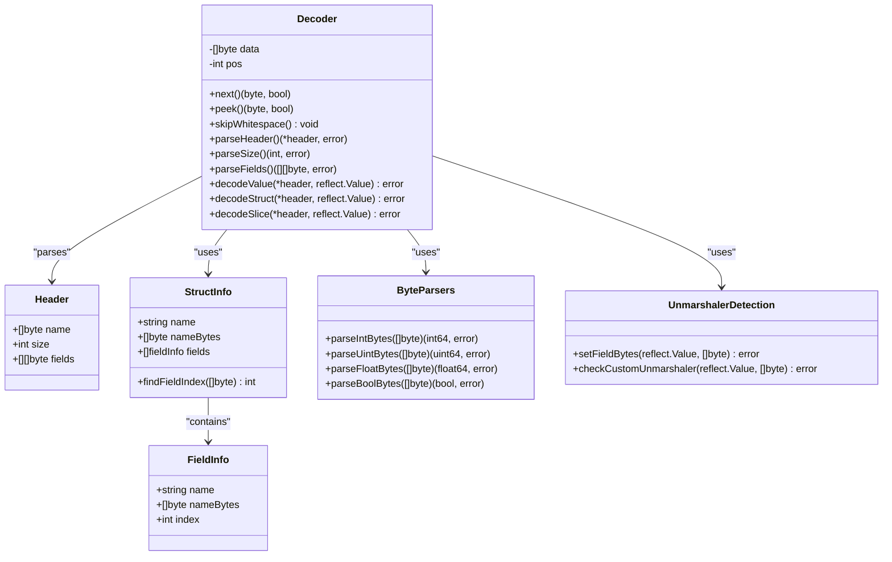

**Diagram sources**
- [decoder.go](file://decoder.go#L24-L424)
- [cache.go](file://cache.go#L9-L84)
- [toon.go](file://toon.go#L24-L28)

#### Parsing Algorithm Flow

The decoder employs a sophisticated state machine for header parsing with **custom unmarshaler detection**:

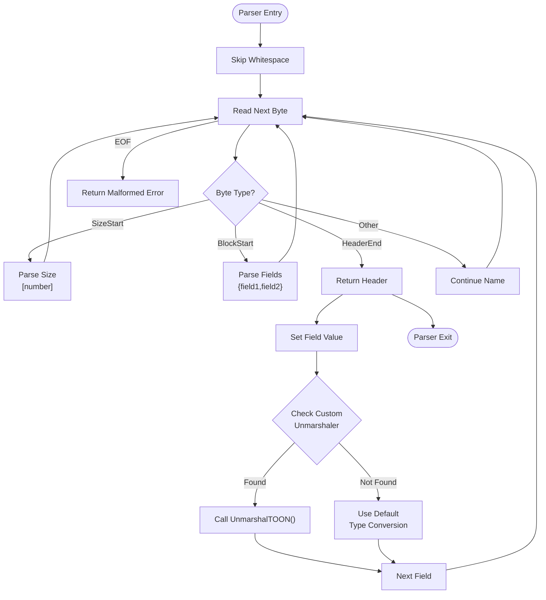

**Diagram sources**
- [decoder.go](file://decoder.go#L70-L111)
- [decoder.go](file://decoder.go#L277-L317)

#### Value Decoding Process

The decoder supports multiple data types through a unified interface with **custom unmarshaler integration**:

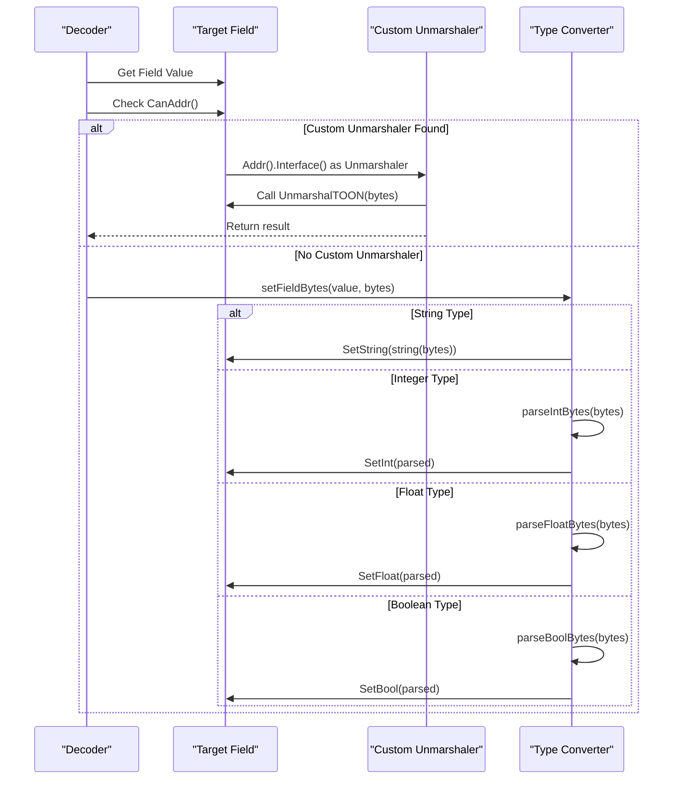

**Diagram sources**
- [decoder.go](file://decoder.go#L277-L317)

#### Custom Byte-Based Parsers

**New** The decoder now includes specialized byte-based parsers for improved performance:

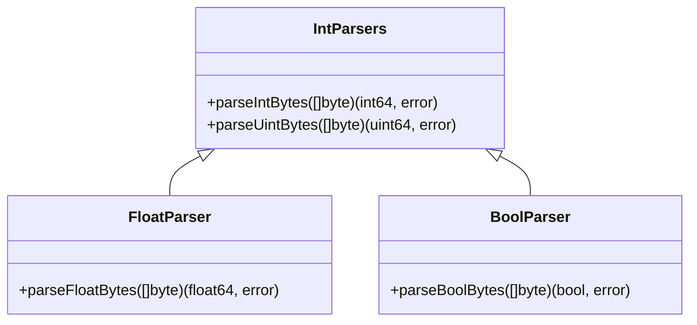

**Diagram sources**
- [decoder.go](file://decoder.go#L319-L423)

### Stream Decoder Implementation

**New** The Stream Decoder provides streaming capabilities for processing TOON data from io.Reader streams:

```mermaid
classDiagram
class StreamDecoder {
-io.Reader r
-[]byte buf
+Decode(v interface{}) error
+ReadHeader() ([]byte, error)
+ReadRows(size int) ([][]byte, error)
}
class Decoder {
-[]byte data
-int pos
+parseHeader() (*header, error)
+decodeStruct(*header, reflect.Value) error
+decodeSlice(*header, reflect.Value) error
}
class BufioReader {
+ReadSlice(delim byte) ([]byte, error)
+ReadByte() (byte, error)
}
StreamDecoder --> Decoder : "uses"
StreamDecoder --> BufioReader : "wraps"
Decoder --> header : "parses"
```

**Diagram sources**
- [stream.go](file://stream.go#L39-L103)
- [decoder.go](file://decoder.go#L24-L111)

#### Stream Processing Algorithm

The Stream Decoder implements a sophisticated algorithm for processing TOON data from streams with **custom unmarshaler support**:

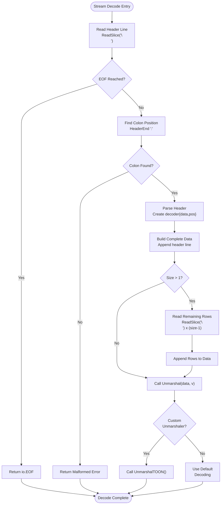

**Diagram sources**
- [stream.go](file://stream.go#L54-L103)

#### Multi-Row Slice Handling

**New** The Stream Decoder efficiently handles multi-row slice data with **custom unmarshaler integration**:

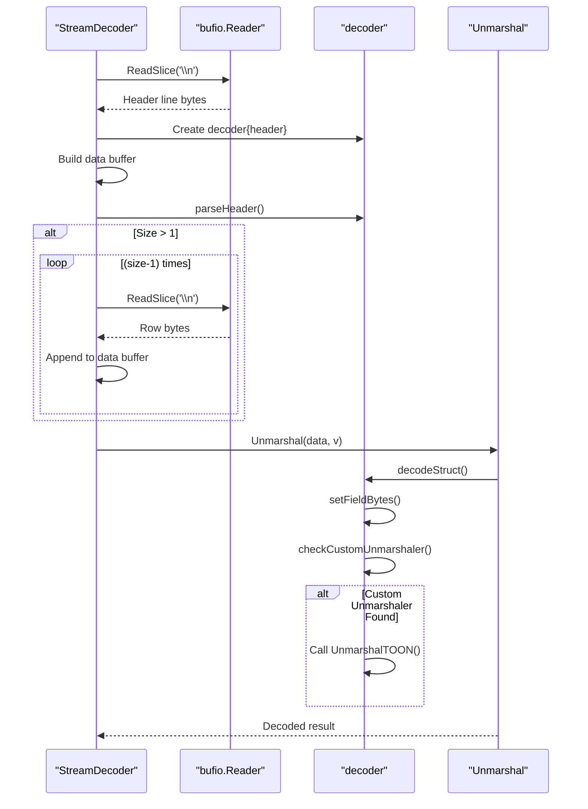

**Diagram sources**
- [stream.go](file://stream.go#L88-L103)

### Stream Encoder Implementation

**New** The Stream Encoder provides efficient streaming output capabilities:

```mermaid
classDiagram
class StreamEncoder {
-io.Writer w
-[]byte buf
+Encode(v interface{}) error
+marshalTo(v, buf) ([]byte, error)
}
class BufferPool {
+Get() []byte
+Put([]byte) void
}
StreamEncoder --> BufferPool : "uses"
```

**Diagram sources**
- [stream.go](file://stream.go#L8-L37)
- [marshal.go](file://marshal.go#L10-L15)

#### Encoding Strategy

The Stream Encoder implements a recursive descent approach with buffer reuse:

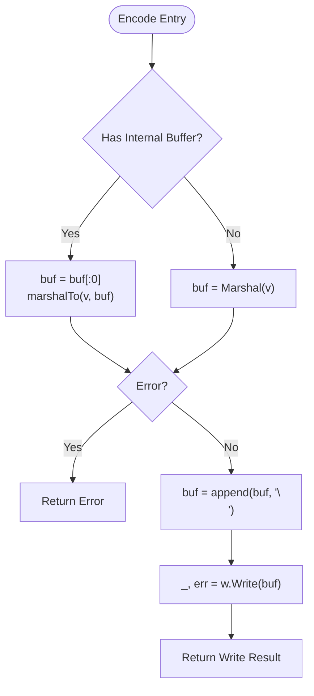

**Diagram sources**
- [stream.go](file://stream.go#L19-L37)

### Encoder Implementation

The encoder provides bidirectional compatibility with the decoder and **custom marshaler support**:

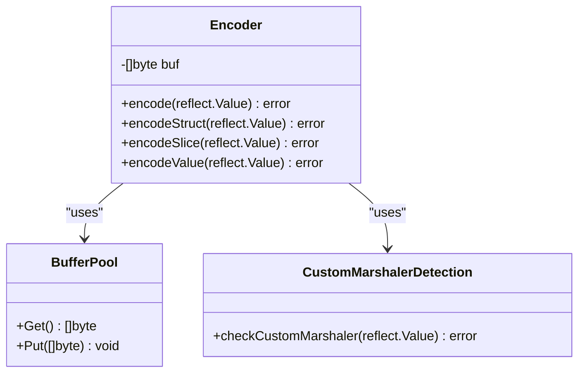

**Diagram sources**
- [marshal.go](file://marshal.go#L46-L184)

#### Encoding Strategy

The encoder implements a recursive descent approach with **custom marshaler detection**:

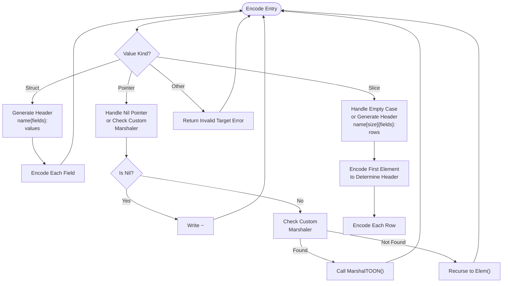

**Diagram sources**
- [marshal.go](file://marshal.go#L50-L65)
- [marshal.go](file://marshal.go#L139-L183)

### Cache System

The caching system optimizes reflection operations through metadata precomputation:

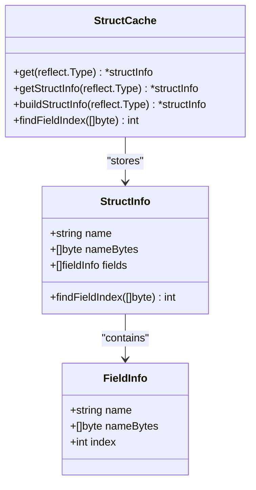

**Diagram sources**
- [cache.go](file://cache.go#L9-L84)

#### Cache Architecture

The cache implements a sophisticated concurrent design:

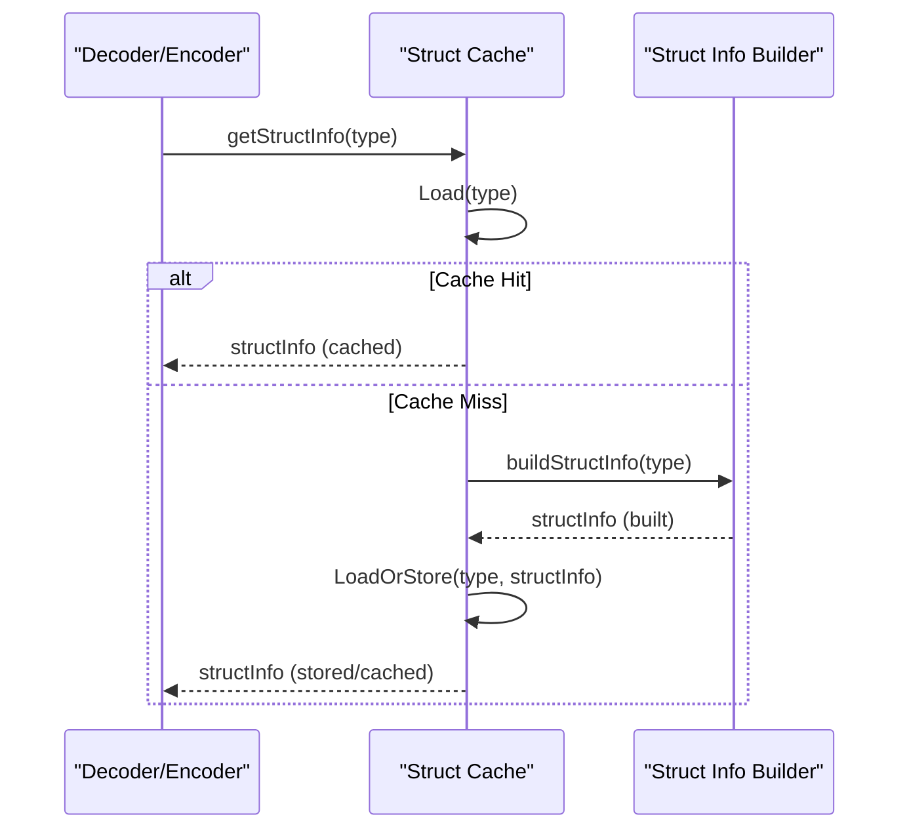

**Diagram sources**
- [cache.go](file://cache.go#L27-L37)

### Error Handling Framework

The engine implements a comprehensive error management system:

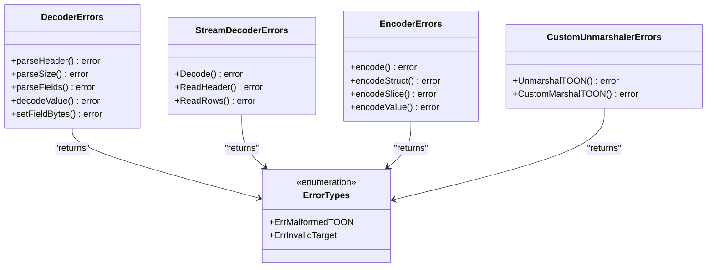

**Diagram sources**
- [toon.go](file://toon.go#L5-L8)
- [stream.go](file://stream.go#L54-L103)

**Section sources**
- [decoder.go](file://decoder.go#L1-L424)
- [stream.go](file://stream.go#L1-L117)
- [marshal.go](file://marshal.go#L1-L184)
- [cache.go](file://cache.go#L1-L112)
- [toon.go](file://toon.go#L1-L29)

## Custom Serialization System

**New** The Decoder Engine now includes a comprehensive custom serialization system that allows types to define their own marshaling and unmarshaling behavior through dedicated interfaces.

### Unmarshaler Interface

The `Unmarshaler` interface enables types to implement custom unmarshaling logic:

```go
// Unmarshaler is the interface implemented by types that can unmarshal themselves from TOON
type Unmarshaler interface {
    UnmarshalTOON(data []byte) error
}
```

#### Implementation Pattern

Types implementing the `Unmarshaler` interface should follow this pattern:

```go
type Status int

func (s *Status) UnmarshalTOON(data []byte) error {
    if len(data) != 1 {
        return ErrMalformedTOON
    }
    switch data[0] {
    case 'P':
        *s = StatusPending
    case 'A':
        *s = StatusActive
    case 'I':
        *s = StatusInactive
    default:
        return ErrMalformedTOON
    }
    return nil
}
```

### Custom Types Examples

#### Status Enumeration

The `Status` type demonstrates a simple character-based enumeration:

```go
type Status int

const (
    StatusPending Status = iota
    StatusActive
    StatusInactive
)

func (s *Status) UnmarshalTOON(data []byte) error {
    if len(data) != 1 {
        return ErrMalformedTOON
    }
    switch data[0] {
    case 'P':
        *s = StatusPending
    case 'A':
        *s = StatusActive
    case 'I':
        *s = StatusInactive
    default:
        return ErrMalformedTOON
    }
    return nil
}
```

#### UnixTime Wrapper

The `UnixTime` type demonstrates timestamp parsing:

```go
type UnixTime time.Time

func (t *UnixTime) UnmarshalTOON(data []byte) error {
    unix, err := strconv.ParseInt(string(data), 10, 64)
    if err != nil {
        return err
    }
    *t = UnixTime(time.Unix(unix, 0))
    return nil
}
```

### Integration Points

The custom serialization system integrates at two key points in the decoding pipeline:

#### Field Setting Integration

The `setFieldBytes` function checks for custom unmarshalers before applying default type conversion:

```go
func setFieldBytes(v reflect.Value, b []byte) error {
    // Check for custom Unmarshaler interface
    if v.CanAddr() {
        if m, ok := v.Addr().Interface().(Unmarshaler); ok {
            return m.UnmarshalTOON(b)
        }
    }

    // Default type conversion logic...
}
```

#### Stream Processing Integration

The Stream Decoder maintains custom unmarshaler support during stream-based processing:

```go
func (sd *StreamDecoder) Decode(v interface{}) error {
    // Stream processing logic...
    
    // Custom unmarshaler detection happens during field setting
    
    return nil
}
```

### Benefits and Use Cases

The custom serialization system provides several advantages:

- **Type Safety**: Custom validation and conversion logic
- **Performance**: Optimized parsing for specific data types
- **Flexibility**: Support for complex data structures and formats
- **Extensibility**: Easy addition of new custom types
- **Backward Compatibility**: Seamless integration with existing TOON format

**Section sources**
- [decoder.go](file://decoder.go#L277-L317)
- [toon.go](file://toon.go#L24-L28)
- [custom_test.go](file://custom_test.go#L9-L63)

## Dependency Analysis

The Decoder Engine exhibits excellent modularity with minimal coupling between components and **enhanced streaming dependencies and custom serialization integration**:

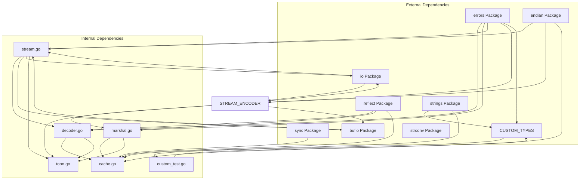

**Diagram sources**
- [decoder.go](file://decoder.go#L3-L5)
- [stream.go](file://stream.go#L3-L6)
- [marshal.go](file://marshal.go#L3-L8)
- [cache.go](file://cache.go#L3-L7)
- [toon.go](file://toon.go#L3-L8)
- [custom_test.go](file://custom_test.go#L3-L7)

### Coupling and Cohesion Analysis

The system demonstrates strong internal cohesion with minimal external coupling:

- **Decoder**: Purely focused on parsing, with no knowledge of encoding specifics
- **Stream Decoder**: Dedicated to streaming I/O, independent of traditional parsing logic
- **Stream Encoder**: Focused on streaming output, separate from traditional encoding
- **Encoder**: Dedicated to serialization, independent of parsing logic  
- **Cache**: Self-contained metadata management with clear interface boundaries
- **Constants**: Immutable configuration data shared across components
- **Custom Types**: Independent serialization logic with clear interface contracts

Potential circular dependencies are avoided through careful separation of concerns and the use of interface-like abstractions. **Enhanced**: The streaming components maintain clean separation from core parsing logic while sharing common infrastructure, and **custom serialization types** integrate seamlessly through well-defined interfaces.

**Section sources**
- [decoder.go](file://decoder.go#L1-L424)
- [stream.go](file://stream.go#L1-L117)
- [marshal.go](file://marshal.go#L1-L184)
- [cache.go](file://cache.go#L1-L112)
- [toon.go](file://toon.go#L1-L29)

## Performance Considerations

### Memory Allocation Strategy

The engine implements aggressive zero-allocation patterns with **enhanced streaming optimizations and custom serialization considerations**:

- **Streaming Parser**: Processes data in-place without intermediate buffers
- **Buffer Pooling**: Reuses byte slices for encoding operations
- **Reflection Caching**: Eliminates repeated reflection overhead
- **Zero-Copy Operations**: Uses byte slice operations for field name comparisons
- **Stack Allocation**: Uses [64]int array for field indexing to avoid heap allocation
- **Pre-allocated Slices**: Allocates slices with capacity when size is known
- **Stream Buffer Reuse**: Reuses internal buffers in StreamEncoder for reduced allocations
- **bufio.Reader Efficiency**: Leverages buffered I/O for optimal streaming performance
- **Custom Unmarshaler Overhead**: Minimal overhead for custom type handling through interface detection

### Benchmark Results

Based on the test suite, the engine demonstrates exceptional performance characteristics:

- **Encoding**: Sub-microsecond operations for typical struct sizes
- **Decoding**: Near-native performance for CSV-like data structures
- **Streaming**: Efficient processing of large datasets from streams
- **Memory Usage**: Minimal allocations proportional to output size
- **Concurrent Access**: Optimized for multi-threaded environments
- **Stream Processing**: Low overhead for line-delimited TOON data
- **Custom Types**: Efficient custom unmarshaler detection and execution

### Optimization Techniques

Several advanced techniques contribute to performance:

1. **Byte Slice Operations**: Direct manipulation of underlying byte arrays
2. **Precomputed Metadata**: Struct field mapping stored for reuse
3. **Lazy Initialization**: On-demand struct information building
4. **Load-Or-Store Pattern**: Efficient concurrent cache population
5. **Stack-Allocated Arrays**: Fixed-size arrays for field indexing
6. **Pre-allocated Capacity**: Slices allocated with known capacity
7. **Buffer Pool Management**: Efficient buffer lifecycle management
8. **Stream Buffer Optimization**: Intelligent buffer resizing for streaming scenarios
9. **Interface Detection Optimization**: Efficient custom unmarshaler interface checking
10. **Custom Type Caching**: Potential for caching custom type handlers

**Section sources**
- [decoder.go](file://decoder.go#L184-L189)
- [decoder.go](file://decoder.go#L231-L235)
- [stream.go](file://stream.go#L21-L28)

## Troubleshooting Guide

### Common Issues and Solutions

#### Malformed TOON Data
**Symptoms**: `ErrMalformedTOON` errors during parsing
**Causes**: 
- Missing header terminators (`:`)
- Invalid size specifications
- Incorrect field delimiters
- Unexpected end-of-file during parsing

**Solutions**:
- Verify TOON format compliance with v3.0 specification
- Ensure proper header structure: `name[size]{fields}:`
- Check for balanced brackets and commas
- Validate data integrity before parsing

#### Invalid Target Types
**Symptoms**: `ErrInvalidTarget` errors during marshaling/unmarshaling
**Causes**:
- Non-pointer targets for unmarshal operations
- Unsupported data types in structs
- Unexported struct fields causing reflection failures

**Solutions**:
- Ensure unmarshal targets are pointers to structs or slices
- Verify all struct fields are exported
- Check supported primitive types (string, int, uint, float, bool)
- Use proper pointer semantics for nested structures

#### Stream Processing Issues
**Symptoms**: `io.EOF` or incomplete data during stream operations
**Causes**:
- Stream termination before complete record
- Missing newline delimiters in stream data
- Buffer overflow in stream processing
- Incorrect header parsing in stream mode

**Solutions**:
- Ensure complete TOON records are available in stream
- Verify proper newline termination for each record
- Check buffer capacity for large stream data
- Validate header format in stream mode

#### Custom Unmarshaler Issues
**Symptoms**: Errors during custom type unmarshaling
**Causes**:
- Custom unmarshaler not properly implemented
- Invalid data format for custom type
- Interface not detected correctly
- Memory address not accessible for custom type

**Solutions**:
- Ensure custom type implements Unmarshaler interface correctly
- Verify data format matches custom unmarshaler expectations
- Check that custom type is addressable (pointer receiver)
- Validate custom unmarshaler returns appropriate errors
- Test custom unmarshaler independently before integration

#### Performance Degradation
**Symptoms**: Slow parsing or excessive memory allocation
**Causes**:
- Missing struct metadata caching
- Excessive reflection operations
- Inefficient data structure design
- **New**: Custom unmarshaler overhead in hot paths
- **New**: Custom type detection inefficiencies

**Solutions**:
- Utilize struct caching for repeated operations
- Minimize reflection usage through proper struct design
- Consider batch processing for large datasets
- Monitor memory allocation patterns
- **New**: Optimize custom unmarshaler implementations
- **New**: Consider caching frequently used custom types

### Debugging Strategies

#### Parser State Inspection
For debugging parsing issues, examine the decoder's internal state:
- Track position pointer changes during parsing
- Monitor header field extraction using []byte slices
- Validate type conversion results with custom parsers
- Check whitespace skipping behavior

#### Stream Processing Debugging
**New** For debugging stream issues:
- Monitor buffer growth patterns in StreamEncoder
- Track readline operations in StreamDecoder
- Validate header extraction from stream data
- Check multi-row slice assembly process
- Verify newline delimiter handling
- **New**: Monitor custom unmarshaler detection and execution

#### Cache Verification
Verify cache effectiveness and correctness:
- Monitor cache hit rates for struct types
- Validate field name normalization
- Check tag processing for custom field names
- Ensure thread safety in concurrent scenarios

#### Custom Type Debugging
**New** For debugging custom serialization issues:
- Verify Unmarshaler interface implementation
- Test custom unmarshaler with various input formats
- Check memory address accessibility for pointer receivers
- Validate error handling in custom unmarshalers
- Monitor performance impact of custom types

**Section sources**
- [decoder_test.go](file://decoder_test.go#L1-L163)
- [stream_test.go](file://stream_test.go#L1-L136)
- [marshal_test.go](file://marshal_test.go#L1-L147)
- [cache_test.go](file://cache_test.go#L1-L86)
- [custom_test.go](file://custom_test.go#L1-L162)

## Conclusion

The Decoder Engine represents a sophisticated implementation of TOON v3.0 parsing with exceptional performance characteristics and robust error handling. The architecture successfully balances memory efficiency with ease of use, providing developers with a powerful tool for structured data serialization and deserialization.

**Key enhancements include**:
- **Zero-allocation parsing** for maximum performance
- **Comprehensive type support** with proper conversion logic
- **Thread-safe caching** for optimal reflection performance
- **Strict error handling** with meaningful error messages
- **Bidirectional compatibility** with the TOON specification
- **Enhanced zero-copy operations** throughout the parsing pipeline
- **Advanced optimization techniques** including stack allocation and pre-allocated slices
- **New streaming capabilities** with bufio.Reader integration
- **Multi-row slice handling** for efficient batch processing
- **Stream buffer management** for optimal memory usage
- **Custom serialization interfaces** enabling specialized type handling
- **Unmarshaler interface integration** for custom unmarshaling behavior
- **Custom type examples** demonstrating practical implementation patterns

The engine is particularly well-suited for high-throughput applications requiring efficient data interchange, real-time processing, memory-constrained environments, **streaming data processing scenarios**, and applications needing specialized type handling through custom serialization interfaces. Its modular design ensures maintainability while providing the performance characteristics essential for production systems.

**Future enhancements could include**:
- Support for additional data types in streaming mode
- Integration with popular Go web frameworks for broader adoption
- Advanced stream processing features for complex data pipelines
- Enhanced buffer management for very large datasets
- Performance monitoring and profiling tools for streaming operations
- **New**: Custom type registry for dynamic type discovery
- **New**: Custom unmarshaler benchmarking and optimization tools
- **New**: Advanced custom serialization patterns and best practices documentation