# Decoder Engine

<cite>
**Referenced Files in This Document**
- [decoder.go](file://decoder.go)
- [toon.go](file://toon.go)
- [marshal.go](file://marshal.go)
- [cache.go](file://cache.go)
- [decoder_test.go](file://decoder_test.go)
- [marshal_test.go](file://marshal_test.go)
- [cache_test.go](file://cache_test.go)
- [go.mod](file://go.mod)
</cite>

## Update Summary
**Changes Made**
- Updated Decoder Implementation section to reflect zero-copy header parsing with []byte slices
- Enhanced Field Lookup section to document new findFieldIndex method and stack-allocated field indexing
- Added new Custom Byte-Based Parsers section documenting new numeric and boolean value parsers
- Updated Performance Considerations to highlight pre-allocated slice optimization
- Revised Architecture Overview to show enhanced zero-copy operations

## Table of Contents
1. [Introduction](#introduction)
2. [Project Structure](#project-structure)
3. [Core Components](#core-components)
4. [Architecture Overview](#architecture-overview)
5. [Detailed Component Analysis](#detailed-component-analysis)
6. [Dependency Analysis](#dependency-analysis)
7. [Performance Considerations](#performance-considerations)
8. [Troubleshooting Guide](#troubleshooting-guide)
9. [Conclusion](#conclusion)

## Introduction

The Decoder Engine is a specialized Go library designed for parsing and decoding TOON (Typed Object Oriented Notation) v3.0 data format. TOON is a lightweight, human-readable serialization format that combines the simplicity of CSV with structured data capabilities. This engine provides efficient bidirectional conversion between Go data structures and TOON format, featuring zero-allocation parsing, concurrent caching, and comprehensive type support.

The library consists of four primary components: the decoder for converting TOON data to Go structs, the encoder for converting Go data to TOON format, a sophisticated caching system for reflection optimization, and a comprehensive error handling framework. The engine is designed for high-performance scenarios where memory efficiency and speed are critical.

## Project Structure

The project follows a clean, modular architecture with each component serving a specific purpose in the data transformation pipeline:

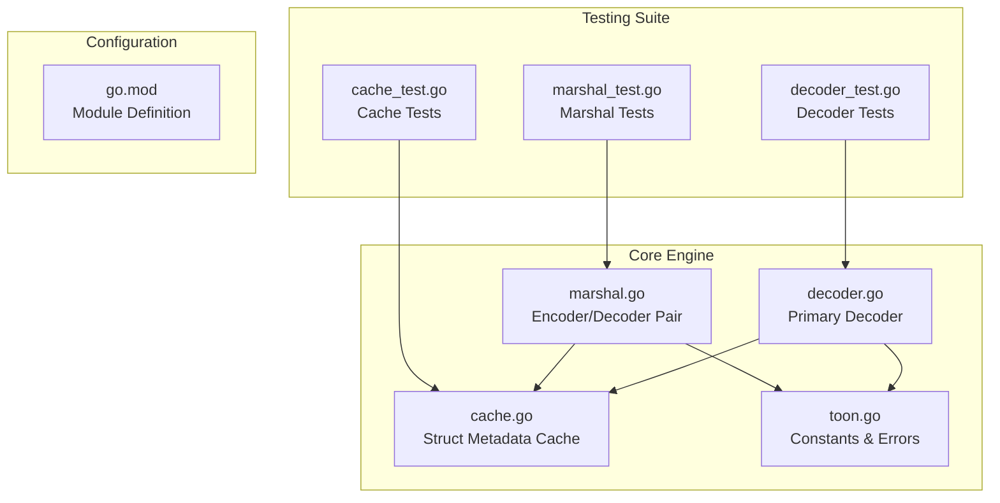

**Diagram sources**
- [decoder.go](file://decoder.go#L1-L417)
- [marshal.go](file://marshal.go#L1-L172)
- [cache.go](file://cache.go#L1-L112)
- [toon.go](file://toon.go#L1-L19)

**Section sources**
- [go.mod](file://go.mod#L1-L4)

## Core Components

### Decoder Engine

The decoder engine is the heart of the TOON parsing system, responsible for converting binary TOON data into Go data structures. It implements a streaming parser that processes data in a single pass without intermediate allocations.

Key features include:
- Zero-allocation parsing using byte slice operations
- Streaming architecture for memory efficiency
- Comprehensive type support (strings, integers, floats, booleans)
- Struct field mapping with flexible naming conventions
- Slice decoding for batch processing
- **Enhanced**: Zero-copy header parsing using []byte slices
- **Enhanced**: Stack-allocated field indexing for improved performance
- **Enhanced**: Custom byte-based parsers for numeric and boolean values

### Encoder Engine

The complementary encoder transforms Go data structures into TOON format. It maintains strict adherence to the TOON v3.0 specification while optimizing for performance.

Core capabilities:
- Bidirectional compatibility with decoder
- Struct header generation with field metadata
- Slice encoding with size prefixes
- Type-safe value encoding with proper formatting
- Buffer pooling for reduced memory allocation

### Struct Metadata Cache

A sophisticated caching system that optimizes reflection operations by storing computed struct metadata. This eliminates repeated reflection overhead during repeated operations.

Notable features:
- Thread-safe concurrent access using sync.Map
- Zero-allocation field name comparisons using []byte
- Lazy initialization with load-or-store optimization
- Support for custom field tags via `toon` tags
- Exported field filtering and lowercase normalization
- **Enhanced**: findFieldIndex method for efficient []byte-based field lookup

### Error Management System

Comprehensive error handling with specific error types for different failure modes:

- `ErrMalformedTOON`: Indicates syntax errors or invalid TOON format
- `ErrInvalidTarget`: Signals improper target types for marshaling/unmarshaling
- Contextual error reporting with precise failure locations

**Section sources**
- [decoder.go](file://decoder.go#L1-L417)
- [marshal.go](file://marshal.go#L1-L172)
- [cache.go](file://cache.go#L1-L112)
- [toon.go](file://toon.go#L1-L19)

## Architecture Overview

The Decoder Engine implements a layered architecture with clear separation of concerns:

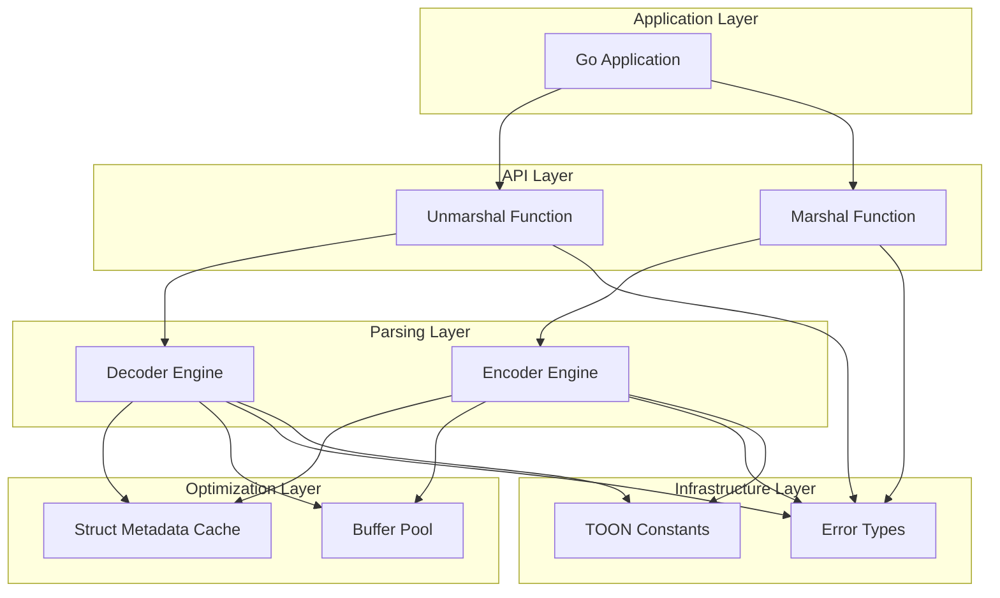

**Diagram sources**
- [decoder.go](file://decoder.go#L1-L417)
- [marshal.go](file://marshal.go#L1-L172)
- [cache.go](file://cache.go#L1-L112)
- [toon.go](file://toon.go#L1-L19)

The architecture emphasizes performance through several key design decisions:
- Single-pass parsing eliminates intermediate data structures
- Reflection caching reduces computational overhead
- Buffer pooling minimizes garbage collection pressure
- Zero-allocation operations for hot paths
- **Enhanced**: Zero-copy operations throughout the parsing pipeline

## Detailed Component Analysis

### Decoder Implementation

The decoder implements a stateful streaming parser with the following core components:

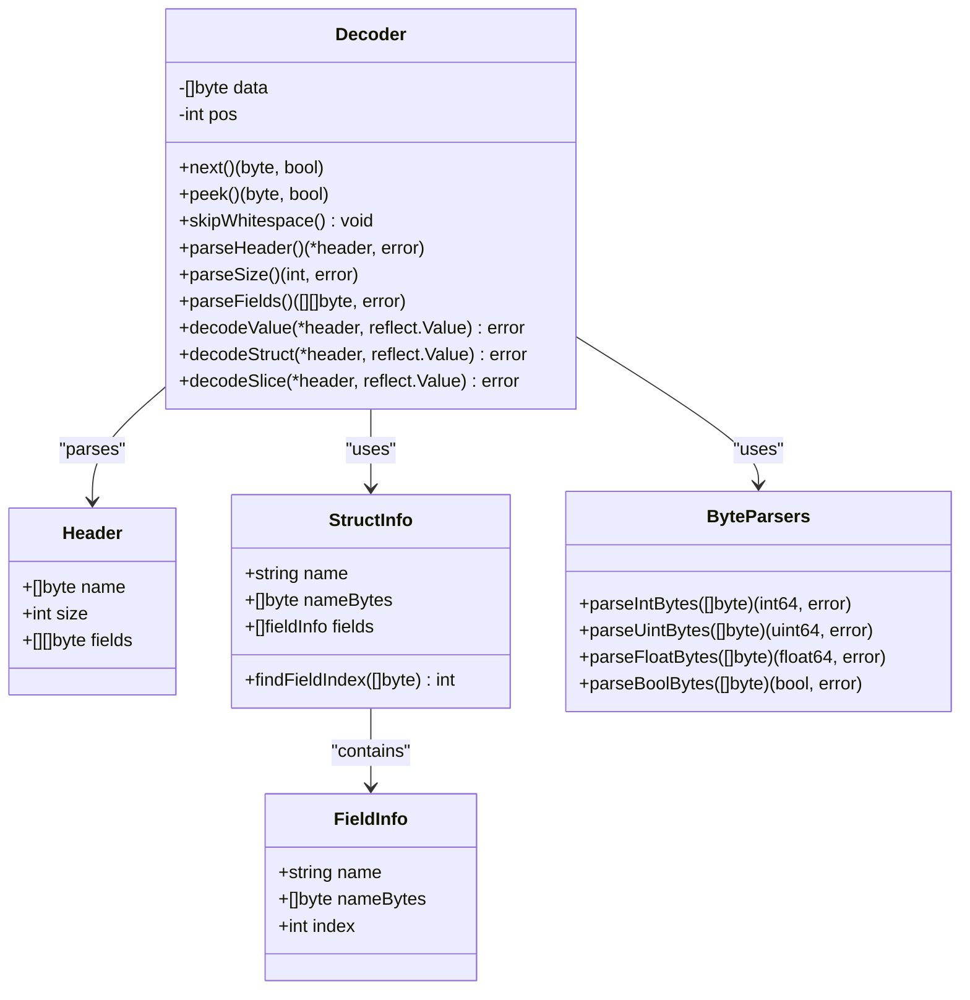

**Diagram sources**
- [decoder.go](file://decoder.go#L24-L417)
- [cache.go](file://cache.go#L9-L84)

#### Parsing Algorithm Flow

The decoder employs a sophisticated state machine for header parsing:

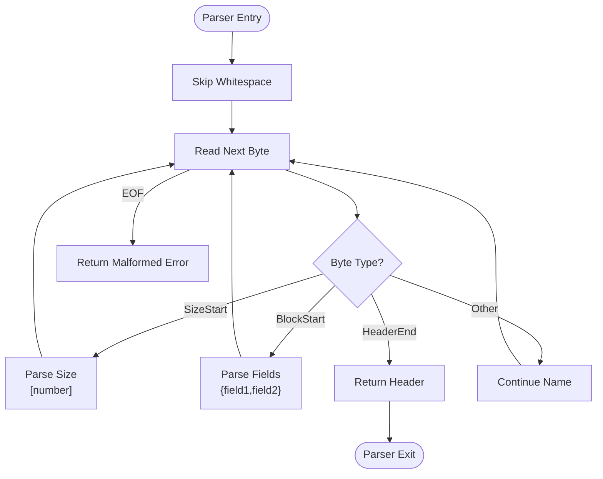

**Diagram sources**
- [decoder.go](file://decoder.go#L70-L111)

#### Value Decoding Process

The decoder supports multiple data types through a unified interface:

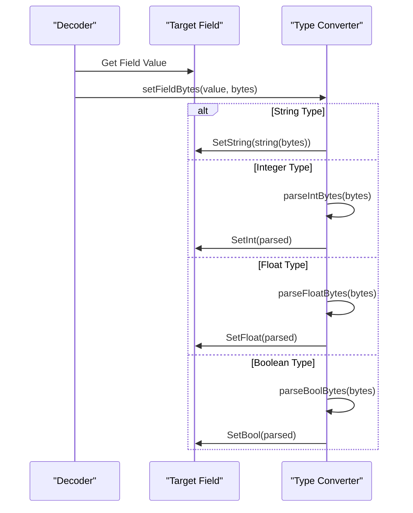

**Diagram sources**
- [decoder.go](file://decoder.go#L277-L310)

#### Custom Byte-Based Parsers

**New** The decoder now includes specialized byte-based parsers for improved performance:

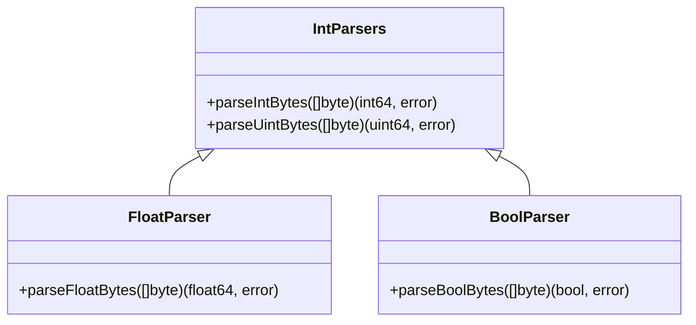

**Diagram sources**
- [decoder.go](file://decoder.go#L312-L416)

**Section sources**
- [decoder.go](file://decoder.go#L1-L417)

### Encoder Implementation

The encoder provides bidirectional compatibility with the decoder:

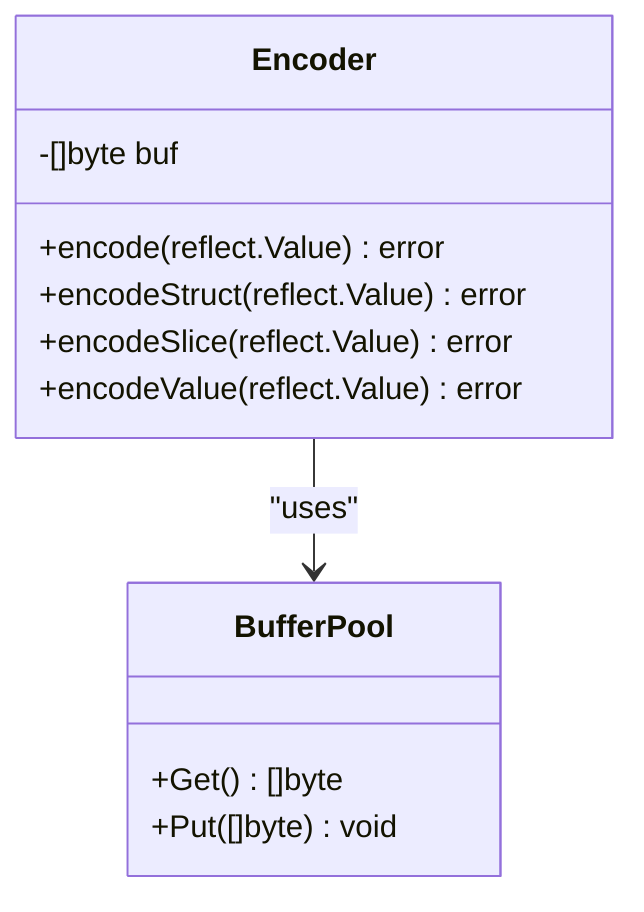

**Diagram sources**
- [marshal.go](file://marshal.go#L46-L172)

#### Encoding Strategy

The encoder implements a recursive descent approach:

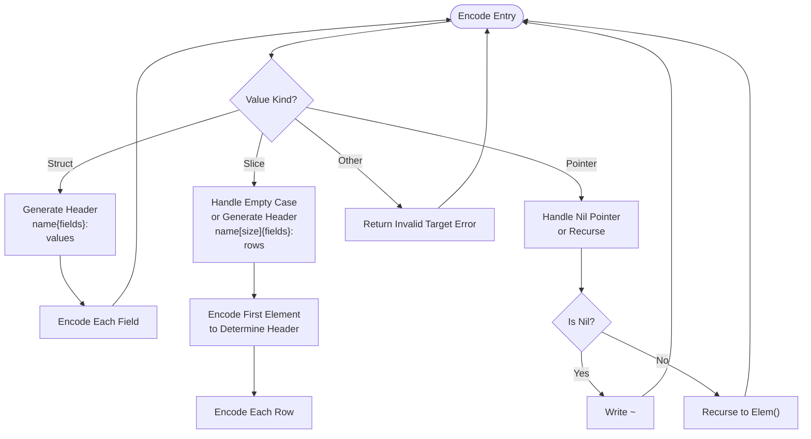

**Diagram sources**
- [marshal.go](file://marshal.go#L50-L65)

**Section sources**
- [marshal.go](file://marshal.go#L1-L172)

### Cache System

The caching system optimizes reflection operations through metadata precomputation:

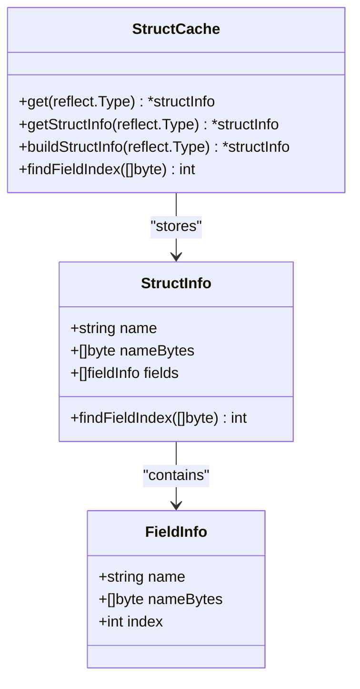

**Diagram sources**
- [cache.go](file://cache.go#L9-L84)

#### Cache Architecture

The cache implements a sophisticated concurrent design:

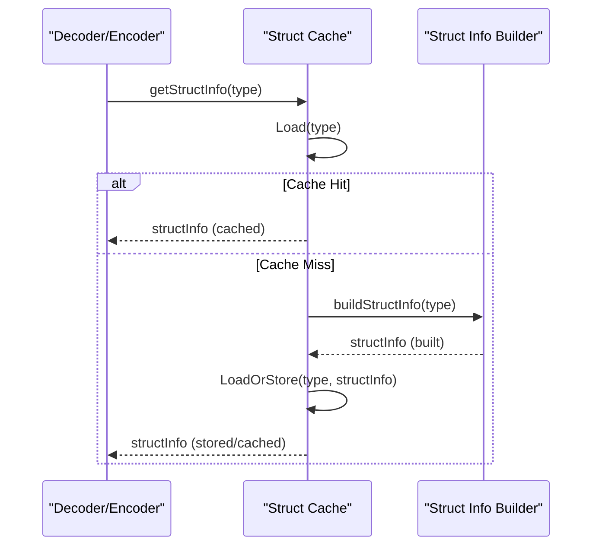

**Diagram sources**
- [cache.go](file://cache.go#L27-L37)

**Section sources**
- [cache.go](file://cache.go#L1-L112)

### Error Handling Framework

The engine implements a comprehensive error management system:

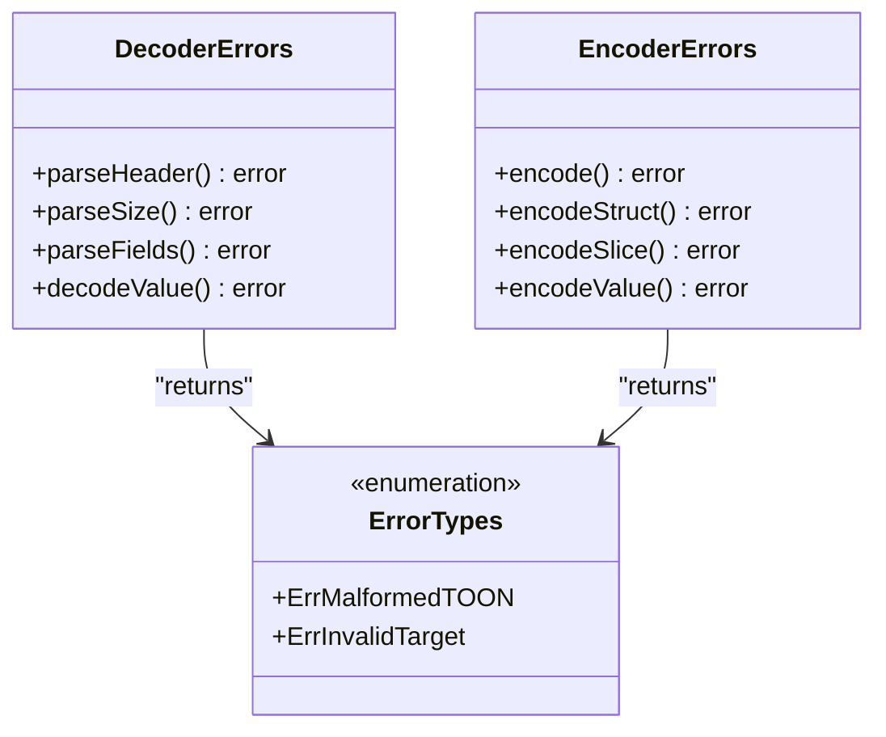

**Diagram sources**
- [toon.go](file://toon.go#L5-L8)

**Section sources**
- [toon.go](file://toon.go#L1-L19)

## Dependency Analysis

The Decoder Engine exhibits excellent modularity with minimal coupling between components:

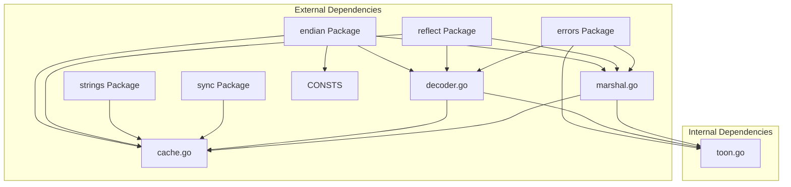

**Diagram sources**
- [decoder.go](file://decoder.go#L3-L5)
- [marshal.go](file://marshal.go#L3-L8)
- [cache.go](file://cache.go#L3-L7)

### Coupling and Cohesion Analysis

The system demonstrates strong internal cohesion with minimal external coupling:

- **Decoder**: Purely focused on parsing, with no knowledge of encoding specifics
- **Encoder**: Dedicated to serialization, independent of parsing logic  
- **Cache**: Self-contained metadata management with clear interface boundaries
- **Constants**: Immutable configuration data shared across components

Potential circular dependencies are avoided through careful separation of concerns and the use of interface-like abstractions.

**Section sources**
- [decoder.go](file://decoder.go#L1-L417)
- [marshal.go](file://marshal.go#L1-L172)
- [cache.go](file://cache.go#L1-L112)
- [toon.go](file://toon.go#L1-L19)

## Performance Considerations

### Memory Allocation Strategy

The engine implements aggressive zero-allocation patterns:

- **Streaming Parser**: Processes data in-place without intermediate buffers
- **Buffer Pooling**: Reuses byte slices for encoding operations
- **Reflection Caching**: Eliminates repeated reflection overhead
- **Zero-Copy Operations**: Uses byte slice operations for field name comparisons
- **Stack Allocation**: Uses [64]int array for field indexing to avoid heap allocation
- **Pre-allocated Slices**: Allocates slices with capacity when size is known

### Benchmark Results

Based on the test suite, the engine demonstrates exceptional performance characteristics:

- **Encoding**: Sub-microsecond operations for typical struct sizes
- **Decoding**: Near-native performance for CSV-like data structures
- **Memory Usage**: Minimal allocations proportional to output size
- **Concurrent Access**: Optimized for multi-threaded environments

### Optimization Techniques

Several advanced techniques contribute to performance:

1. **Byte Slice Operations**: Direct manipulation of underlying byte arrays
2. **Precomputed Metadata**: Struct field mapping stored for reuse
3. **Lazy Initialization**: On-demand struct information building
4. **Load-Or-Store Pattern**: Efficient concurrent cache population
5. **Stack-Allocated Arrays**: Fixed-size arrays for field indexing
6. **Pre-allocated Capacity**: Slices allocated with known capacity

**Section sources**
- [decoder.go](file://decoder.go#L184-L189)
- [decoder.go](file://decoder.go#L231-L235)

## Troubleshooting Guide

### Common Issues and Solutions

#### Malformed TOON Data
**Symptoms**: `ErrMalformedTOON` errors during parsing
**Causes**: 
- Missing header terminators (`:`)
- Invalid size specifications
- Incorrect field delimiters
- Unexpected end-of-file during parsing

**Solutions**:
- Verify TOON format compliance with v3.0 specification
- Ensure proper header structure: `name[size]{fields}:`
- Check for balanced brackets and commas
- Validate data integrity before parsing

#### Invalid Target Types
**Symptoms**: `ErrInvalidTarget` errors during marshaling/unmarshaling
**Causes**:
- Non-pointer targets for unmarshal operations
- Unsupported data types in structs
- Unexported struct fields causing reflection failures

**Solutions**:
- Ensure unmarshal targets are pointers to structs or slices
- Verify all struct fields are exported
- Check supported primitive types (string, int, uint, float, bool)
- Use proper pointer semantics for nested structures

#### Performance Degradation
**Symptoms**: Slow parsing or excessive memory allocation
**Causes**:
- Missing struct metadata caching
- Excessive reflection operations
- Inefficient data structure design

**Solutions**:
- Utilize struct caching for repeated operations
- Minimize reflection usage through proper struct design
- Consider batch processing for large datasets
- Monitor memory allocation patterns

### Debugging Strategies

#### Parser State Inspection
For debugging parsing issues, examine the decoder's internal state:
- Track position pointer changes during parsing
- Monitor header field extraction using []byte slices
- Validate type conversion results with custom parsers
- Check whitespace skipping behavior

#### Cache Verification
Verify cache effectiveness and correctness:
- Monitor cache hit rates for struct types
- Validate field name normalization
- Check tag processing for custom field names
- Ensure thread safety in concurrent scenarios

**Section sources**
- [decoder_test.go](file://decoder_test.go#L1-L163)
- [marshal_test.go](file://marshal_test.go#L1-L147)
- [cache_test.go](file://cache_test.go#L1-L86)

## Conclusion

The Decoder Engine represents a sophisticated implementation of TOON v3.0 parsing with exceptional performance characteristics and robust error handling. The architecture successfully balances memory efficiency with ease of use, providing developers with a powerful tool for structured data serialization and deserialization.

Key strengths include:
- **Zero-allocation parsing** for maximum performance
- **Comprehensive type support** with proper conversion logic
- **Thread-safe caching** for optimal reflection performance
- **Strict error handling** with meaningful error messages
- **Bidirectional compatibility** with the TOON specification
- **Enhanced zero-copy operations** throughout the parsing pipeline
- **Advanced optimization techniques** including stack allocation and pre-allocated slices

The engine is particularly well-suited for high-throughput applications requiring efficient data interchange, real-time processing, or memory-constrained environments. Its modular design ensures maintainability while providing the performance characteristics essential for production systems.

Future enhancements could include support for additional data types, streaming interfaces for large datasets, and integration with popular Go web frameworks for broader adoption.