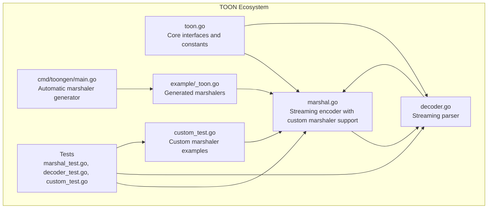
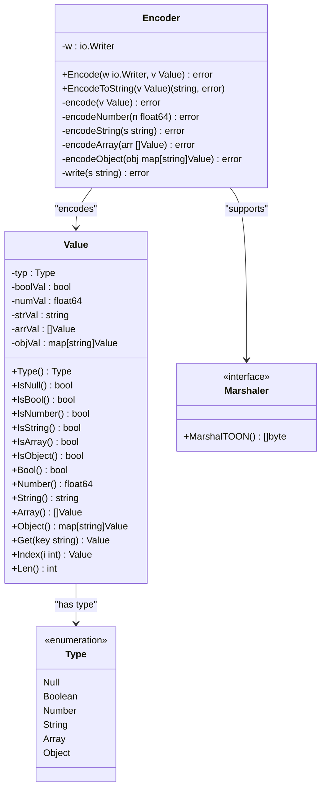
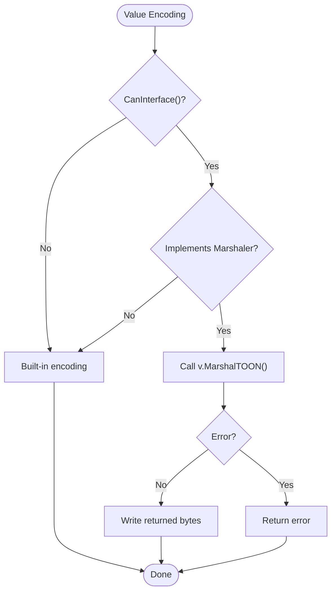
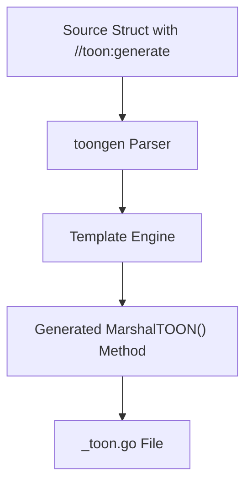

# Encoder Implementation

<cite>
**Referenced Files in This Document**
- [marshal.go](file://marshal.go)
- [toon.go](file://toon.go)
- [custom_test.go](file://custom_test.go)
- [example/_toon.go](file://example/_toon.go)
- [cmd/toongen/main.go](file://cmd/toongen/main.go)
- [marshal_test.go](file://marshal_test.go)
- [decoder.go](file://decoder.go)
- [decoder_test.go](file://decoder_test.go)
- [stream.go](file://stream.go)
- [stream_test.go](file://stream_test.go)
- [cache.go](file://cache.go)
- [cache_test.go](file://cache_test.go)
- [go.mod](file://go.mod)
</cite>

## Update Summary
**Changes Made**
- Added comprehensive documentation for the new custom serialization system integration
- Documented the Marshaler interface and its role in the encoding pipeline
- Added examples of custom marshaler implementations
- Documented the toongen tool for automatic marshaler generation
- Updated architecture diagrams to reflect the new custom marshaling capabilities

## Table of Contents
1. [Introduction](#introduction)
2. [Project Structure](#project-structure)
3. [Core Components](#core-components)
4. [Architecture Overview](#architecture-overview)
5. [Detailed Component Analysis](#detailed-component-analysis)
6. [Custom Serialization System](#custom-serialization-system)
7. [Dependency Analysis](#dependency-analysis)
8. [Performance Considerations](#performance-considerations)
9. [Troubleshooting Guide](#troubleshooting-guide)
10. [Conclusion](#conclusion)
11. [Appendices](#appendices)

## Introduction
This document provides comprehensive technical documentation for the TOON encoder implementation, focusing on streaming output generation, deterministic serialization, and efficient string escaping. TOON is a compact, token-oriented notation designed to reduce LLM token usage compared to JSON. The encoder transforms structured Value objects into TOON format using streaming I/O operations, maintains deterministic key ordering for consistent hashing, and optimizes string escaping and formatting for performance and correctness.

**Updated** Added support for custom serialization through the Marshaler interface, enabling types to define their own TOON encoding behavior.

## Project Structure
The repository implements a minimal, focused TOON ecosystem with clear separation between encoding, decoding, and shared data structures:

- marshal.go: Streaming encoder implementation with builder pattern, deterministic serialization, and custom marshaler support
- toon.go: Core interfaces including Marshaler and Unmarshaler for custom serialization
- custom_test.go: Examples of custom marshaler implementations (Status, UnixTime)
- example/_toon.go: Generated marshaler implementations for User and Product types
- cmd/toongen/main.go: Tool for automatic marshaler generation from struct definitions
- decoder.go: Streaming parser implementation for TOON format
- Tests: Comprehensive validation of encoding/decoding behavior and round-trip fidelity



**Diagram sources**
- [marshal.go](file://marshal.go#L1-L184)
- [toon.go](file://toon.go#L1-L29)
- [custom_test.go](file://custom_test.go#L1-L162)
- [example/_toon.go](file://example/_toon.go#L1-L163)
- [cmd/toongen/main.go](file://cmd/toongen/main.go#L1-L359)

**Section sources**
- [marshal.go](file://marshal.go#L1-L184)
- [toon.go](file://toon.go#L1-L29)
- [custom_test.go](file://custom_test.go#L1-L162)
- [example/_toon.go](file://example/_toon.go#L1-L163)
- [cmd/toongen/main.go](file://cmd/toongen/main.go#L1-L359)

## Core Components
The encoder is built around a streaming architecture that writes directly to an io.Writer, minimizing intermediate allocations and enabling efficient processing of large datasets. The core components include:

- Encoder struct: Holds the output writer and provides streaming encode operations
- Value type system: Unified representation supporting six primitive types (Null, Boolean, Number, String, Array, Object)
- Builder pattern: Uses strings.Builder for efficient string construction during encoding
- Identifier detection: Compact key representation when keys meet identifier criteria
- Deterministic ordering: Sorted key processing for consistent output
- **Custom marshaler support**: Integration of Marshaler interface for custom serialization behavior

Key encoding behaviors:
- Null: Encoded as "~"
- Booleans: Encoded as "+" (true) and "-" (false)
- Numbers: Optimized integer vs floating-point formatting
- Strings: Full escaping support with Unicode handling
- Arrays: Space-separated items with bracket delimiters
- Objects: Deterministic key ordering with identifier optimization
- **Custom types**: Support for types implementing Marshaler interface

**Section sources**
- [marshal.go](file://marshal.go#L1-L184)
- [toon.go](file://toon.go#L1-L29)

## Architecture Overview
The encoder follows a streaming-first design that writes directly to the destination writer, avoiding unnecessary buffering. The architecture emphasizes:

- Single-pass encoding with minimal memory overhead
- Deterministic output through sorted key processing
- Efficient string escaping using pre-sized builders
- Compact identifier representation for object keys
- **Custom marshaler integration** for specialized type handling

```mermaid
sequenceDiagram
participant Client as "Client Code"
participant Encoder as "Encoder"
participant Writer as "io.Writer"
participant Builder as "strings.Builder"
participant CustomMarshaler as "Custom Marshaler"
Client->>Encoder : Marshal(v interface{})
Encoder->>Encoder : encode(reflect.Value)
alt Custom Marshaler Check
case Implements Marshaler
Encoder->>CustomMarshaler : v.MarshalTOON()
CustomMarshaler-->>Encoder : []byte
Encoder->>Writer : write(custom bytes)
else Built-in Types
Encoder->>Encoder : encodeValue(v)
alt Value Type
case String/Int/Float/Bool
Encoder->>Writer : write(formatted)
case Slice
Encoder->>Writer : write("[")
loop items
Encoder->>Encoder : encodeValue(item)
Encoder->>Writer : write(",")
end
Encoder->>Writer : write("]")
end
end
Encoder-->>Client : []byte or error
```

**Diagram sources**
- [marshal.go](file://marshal.go#L139-L183)
- [toon.go](file://toon.go#L20-L23)

## Detailed Component Analysis

### Encoder Class and Builder Pattern
The Encoder struct encapsulates the streaming write operation and provides a clean interface for encoding Value objects. The builder pattern is implemented through strings.Builder for efficient string construction during string encoding and key building.



**Diagram sources**
- [marshal.go](file://marshal.go#L45-L65)
- [toon.go](file://toon.go#L20-L23)

**Section sources**
- [marshal.go](file://marshal.go#L45-L65)
- [toon.go](file://toon.go#L20-L23)

### Deterministic Serialization and Key Ordering
The encoder ensures deterministic output by sorting object keys before serialization. This guarantees consistent hash values and predictable output regardless of insertion order.


**Diagram sources**
- [marshal.go](file://marshal.go#L67-L93)

Key ordering characteristics:
- Uses simple bubble sort for determinism (O(n²) but acceptable for typical key counts)
- Ensures consistent output for hashing and caching scenarios
- Maintains backward compatibility with existing object structures

**Section sources**
- [marshal.go](file://marshal.go#L67-L93)

### String Escaping and Formatting
The encoder implements comprehensive string escaping to handle control characters, quotes, backslashes, and Unicode sequences. The implementation prioritizes correctness and performance through careful buffer sizing and escape sequence handling.


**Diagram sources**
- [marshal.go](file://marshal.go#L152-L183)

String escaping rules:
- Double quotes: escaped as \"
- Backslashes: escaped as \\
- Control characters (< 0x20): escaped as Unicode sequences (\uXXXX)
- Tab, newline, carriage return, form feed: escaped as \t, \n, \r, \f
- All other characters: written as-is

**Section sources**
- [marshal.go](file://marshal.go#L152-L183)

### Number Formatting and Optimization
The encoder optimizes number representation by distinguishing between integers and floating-point values, using the most compact representation possible.

Number formatting characteristics:
- Integers: formatted as decimal without fractional part
- Floating-point: uses Go's default float formatting (-1 precision for optimal representation)
- Scientific notation: handled automatically by Go's formatting functions
- Sign handling: preserves negative signs appropriately

**Section sources**
- [marshal.go](file://marshal.go#L155-L160)

### Identifier Detection and Compact Representation
The encoder includes intelligent identifier detection that allows object keys to be written without quotes when they meet identifier criteria, reducing output size and improving readability.

Identifier validation rules:
- First character: letter (a-z, A-Z) or underscore (_)
- Subsequent characters: letters, digits, underscores, or hyphens
- Empty strings are not valid identifiers
- Identifiers enable compact key representation without quotes

**Section sources**
- [marshal.go](file://marshal.go#L167-L179)

### Streaming I/O Operations and Memory Efficiency
The encoder employs several strategies for memory efficiency and streaming performance:

- Direct writer writes: bypasses intermediate buffers for immediate output
- Pre-sized builders: strings.Builder avoids repeated reallocation
- Minimal temporary allocations: reuses buffers where possible
- Incremental processing: processes arrays and objects in a single pass
- **Buffer pooling**: sync.Pool for zero-allocation encoding operations

Memory efficiency techniques:
- strings.Builder for string construction
- Single-pass key sorting (bubble sort for small arrays)
- Direct byte writes to io.Writer
- No intermediate string concatenation beyond necessary
- **Buffer pool reuse for encoding operations**

**Section sources**
- [marshal.go](file://marshal.go#L10-L15)
- [marshal.go](file://marshal.go#L139-L183)

## Custom Serialization System

### Marshaler Interface Integration
The encoder now supports custom serialization through the Marshaler interface, allowing types to define their own TOON encoding behavior. This integration occurs during the value encoding phase, checking if a value implements the Marshaler interface before falling back to built-in encoding.



**Diagram sources**
- [marshal.go](file://marshal.go#L139-L150)

### Custom Marshaler Examples
The codebase includes several examples demonstrating custom marshaler implementations:

#### Status Type Example
A simple enum-like type that marshals to single-character codes:
- Pending → "P"
- Active → "A"  
- Inactive → "I"

#### UnixTime Wrapper Example
A time wrapper that marshals to Unix timestamps as integers:
- Converts time.Time to Unix epoch seconds
- Enables compact time representation

**Section sources**
- [custom_test.go](file://custom_test.go#L9-L47)
- [custom_test.go](file://custom_test.go#L49-L63)

### Automatic Marshaler Generation
The toongen tool provides automatic generation of marshaler implementations for structs annotated with `//toon:generate` comments. This enables zero-boilerplate custom serialization for complex data structures.



**Diagram sources**
- [cmd/toongen/main.go](file://cmd/toongen/main.go#L30-L88)

Generation features:
- Automatic field discovery and processing
- Header generation with type name and field names
- Field value encoding with appropriate formatting
- UnmarshalTOON() method generation for round-trip support
- Template-based code generation for consistency

**Section sources**
- [cmd/toongen/main.go](file://cmd/toongen/main.go#L30-L88)
- [example/_toon.go](file://example/_toon.go#L9-L32)
- [example/_toon.go](file://example/_toon.go#L108-L127)

### Integration Benefits
The custom serialization system provides several benefits:

- **Flexibility**: Types can define their own encoding format
- **Performance**: Custom marshaling can be optimized for specific use cases
- **Consistency**: Generated marshalers ensure uniform encoding behavior
- **Type Safety**: Compile-time checking of marshaler implementations
- **Backward Compatibility**: Existing types continue to work unchanged

**Section sources**
- [marshal.go](file://marshal.go#L140-L150)
- [toon.go](file://toon.go#L20-L23)

## Dependency Analysis
The encoder implementation demonstrates clean separation of concerns with minimal external dependencies:

```mermaid
graph TB
subgraph "External Dependencies"
IO["io package"]
REFLECT["reflect package"]
STRCONV["strconv package"]
SYNC["sync package"]
END
subgraph "Internal Dependencies"
Marshaler["toon.go<br/>Marshaler interface"]
Encoder["marshal.go<br/>Custom marshaler support"]
Parser["decoder.go"]
CustomExamples["custom_test.go<br/>Custom marshaler examples"]
Generated["example/_toon.go<br/>Generated marshalers"]
Generator["cmd/toongen/main.go<br/>Code generator"]
end
Marshaler --> Encoder
Encoder --> Parser
CustomExamples --> Encoder
Generated --> Encoder
Generator --> Generated
IO --> Encoder
REFLECT --> Encoder
STRCONV --> Encoder
SYNC --> Encoder
```

**Diagram sources**
- [marshal.go](file://marshal.go#L3-L8)
- [toon.go](file://toon.go#L1-L29)

Dependency relationships:
- Encoder depends on io, reflect, strconv, and sync packages
- Parser shares the same external dependencies
- Both components depend on the shared Marshaler interface
- Custom marshaler examples demonstrate interface implementation
- No circular dependencies exist between components

**Section sources**
- [marshal.go](file://marshal.go#L3-L8)
- [toon.go](file://toon.go#L1-L29)

## Performance Considerations
The encoder implementation incorporates several performance optimizations:

- Streaming architecture: reduces memory footprint by writing directly to output
- Efficient string building: uses strings.Builder to minimize allocations
- Deterministic key sorting: O(n²) bubble sort suitable for typical key counts
- Identifier optimization: eliminates quote overhead for valid identifiers
- Minimal type assertions: uses switch statements for fast type dispatch
- **Buffer pooling**: sync.Pool reduces allocation overhead for encoding operations
- **Custom marshaler optimization**: Direct byte writing bypasses string conversion overhead

Performance characteristics:
- Time complexity: O(n) for basic values, O(n log n) for objects due to key sorting
- Space complexity: O(1) additional space beyond output buffer
- Memory allocation: minimal, primarily for string builders and temporary slices
- Throughput: optimized for streaming scenarios with large datasets
- **Custom marshaler performance**: Often faster than reflection-based encoding

Optimization recommendations:
- For very large objects, consider pre-sorting keys externally
- Use buffered writers for improved I/O performance
- Leverage identifier-friendly key naming conventions
- Implement custom marshalers for frequently encoded types
- Monitor output size for large datasets to optimize memory usage

## Troubleshooting Guide
Common issues and their solutions:

### Output Format Issues
- **Problem**: Unexpected quotes around object keys
  - **Cause**: Key does not meet identifier criteria
  - **Solution**: Ensure keys start with letter/underscore and contain only valid characters

- **Problem**: Control characters not properly escaped
  - **Cause**: Non-printable characters in strings
  - **Solution**: Encoder automatically escapes control characters as Unicode sequences

### Memory and Performance Issues
- **Problem**: High memory usage with large objects
  - **Cause**: Large number of keys requiring sorting
  - **Solution**: Consider external key sorting or using identifier-friendly keys

- **Problem**: Slow encoding performance
  - **Cause**: Excessive string building operations
  - **Solution**: Use buffered writers and minimize intermediate string operations

- **Problem**: Custom marshaler performance issues
  - **Cause**: Inefficient marshaler implementation
  - **Solution**: Use pre-allocated buffers and avoid unnecessary allocations

### Custom Marshaler Issues
- **Problem**: Custom marshaler not being called
  - **Cause**: Type doesn't implement Marshaler interface correctly
  - **Solution**: Ensure method signature matches `MarshalTOON() ([]byte, error)`

- **Problem**: Generated marshaler conflicts
  - **Cause**: Manual implementation conflicts with generated code
  - **Solution**: Remove manual implementation or regenerate code

### Edge Cases
- **Problem**: Empty arrays or objects
  - **Solution**: Handled correctly by encoder ([]) and ({})
- **Problem**: Nested structures
  - **Solution**: Recursively processed with proper delimiter handling
- **Problem**: Nil pointers in custom marshalers
  - **Solution**: Custom marshalers should handle nil values appropriately

**Section sources**
- [marshal.go](file://marshal.go#L152-L183)
- [marshal.go](file://marshal.go#L139-L150)
- [custom_test.go](file://custom_test.go#L65-L92)

## Conclusion
The TOON encoder implementation provides a robust, efficient solution for streaming serialization with deterministic output and enhanced customization capabilities. Its architecture balances performance, correctness, and simplicity through:

- Streaming-first design with minimal memory overhead
- Deterministic key ordering for consistent hashing
- Intelligent identifier detection for compact output
- Comprehensive string escaping for safety and portability
- Clean separation of concerns with minimal dependencies
- **Custom serialization system integration** enabling specialized type handling
- **Automatic marshaler generation** for zero-boilerplate custom serialization

The implementation serves as an excellent foundation for applications requiring compact, token-efficient serialization while maintaining full compatibility with the broader TOON ecosystem and enabling advanced customization scenarios.

## Appendices

### Output Format Specifications
TOON encoding follows these format rules:

- **Null**: "~"
- **Boolean**: "+" (true), "-" (false)
- **Number**: Integer or decimal representation
- **String**: Quoted with full escaping support
- **Array**: "[item1 item2 ...]"
- **Object**: "{key1 value1 key2 value2 ...}"
- **Custom types**: Direct byte output from MarshalTOON() method

Key characteristics:
- Space-separated items and pairs
- Deterministic key ordering
- Identifier optimization for object keys
- Full Unicode and control character support
- **Custom marshaler output integration**

### Usage Examples
The encoder supports multiple usage patterns:

- Direct streaming to io.Writer
- String conversion via EncodeToString
- Integration with buffered I/O for performance
- Round-trip encoding/decoding validation
- **Custom marshaler integration** for specialized types
- **Generated marshaler usage** for automatic serialization

**Section sources**
- [marshal.go](file://marshal.go#L17-L38)
- [marshal_test.go](file://marshal_test.go#L18-L73)
- [custom_test.go](file://custom_test.go#L65-L128)

### Custom Marshaler Interface
The Marshaler interface enables custom serialization behavior:

```go
type Marshaler interface {
    MarshalTOON() ([]byte, error)
}
```

Implementation requirements:
- Must return valid TOON-encoded bytes
- Should handle errors gracefully
- Should be deterministic for consistent output
- Should avoid external dependencies when possible

**Section sources**
- [toon.go](file://toon.go#L20-L23)
- [custom_test.go](file://custom_test.go#L18-L29)
- [custom_test.go](file://custom_test.go#L52-L54)

### Generated Marshaler Features
Generated marshalers provide automatic serialization for structs:

- Automatic field discovery and processing
- Header generation with type name and field names
- Field value encoding with appropriate formatting
- UnmarshalTOON() method generation for round-trip support
- Template-based code generation for consistency
- Zero-allocation buffer management

**Section sources**
- [cmd/toongen/main.go](file://cmd/toongen/main.go#L30-L88)
- [example/_toon.go](file://example/_toon.go#L9-L32)
- [example/_toon.go](file://example/_toon.go#L108-L127)