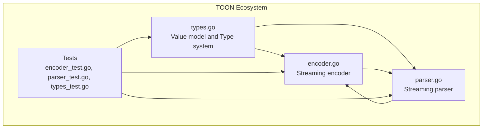
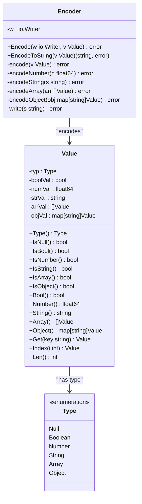
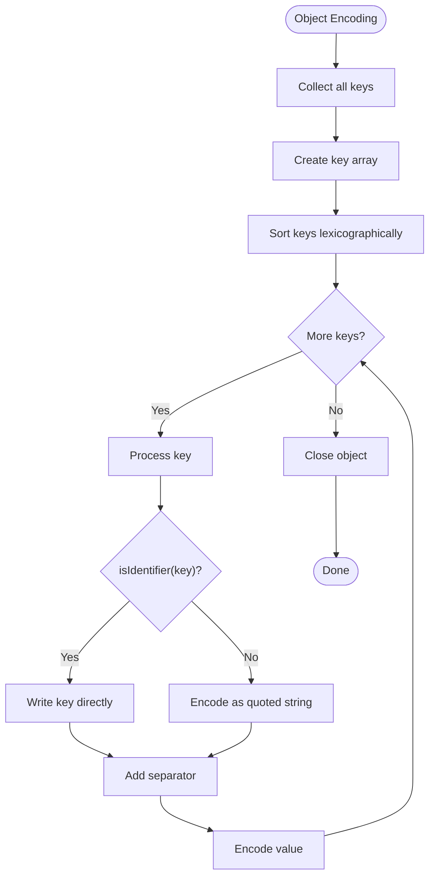
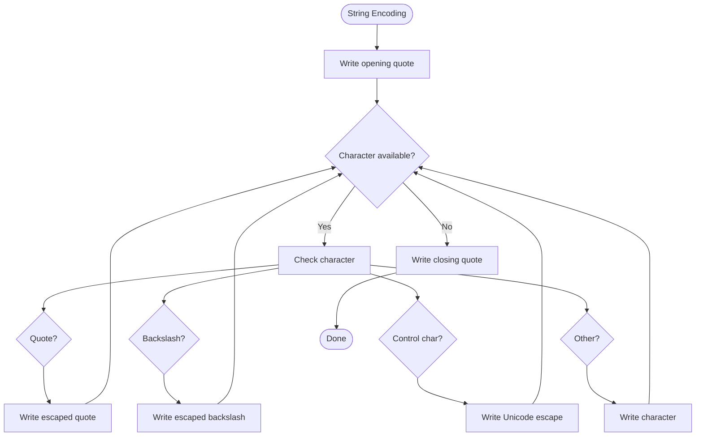
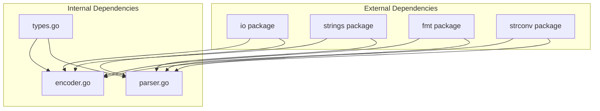

# Encoder Implementation

<cite>
**Referenced Files in This Document**
- [encoder.go](file://encoder.go)
- [types.go](file://types.go)
- [parser.go](file://parser.go)
- [encoder_test.go](file://encoder_test.go)
- [parser_test.go](file://parser_test.go)
- [types_test.go](file://types_test.go)
- [go.mod](file://go.mod)
</cite>

## Table of Contents
1. [Introduction](#introduction)
2. [Project Structure](#project-structure)
3. [Core Components](#core-components)
4. [Architecture Overview](#architecture-overview)
5. [Detailed Component Analysis](#detailed-component-analysis)
6. [Dependency Analysis](#dependency-analysis)
7. [Performance Considerations](#performance-considerations)
8. [Troubleshooting Guide](#troubleshooting-guide)
9. [Conclusion](#conclusion)
10. [Appendices](#appendices)

## Introduction
This document provides comprehensive technical documentation for the TOON encoder implementation, focusing on streaming output generation, deterministic serialization, and efficient string escaping. TOON is a compact, token-oriented notation designed to reduce LLM token usage compared to JSON. The encoder transforms structured Value objects into TOON format using streaming I/O operations, maintains deterministic key ordering for consistent hashing, and optimizes string escaping and formatting for performance and correctness.

## Project Structure
The repository implements a minimal, focused TOON ecosystem with clear separation between encoding, decoding, and shared data structures:

- encoder.go: Streaming encoder implementation with builder pattern and deterministic serialization
- parser.go: Streaming parser implementation for TOON format
- types.go: Shared Value model and type system
- Tests: Comprehensive validation of encoding/decoding behavior and round-trip fidelity



**Diagram sources**
- [encoder.go](file://encoder.go#L1-L192)
- [parser.go](file://parser.go#L1-L411)
- [types.go](file://types.go#L1-L209)

**Section sources**
- [encoder.go](file://encoder.go#L1-L192)
- [parser.go](file://parser.go#L1-L411)
- [types.go](file://types.go#L1-L209)

## Core Components
The encoder is built around a streaming architecture that writes directly to an io.Writer, minimizing intermediate allocations and enabling efficient processing of large datasets. The core components include:

- Encoder struct: Holds the output writer and provides streaming encode operations
- Value type system: Unified representation supporting six primitive types (Null, Boolean, Number, String, Array, Object)
- Builder pattern: Uses strings.Builder for efficient string construction during encoding
- Identifier detection: Compact key representation when keys meet identifier criteria
- Deterministic ordering: Sorted key processing for consistent output

Key encoding behaviors:
- Null: Encoded as "~"
- Booleans: Encoded as "+" (true) and "-" (false)
- Numbers: Optimized integer vs floating-point formatting
- Strings: Full escaping support with Unicode handling
- Arrays: Space-separated items with bracket delimiters
- Objects: Deterministic key ordering with identifier optimization

**Section sources**
- [encoder.go](file://encoder.go#L10-L192)
- [types.go](file://types.go#L9-L209)

## Architecture Overview
The encoder follows a streaming-first design that writes directly to the destination writer, avoiding unnecessary buffering. The architecture emphasizes:

- Single-pass encoding with minimal memory overhead
- Deterministic output through sorted key processing
- Efficient string escaping using pre-sized builders
- Compact identifier representation for object keys

```mermaid
sequenceDiagram
participant Client as "Client Code"
participant Encoder as "Encoder"
participant Writer as "io.Writer"
participant Builder as "strings.Builder"
Client->>Encoder : Encode(writer, value)
Encoder->>Encoder : encode(value)
alt Value Type
case Null
Encoder->>Writer : write("~")
case Boolean
Encoder->>Writer : write("+/-")
case Number
Encoder->>Encoder : encodeNumber()
Encoder->>Writer : write(formatted)
case String
Encoder->>Builder : build escaped string
Builder-->>Encoder : string
Encoder->>Writer : write(string)
case Array
Encoder->>Writer : write("[")
loop items
Encoder->>Encoder : encode(item)
Encoder->>Writer : write(" ")
end
Encoder->>Writer : write("]")
case Object
Encoder->>Writer : write("{")
Encoder->>Encoder : sort keys
loop keys
Encoder->>Encoder : isIdentifier(key)?
alt identifier
Encoder->>Writer : write(key)
else string
Encoder->>Encoder : encodeString(key)
end
Encoder->>Writer : write(" ")
Encoder->>Encoder : encode(value)
Encoder->>Writer : write(" ")
end
Encoder->>Writer : write("}")
end
Encoder-->>Client : error or success
```

**Diagram sources**
- [encoder.go](file://encoder.go#L15-L192)

## Detailed Component Analysis

### Encoder Class and Builder Pattern
The Encoder struct encapsulates the streaming write operation and provides a clean interface for encoding Value objects. The builder pattern is implemented through strings.Builder for efficient string construction during string encoding and key building.



**Diagram sources**
- [encoder.go](file://encoder.go#L10-L192)
- [types.go](file://types.go#L47-L209)

**Section sources**
- [encoder.go](file://encoder.go#L10-L192)
- [types.go](file://types.go#L47-L209)

### Deterministic Serialization and Key Ordering
The encoder ensures deterministic output by sorting object keys before serialization. This guarantees consistent hash values and predictable output regardless of insertion order.



**Diagram sources**
- [encoder.go](file://encoder.go#L115-L163)

Key ordering characteristics:
- Uses simple bubble sort for determinism (O(n²) but acceptable for typical key counts)
- Ensures consistent output for hashing and caching scenarios
- Maintains backward compatibility with existing object structures

**Section sources**
- [encoder.go](file://encoder.go#L115-L163)

### String Escaping and Formatting
The encoder implements comprehensive string escaping to handle control characters, quotes, backslashes, and Unicode sequences. The implementation prioritizes correctness and performance through careful buffer sizing and escape sequence handling.



**Diagram sources**
- [encoder.go](file://encoder.go#L61-L94)

String escaping rules:
- Double quotes: escaped as \"
- Backslashes: escaped as \\
- Control characters (< 0x20): escaped as Unicode sequences (\uXXXX)
- Tab, newline, carriage return, form feed: escaped as \t, \n, \r, \f
- All other characters: written as-is

**Section sources**
- [encoder.go](file://encoder.go#L61-L94)

### Number Formatting and Optimization
The encoder optimizes number representation by distinguishing between integers and floating-point values, using the most compact representation possible.

Number formatting characteristics:
- Integers: formatted as decimal without fractional part
- Floating-point: uses Go's default float formatting (-1 precision for optimal representation)
- Scientific notation: handled automatically by Go's formatting functions
- Sign handling: preserves negative signs appropriately

**Section sources**
- [encoder.go](file://encoder.go#L53-L59)

### Identifier Detection and Compact Representation
The encoder includes intelligent identifier detection that allows object keys to be written without quotes when they meet identifier criteria, reducing output size and improving readability.

Identifier validation rules:
- First character: letter (a-z, A-Z) or underscore (_)
- Subsequent characters: letters, digits, underscores, or hyphens
- Empty strings are not valid identifiers
- Identifiers enable compact key representation without quotes

**Section sources**
- [encoder.go](file://encoder.go#L170-L191)

### Streaming I/O Operations and Memory Efficiency
The encoder employs several strategies for memory efficiency and streaming performance:

- Direct writer writes: bypasses intermediate buffers for immediate output
- Pre-sized builders: strings.Builder avoids repeated reallocation
- Minimal temporary allocations: reuses buffers where possible
- Incremental processing: processes arrays and objects in a single pass

Memory efficiency techniques:
- strings.Builder for string construction
- Single-pass key sorting (bubble sort for small arrays)
- Direct byte writes to io.Writer
- No intermediate string concatenation beyond necessary

**Section sources**
- [encoder.go](file://encoder.go#L165-L192)

## Dependency Analysis
The encoder implementation demonstrates clean separation of concerns with minimal external dependencies:



**Diagram sources**
- [encoder.go](file://encoder.go#L3-L8)
- [parser.go](file://parser.go#L3-L10)

Dependency relationships:
- Encoder depends on io, strings, fmt, and strconv packages
- Parser shares the same external dependencies
- Both components depend on the shared Value type system
- No circular dependencies exist between components

**Section sources**
- [encoder.go](file://encoder.go#L3-L8)
- [parser.go](file://parser.go#L3-L10)
- [types.go](file://types.go#L5-L7)

## Performance Considerations
The encoder implementation incorporates several performance optimizations:

- Streaming architecture: reduces memory footprint by writing directly to output
- Efficient string building: uses strings.Builder to minimize allocations
- Deterministic key sorting: O(n²) bubble sort suitable for typical key counts
- Identifier optimization: eliminates quote overhead for valid identifiers
- Minimal type assertions: uses switch statements for fast type dispatch

Performance characteristics:
- Time complexity: O(n) for basic values, O(n log n) for objects due to key sorting
- Space complexity: O(1) additional space beyond output buffer
- Memory allocation: minimal, primarily for string builders and temporary slices
- Throughput: optimized for streaming scenarios with large datasets

Optimization recommendations:
- For very large objects, consider pre-sorting keys externally
- Use buffered writers for improved I/O performance
- Leverage identifier-friendly key naming conventions
- Monitor output size for large datasets to optimize memory usage

## Troubleshooting Guide
Common issues and their solutions:

### Output Format Issues
- **Problem**: Unexpected quotes around object keys
  - **Cause**: Key does not meet identifier criteria
  - **Solution**: Ensure keys start with letter/underscore and contain only valid characters

- **Problem**: Control characters not properly escaped
  - **Cause**: Non-printable characters in strings
  - **Solution**: Encoder automatically escapes control characters as Unicode sequences

### Memory and Performance Issues
- **Problem**: High memory usage with large objects
  - **Cause**: Large number of keys requiring sorting
  - **Solution**: Consider external key sorting or using identifier-friendly keys

- **Problem**: Slow encoding performance
  - **Cause**: Excessive string building operations
  - **Solution**: Use buffered writers and minimize intermediate string operations

### Edge Cases
- **Problem**: Empty arrays or objects
  - **Solution**: Handled correctly by encoder ([]) and ({})
- **Problem**: Nested structures
  - **Solution**: Recursively processed with proper delimiter handling

**Section sources**
- [encoder.go](file://encoder.go#L61-L94)
- [encoder.go](file://encoder.go#L115-L163)

## Conclusion
The TOON encoder implementation provides a robust, efficient solution for streaming serialization with deterministic output. Its architecture balances performance, correctness, and simplicity through:

- Streaming-first design with minimal memory overhead
- Deterministic key ordering for consistent hashing
- Intelligent identifier detection for compact output
- Comprehensive string escaping for safety and portability
- Clean separation of concerns with minimal dependencies

The implementation serves as an excellent foundation for applications requiring compact, token-efficient serialization while maintaining full compatibility with the broader TOON ecosystem.

## Appendices

### Output Format Specifications
TOON encoding follows these format rules:

- **Null**: "~"
- **Boolean**: "+" (true), "-" (false)
- **Number**: Integer or decimal representation
- **String**: Quoted with full escaping support
- **Array**: "[item1 item2 ...]"
- **Object**: "{key1 value1 key2 value2 ...}"

Key characteristics:
- Space-separated items and pairs
- Deterministic key ordering
- Identifier optimization for object keys
- Full Unicode and control character support

### Usage Examples
The encoder supports multiple usage patterns:

- Direct streaming to io.Writer
- String conversion via EncodeToString
- Integration with buffered I/O for performance
- Round-trip encoding/decoding validation

**Section sources**
- [encoder.go](file://encoder.go#L15-L29)
- [encoder_test.go](file://encoder_test.go#L305-L320)