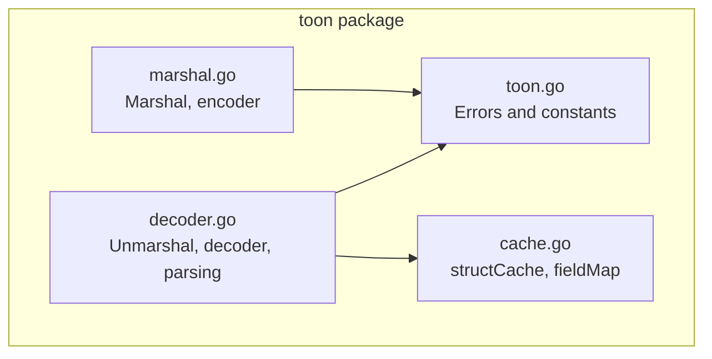
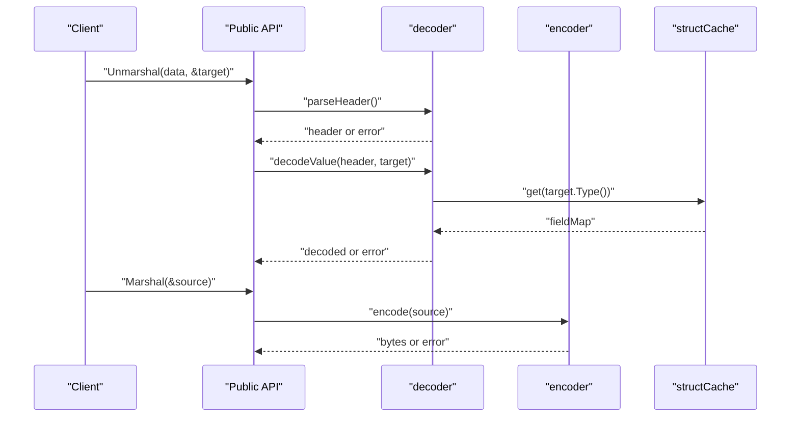
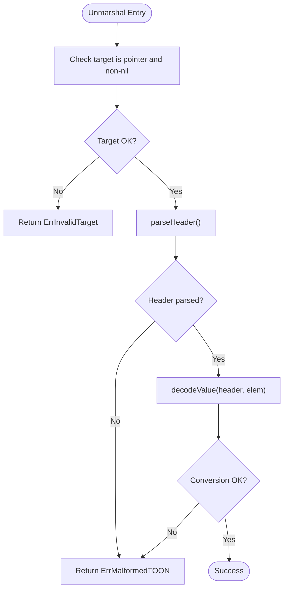
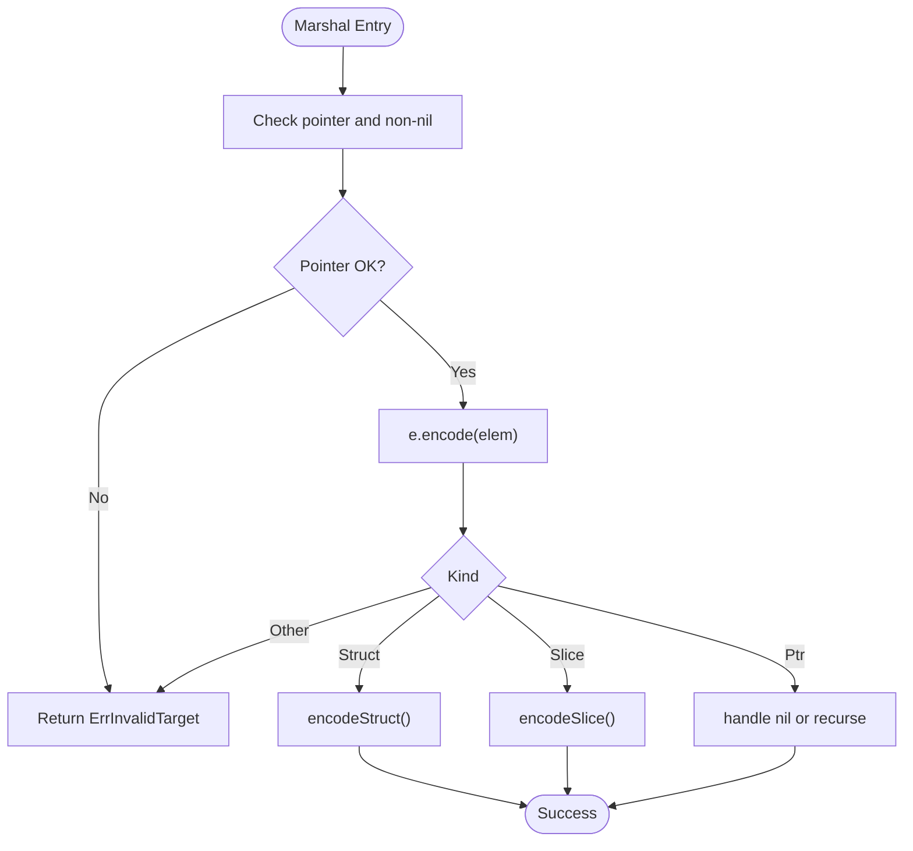
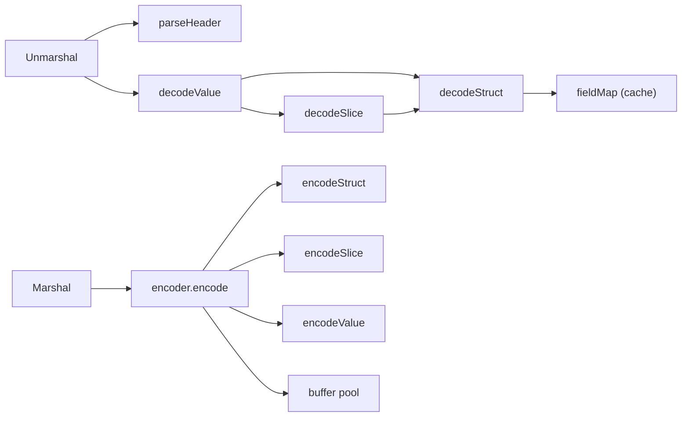
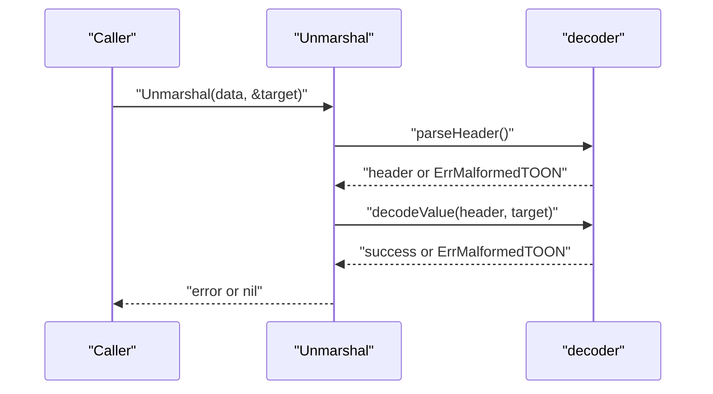
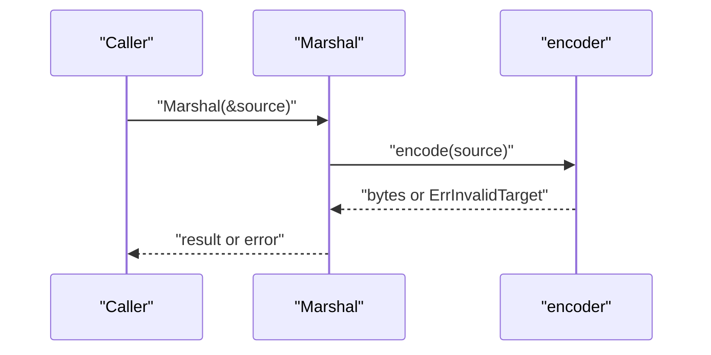

# Error Handling and Debugging

<cite>
**Referenced Files in This Document**
- [toon.go](file://toon.go)
- [decoder.go](file://decoder.go)
- [marshal.go](file://marshal.go)
- [cache.go](file://cache.go)
- [decoder_test.go](file://decoder_test.go)
- [cache_test.go](file://cache_test.go)
- [go.mod](file://go.mod)
</cite>

## Table of Contents
1. [Introduction](#introduction)
2. [Project Structure](#project-structure)
3. [Core Components](#core-components)
4. [Architecture Overview](#architecture-overview)
5. [Detailed Component Analysis](#detailed-component-analysis)
6. [Dependency Analysis](#dependency-analysis)
7. [Performance Considerations](#performance-considerations)
8. [Troubleshooting Guide](#troubleshooting-guide)
9. [Conclusion](#conclusion)
10. [Appendices](#appendices)

## Introduction
This document explains error handling and debugging strategies in the go-toon library. It covers the error types defined in the library, their meanings, and typical scenarios where they arise. It also documents recovery patterns in the parser and encoder, debugging techniques for malformed TOON data, and troubleshooting approaches for unmarshaling failures. Practical examples of error handling in production code, logging strategies for serialization errors, and diagnostic tools for performance issues are included. Finally, it addresses common pitfalls, error propagation patterns, and best practices for robust error handling in distributed systems.

## Project Structure
The go-toon library consists of a small, focused set of packages implementing TOON v3.0 serialization and deserialization with zero-allocation design principles:
- Error definitions and constants
- Decoder for unmarshaling TOON bytes into Go values
- Encoder for marshaling Go values into TOON bytes
- Field cache for efficient struct field mapping
- Tests validating error behavior and correctness

**Diagram sources**
- [toon.go](file://toon.go#L1-L19)
- [decoder.go](file://decoder.go#L1-L303)
- [marshal.go](file://marshal.go#L1-L172)
- [cache.go](file://cache.go#L1-L68)

**Section sources**
- [go.mod](file://go.mod#L1-L4)
- [toon.go](file://toon.go#L1-L19)
- [decoder.go](file://decoder.go#L1-L303)
- [marshal.go](file://marshal.go#L1-L172)
- [cache.go](file://cache.go#L1-L68)

## Core Components
- Error types
  - ErrMalformedTOON: Indicates malformed TOON syntax encountered during parsing or conversion.
  - ErrInvalidTarget: Returned when the target argument to Marshal or Unmarshal is not a pointer to a supported type (struct or slice).
- Constants
  - Delimiters and separators used by the TOON v3.0 grammar: block start/end, size brackets, header terminator, and field separator.

These errors are central to the library’s safety guarantees and are returned by the public APIs when preconditions or input formats are violated.

**Section sources**
- [toon.go](file://toon.go#L5-L18)

## Architecture Overview
The library exposes two primary APIs:
- Marshal(v interface{}) ([]byte, error): Encodes a pointer to a struct or slice into TOON bytes.
- Unmarshal(data []byte, v interface{}) error: Decodes TOON bytes into a pointer to a struct or slice.

Internally:
- The decoder scans the input byte stream without allocations, parsing headers, sizes, and fields, then converting values into Go types via reflection.
- The encoder writes TOON bytes using a pooled buffer and reflection, emitting headers and values according to the TOON v3.0 specification.
- A field cache maps struct field names to indices for fast decoding.

**Diagram sources**
- [decoder.go](file://decoder.go#L8-L22)
- [marshal.go](file://marshal.go#L17-L38)
- [cache.go](file://cache.go#L21-L43)

## Detailed Component Analysis

### Error Types and Scenarios
- ErrMalformedTOON
  - Occurrence contexts:
    - Header parsing fails due to missing terminators or invalid tokens.
    - Size parsing encounters non-digit characters or premature EOF.
    - Field parsing reaches unexpected end-of-data.
    - Type conversion fails during setField for numeric, float, or boolean values.
  - Typical symptoms:
    - Unexpected EOF during parsing.
    - Non-numeric values where numbers are expected.
    - Missing colon after header name.
- ErrInvalidTarget
  - Occurrence contexts:
    - Marshal called with a non-pointer or nil pointer.
    - Unmarshal called with a non-pointer, nil pointer, or pointer to unsupported kind (e.g., scalar).
    - Encoder/decoder switch falls through to invalid kinds.

Common scenarios:
- Passing a plain struct (not a pointer) to Marshal/Unmarshal.
- Providing malformed headers (e.g., missing colon, invalid size brackets).
- Attempting to decode into a non-struct/slice pointer.

**Section sources**
- [toon.go](file://toon.go#L5-L8)
- [decoder.go](file://decoder.go#L11-L13)
- [decoder.go](file://decoder.go#L71-L115)
- [decoder.go](file://decoder.go#L118-L139)
- [decoder.go](file://decoder.go#L142-L173)
- [decoder.go](file://decoder.go#L176-L187)
- [decoder.go](file://decoder.go#L269-L302)
- [marshal.go](file://marshal.go#L18-L22)
- [marshal.go](file://marshal.go#L50-L65)

### Parser Recovery Patterns
The decoder follows a fail-fast strategy:
- Early validation of target pointers in Unmarshal.
- Strict header parsing with explicit checks for terminators and delimiters.
- Robust scanning with bounds checks; returns ErrMalformedTOON on unexpected EOF or invalid characters.
- On type conversion errors, returns ErrMalformedTOON immediately to prevent partial state updates.

Recovery recommendations:
- Validate inputs upstream (pointer types, expected shapes).
- Normalize TOON data to ensure headers end with the required terminator.
- Prefer streaming parsers that can recover from isolated malformed segments by skipping to the next record boundary.

**Diagram sources**
- [decoder.go](file://decoder.go#L8-L22)
- [decoder.go](file://decoder.go#L71-L115)
- [decoder.go](file://decoder.go#L176-L187)
- [decoder.go](file://decoder.go#L269-L302)

**Section sources**
- [decoder.go](file://decoder.go#L8-L22)
- [decoder.go](file://decoder.go#L71-L115)
- [decoder.go](file://decoder.go#L176-L187)
- [decoder.go](file://decoder.go#L269-L302)

### Encoder Error Propagation
The encoder validates the top-level type and delegates to specialized handlers:
- Top-level validation returns ErrInvalidTarget for unsupported kinds.
- Struct encoding emits header and values; any nested conversion error is propagated.
- Slice encoding writes header with size and iterates rows; any row conversion error halts encoding.
- Nil pointers are encoded as a special sentinel.

Best practices:
- Ensure the input is a pointer to a struct or slice.
- Avoid unsupported field types; the encoder returns ErrInvalidTarget for unsupported kinds.

**Diagram sources**
- [marshal.go](file://marshal.go#L17-L38)
- [marshal.go](file://marshal.go#L50-L65)
- [marshal.go](file://marshal.go#L67-L93)
- [marshal.go](file://marshal.go#L95-L137)
- [marshal.go](file://marshal.go#L139-L171)

**Section sources**
- [marshal.go](file://marshal.go#L17-L38)
- [marshal.go](file://marshal.go#L50-L65)
- [marshal.go](file://marshal.go#L67-L93)
- [marshal.go](file://marshal.go#L95-L137)
- [marshal.go](file://marshal.go#L139-L171)

### Field Cache and Unknown Fields
The cache maps struct field names to indices, enabling fast decoding. Unknown fields in the TOON header are skipped safely, preventing decoding failures due to schema evolution.

Practical tips:
- Use exported struct fields for decoding.
- Use struct tags to align field names with TOON headers when necessary.
- Unknown fields are ignored; ensure your schema matches the data.

**Section sources**
- [cache.go](file://cache.go#L21-L43)
- [decoder.go](file://decoder.go#L190-L229)
- [cache_test.go](file://cache_test.go#L15-L42)

## Dependency Analysis
The public APIs depend on internal helpers and shared error types. The decoder depends on the cache for field mapping. The encoder uses reflection and a buffer pool.

**Diagram sources**
- [decoder.go](file://decoder.go#L8-L22)
- [decoder.go](file://decoder.go#L71-L115)
- [decoder.go](file://decoder.go#L176-L187)
- [decoder.go](file://decoder.go#L190-L267)
- [marshal.go](file://marshal.go#L17-L38)
- [marshal.go](file://marshal.go#L50-L65)
- [marshal.go](file://marshal.go#L67-L137)
- [marshal.go](file://marshal.go#L139-L171)
- [cache.go](file://cache.go#L21-L43)

**Section sources**
- [decoder.go](file://decoder.go#L8-L22)
- [decoder.go](file://decoder.go#L71-L115)
- [decoder.go](file://decoder.go#L176-L187)
- [decoder.go](file://decoder.go#L190-L267)
- [marshal.go](file://marshal.go#L17-L38)
- [marshal.go](file://marshal.go#L50-L65)
- [marshal.go](file://marshal.go#L67-L137)
- [marshal.go](file://marshal.go#L139-L171)
- [cache.go](file://cache.go#L21-L43)

## Performance Considerations
- Zero-allocation decoding and encoding:
  - Decoder uses a single struct with position tracking and minimal branching.
  - Encoder reuses a pooled buffer to avoid repeated allocations.
- Reflection overhead:
  - Field mapping is cached to minimize repeated reflection work.
- Practical tips:
  - Reuse buffers via the buffer pool when writing to io.Writer.
  - Keep structs simple and avoid deep nesting to reduce reflection costs.
  - Prefer streaming for large datasets to bound memory usage.

[No sources needed since this section provides general guidance]

## Troubleshooting Guide

### Common Pitfalls
- Passing non-pointers or nil pointers to Marshal/Unmarshal leads to ErrInvalidTarget.
- Malformed headers (missing colon, invalid size brackets) trigger ErrMalformedTOON.
- Type mismatches during conversion (e.g., non-numeric strings to integers) cause ErrMalformedTOON.
- Unknown fields in TOON headers are ignored; ensure schema alignment.

**Section sources**
- [decoder.go](file://decoder.go#L11-L13)
- [decoder.go](file://decoder.go#L71-L115)
- [decoder.go](file://decoder.go#L118-L139)
- [decoder.go](file://decoder.go#L142-L173)
- [decoder.go](file://decoder.go#L269-L302)
- [marshal.go](file://marshal.go#L18-L22)
- [marshal.go](file://marshal.go#L50-L65)

### Debugging Malformed TOON Data
- Inspect the raw bytes around the failure point.
- Verify header termination and delimiters.
- Confirm numeric conversions and boolean encodings.
- Validate field counts and order match the header.

Diagnostic techniques:
- Add logging around parseHeader and setField to capture positions and values.
- Use unit tests to reproduce edge cases (empty sizes, trailing commas, missing newlines).

**Section sources**
- [decoder.go](file://decoder.go#L71-L115)
- [decoder.go](file://decoder.go#L118-L139)
- [decoder.go](file://decoder.go#L142-L173)
- [decoder.go](file://decoder.go#L269-L302)
- [decoder_test.go](file://decoder_test.go#L27-L94)

### Unmarshaling Failure Troubleshooting
- Ensure the target is a pointer to a struct or slice.
- Confirm the TOON header matches the struct fields and types.
- Check for unknown fields and schema evolution.
- Validate that numeric, boolean, and string conversions are valid.

**Section sources**
- [decoder.go](file://decoder.go#L8-L22)
- [decoder.go](file://decoder.go#L190-L229)
- [decoder_test.go](file://decoder_test.go#L96-L143)

### Logging Strategies for Serialization Errors
- Log the operation (Marshal/Unmarshal), target type, and input length.
- Capture the error type and position (decoder position) when available.
- For production, include correlation IDs and structured fields for observability.

[No sources needed since this section provides general guidance]

### Production Error Handling Examples
- Always check the error returned by Marshal/Unmarshal and propagate it up the call stack.
- In HTTP handlers, return appropriate status codes and include sanitized error messages.
- For retries, distinguish transient vs. permanent errors; ErrMalformedTOON is typically not retryable.

[No sources needed since this section provides general guidance]

### Best Practices for Distributed Systems
- Validate inputs early and fail fast.
- Use idempotent keys and stable schemas to minimize unmarshaling failures.
- Instrument serialization paths with metrics and traces.
- Avoid embedding sensitive data in error messages.

[No sources needed since this section provides general guidance]

## Conclusion
The go-toon library provides clear, explicit error semantics with ErrMalformedTOON and ErrInvalidTarget guiding safe handling of malformed inputs and invalid targets. The decoder and encoder are designed for zero-allocation performance while maintaining strict validation. By following the recommended patterns—validating inputs, logging diagnostics, and handling errors explicitly—you can build robust, observable systems that leverage TOON efficiently and reliably.

[No sources needed since this section summarizes without analyzing specific files]

## Appendices

### API Error Reference
- ErrMalformedTOON: Returned when TOON syntax is invalid or conversion fails.
- ErrInvalidTarget: Returned when the target is not a pointer to a supported type.

**Section sources**
- [toon.go](file://toon.go#L5-L8)

### Example Workflows

#### Unmarshal Workflow

**Diagram sources**
- [decoder.go](file://decoder.go#L8-L22)
- [decoder.go](file://decoder.go#L71-L115)
- [decoder.go](file://decoder.go#L176-L187)

#### Marshal Workflow

**Diagram sources**
- [marshal.go](file://marshal.go#L17-L38)
- [marshal.go](file://marshal.go#L50-L65)