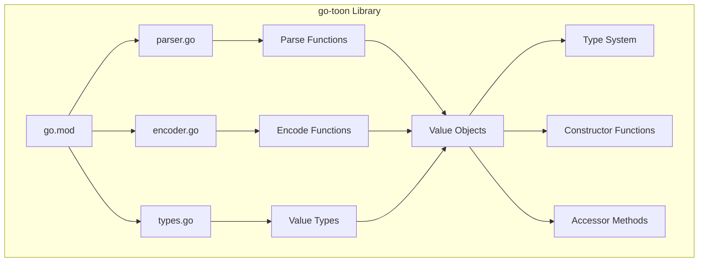
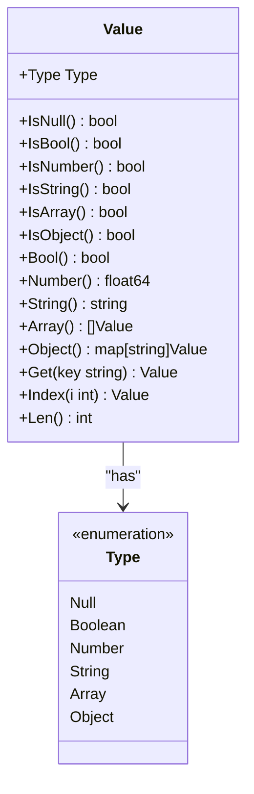
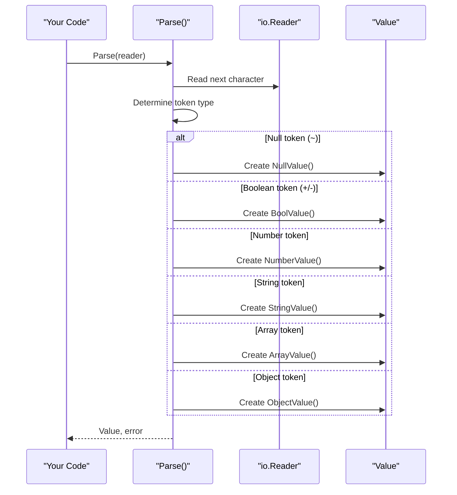
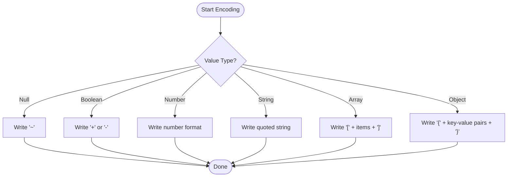
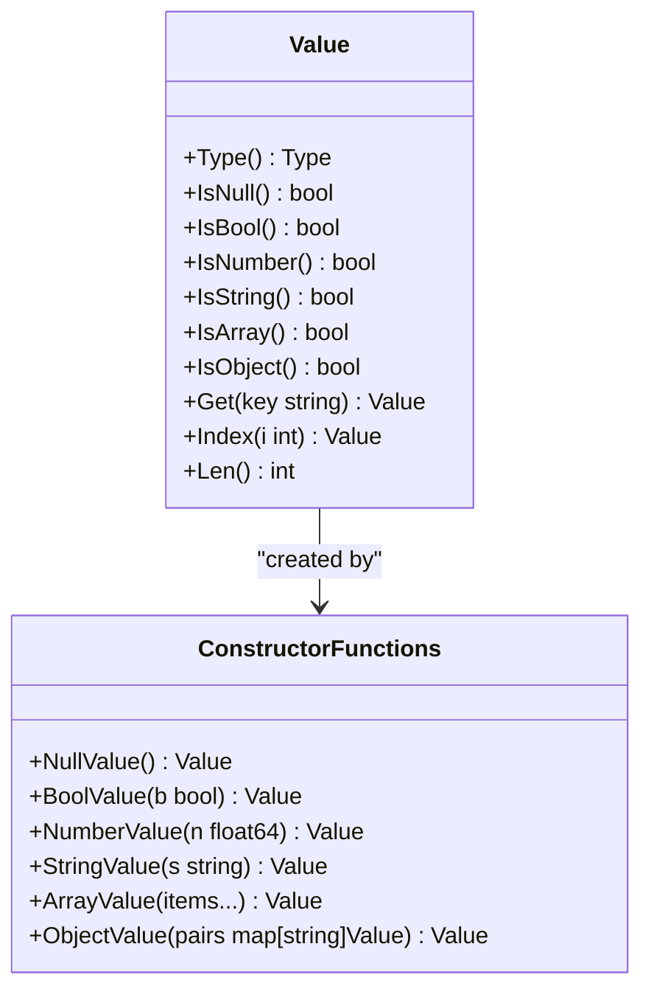
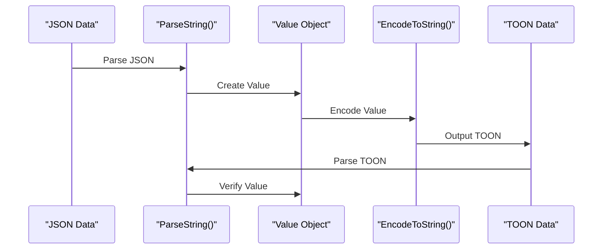
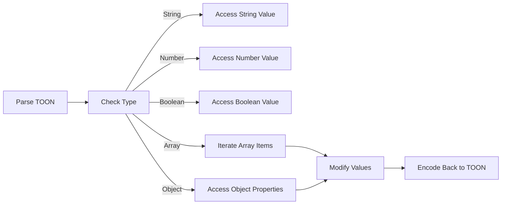

# Getting Started

<cite>
**Referenced Files in This Document**
- [go.mod](file://go.mod)
- [parser.go](file://parser.go)
- [encoder.go](file://encoder.go)
- [types.go](file://types.go)
- [parser_test.go](file://parser_test.go)
- [encoder_test.go](file://encoder_test.go)
- [types_test.go](file://types_test.go)
</cite>

## Table of Contents
1. [Introduction](#introduction)
2. [Project Structure](#project-structure)
3. [Installation](#installation)
4. [Core Concepts](#core-concepts)
5. [Basic Serialization and Deserialization](#basic-serialization-and-deserialization)
6. [Working with Value Objects](#working-with-value-objects)
7. [Converting Between TOON and JSON](#converting-between-toon-and-json)
8. [Common Use Cases](#common-use-cases)
9. [Error Handling Patterns](#error-handling-patterns)
10. [Next Steps](#next-steps)

## Introduction
Welcome to the go-toon library! This guide will help you quickly get started with TOON (Token-Oriented Object Notation), a compact binary format designed to save up to 40% LLM tokens compared to JSON. The library provides high-performance parsing and encoding capabilities for Go applications.

TOON is a lightweight, human-readable format that uses a minimal set of tokens to represent structured data. It's particularly useful for AI/ML applications where token efficiency matters, but it's also suitable for general-purpose data interchange.

## Project Structure
The go-toon library consists of four main components:



**Diagram sources**
- [go.mod](file://go.mod#L1-L4)
- [parser.go](file://parser.go#L1-L411)
- [encoder.go](file://encoder.go#L1-L192)
- [types.go](file://types.go#L1-L209)

**Section sources**
- [go.mod](file://go.mod#L1-L4)
- [parser.go](file://parser.go#L1-L411)
- [encoder.go](file://encoder.go#L1-L192)
- [types.go](file://types.go#L1-L209)

## Installation
To use the go-toon library in your Go project, add it as a dependency using Go modules:

```bash
go get github.com/OTumanov/go-toon
```

The library requires Go 1.25.0 or later. You can check your Go version with:
```bash
go version
```

**Section sources**
- [go.mod](file://go.mod#L1-L4)

## Core Concepts
Before diving into usage, let's understand the fundamental concepts of the TOON format and the go-toon library.

### TOON Format Basics
TOON uses a minimal token set to represent data types:
- `~` represents null values
- `+` represents true boolean values  
- `-` represents false boolean values
- Numbers are written as-is (integers and floats)
- Strings are enclosed in double quotes with standard escape sequences
- Arrays use square brackets with space-separated values
- Objects use curly braces with key-value pairs separated by spaces

### Value System
The library uses a unified `Value` type that can represent any TOON data type. Each `Value` has:
- A type discriminator (`Null`, `Boolean`, `Number`, `String`, `Array`, `Object`)
- Type-specific storage for the actual data
- Helper methods for safe type conversion



**Diagram sources**
- [types.go](file://types.go#L47-L209)

**Section sources**
- [types.go](file://types.go#L1-L209)

## Basic Serialization and Deserialization
This section covers the fundamental operations for converting between TOON format and Go data structures.

### Parsing TOON Data
The primary parsing function reads TOON data from various sources and returns a `Value` object:



**Diagram sources**
- [parser.go](file://parser.go#L18-L38)
- [parser.go](file://parser.go#L40-L70)

#### Basic Parsing Examples
Here are common ways to parse TOON data:

1. **From a string**: Use `ParseString()` for simple string inputs
2. **From an io.Reader**: Use `Parse()` for streams, files, or network data
3. **From bytes**: Wrap your byte slice with `bytes.NewReader()`

**Section sources**
- [parser.go](file://parser.go#L18-L38)
- [parser.go](file://parser.go#L40-L70)

### Encoding Values Back to TOON
The encoding process converts `Value` objects back to TOON format:



**Diagram sources**
- [encoder.go](file://encoder.go#L31-L51)
- [encoder.go](file://encoder.go#L96-L113)
- [encoder.go](file://encoder.go#L115-L163)

#### Basic Encoding Examples
1. **To a writer**: Use `Encode(writer, value)` for streaming output
2. **To a string**: Use `EncodeToString(value)` for string output
3. **To bytes**: Use `EncodeToString()` then convert to bytes if needed

**Section sources**
- [encoder.go](file://encoder.go#L15-L29)
- [encoder.go](file://encoder.go#L31-L51)

## Working with Value Objects
Once you have parsed TOON data into `Value` objects, you can manipulate them using the provided methods.

### Type Checking and Access
Always check the type before accessing values to avoid panics:



**Diagram sources**
- [types.go](file://types.go#L61-L176)
- [types.go](file://types.go#L178-L209)

### Safe Value Access
The `Value` type provides safe accessor methods that return appropriate defaults for non-matching types:

- **Get(key)**: Returns a `Value` for object keys, or null if key doesn't exist
- **Index(i)**: Returns a `Value` for array indices, or null if out of bounds
- **Len()**: Returns the length for arrays/objects, or 0 for primitives

**Section sources**
- [types.go](file://types.go#L141-L176)

## Converting Between TOON and JSON
The go-toon library makes it easy to work with both TOON and JSON formats, allowing you to leverage existing JSON tooling while benefiting from TOON's efficiency.

### JSON to TOON Conversion
1. Parse JSON data using your preferred JSON library
2. Convert to `Value` objects using the constructor functions
3. Encode to TOON format using `EncodeToString()`

### TOON to JSON Conversion  
1. Parse TOON data using `ParseString()`
2. Convert to JSON using your preferred JSON library
3. Serialize to JSON format

### Round-Trip Testing
The library includes comprehensive round-trip testing that demonstrates the bidirectional conversion process:



**Diagram sources**
- [encoder_test.go](file://encoder_test.go#L322-L375)

**Section sources**
- [encoder_test.go](file://encoder_test.go#L322-L375)

## Common Use Cases
This section demonstrates practical scenarios you'll encounter when working with the go-toon library.

### Basic Data Manipulation
Working with simple data types:



**Diagram sources**
- [types.go](file://types.go#L141-L176)
- [parser.go](file://parser.go#L255-L283)

### Nested Data Structures
Handling complex nested objects and arrays:

1. **Parsing**: Use `ParseString()` to parse nested structures
2. **Accessing**: Use `Get()` for object properties and `Index()` for array elements
3. **Modification**: Create new `Value` objects and re-encode
4. **Validation**: Always check types before accessing values

### Streaming Data Processing
For large datasets or real-time processing:

1. **Streaming Parse**: Use `Parse(io.Reader)` with buffered readers
2. **Streaming Encode**: Use `Encode(io.Writer)` for continuous output
3. **Memory Efficiency**: Process data in chunks rather than loading entire datasets

**Section sources**
- [parser.go](file://parser.go#L18-L38)
- [encoder.go](file://encoder.go#L15-L29)

## Error Handling Patterns
The go-toon library follows Go's standard error handling patterns. Here are common approaches:

### Expected Errors
- **Invalid syntax**: Parsing errors return descriptive messages
- **Unexpected EOF**: Incomplete data triggers errors
- **Type mismatches**: Accessing wrong type panics (documented behavior)

### Robust Error Handling
```go
// Example pattern for robust error handling
func processTOON(data string) (Value, error) {
    // Parse with error checking
    value, err := ParseString(data)
    if err != nil {
        return Value{}, fmt.Errorf("parsing failed: %w", err)
    }
    
    // Validate expected structure
    if !value.IsObject() {
        return Value{}, fmt.Errorf("expected object, got %s", value.Type())
    }
    
    // Safely access properties
    name := value.Get("name")
    if name.IsNull() {
        return Value{}, fmt.Errorf("missing required field: name")
    }
    
    return value, nil
}
```

### Panic Safety
The `Value` type uses panics for type conversion errors rather than returning errors. This design choice emphasizes explicit type checking:

- Always check types with `IsX()` methods before conversion
- Use `Get()` and `Index()` which return null values for missing keys/indices
- Wrap conversions in defensive checks

**Section sources**
- [parser.go](file://parser.go#L19-L33)
- [types.go](file://types.go#L96-L139)

## Next Steps
You've learned the fundamentals of the go-toon library. Here are suggestions for continued learning:

### Advanced Topics
- **Custom Writers**: Implement custom `io.Writer` for specialized output formats
- **Performance Optimization**: Benchmark different parsing and encoding strategies
- **Integration Patterns**: Explore integration with popular JSON libraries
- **Memory Management**: Understand memory usage patterns for large datasets

### Best Practices
- Always validate input data before parsing
- Use type checking methods consistently
- Leverage the round-trip testing patterns shown in the examples
- Consider streaming for large datasets
- Handle errors gracefully in production code

### Further Exploration
- Review the comprehensive test suite for additional usage patterns
- Experiment with different data structures and edge cases
- Compare performance characteristics with JSON for your specific use case
- Explore integration with existing Go ecosystem tools

The go-toon library provides a solid foundation for efficient data interchange in Go applications. Start with the basics covered here, then gradually explore more advanced features as your needs grow.