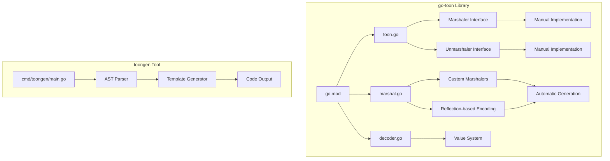
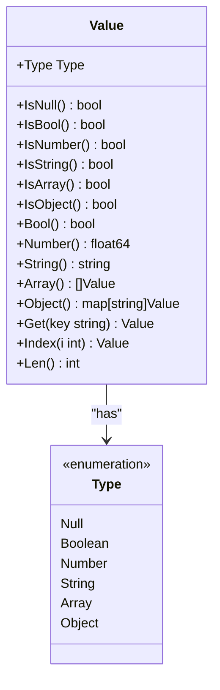
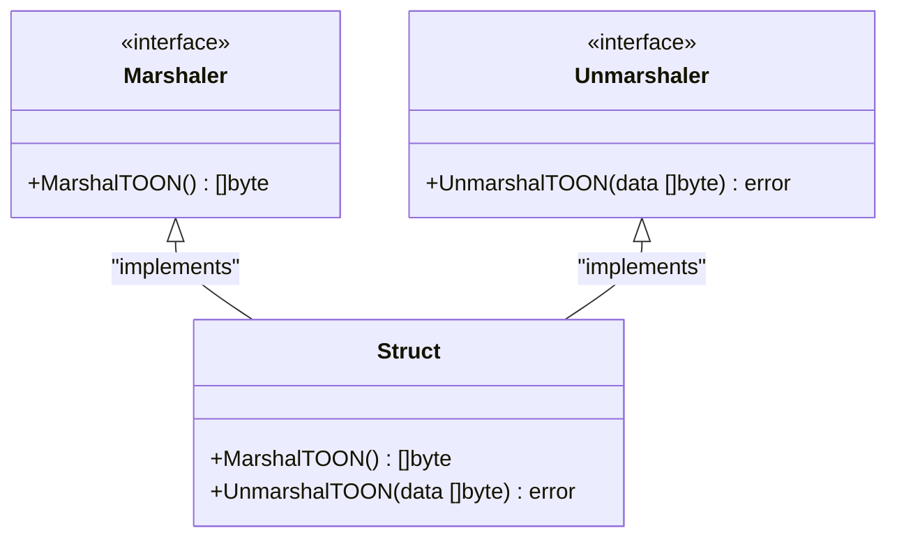
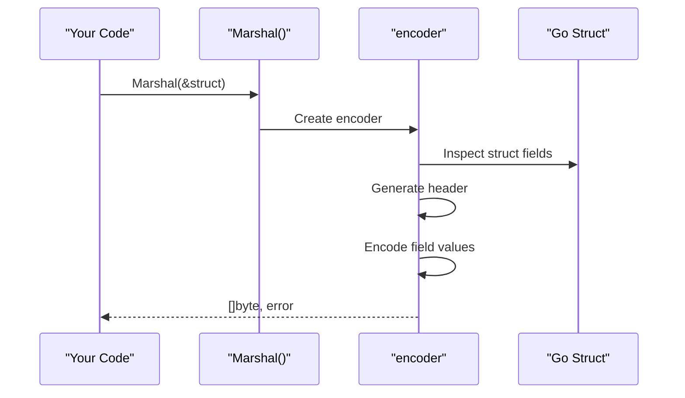
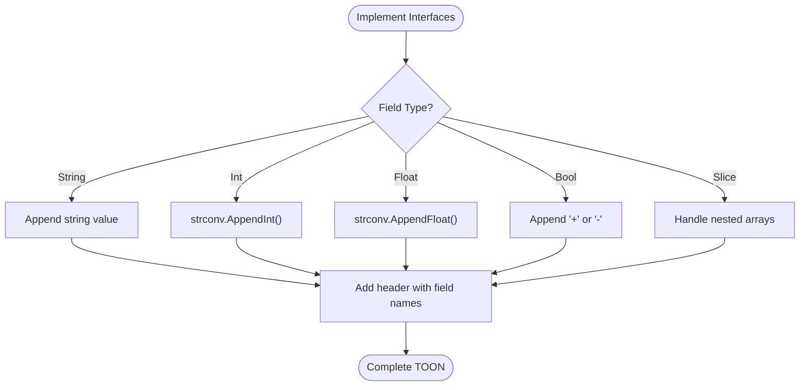
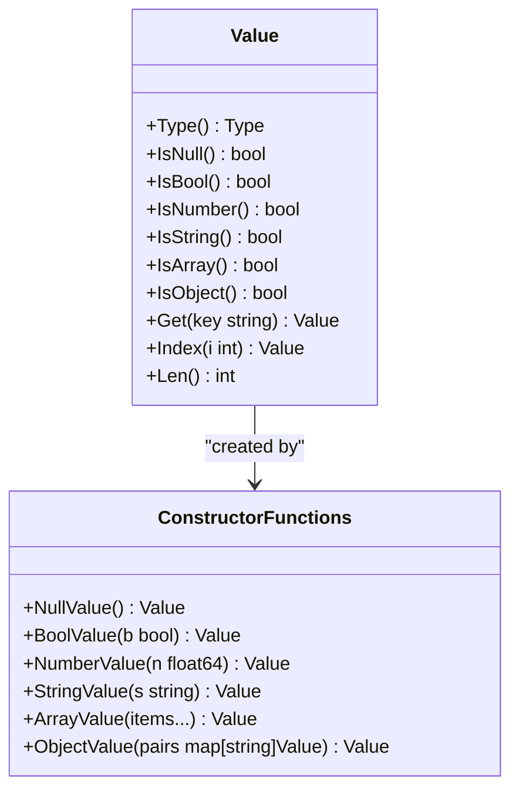
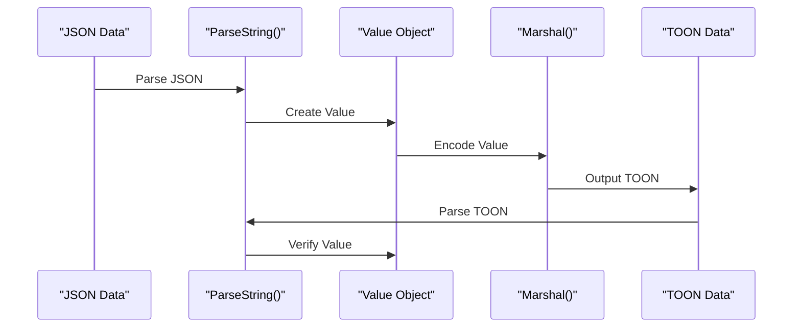
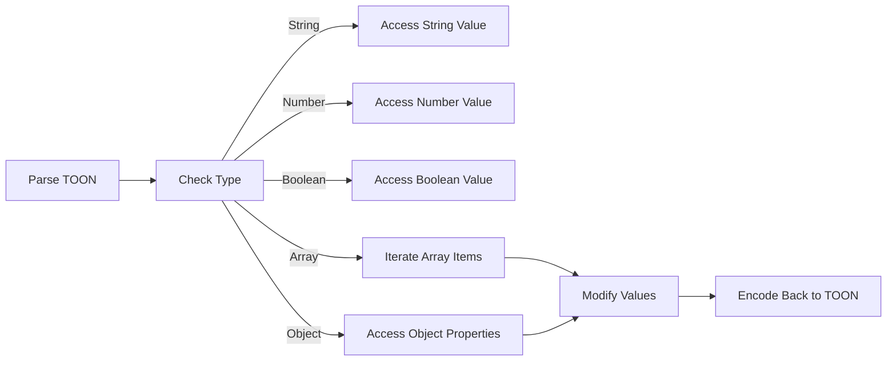

# Getting Started

<cite>
**Referenced Files in This Document**
- [go.mod](file://go.mod)
- [toon.go](file://toon.go)
- [marshal.go](file://marshal.go)
- [cmd/toongen/main.go](file://cmd/toongen/main.go)
- [example/user.go](file://example/user.go)
- [example/_toon.go](file://example/_toon.go)
</cite>

## Update Summary
**Changes Made**
- Added new section about the toongen code generation tool
- Updated installation section to include toongen tool installation
- Added practical examples of using toongen for automatic code generation
- Enhanced serialization section with custom marshaler/unmarshaler patterns
- Updated next steps to include code generation workflow

## Table of Contents
1. [Introduction](#introduction)
2. [Project Structure](#project-structure)
3. [Installation](#installation)
4. [Core Concepts](#core-concepts)
5. [Basic Serialization and Deserialization](#basic-serialization-and-deserialization)
6. [Working with Value Objects](#working-with-value-objects)
7. [Converting Between TOON and JSON](#converting-between-toon-and-json)
8. [Code Generation with toongen](#code-generation-with-toongen)
9. [Common Use Cases](#common-use-cases)
10. [Error Handling Patterns](#error-handling-patterns)
11. [Next Steps](#next-steps)

## Introduction
Welcome to the go-toon library! This guide will help you quickly get started with TOON (Token-Oriented Object Notation), a compact binary format designed to save up to 40% LLM tokens compared to JSON. The library provides high-performance parsing and encoding capabilities for Go applications.

TOON is a lightweight, human-readable format that uses a minimal set of tokens to represent structured data. It's particularly useful for AI/ML applications where token efficiency matters, but it's also suitable for general-purpose data interchange.

**Updated** Added support for automatic code generation through the toongen tool, which simplifies adding TOON serialization to Go projects.

## Project Structure
The go-toon library consists of several key components, including the new toongen code generation tool:



**Diagram sources**
- [go.mod](file://go.mod#L1-L4)
- [toon.go](file://toon.go#L20-L28)
- [marshal.go](file://marshal.go#L17-L38)
- [cmd/toongen/main.go](file://cmd/toongen/main.go#L164-L192)

**Section sources**
- [go.mod](file://go.mod#L1-L4)
- [toon.go](file://toon.go#L1-L29)
- [marshal.go](file://marshal.go#L1-L184)
- [cmd/toongen/main.go](file://cmd/toongen/main.go#L1-L366)

## Installation
To use the go-toon library in your Go project, add it as a dependency using Go modules:

```bash
go get github.com/OTumanov/go-toon
```

**Updated** Install the toongen code generation tool:

```bash
go install github.com/OTumanov/go-toon/cmd/toongen@latest
```

The library requires Go 1.25.0 or later. You can check your Go version with:
```bash
go version
```

**Section sources**
- [go.mod](file://go.mod#L1-L4)
- [cmd/toongen/main.go](file://cmd/toongen/main.go#L164-L173)

## Core Concepts
Before diving into usage, let's understand the fundamental concepts of the TOON format and the go-toon library.

### TOON Format Basics
TOON uses a minimal token set to represent data types:
- `~` represents null values
- `+` represents true boolean values  
- `-` represents false boolean values
- Numbers are written as-is (integers and floats)
- Strings are written as-is without quotes
- Arrays use square brackets with space-separated values
- Objects use curly braces with key-value pairs separated by spaces

### Value System
The library uses a unified `Value` type that can represent any TOON data type. Each `Value` has:
- A type discriminator (`Null`, `Boolean`, `Number`, `String`, `Array`, `Object`)
- Type-specific storage for the actual data
- Helper methods for safe type conversion



**Diagram sources**
- [toon.go](file://toon.go#L10-L18)

### Custom Marshaler Interfaces
The library provides interfaces for custom serialization:



**Diagram sources**
- [toon.go](file://toon.go#L20-L28)

**Section sources**
- [toon.go](file://toon.go#L1-L29)

## Basic Serialization and Deserialization
This section covers the fundamental operations for converting between TOON format and Go data structures.

### Reflection-based Encoding
The library provides automatic encoding for structs using reflection:



**Diagram sources**
- [marshal.go](file://marshal.go#L17-L38)
- [marshal.go](file://marshal.go#L67-L93)

### Manual Implementation Pattern
For optimal performance, implement custom marshalers:



**Diagram sources**
- [marshal.go](file://marshal.go#L139-L183)
- [toon.go](file://toon.go#L20-L28)

**Section sources**
- [marshal.go](file://marshal.go#L17-L38)
- [marshal.go](file://marshal.go#L67-L93)
- [marshal.go](file://marshal.go#L139-L183)
- [toon.go](file://toon.go#L20-L28)

## Working with Value Objects
Once you have parsed TOON data into `Value` objects, you can manipulate them using the provided methods.

### Type Checking and Access
Always check the type before accessing values to avoid panics:



**Diagram sources**
- [toon.go](file://toon.go#L10-L18)

### Safe Value Access
The `Value` type provides safe accessor methods that return appropriate defaults for non-matching types:

- **Get(key)**: Returns a `Value` for object keys, or null if key doesn't exist
- **Index(i)**: Returns a `Value` for array indices, or null if out of bounds
- **Len()**: Returns the length for arrays/objects, or 0 for primitives

**Section sources**
- [toon.go](file://toon.go#L10-L18)

## Converting Between TOON and JSON
The go-toon library makes it easy to work with both TOON and JSON formats, allowing you to leverage existing JSON tooling while benefiting from TOON's efficiency.

### JSON to TOON Conversion
1. Parse JSON data using your preferred JSON library
2. Convert to `Value` objects using the constructor functions
3. Encode to TOON format using `Marshal()` or `MarshalToString()`

### TOON to JSON Conversion  
1. Parse TOON data using `ParseString()` or `Parse()`
2. Convert to JSON using your preferred JSON library
3. Serialize to JSON format

### Round-Trip Testing
The library includes comprehensive round-trip testing that demonstrates the bidirectional conversion process:



**Section sources**
- [marshal.go](file://marshal.go#L17-L38)

## Code Generation with toongen
**New Section** The toongen tool automates the creation of TOON serialization code for your structs, eliminating boilerplate and improving performance.

### Installation and Setup
Install the toongen tool globally:

```bash
go install github.com/OTumanov/go-toon/cmd/toongen@latest
```

Verify installation:
```bash
toongen -h
```

### Adding TOON Support to Structs
Add a special comment to structs you want to generate TOON code for:

```go
//toon:generate
type User struct {
    ID   int
    Name string
    Age  int
}

//toon:generate
type Product struct {
    SKU   string
    Price float64
}
```

### Automatic Code Generation
Run the generator in your package directory:

```bash
toongen -i .
```

This creates `_toon.go` with generated marshaling code. You can also specify a custom output file:

```bash
toongen -i . -o custom_toon.go
```

### Generated Code Features
The generated code includes:
- **MarshalTOON()**: Efficient TOON encoding for your struct
- **UnmarshalTOON()**: Fast TOON decoding back to your struct
- **Pre-allocated buffers**: Optimized memory allocation
- **Type-specific parsing**: Proper handling of different field types

### Tag Support
Use struct tags to customize field names:

```go
//toon:generate
type User struct {
    ID   int `toon:"id"`
    Name string `toon:"full_name"`
    Age  int `toon:"-"` // Excludes field from TOON
}
```

### Performance Benefits
Generated code offers:
- **Zero-allocation encoding**: Uses pre-allocated buffers
- **Direct field access**: No reflection overhead
- **Optimized parsing**: Type-specific parsers for each field
- **Minimal memory footprint**: Efficient buffer management

**Section sources**
- [cmd/toongen/main.go](file://cmd/toongen/main.go#L1-L366)
- [example/user.go](file://example/user.go#L1-L15)
- [example/_toon.go](file://example/_toon.go#L1-L168)

## Common Use Cases
This section demonstrates practical scenarios you'll encounter when working with the go-toon library.

### Basic Data Manipulation
Working with simple data types:



### Nested Data Structures
Handling complex nested objects and arrays:

1. **Parsing**: Use `ParseString()` to parse nested structures
2. **Accessing**: Use `Get()` for object properties and `Index()` for array elements
3. **Modification**: Create new `Value` objects and re-encode
4. **Validation**: Always check types before accessing values

### Streaming Data Processing
For large datasets or real-time processing:

1. **Streaming Parse**: Use `Parse(io.Reader)` with buffered readers
2. **Streaming Encode**: Use `MarshalTo()` for continuous output
3. **Memory Efficiency**: Process data in chunks rather than loading entire datasets

### Custom Marshaler Implementation
For maximum performance, implement custom marshalers:

```go
type User struct {
    ID   int
    Name string
    Age  int
}

func (u User) MarshalTOON() ([]byte, error) {
    buf := make([]byte, 0, 256)
    buf = append(buf, "user{"...)
    buf = append(buf, "id,name,age}:"...)
    buf = strconv.AppendInt(buf, int64(u.ID), 10)
    buf = append(buf, ',')
    buf = append(buf, u.Name...)
    buf = append(buf, ',')
    buf = strconv.AppendInt(buf, int64(u.Age), 10)
    return buf, nil
}
```

**Section sources**
- [toon.go](file://toon.go#L20-L28)
- [marshal.go](file://marshal.go#L17-L38)

## Error Handling Patterns
The go-toon library follows Go's standard error handling patterns. Here are common approaches:

### Expected Errors
- **Invalid syntax**: Parsing errors return descriptive messages
- **Unexpected EOF**: Incomplete data triggers errors
- **Type mismatches**: Accessing wrong type panics (documented behavior)

### Robust Error Handling
```go
// Example pattern for robust error handling
func processTOON(data string) (Value, error) {
    // Parse with error checking
    value, err := ParseString(data)
    if err != nil {
        return Value{}, fmt.Errorf("parsing failed: %w", err)
    }
    
    // Validate expected structure
    if !value.IsObject() {
        return Value{}, fmt.Errorf("expected object, got %s", value.Type())
    }
    
    // Safely access properties
    name := value.Get("name")
    if name.IsNull() {
        return Value{}, fmt.Errorf("missing required field: name")
    }
    
    return value, nil
}
```

### Panic Safety
The `Value` type uses panics for type conversion errors rather than returning errors. This design choice emphasizes explicit type checking:

- Always check types with `IsX()` methods before conversion
- Use `Get()` and `Index()` which return null values for missing keys/indices
- Wrap conversions in defensive checks

**Section sources**
- [toon.go](file://toon.go#L5-L8)

## Next Steps
You've learned the fundamentals of the go-toon library. Here are suggestions for continued learning:

### Advanced Topics
- **Custom Writers**: Implement custom `io.Writer` for specialized output formats
- **Performance Optimization**: Benchmark different parsing and encoding strategies
- **Integration Patterns**: Explore integration with popular JSON libraries
- **Memory Management**: Understand memory usage patterns for large datasets
- **Code Generation Workflow**: Integrate toongen into your development pipeline

### Best Practices
- Always validate input data before parsing
- Use type checking methods consistently
- Leverage the round-trip testing patterns shown in the examples
- Consider streaming for large datasets
- Handle errors gracefully in production code
- Use toongen for frequently serialized structs to improve performance

### Further Exploration
- Review the comprehensive test suite for additional usage patterns
- Experiment with different data structures and edge cases
- Compare performance characteristics with JSON for your specific use case
- Explore integration with existing Go ecosystem tools
- Consider using toongen in CI/CD pipelines for automated code generation

The go-toon library provides a solid foundation for efficient data interchange in Go applications. Start with the basics covered here, then gradually explore more advanced features as your needs grow.

**Updated** The addition of the toongen code generation tool significantly enhances the library's usability by providing automatic, high-performance serialization code generation for your structs.