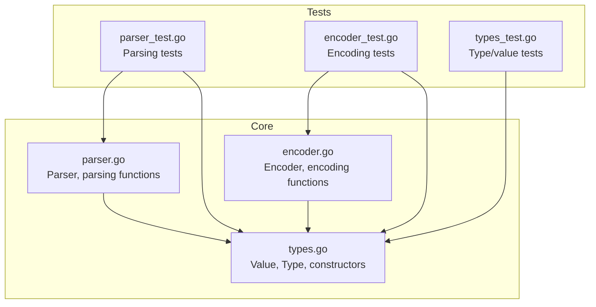
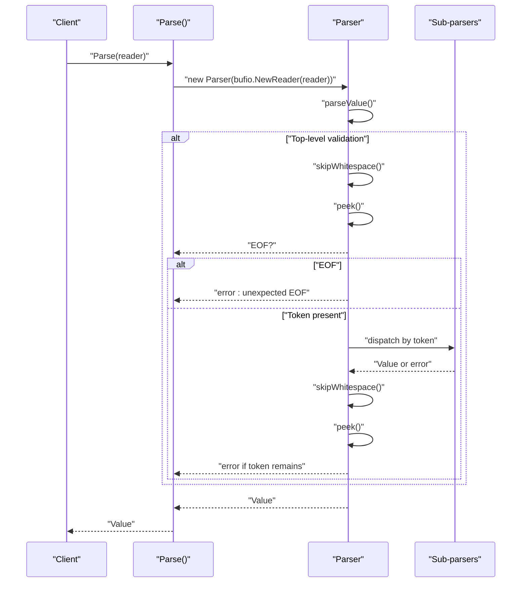
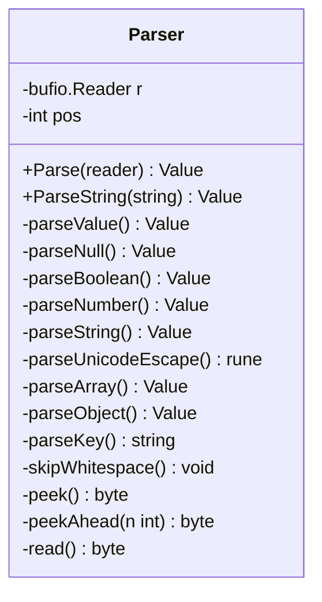
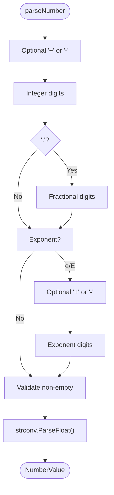
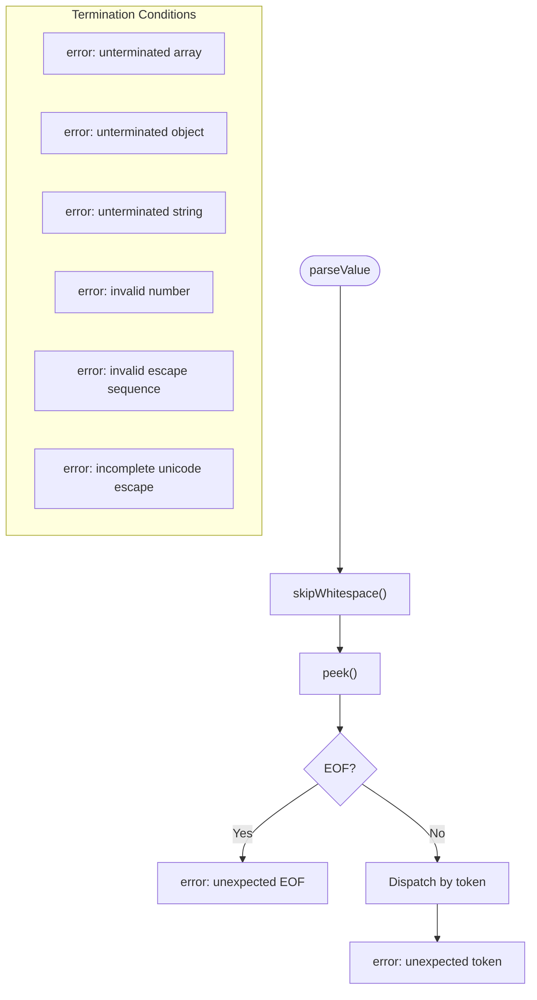
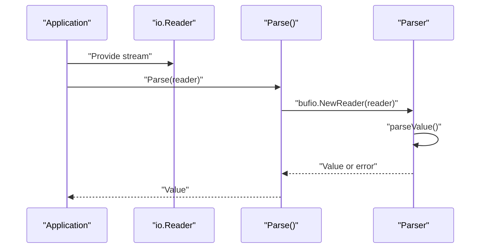
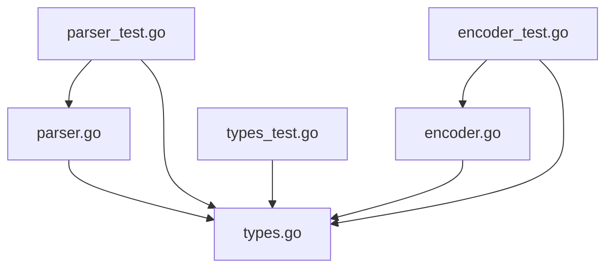

# Parser Implementation

<cite>
**Referenced Files in This Document**
- [parser.go](file://parser.go)
- [types.go](file://types.go)
- [encoder.go](file://encoder.go)
- [parser_test.go](file://parser_test.go)
- [encoder_test.go](file://encoder_test.go)
- [types_test.go](file://types_test.go)
- [go.mod](file://go.mod)
</cite>

## Table of Contents
1. [Introduction](#introduction)
2. [Project Structure](#project-structure)
3. [Core Components](#core-components)
4. [Architecture Overview](#architecture-overview)
5. [Detailed Component Analysis](#detailed-component-analysis)
6. [Dependency Analysis](#dependency-analysis)
7. [Performance Considerations](#performance-considerations)
8. [Troubleshooting Guide](#troubleshooting-guide)
9. [Conclusion](#conclusion)
10. [Appendices](#appendices)

## Introduction
This document provides comprehensive documentation for the TOON parser implementation, focusing on its streaming parsing architecture and recursive descent algorithm. The parser is designed to handle TOON (Token-Oriented Object Notation), a compact serialization format that reduces token usage compared to JSON. It emphasizes efficient I/O operations using bufio.Reader, lookahead mechanisms for robust error recovery, and support for scientific notation and Unicode escapes. The implementation follows a stateful design pattern, manages parsing state carefully, and provides clear error messages to aid debugging and recovery.

## Project Structure
The project consists of four primary packages and supporting tests:
- parser.go: Implements the streaming parser with recursive descent and lookahead mechanisms.
- types.go: Defines the Value type and associated constructors for representing parsed data.
- encoder.go: Provides encoding functionality for converting Value instances back to TOON strings.
- Tests: Comprehensive test suites validating parsing, encoding, and round-trip behavior.



**Diagram sources**
- [parser.go](file://parser.go#L1-L411)
- [types.go](file://types.go#L1-L209)
- [encoder.go](file://encoder.go#L1-L192)
- [parser_test.go](file://parser_test.go#L1-L414)
- [encoder_test.go](file://encoder_test.go#L1-L376)
- [types_test.go](file://types_test.go#L1-L197)

**Section sources**
- [parser.go](file://parser.go#L1-L411)
- [types.go](file://types.go#L1-L209)
- [encoder.go](file://encoder.go#L1-L192)
- [go.mod](file://go.mod#L1-L4)

## Core Components
- Parser: A stateful structure wrapping a bufio.Reader and maintaining position tracking. It exposes methods for reading, peeking, and skipping whitespace, enabling lookahead-driven parsing decisions.
- Value: A discriminated union-like structure representing parsed data with typed accessors and constructors for each supported type.
- Encoder: Handles conversion of Value instances back to TOON format, including number formatting, string escaping, and deterministic object key ordering.

Key capabilities:
- Streaming I/O: Uses bufio.Reader for buffered reads and Peek operations to implement lookahead without consuming unnecessary bytes.
- Recursive descent: Each grammar production is implemented as a dedicated parsing function, with clear separation of concerns.
- Scientific notation: Numbers support integer, fractional, and exponential forms.
- Unicode escapes: Strings support standard escape sequences and Unicode code point escapes.
- Error handling: Descriptive error messages guide recovery and debugging.

**Section sources**
- [parser.go](file://parser.go#L12-L16)
- [parser.go](file://parser.go#L18-L38)
- [parser.go](file://parser.go#L40-L70)
- [parser.go](file://parser.go#L98-L170)
- [parser.go](file://parser.go#L172-L228)
- [parser.go](file://parser.go#L230-L253)
- [parser.go](file://parser.go#L255-L283)
- [parser.go](file://parser.go#L285-L323)
- [parser.go](file://parser.go#L325-L364)
- [parser.go](file://parser.go#L366-L402)
- [parser.go](file://parser.go#L404-L410)
- [types.go](file://types.go#L47-L59)
- [types.go](file://types.go#L178-L209)
- [encoder.go](file://encoder.go#L10-L13)
- [encoder.go](file://encoder.go#L15-L29)
- [encoder.go](file://encoder.go#L31-L51)
- [encoder.go](file://encoder.go#L53-L59)
- [encoder.go](file://encoder.go#L61-L94)
- [encoder.go](file://encoder.go#L96-L113)
- [encoder.go](file://encoder.go#L115-L163)
- [encoder.go](file://encoder.go#L165-L168)
- [encoder.go](file://encoder.go#L170-L191)

## Architecture Overview
The parser employs a recursive descent approach with a stateful tokenizer built on bufio.Reader. Parsing functions delegate to sub-parsers for nested structures, and lookahead is used to disambiguate tokens such as numbers versus booleans.



**Diagram sources**
- [parser.go](file://parser.go#L18-L33)
- [parser.go](file://parser.go#L40-L70)
- [parser.go](file://parser.go#L366-L402)

## Detailed Component Analysis

### Parser State and I/O Management
The Parser maintains:
- A bufio.Reader for buffered reading from an io.Reader.
- A position counter to track stream offset.
- Helper methods for peeking, reading, and skipping whitespace.

Stateful design benefits:
- Efficient I/O: Buffered reads minimize syscalls.
- Lookahead: Peek operations enable predictive parsing decisions.
- Position tracking: Helps in diagnostics and error reporting.



**Diagram sources**
- [parser.go](file://parser.go#L12-L16)
- [parser.go](file://parser.go#L18-L38)
- [parser.go](file://parser.go#L40-L70)
- [parser.go](file://parser.go#L74-L96)
- [parser.go](file://parser.go#L98-L170)
- [parser.go](file://parser.go#L172-L228)
- [parser.go](file://parser.go#L230-L253)
- [parser.go](file://parser.go#L255-L283)
- [parser.go](file://parser.go#L285-L323)
- [parser.go](file://parser.go#L325-L364)
- [parser.go](file://parser.go#L366-L402)

**Section sources**
- [parser.go](file://parser.go#L12-L16)
- [parser.go](file://parser.go#L366-L402)

### Recursive Descent Parsing Functions
Each grammar production is handled by a dedicated function:
- parseValue: Top-level dispatcher based on the next token.
- parseNull, parseBoolean: Atomic literals.
- parseNumber: Supports optional sign, integer/fractional parts, and exponent with optional sign.
- parseString: Supports standard escapes and Unicode code point escapes.
- parseArray: Parses comma-free lists with whitespace separation.
- parseObject: Parses key-value pairs with support for quoted or identifier keys.
- parseKey: Parses either quoted strings or identifier-like tokens.

```mermaid
flowchart TD
Start(["parseValue"]) --> WS["skipWhitespace()"]
WS --> Peek["peek()"]
Peek --> Decision{"Next char"}
Decision --> |"~"| Null["parseNull()"]
Decision --> |"+/-"| SignCheck["peekAhead(1)"]
SignCheck --> |Digit/\.| Num["parseNumber()"]
Decision --> |"\""| Str["parseString()"]
Decision --> |"["| Arr["parseArray()"]
Decision --> |"{"| Obj["parseObject()"]
Decision --> |Digit/\.| Num
Decision --> |Other| Err["error: unexpected token"]
```

**Diagram sources**
- [parser.go](file://parser.go#L40-L70)
- [parser.go](file://parser.go#L74-L96)
- [parser.go](file://parser.go#L98-L170)
- [parser.go](file://parser.go#L172-L228)
- [parser.go](file://parser.go#L255-L283)
- [parser.go](file://parser.go#L285-L323)
- [parser.go](file://parser.go#L325-L364)

**Section sources**
- [parser.go](file://parser.go#L40-L70)
- [parser.go](file://parser.go#L74-L96)
- [parser.go](file://parser.go#L98-L170)
- [parser.go](file://parser.go#L172-L228)
- [parser.go](file://parser.go#L255-L283)
- [parser.go](file://parser.go#L285-L323)
- [parser.go](file://parser.go#L325-L364)

### Scientific Notation and Unicode Escapes
- Scientific notation: parseNumber recognizes optional sign, integer and fractional parts, and an exponent with optional sign. It validates completeness and converts the string to a float.
- Unicode escapes: parseString supports standard escape sequences and Unicode code point escapes. parseUnicodeEscape reads four hexadecimal digits and produces a rune.



**Diagram sources**
- [parser.go](file://parser.go#L98-L170)

**Section sources**
- [parser.go](file://parser.go#L98-L170)
- [parser.go](file://parser.go#L172-L228)
- [parser.go](file://parser.go#L230-L253)

### Error Handling and Recovery Patterns
The parser returns descriptive errors for:
- Unexpected EOF during critical operations.
- Unrecognized tokens or malformed constructs.
- Unterminated arrays, objects, strings, and escape sequences.
- Invalid number formats and incomplete Unicode escapes.

Recovery patterns:
- Early termination on encountering invalid tokens.
- Whitespace skipping around terminals to simplify parsing.
- Clear error messages indicating the offending character or context.



**Diagram sources**
- [parser.go](file://parser.go#L18-L33)
- [parser.go](file://parser.go#L265-L268)
- [parser.go](file://parser.go#L295-L298)
- [parser.go](file://parser.go#L181-L183)
- [parser.go](file://parser.go#L190-L193)
- [parser.go](file://parser.go#L160-L162)
- [parser.go](file://parser.go#L234-L236)
- [parser.go](file://parser.go#L246-L248)

**Section sources**
- [parser.go](file://parser.go#L18-L33)
- [parser.go](file://parser.go#L265-L268)
- [parser.go](file://parser.go#L295-L298)
- [parser.go](file://parser.go#L181-L183)
- [parser.go](file://parser.go#L190-L193)
- [parser.go](file://parser.go#L160-L162)
- [parser.go](file://parser.go#L234-L236)
- [parser.go](file://parser.go#L246-L248)

### Integration with Streaming Data Sources
The parser accepts any io.Reader, enabling integration with:
- Files via os.Open.
- Network streams via net.Conn.
- Byte buffers via bytes.Reader.
- Strings via strings.Reader.

Usage patterns:
- Parse(reader) for streaming input.
- ParseString(string) for convenience with string inputs.



**Diagram sources**
- [parser.go](file://parser.go#L18-L38)

**Section sources**
- [parser.go](file://parser.go#L18-L38)

### Example Usage Scenarios
- Parsing a simple number: Input "42" yields a NumberValue.
- Parsing a boolean: Input "+" yields a BoolValue(true).
- Parsing a string with escapes: Input "\"hello\\nworld\"" yields a StringValue with newline.
- Parsing arrays and objects: Input "[1 \"two\" + ~]" yields an ArrayValue containing mixed types.
- Scientific notation: Input "1e10" yields a NumberValue representing 10^10.
- Round-trip encoding/decoding: EncodeToString followed by ParseString preserves structure.

**Section sources**
- [parser_test.go](file://parser_test.go#L84-L126)
- [parser_test.go](file://parser_test.go#L128-L169)
- [parser_test.go](file://parser_test.go#L171-L246)
- [parser_test.go](file://parser_test.go#L248-L355)
- [parser_test.go](file://parser_test.go#L357-L399)
- [parser_test.go](file://parser_test.go#L401-L413)
- [encoder_test.go](file://encoder_test.go#L244-L303)
- [encoder_test.go](file://encoder_test.go#L322-L375)

## Dependency Analysis
The parser depends on the Value type for representing parsed data, while the encoder depends on both Parser and Value for round-trip validation. The tests exercise both directions, ensuring correctness across formats.



**Diagram sources**
- [parser.go](file://parser.go#L1-L411)
- [types.go](file://types.go#L1-L209)
- [encoder.go](file://encoder.go#L1-L192)
- [parser_test.go](file://parser_test.go#L1-L414)
- [encoder_test.go](file://encoder_test.go#L1-L376)
- [types_test.go](file://types_test.go#L1-L197)

**Section sources**
- [parser.go](file://parser.go#L1-L411)
- [types.go](file://types.go#L1-L209)
- [encoder.go](file://encoder.go#L1-L192)
- [parser_test.go](file://parser_test.go#L1-L414)
- [encoder_test.go](file://encoder_test.go#L1-L376)
- [types_test.go](file://types_test.go#L1-L197)

## Performance Considerations
- I/O efficiency: Using bufio.Reader minimizes system calls and improves throughput for large inputs.
- Memory efficiency: Parsing functions use strings.Builder for string concatenation and accumulate slices for arrays, avoiding intermediate copies where possible.
- Complexity: Parsing is linear in input size O(n). Lookahead operations are constant-time due to buffered reads.
- Optimizations:
  - Prefer ParseString for small, known strings to avoid extra buffering overhead.
  - For very large datasets, consider streaming parsers that process tokens incrementally without building entire structures in memory.
  - Avoid repeated Peek operations by batching reads when feasible.

[No sources needed since this section provides general guidance]

## Troubleshooting Guide
Common issues and resolutions:
- Unexpected EOF: Occurs when parsing expects more input but reaches end-of-stream. Ensure the input is complete or handle partial reads appropriately.
- Invalid number format: Occurs when the number lacks required digits or contains invalid characters. Validate input before parsing.
- Unterminated string or container: Occurs when closing delimiter is missing. Correct the input format.
- Invalid escape sequence: Occurs when an unrecognized escape is encountered. Use supported escape sequences or Unicode code points.
- Unexpected token after value: Occurs when extra characters remain after top-level parsing. Trim trailing whitespace or adjust input.

Diagnostic tips:
- Use ParseString for quick validation of small inputs.
- Leverage test patterns to reproduce and isolate issues.
- For streaming sources, verify that the reader remains open and readable until EOF.

**Section sources**
- [parser.go](file://parser.go#L18-L33)
- [parser.go](file://parser.go#L265-L268)
- [parser.go](file://parser.go#L295-L298)
- [parser.go](file://parser.go#L181-L183)
- [parser.go](file://parser.go#L190-L193)
- [parser.go](file://parser.go#L160-L162)
- [parser.go](file://parser.go#L234-L236)
- [parser.go](file://parser.go#L246-L248)
- [parser_test.go](file://parser_test.go#L8-L42)
- [parser_test.go](file://parser_test.go#L44-L82)
- [parser_test.go](file://parser_test.go#L84-L126)
- [parser_test.go](file://parser_test.go#L128-L169)
- [parser_test.go](file://parser_test.go#L171-L246)
- [parser_test.go](file://parser_test.go#L248-L355)
- [parser_test.go](file://parser_test.go#L401-L413)

## Conclusion
The TOON parser demonstrates a clean, efficient recursive descent implementation tailored for streaming data sources. Its stateful design with bufio.Reader and lookahead mechanisms ensures robust parsing of diverse TOON constructs, including scientific notation and Unicode escapes. The clear error messages and comprehensive test coverage facilitate reliable integration and maintenance. For large-scale applications, consider the performance and memory implications outlined above and leverage the provided APIs for seamless streaming and round-trip encoding/decoding.

[No sources needed since this section summarizes without analyzing specific files]

## Appendices

### API Reference Summary
- Parse(io.Reader) (Value, error): Parse top-level TOON value from a stream.
- ParseString(string) (Value, error): Convenience wrapper for string inputs.
- Value constructors: NullValue(), BoolValue(bool), NumberValue(float64), StringValue(string), ArrayValue(...Value), ObjectValue(map[string]Value).
- Value accessors: Type(), IsNull(), IsBool(), IsNumber(), IsString(), IsArray(), IsObject(), Bool(), Number(), String(), Array(), Object(), Get(string), Index(int), Len().
- Encoder: Encode(io.Writer, Value) error, EncodeToString(Value) (string, error).

**Section sources**
- [parser.go](file://parser.go#L18-L38)
- [types.go](file://types.go#L178-L209)
- [encoder.go](file://encoder.go#L15-L29)