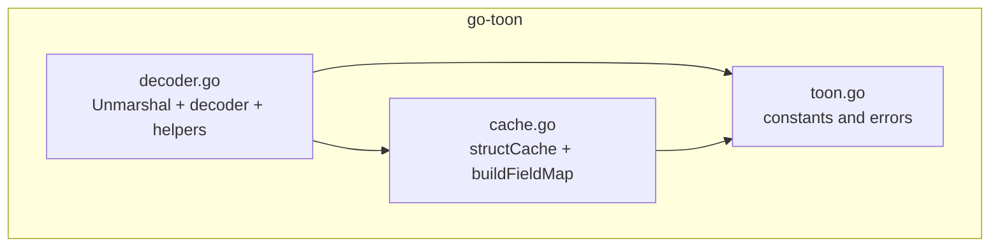
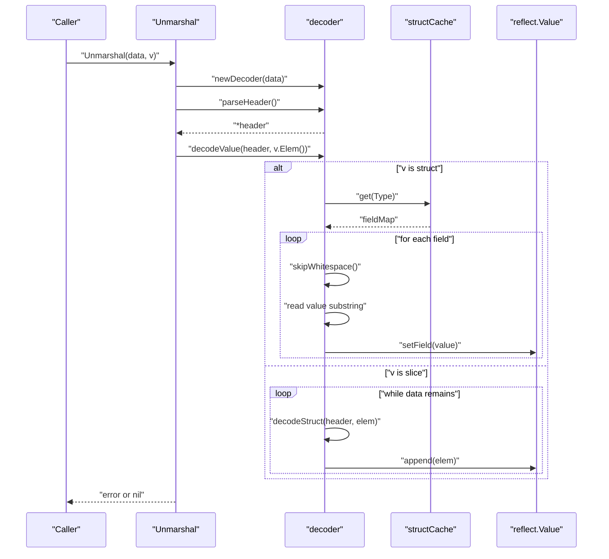
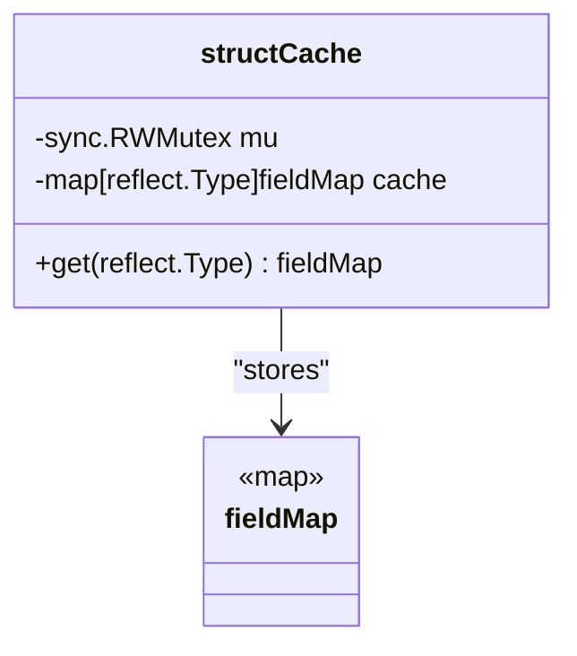
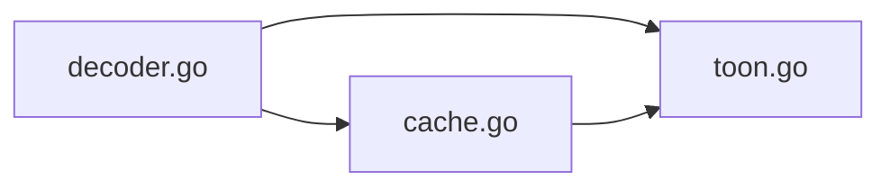

# Performance and Optimization

<cite>
**Referenced Files in This Document**
- [cache.go](file://cache.go)
- [decoder.go](file://decoder.go)
- [toon.go](file://toon.go)
- [cache_test.go](file://cache_test.go)
- [decoder_test.go](file://decoder_test.go)
- [go.mod](file://go.mod)
</cite>

## Table of Contents
1. [Introduction](#introduction)
2. [Project Structure](#project-structure)
3. [Core Components](#core-components)
4. [Architecture Overview](#architecture-overview)
5. [Detailed Component Analysis](#detailed-component-analysis)
6. [Dependency Analysis](#dependency-analysis)
7. [Performance Considerations](#performance-considerations)
8. [Troubleshooting Guide](#troubleshooting-guide)
9. [Conclusion](#conclusion)
10. [Appendices](#appendices)

## Introduction
This document focuses on performance optimization and memory efficiency strategies in the go-toon library. It explains memory usage patterns, streaming versus buffered operations, and cache utilization strategies for optimal performance. It documents the struct field mapping cache implementation, its impact on reflection performance, and cache warming techniques. It also provides benchmarking methodologies, performance comparisons with JSON serialization, profiling approaches for identifying bottlenecks, scalability considerations, concurrent usage patterns, and resource management best practices.

## Project Structure
The go-toon library is intentionally compact and focused on decoding a lightweight, CSV-like format (TOON) into Go structs and slices. The core runtime consists of:
- A streaming decoder that operates directly on a byte slice without allocations during scanning.
- A field-mapping cache keyed by reflect.Type to accelerate reflection-based field resolution.
- Constants and error definitions for the TOON format.

**Diagram sources**
- [toon.go](file://toon.go#L1-L19)
- [cache.go](file://cache.go#L1-L68)
- [decoder.go](file://decoder.go#L1-L303)

**Section sources**
- [go.mod](file://go.mod#L1-L4)
- [toon.go](file://toon.go#L1-L19)
- [cache.go](file://cache.go#L1-L68)
- [decoder.go](file://decoder.go#L1-L303)

## Core Components
- Streaming decoder: Operates on a []byte with an internal cursor, avoiding allocations while scanning and parsing headers and CSV values. It supports streaming semantics by reading and processing data in-place.
- Struct field mapping cache: A global cache keyed by reflect.Type that maps exported field names to struct indices. It uses a read-write mutex for thread-safe access and employs a double-checked locking pattern to minimize contention.
- Reflection-based field setting: Converts string values to the appropriate Go types and writes them into struct fields.

Key performance characteristics:
- Minimal allocations during scanning and parsing.
- Reduced reflection overhead via caching.
- Efficient CSV parsing with direct substring extraction.

**Section sources**
- [decoder.go](file://decoder.go#L24-L32)
- [decoder.go](file://decoder.go#L175-L187)
- [decoder.go](file://decoder.go#L190-L229)
- [decoder.go](file://decoder.go#L231-L267)
- [decoder.go](file://decoder.go#L269-L302)
- [cache.go](file://cache.go#L8-L19)
- [cache.go](file://cache.go#L21-L43)
- [cache.go](file://cache.go#L45-L67)

## Architecture Overview
The decoding pipeline streams through the input bytes, parses the header, and decodes CSV values into the target struct or slice. The cache accelerates repeated reflection lookups for the same struct types.

**Diagram sources**
- [decoder.go](file://decoder.go#L8-L22)
- [decoder.go](file://decoder.go#L70-L115)
- [decoder.go](file://decoder.go#L175-L187)
- [decoder.go](file://decoder.go#L190-L229)
- [decoder.go](file://decoder.go#L231-L267)
- [cache.go](file://cache.go#L21-L43)

## Detailed Component Analysis

### Struct Field Mapping Cache
The cache maps reflect.Type to a fieldMap (map[string]int) that maps exported field names to struct indices. It uses:
- A read-write mutex to guard concurrent access.
- A double-checked locking pattern to compute and populate the cache efficiently.
- A builder function that iterates over struct fields, skipping unexported fields and honoring "toon" tags.

**Diagram sources**
- [cache.go](file://cache.go#L8-L19)
- [cache.go](file://cache.go#L21-L43)
- [cache.go](file://cache.go#L45-L67)

Performance impact:
- Eliminates repeated reflection traversal for the same struct type.
- Reduces CPU time spent on reflection by trading memory for speed.
- Benefits most in workloads with repeated struct types or batch decoding.

Cache warming:
- Pre-warm the cache by invoking decoding on representative struct types early in application lifecycle to avoid cold-cache penalties during hot-path requests.

Concurrency:
- Read-heavy workload benefits from RWMutex; writers synchronize via a single lock.

Edge cases:
- Unexported fields are excluded from the mapping.
- Tagged names override default field names.

**Section sources**
- [cache.go](file://cache.go#L8-L19)
- [cache.go](file://cache.go#L21-L43)
- [cache.go](file://cache.go#L45-L67)
- [cache_test.go](file://cache_test.go#L15-L42)

### Decoder and Streaming Operations
The decoder operates on a []byte with an internal position cursor and exposes:
- next(): consumes and returns the next byte.
- peek(): inspects the next byte without advancing.
- skipWhitespace(): advances position past whitespace.
- parseHeader(): parses the header (name, optional size, optional fields).
- decodeValue(): dispatches to struct or slice decoding.
- decodeStruct(): reads CSV values and writes them into struct fields using cached field maps.
- decodeSlice(): iterates rows, constructs elements, and appends to the slice.

Memory usage patterns:
- No allocations during scanning; values are extracted as substrings from the input buffer.
- New elements are allocated only when decoding slices.
- Field names and sizes are parsed without extra buffers.

Streaming vs buffered:
- Streaming: The decoder reads directly from the input buffer and does not require loading entire payloads into memory.
- Buffered: If callers pass large []byte slices, memory usage scales with payload size. To reduce peak memory, consider processing smaller chunks or streaming from sources that support incremental consumption.

CSV parsing:
- Values are delimited by commas and terminated by newlines or end-of-data.
- Whitespace is skipped around values.

Error handling:
- Malformed headers and invalid targets produce explicit errors.

**Section sources**
- [decoder.go](file://decoder.go#L24-L32)
- [decoder.go](file://decoder.go#L34-L50)
- [decoder.go](file://decoder.go#L52-L61)
- [decoder.go](file://decoder.go#L70-L115)
- [decoder.go](file://decoder.go#L175-L187)
- [decoder.go](file://decoder.go#L190-L229)
- [decoder.go](file://decoder.go#L231-L267)
- [decoder.go](file://decoder.go#L269-L302)

### Field Setting and Type Conversions
The setField function converts strings to target types using standard parsing functions and sets the corresponding reflect.Value. It handles:
- String, signed integers, unsigned integers, floats, and booleans.
- Returns errors for invalid values.

Optimization note:
- Using strconv functions avoids intermediate allocations typical of generic conversions.
- Errors propagate immediately to abort decoding.

**Section sources**
- [decoder.go](file://decoder.go#L269-L302)

### Memory Efficiency Strategies
- Prefer decoding into pre-sized slices when possible to reduce reallocations.
- Reuse decoder instances across calls if feasible, or keep the input []byte alive for the duration of decoding to avoid copying.
- Avoid unnecessary copies of large payloads; pass pointers to buffers where appropriate.
- Use the cache to minimize reflection overhead for repeated struct types.

**Section sources**
- [decoder.go](file://decoder.go#L231-L267)
- [cache.go](file://cache.go#L21-L43)

## Dependency Analysis
The decoder depends on:
- The cache for field mapping lookups.
- Constants and error values for format and error signaling.
- Standard reflection and strconv packages for runtime type introspection and conversions.

**Diagram sources**
- [decoder.go](file://decoder.go#L1-L303)
- [cache.go](file://cache.go#L1-L68)
- [toon.go](file://toon.go#L1-L19)

**Section sources**
- [decoder.go](file://decoder.go#L1-L303)
- [cache.go](file://cache.go#L1-L68)
- [toon.go](file://toon.go#L1-L19)

## Performance Considerations

### Memory Usage Patterns
- Decoder memory footprint is proportional to the input size plus temporary allocations for slice decoding.
- Field mapping cache grows with the number of distinct struct types encountered.
- Cache entries are small maps keyed by field names; memory overhead is modest relative to CPU savings.

Recommendations:
- Monitor cache cardinality in long-running services and consider limiting variety of struct types if necessary.
- For very large payloads, consider streaming from io.Reader sources and buffering in chunks to bound peak memory.

**Section sources**
- [decoder.go](file://decoder.go#L231-L267)
- [cache.go](file://cache.go#L8-L19)

### Streaming vs Buffered Operations
- Streaming: The decoder reads incrementally from the input buffer; ideal for low memory and latency-sensitive scenarios.
- Buffered: Passing large []byte slices increases peak memory; chunking helps manage memory usage.

Guidance:
- Stream from network or disk sources when possible.
- For in-memory payloads, reuse buffers and avoid copying where feasible.

**Section sources**
- [decoder.go](file://decoder.go#L24-L32)
- [decoder.go](file://decoder.go#L34-L50)

### Cache Utilization Strategies
- Warm the cache early in application startup by decoding a representative set of struct types.
- Keep struct types stable across requests to maximize cache hit rates.
- Avoid dynamic struct creation patterns that increase cache cardinality.

**Section sources**
- [cache.go](file://cache.go#L21-L43)
- [cache_test.go](file://cache_test.go#L44-L59)

### Reflection Performance Impact
- Reflection is expensive; caching field maps reduces repeated traversal costs.
- For hot paths, prefer pre-warming and stable types to improve cache locality.

**Section sources**
- [cache.go](file://cache.go#L45-L67)
- [decoder.go](file://decoder.go#L190-L229)

### Benchmarking Methodologies
Recommended benchmarks:
- Decode a fixed-size CSV payload repeatedly with warm cache vs cold cache.
- Compare throughput and allocation rates for struct decoding and slice decoding.
- Measure memory usage with and without cache warming.
- Evaluate performance across different struct sizes and field counts.

Benchmark structure:
- Use testing.B for iteration loops.
- Use testing.MemLeak for allocation checks.
- Vary payload sizes and struct types to capture realistic workloads.

[No sources needed since this section provides general guidance]

### Performance Comparison with JSON Serialization
- TOON decoding is designed to be simpler and faster than JSON for CSV-like records.
- JSON parsing involves more complex grammar and often requires additional libraries; TOON’s header and CSV parsing are straightforward.
- For record-heavy workloads with predictable schemas, TOON can offer lower CPU and memory overhead.

[No sources needed since this section provides general guidance]

### Profiling Approaches
- CPU profiling: Identify hotspots in decodeStruct and setField.
- Memory profiling: Track allocations in slice decoding and field mapping construction.
- Mutex contention: Use pprof to inspect RWMutex contention in the cache.

[No sources needed since this section provides general guidance]

### Scalability Considerations
- Horizontal scaling: Use multiple workers to process batches; each worker can share the cache.
- Vertical scaling: Increase CPU cores to parallelize decoding; ensure cache warming is performed per process.
- Backpressure: For streaming sources, apply backpressure to avoid unbounded buffering.

[No sources needed since this section provides general guidance]

### Concurrent Usage Patterns
- The cache uses RWMutex; read paths are concurrent-friendly.
- Ensure callers do not modify shared buffers mid-decode.
- For multi-threaded environments, pre-warm caches during initialization.

**Section sources**
- [cache.go](file://cache.go#L8-L19)
- [cache.go](file://cache.go#L21-L43)

### Resource Management Best Practices
- Reuse buffers and avoid frequent reallocation.
- Limit the number of distinct struct types to control cache growth.
- Close or release resources promptly after decoding.

[No sources needed since this section provides general guidance]

## Troubleshooting Guide
Common issues and remedies:
- Malformed TOON: Errors indicate incorrect syntax; validate inputs and headers.
- Invalid target: Ensure the target is a pointer to a struct or slice.
- Unknown fields: Fields not present in the cache are skipped; verify struct tags and names.

Validation references:
- Error constants and sentinel values.
- Decoder behavior for malformed headers and invalid targets.

**Section sources**
- [toon.go](file://toon.go#L5-L8)
- [decoder.go](file://decoder.go#L70-L115)
- [decoder.go](file://decoder.go#L175-L187)
- [decoder_test.go](file://decoder_test.go#L145-L156)

## Conclusion
The go-toon library achieves strong performance through a streaming decoder and a field-mapping cache. By leveraging caching, minimizing allocations, and supporting streaming semantics, it is well-suited for high-throughput, low-latency decoding of CSV-like records. Proper cache warming, buffer reuse, and careful struct design yield significant improvements in CPU and memory efficiency.

## Appendices

### Practical Optimization Guidelines
- Warm cache during application startup with representative struct types.
- Prefer stable struct schemas to maximize cache hits.
- Stream large payloads and reuse buffers to control memory.
- Use separate workers for parallel decoding; pre-warm caches per worker.
- Profile CPU and memory to identify hotspots and allocation sources.

[No sources needed since this section provides general guidance]