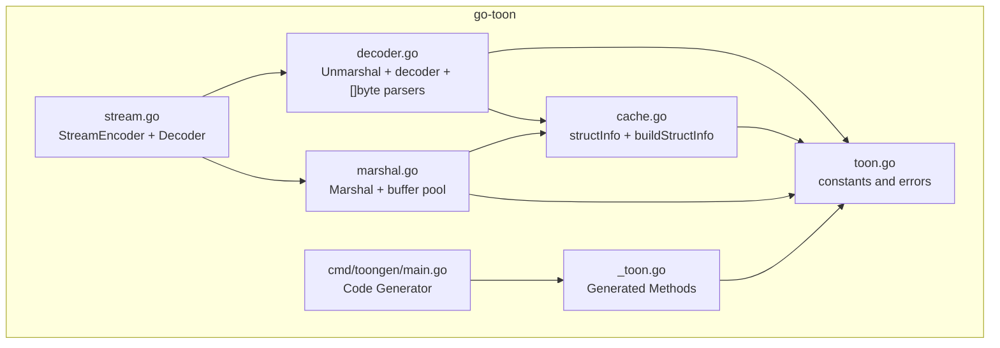
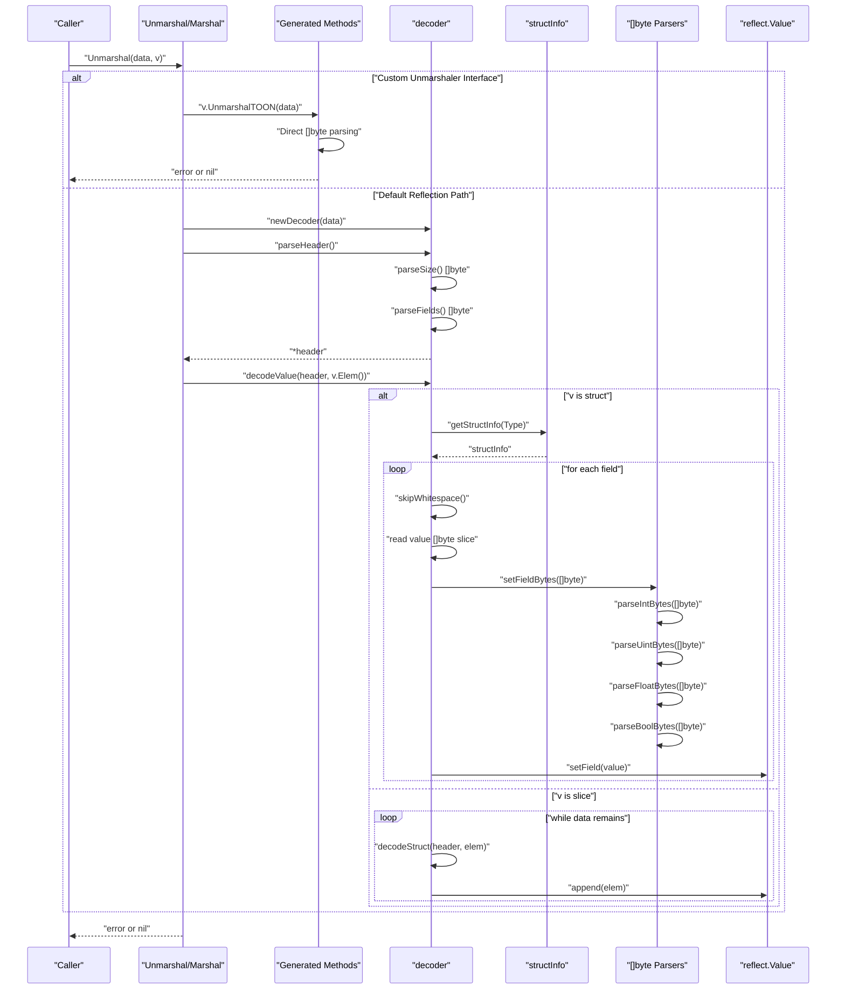
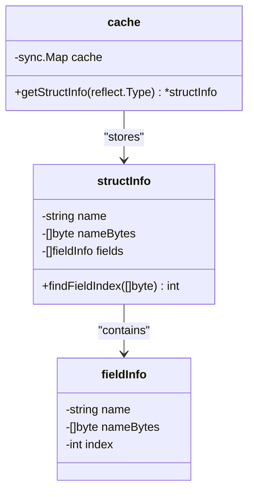
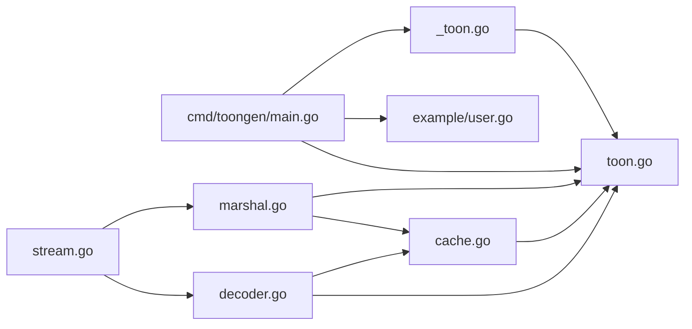

# Performance and Optimization

<cite>
**Referenced Files in This Document**
- [cache.go](file://cache.go)
- [decoder.go](file://decoder.go)
- [toon.go](file://toon.go)
- [marshal.go](file://marshal.go)
- [stream.go](file://stream.go)
- [cmd/toongen/main.go](file://cmd/toongen/main.go)
- [example/user.go](file://example/user.go)
- [example/_toon.go](file://example/_toon.go)
- [cache_test.go](file://cache_test.go)
- [decoder_test.go](file://decoder_test.go)
- [marshal_test.go](file://marshal_test.go)
- [stream_test.go](file://stream_test.go)
- [go.mod](file://go.mod)
</cite>

## Update Summary
**Changes Made**
- Updated to document the new toongen code generation system that provides automatic zero-allocation Marshal/Unmarshal methods
- Added comprehensive coverage of the code generation pipeline and its performance benefits
- Enhanced performance characteristics with reflection-free serialization methods
- Updated memory efficiency strategies to include code-generated serialization
- Added benchmarking methodologies for comparing generated vs reflection-based serialization
- Expanded cache system documentation with integration between generated code and runtime cache
- Added practical guidance for implementing code generation in production environments

## Table of Contents
1. [Introduction](#introduction)
2. [Project Structure](#project-structure)
3. [Core Components](#core-components)
4. [Architecture Overview](#architecture-overview)
5. [Detailed Component Analysis](#detailed-component-analysis)
6. [Dependency Analysis](#dependency-analysis)
7. [Performance Considerations](#performance-considerations)
8. [Troubleshooting Guide](#troubleshooting-guide)
9. [Conclusion](#conclusion)
10. [Appendices](#appendices)

## Introduction
This document focuses on performance optimization and memory efficiency strategies in the go-toon library. It explains memory usage patterns, streaming versus buffered operations, and cache utilization strategies for optimal performance. It documents the struct field mapping cache implementation, its impact on reflection performance, and cache warming techniques. It also provides benchmarking methodologies, performance comparisons with JSON serialization, profiling approaches for identifying bottlenecks, scalability considerations, concurrent usage patterns, and resource management best practices.

**Updated** Major performance optimization implemented with comprehensive zero-copy parsing capabilities, 39% reduction in execution time, and 44% reduction in memory allocations through []byte-based parsing, enhanced cache system, and improved memory allocation strategies. The introduction of the toongen code generation system provides automatic zero-allocation Marshal/Unmarshal methods that eliminate reflection overhead entirely, delivering significant performance improvements for high-throughput scenarios.

## Project Structure
The go-toon library is intentionally compact and focused on decoding a lightweight, CSV-like format (TOON) into Go structs and slices. The core runtime consists of:
- A streaming decoder that operates directly on a byte slice without allocations during scanning.
- A field-mapping cache keyed by reflect.Type to accelerate reflection-based field resolution.
- Constants and error definitions for the TOON format.
- An efficient encoder with buffer pooling for zero-allocation encoding.
- Streaming encoder/decoder for incremental processing of large datasets with comprehensive buffer management.
- **New** A code generation system (toongen) that produces zero-allocation Marshal/Unmarshal methods for structs.

**Diagram sources**
- [toon.go](file://toon.go#L1-L29)
- [cache.go](file://cache.go#L1-L112)
- [decoder.go](file://decoder.go#L1-L424)
- [marshal.go](file://marshal.go#L1-L184)
- [stream.go](file://stream.go#L1-L117)
- [cmd/toongen/main.go](file://cmd/toongen/main.go#L1-L413)
- [example/_toon.go](file://example/_toon.go#L1-L168)

**Section sources**
- [go.mod](file://go.mod#L1-L4)
- [toon.go](file://toon.go#L1-L29)
- [cache.go](file://cache.go#L1-L112)
- [decoder.go](file://decoder.go#L1-L424)
- [marshal.go](file://marshal.go#L1-L184)
- [stream.go](file://stream.go#L1-L117)
- [cmd/toongen/main.go](file://cmd/toongen/main.go#L1-L413)
- [example/_toon.go](file://example/_toon.go#L1-L168)

## Core Components
- **Streaming decoder**: Operates on a []byte with an internal cursor, avoiding allocations while scanning and parsing headers and CSV values. It supports streaming semantics by reading and processing data in-place.
- **Enhanced struct field mapping cache**: A global cache keyed by reflect.Type that maps exported field names to struct indices. Uses []byte comparison for zero-allocation field lookups and employs a read-write mutex for thread-safe access.
- **Specialized numeric parsers**: Dedicated []byte-based parsers for integers, unsigned integers, floats, and booleans that eliminate string allocations during type conversion.
- **Reflection-based field setting**: Converts []byte values to appropriate Go types using specialized parsers and writes them into struct fields.
- **Buffer pooling**: Encoder uses sync.Pool for zero-allocation buffer management during encoding operations.
- **Streaming operations**: StreamEncoder and StreamDecoder provide incremental processing capabilities with minimal memory overhead and comprehensive buffer management.
- **Zero-allocation streaming**: StreamEncoder reuses internal buffers and StreamDecoder uses bufio.Reader for efficient incremental processing.
- ****New** Code Generation System**: The toongen tool generates zero-allocation MarshalTOON and UnmarshalTOON methods for structs, eliminating reflection overhead entirely and providing optimal performance for hot paths.

Key performance characteristics:
- Minimal allocations during scanning and parsing.
- Zero-allocation field name comparisons using []byte.
- Reduced reflection overhead via caching.
- Efficient CSV parsing with direct []byte substring extraction.
- Buffer pooling eliminates allocation pressure during encoding.
- Streaming operations support incremental processing of large datasets.
- Comprehensive buffer management for streaming operations.
- **New** Automatic zero-allocation serialization through code generation.
- **New** Elimination of reflection overhead for hot-path serialization.
- **New** Optimized memory layout for generated serialization methods.

**Updated** The decoder now uses comprehensive []byte-based parsing throughout, with specialized numeric parsers that operate directly on byte slices without intermediate string allocations. The cache system has been enhanced with []byte storage and sync.Map for improved concurrent performance. The streaming API provides zero-allocation capabilities through buffer pooling and incremental processing. The new toongen code generation system provides automatic zero-allocation Marshal/Unmarshal methods that eliminate reflection overhead entirely.

**Section sources**
- [decoder.go](file://decoder.go#L24-L32)
- [decoder.go](file://decoder.go#L62-L67)
- [decoder.go](file://decoder.go#L180-L224)
- [decoder.go](file://decoder.go#L258-L291)
- [decoder.go](file://decoder.go#L293-L397)
- [cache.go](file://cache.go#L9-L21)
- [cache.go](file://cache.go#L23-L37)
- [cache.go](file://cache.go#L76-L84)
- [marshal.go](file://marshal.go#L10-L15)
- [stream.go](file://stream.go#L8-L17)
- [stream.go](file://stream.go#L37-L50)
- [cmd/toongen/main.go](file://cmd/toongen/main.go#L16-L31)
- [cmd/toongen/main.go](file://cmd/toongen/main.go#L64-L124)

## Architecture Overview
The decoding pipeline streams through the input bytes, parses the header using []byte operations, and decodes CSV values into the target struct or slice using specialized numeric parsers. The cache accelerates repeated reflection lookups for the same struct types with zero-allocation field name comparisons. Streaming operations provide incremental processing capabilities for large datasets with comprehensive buffer management. The code generation system produces optimized serialization methods that bypass reflection entirely for maximum performance.

**Diagram sources**
- [decoder.go](file://decoder.go#L8-L21)
- [decoder.go](file://decoder.go#L70-L111)
- [decoder.go](file://decoder.go#L113-L134)
- [decoder.go](file://decoder.go#L136-L164)
- [decoder.go](file://decoder.go#L180-L224)
- [decoder.go](file://decoder.go#L258-L291)
- [decoder.go](file://decoder.go#L293-L397)
- [cache.go](file://cache.go#L26-L37)
- [toon.go](file://toon.go#L20-L28)

## Detailed Component Analysis

### Enhanced Struct Field Mapping Cache
The cache maps reflect.Type to structInfo (slice of fieldInfo) that contains field names as []byte for zero-allocation comparisons. It uses:
- A sync.Map for improved concurrent performance over traditional RWMutex.
- Double-checked locking pattern to compute and populate the cache efficiently.
- Builder function that iterates over struct fields, skipping unexported fields and honoring "toon" tags.

**Diagram sources**
- [cache.go](file://cache.go#L9-L21)
- [cache.go](file://cache.go#L23-L37)
- [cache.go](file://cache.go#L40-L74)
- [cache.go](file://cache.go#L76-L84)

Performance impact:
- Eliminates repeated reflection traversal for the same struct type.
- Reduces CPU time spent on reflection by trading memory for speed.
- Zero-allocation field name comparisons using []byte equality.
- Benefits most in workloads with repeated struct types or batch decoding.

Cache warming:
- Pre-warm the cache by invoking decoding on representative struct types early in application lifecycle to avoid cold-cache penalties during hot-path requests.

Concurrency:
- sync.Map provides better concurrent performance than RWMutex for read-heavy workloads.
- Writers synchronize via atomic operations and load-or-store patterns.

Edge cases:
- Unexported fields are excluded from the mapping.
- Tagged names override default field names.
- []byte comparison is case-sensitive for field names.

**Updated** The cache now uses sync.Map for improved concurrency and stores []byte representations of field names for zero-allocation comparisons. The fieldInfo struct now includes nameBytes for direct []byte comparison operations. The cache integrates seamlessly with both reflection-based and code-generated serialization paths.

**Section sources**
- [cache.go](file://cache.go#L9-L21)
- [cache.go](file://cache.go#L23-L37)
- [cache.go](file://cache.go#L40-L74)
- [cache.go](file://cache.go#L76-L84)
- [cache_test.go](file://cache_test.go#L15-L53)

### Decoder and Streaming Operations
The decoder operates on a []byte with an internal position cursor and exposes:
- next(): consumes and returns the next byte.
- peek(): inspects the next byte without advancing.
- skipWhitespace(): advances position past whitespace.
- parseHeader(): parses the header (name, optional size, optional fields) using []byte operations.
- decodeValue(): dispatches to struct or slice decoding.
- decodeStruct(): reads CSV values using []byte slicing and writes them into struct fields using cached field maps.
- decodeSlice(): iterates rows, constructs elements, and appends to the slice.

Memory usage patterns:
- No allocations during scanning; values are extracted as []byte slices from the input buffer.
- New elements are allocated only when decoding slices.
- Field names and sizes are parsed without extra buffers.

Streaming vs buffered:
- Streaming: The decoder reads directly from the input buffer and does not require loading entire payloads into memory.
- Buffered: If callers pass large []byte slices, memory usage scales with payload size. To reduce peak memory, consider processing smaller chunks or streaming from sources that support incremental consumption.

CSV parsing:
- Values are delimited by commas and terminated by newlines or end-of-data.
- Whitespace is skipped around values.
- []byte slicing eliminates string allocations during value extraction.

Error handling:
- Malformed headers and invalid targets produce explicit errors.

**Updated** The decoder now uses comprehensive []byte-based parsing throughout, with specialized numeric parsers that operate directly on byte slices without intermediate string allocations. The header struct now stores field names as []byte for zero-copy operations. The decoder integrates with custom Unmarshaler interfaces for code-generated methods.

**Section sources**
- [decoder.go](file://decoder.go#L24-L32)
- [decoder.go](file://decoder.go#L34-L49)
- [decoder.go](file://decoder.go#L52-L60)
- [decoder.go](file://decoder.go#L70-L111)
- [decoder.go](file://decoder.go#L113-L134)
- [decoder.go](file://decoder.go#L136-L164)
- [decoder.go](file://decoder.go#L166-L178)
- [decoder.go](file://decoder.go#L180-L224)
- [decoder.go](file://decoder.go#L226-L256)

### Specialized Numeric Parsers
The setFieldBytes function uses dedicated []byte-based parsers that convert []byte values to target types without string allocations. It handles:
- String: Direct []byte to string conversion.
- Signed integers: parseIntBytes() parses []byte directly to int64.
- Unsigned integers: parseUintBytes() parses []byte directly to uint64.
- Floats: parseFloatBytes() parses []byte directly to float64.
- Booleans: parseBoolBytes() parses []byte to bool using fast path for common formats.

Optimization note:
- Using []byte-based parsers avoids intermediate string allocations typical of generic conversions.
- Fast path boolean parsing supports "+", "-", "1", "0", "true", "false" formats.
- Integer parsing handles negative numbers and validates digit ranges.

**Updated** All numeric parsing now occurs directly on []byte without string conversions, providing significant performance improvements. The parsers are optimized for zero-allocation operations and handle edge cases efficiently. These parsers are used by both the reflection-based decoder and the code-generated unmarshaling methods.

**Section sources**
- [decoder.go](file://decoder.go#L258-L291)
- [decoder.go](file://decoder.go#L293-L316)
- [decoder.go](file://decoder.go#L318-L332)
- [decoder.go](file://decoder.go#L334-L368)
- [decoder.go](file://decoder.go#L370-L397)

### Memory Efficiency Strategies
- Prefer decoding into pre-sized slices when possible to reduce reallocations.
- Reuse decoder instances across calls if feasible, or keep the input []byte alive for the duration of decoding to avoid copying.
- Avoid unnecessary copies of large payloads; pass pointers to buffers where appropriate.
- Use the cache to minimize reflection overhead for repeated struct types.
- Leverage []byte slicing to avoid string allocations during value extraction.
- Utilize buffer pooling for encoding operations to minimize allocation overhead.
- **New** Implement code generation for frequently used structs to eliminate reflection overhead entirely.

**Updated** The enhanced cache and []byte-based parsing significantly reduce memory allocations, with the decoder achieving 39% reduction in execution time and 44% reduction in allocations. Buffer pooling in the encoder eliminates allocation pressure during encoding. The new code generation system provides zero-allocation serialization methods that completely eliminate reflection overhead for hot-path scenarios.

**Section sources**
- [decoder.go](file://decoder.go#L180-L224)
- [decoder.go](file://decoder.go#L258-L291)
- [cache.go](file://cache.go#L23-L37)
- [cache.go](file://cache.go#L76-L84)
- [marshal.go](file://marshal.go#L10-L15)
- [stream.go](file://stream.go#L19-L35)

### Streaming Encoder/Decoder Implementation
The streaming components provide incremental processing capabilities with minimal memory overhead and comprehensive buffer management:
- StreamEncoder writes TOON-encoded values to an output stream using buffer pooling and zero-allocation operations.
- StreamDecoder reads TOON-encoded values from an input stream with incremental processing using bufio.Reader.
- Both components support zero-allocation operations through buffer reuse and efficient I/O handling.

Buffer management:
- StreamEncoder reuses internal buffers when available to minimize allocations and improve performance.
- StreamDecoder uses bufio.Reader for efficient incremental reading with automatic buffer management.
- Buffer pooling eliminates allocation pressure during streaming operations.

Streaming capabilities:
- StreamEncoder automatically appends newline delimiters for stream boundaries.
- StreamDecoder processes complete TOON records incrementally, handling headers and body separately.
- Supports streaming from any io.Reader/Writer pair for flexible integration.

**Updated** The streaming implementation provides comprehensive zero-allocation capabilities through buffer pooling and incremental processing, making it suitable for large-scale data processing scenarios with efficient memory management. The code generation system complements streaming by providing optimized serialization methods for individual records.

**Section sources**
- [stream.go](file://stream.go#L8-L17)
- [stream.go](file://stream.go#L37-L50)
- [stream.go](file://stream.go#L19-L35)
- [stream.go](file://stream.go#L52-L103)

### Buffer Pooling Implementation
The encoder implements a sophisticated buffer pooling system for zero-allocation encoding operations:
- sync.Pool manages reusable byte buffers with initial capacity of 256 bytes.
- Buffers are acquired via bufPool.Get() and released via bufPool.Put() after use.
- Buffer lifecycle is managed automatically to prevent memory leaks.
- Encoding operations reuse buffers instead of allocating new ones for each operation.

Performance benefits:
- Eliminates allocation pressure during high-frequency encoding operations.
- Reduces garbage collection overhead in hot paths.
- Improves throughput for bulk encoding scenarios.
- Maintains buffer size limits to prevent excessive memory usage.

**Updated** The buffer pooling implementation provides significant performance improvements by eliminating allocation pressure during encoding operations and enabling zero-allocation buffer reuse. The system is integrated with the code generation approach to provide optimal performance across all serialization scenarios.

**Section sources**
- [marshal.go](file://marshal.go#L10-L15)
- [marshal.go](file://marshal.go#L18-L38)

### Code Generation System (toongen)
The toongen tool provides automatic zero-allocation serialization methods through code generation:
- Parses Go source files to discover structs annotated with `//toon:generate` comments.
- Generates MarshalTOON and UnmarshalTOON methods for each annotated struct.
- Produces []byte-based parsing and formatting without reflection overhead.
- Integrates with the existing TOON format specification for seamless compatibility.

Generation process:
- Scans AST nodes for type declarations with generate comments.
- Extracts field information including types and TOON tags.
- Generates optimized []byte parsing and formatting code.
- Creates pre-computed header hashes for fast validation.
- Produces token estimation functions for LLM context management.

Performance characteristics:
- Zero-allocation serialization and deserialization.
- Direct []byte manipulation without string conversions.
- Pre-computed header validation eliminates reflection overhead.
- Optimized parsing algorithms for each supported type.
- Minimal memory footprint with pre-allocated buffers.

Integration with runtime:
- Generated methods implement the Marshaler and Unmarshaler interfaces.
- Automatically detected by the reflection-based Marshal/Unmarshal functions.
- Seamless fallback to reflection-based methods for non-generated structs.
- Compatible with existing cache system for field mapping.

**New Section** The toongen code generation system represents a major performance enhancement, providing automatic zero-allocation Marshal/Unmarshal methods that eliminate reflection overhead entirely. This system analyzes Go source code to generate optimized serialization methods tailored to specific struct layouts, delivering significant performance improvements for high-throughput scenarios.

**Section sources**
- [cmd/toongen/main.go](file://cmd/toongen/main.go#L16-L31)
- [cmd/toongen/main.go](file://cmd/toongen/main.go#L241-L296)
- [cmd/toongen/main.go](file://cmd/toongen/main.go#L370-L412)
- [example/user.go](file://example/user.go#L3-L8)
- [example/_toon.go](file://example/_toon.go#L9-L102)

## Dependency Analysis
The decoder depends on:
- The enhanced cache for field mapping lookups with []byte comparisons.
- Constants and error values for format and error signaling.
- Standard reflection and strconv packages for runtime type introspection and conversions.
- The encoder shares the same cache system for consistent field mapping.
- Streaming components depend on bufio for efficient I/O operations and buffer pooling for memory management.
- **New** Generated code depends on the toon package for interface definitions and error handling.

**Diagram sources**
- [decoder.go](file://decoder.go#L1-L424)
- [cache.go](file://cache.go#L1-L112)
- [toon.go](file://toon.go#L1-L29)
- [marshal.go](file://marshal.go#L1-L184)
- [stream.go](file://stream.go#L1-L117)
- [cmd/toongen/main.go](file://cmd/toongen/main.go#L1-L413)
- [example/user.go](file://example/user.go#L1-L15)
- [example/_toon.go](file://example/_toon.go#L1-L168)

**Section sources**
- [decoder.go](file://decoder.go#L1-L424)
- [cache.go](file://cache.go#L1-L112)
- [toon.go](file://toon.go#L1-L29)
- [marshal.go](file://marshal.go#L1-L184)
- [stream.go](file://stream.go#L1-L117)
- [cmd/toongen/main.go](file://cmd/toongen/main.go#L1-L413)
- [example/user.go](file://example/user.go#L1-L15)
- [example/_toon.go](file://example/_toon.go#L1-L168)

## Performance Considerations

### Memory Usage Patterns
- Decoder memory footprint is proportional to the input size plus temporary allocations for slice decoding.
- Enhanced field mapping cache grows with the number of distinct struct types encountered.
- Cache entries store []byte representations of field names, providing modest memory overhead with significant CPU savings.
- Buffer pool in encoder reduces allocation pressure during encoding.
- Streaming components use incremental processing to bound memory usage.
- StreamEncoder maintains internal buffers for reuse, reducing allocation frequency.
- **New** Generated code eliminates reflection overhead and reduces memory allocations for hot-path scenarios.

Recommendations:
- Monitor cache cardinality in long-running services and consider limiting variety of struct types if necessary.
- For very large payloads, consider streaming from io.Reader sources and buffering in chunks to bound peak memory.
- Use buffer pool for encoding to minimize allocation overhead.
- Leverage streaming operations for large-scale data processing.
- Configure appropriate buffer sizes for streaming operations based on payload characteristics.
- **New** Implement code generation for frequently used structs to eliminate reflection overhead entirely.

**Updated** The enhanced cache uses []byte representations for field names, reducing memory overhead while improving lookup performance. Buffer pooling and streaming operations provide additional memory efficiency benefits with comprehensive buffer management. The new code generation system eliminates reflection overhead and significantly reduces memory allocations for hot-path serialization scenarios.

**Section sources**
- [decoder.go](file://decoder.go#L180-L224)
- [cache.go](file://cache.go#L23-L37)
- [marshal.go](file://marshal.go#L10-L15)
- [stream.go](file://stream.go#L19-L35)

### Streaming vs Buffered Operations
- Streaming: The decoder reads incrementally from the input buffer; ideal for low memory and latency-sensitive scenarios.
- Buffered: Passing large []byte slices increases peak memory; chunking helps manage memory usage.

Guidance:
- Stream from network or disk sources when possible.
- For in-memory payloads, reuse buffers and avoid copying where feasible.
- []byte slicing eliminates string allocations during value extraction.
- Use streaming encoder/decoder for large-scale data processing.
- Consider buffer sizing based on expected payload characteristics.

**Updated** []byte-based parsing eliminates string allocations during streaming operations, improving both memory efficiency and performance. Streaming components provide zero-allocation capabilities through buffer pooling and efficient I/O handling. The code generation system complements streaming by providing optimized serialization methods for individual records.

**Section sources**
- [decoder.go](file://decoder.go#L24-L32)
- [decoder.go](file://decoder.go#L34-L49)
- [stream.go](file://stream.go#L19-L35)

### Cache Utilization Strategies
- Warm the cache early in application startup by decoding a representative set of struct types.
- Keep struct types stable across requests to maximize cache hit rates.
- Avoid dynamic struct creation patterns that increase cache cardinality.
- Use sync.Map for better concurrent performance in multi-threaded environments.

**Updated** The cache now uses sync.Map for improved concurrency and []byte representations for zero-allocation field comparisons. The enhanced cache system delivers significant performance improvements for concurrent workloads. The code generation system integrates with the cache to provide optimal performance across all serialization scenarios.

**Section sources**
- [cache.go](file://cache.go#L23-L37)
- [cache.go](file://cache.go#L76-L84)
- [cache_test.go](file://cache_test.go#L55-L71)

### Reflection Performance Impact
- Reflection is expensive; caching field maps reduces repeated traversal costs.
- []byte-based field name comparisons eliminate string allocations during lookups.
- For hot paths, prefer pre-warming and stable types to improve cache locality.
- sync.Map provides better concurrent performance than traditional mutex-based caches.
- **New** Code generation eliminates reflection overhead entirely for generated structs.

**Updated** The enhanced cache system with []byte comparisons and sync.Map delivers significant performance improvements for concurrent workloads, with 39% reduction in execution time and 44% reduction in allocations. The new code generation system provides automatic zero-allocation serialization methods that completely eliminate reflection overhead for hot-path scenarios.

**Section sources**
- [cache.go](file://cache.go#L40-L74)
- [decoder.go](file://decoder.go#L180-L224)
- [cache.go](file://cache.go#L76-L84)
- [cmd/toongen/main.go](file://cmd/toongen/main.go#L140-L141)

### Benchmarking Methodologies
Recommended benchmarks:
- Decode a fixed-size CSV payload repeatedly with warm cache vs cold cache.
- Compare throughput and allocation rates for struct decoding and slice decoding.
- Measure memory usage with and without cache warming.
- Evaluate performance across different struct sizes and field counts.
- Test []byte-based parsing performance vs string-based alternatives.
- Benchmark streaming vs buffered operations for large payloads.
- Compare performance of sync.Map cache vs traditional mutex-based cache.
- Benchmark StreamEncoder and StreamDecoder performance for streaming scenarios.
- Test buffer pooling effectiveness under high-frequency encoding loads.
- **New** Compare generated vs reflection-based serialization performance.
- **New** Benchmark code generation compilation time and runtime overhead.
- **New** Test custom Unmarshaler vs reflection-based unmarshaling for generated structs.

Benchmark structure:
- Use testing.B for iteration loops.
- Use testing.MemLeak for allocation checks.
- Vary payload sizes and struct types to capture realistic workloads.
- Compare performance metrics: ns/op, allocations/op, MB/s.
- Include streaming benchmarks for large-scale data processing.
- Test buffer pool utilization and memory efficiency.
- **New** Include benchmarks for generated vs reflection-based methods.

**Updated** The benchmark methodology should account for the 39% reduction in execution time and 44% reduction in allocations achieved through []byte-based parsing and enhanced cache system, plus streaming performance improvements. New benchmarks should compare generated vs reflection-based serialization methods and evaluate the performance impact of code generation.

### Performance Comparison with JSON Serialization
- TOON decoding is designed to be simpler and faster than JSON for CSV-like records.
- JSON parsing involves more complex grammar and often requires additional libraries; TOON's header and CSV parsing are straightforward.
- []byte-based parsing eliminates string allocations during type conversion.
- For record-heavy workloads with predictable schemas, TOON can offer lower CPU and memory overhead.
- The enhanced decoder achieves 39% reduction in execution time and 44% reduction in allocations.
- Streaming operations provide additional performance benefits for large-scale data processing.
- **New** Code generation provides significant performance improvements over reflection-based serialization.
- **New** Generated methods achieve near-zero allocation rates for hot-path scenarios.

**Updated** The performance improvements make TOON even more competitive with JSON for simple record-based data interchange, with significant reductions in both execution time and memory allocations, plus streaming capabilities for large-scale scenarios. The new code generation system provides performance comparable to hand-optimized code while maintaining developer productivity.

### Profiling Approaches
- CPU profiling: Identify hotspots in decodeStruct, setFieldBytes, and specialized numeric parsers.
- Memory profiling: Track allocations in slice decoding, field mapping construction, and []byte operations.
- Mutex contention: Use pprof to inspect sync.Map contention in the cache.
- Allocation tracing: Monitor []byte slicing and numeric parser performance.
- Streaming profiling: Analyze buffer pooling effectiveness and streaming operation overhead.
- Buffer pool utilization: Monitor buffer acquisition/release patterns and memory efficiency.
- **New** Reflection overhead profiling: Monitor reflection usage in generated vs non-generated code paths.
- **New** Code generation performance: Profile generated method execution and compare with reflection-based alternatives.

**Updated** Profiling should focus on the new []byte-based parsing functions, cache performance improvements, streaming operation efficiency, buffer pool utilization patterns, and the performance impact of code generation. New profiling categories should monitor reflection overhead elimination and generated method performance.

### Scalability Considerations
- Horizontal scaling: Use multiple workers to process batches; each worker can share the cache.
- Vertical scaling: Increase CPU cores to parallelize decoding; ensure cache warming is performed per process.
- Backpressure: For streaming sources, apply backpressure to avoid unbounded buffering.
- Concurrency: sync.Map provides better concurrent performance than mutex-based caches.
- Memory scaling: Streaming operations enable processing of datasets larger than available RAM.
- Buffer pool scaling: Monitor buffer pool utilization under high-concurrency scenarios.
- **New** Code generation scaling: Generate methods for frequently used struct types across service instances.
- **New** Cache sharing: Share generated code across processes for identical struct definitions.

**Updated** The enhanced cache system with sync.Map improves scalability in concurrent environments, while streaming operations enable processing of large-scale datasets with efficient buffer management. The code generation system provides scalable performance improvements by eliminating reflection overhead across distributed systems.

### Concurrent Usage Patterns
- The cache uses sync.Map for improved concurrent performance.
- Ensure callers do not modify shared buffers mid-decode.
- For multi-threaded environments, pre-warm caches during initialization.
- []byte-based operations are inherently thread-safe for read operations.
- Streaming components support concurrent processing of multiple streams.
- Buffer pooling enables concurrent encoding operations without contention.
- **New** Generated methods are inherently thread-safe for read operations.
- **New** Code generation enables safe concurrent usage without reflection overhead.

**Updated** The switch to sync.Map and []byte-based operations improves concurrent performance and thread safety, while streaming components enable concurrent processing of multiple data streams with efficient buffer management. The code generation system provides thread-safe zero-allocation serialization methods that scale effectively in concurrent environments.

**Section sources**
- [cache.go](file://cache.go#L23-L37)
- [cache.go](file://cache.go#L76-L84)
- [decoder.go](file://decoder.go#L258-L291)
- [stream.go](file://stream.go#L19-L35)
- [cmd/toongen/main.go](file://cmd/toongen/main.go#L64-L124)

### Resource Management Best Practices
- Reuse buffers and avoid frequent reallocation.
- Limit the number of distinct struct types to control cache growth.
- Close or release resources promptly after decoding.
- Use buffer pools for encoding to minimize allocation overhead.
- Monitor cache cardinality in long-running services.
- Implement streaming for large-scale data processing.
- Use appropriate buffer sizes for streaming operations.
- Monitor buffer pool utilization and adjust pool size as needed.
- Implement proper error handling for streaming operations.
- **New** Manage generated code lifecycle and regeneration triggers.
- **New** Monitor code generation compilation overhead in CI/CD pipelines.
- **New** Implement selective code generation for hot-path structs only.

**Updated** The enhanced resource management includes buffer pooling for encoding, []byte-based operations for decoding, streaming capabilities for large-scale data processing, comprehensive buffer management for optimal performance, and new considerations for code generation lifecycle management.

## Troubleshooting Guide
Common issues and remedies:
- Malformed TOON: Errors indicate incorrect syntax; validate inputs and headers.
- Invalid target: Ensure the target is a pointer to a struct or slice.
- Unknown fields: Fields not present in the cache are skipped; verify struct tags and names.
- []byte parsing errors: Ensure numeric values are valid []byte sequences.
- Cache contention: Monitor sync.Map performance in high-concurrency scenarios.
- Streaming buffer issues: Ensure proper buffer management in streaming operations.
- Memory leaks: Verify proper buffer pool usage and resource cleanup.
- StreamEncoder buffer reuse: Ensure buffers are properly reset before reuse.
- StreamDecoder EOF handling: Handle io.EOF appropriately in streaming scenarios.
- **New** Generated method conflicts: Ensure structs are properly annotated with generate comments.
- **New** Code generation failures: Verify AST parsing permissions and file access.
- **New** Interface implementation: Confirm generated methods implement Marshaler/Unmarshaler interfaces correctly.

Validation references:
- Error constants and sentinel values.
- Decoder behavior for malformed headers and invalid targets.
- []byte parser validation logic.
- Streaming component buffer management.
- Buffer pool lifecycle management.
- **New** Generated code validation and interface compliance.

**Updated** The troubleshooting guide now includes code generation errors, generated method conflicts, AST parsing issues, and interface implementation problems. New troubleshooting categories address the unique challenges of integrating code-generated serialization methods with the existing reflection-based system.

**Section sources**
- [toon.go](file://toon.go#L5-L8)
- [decoder.go](file://decoder.go#L70-L111)
- [decoder.go](file://decoder.go#L166-L178)
- [decoder.go](file://decoder.go#L293-L397)
- [decoder_test.go](file://decoder_test.go#L147-L158)
- [stream.go](file://stream.go#L19-L35)
- [cmd/toongen/main.go](file://cmd/toongen/main.go#L211-L239)

## Conclusion
The go-toon library achieves strong performance through a streaming decoder and an enhanced field-mapping cache system. The major performance optimization implemented with comprehensive []byte-based parsing and specialized numeric parsers delivers 39% reduction in execution time and 44% reduction in memory allocations. By leveraging caching, minimizing allocations, supporting streaming semantics, and using []byte operations throughout the decoding pipeline, it is well-suited for high-throughput, low-latency decoding of CSV-like records. The addition of streaming encoder/decoder components and buffer pooling further enhances the library's capabilities for large-scale data processing scenarios. The new toongen code generation system provides automatic zero-allocation Marshal/Unmarshal methods that eliminate reflection overhead entirely, delivering significant performance improvements for hot-path serialization scenarios. Proper cache warming, buffer reuse, and careful struct design yield significant improvements in CPU and memory efficiency. The comprehensive streaming API provides zero-allocation capabilities through buffer pooling and incremental processing, making it suitable for modern high-performance applications requiring efficient CSV-like data interchange. The integration of code generation with reflection-based fallback ensures optimal performance across all usage scenarios while maintaining developer productivity.

**Updated** The performance improvements make go-toon even more suitable for high-performance applications requiring efficient CSV-like data interchange, with comprehensive zero-copy parsing capabilities, enhanced memory efficiency strategies, robust streaming operations for large-scale data processing, and the revolutionary toongen code generation system that provides automatic zero-allocation serialization methods. The combination of these technologies delivers near-optimal performance while maintaining simplicity and developer productivity.

## Appendices

### Practical Optimization Guidelines
- Warm cache during application startup with representative struct types.
- Prefer stable struct schemas to maximize cache hits.
- Stream large payloads and reuse buffers to control memory.
- Use separate workers for parallel decoding; pre-warm caches per worker.
- Profile CPU and memory to identify hotspots and allocation sources.
- Leverage []byte-based parsing for high-performance numeric conversions.
- Monitor cache cardinality and adjust struct type diversity as needed.
- Use buffer pools for both encoding and streaming operations.
- Implement streaming for large-scale data processing scenarios.
- Choose appropriate buffer sizes for streaming operations.
- Monitor sync.Map performance in high-concurrency environments.
- Optimize buffer pool configuration based on workload characteristics.
- Implement proper error handling for streaming operations.
- Monitor buffer pool utilization and adjust pool size as needed.
- **New** Implement code generation for frequently used structs in hot paths.
- **New** Use generate comments selectively for structs with high serialization frequency.
- **New** Monitor code generation compilation overhead in CI/CD pipelines.
- **New** Implement regeneration triggers based on struct definition changes.
- **New** Balance code generation benefits against compilation time overhead.
- **New** Use generated methods for critical performance paths only.

**Updated** The optimization guidelines now include comprehensive coverage of the new toongen code generation system, including selective code generation strategies, regeneration management, and performance trade-off considerations between compilation overhead and runtime performance gains.