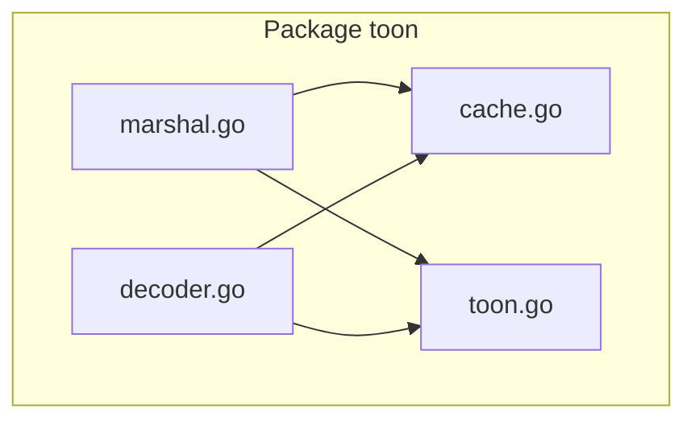
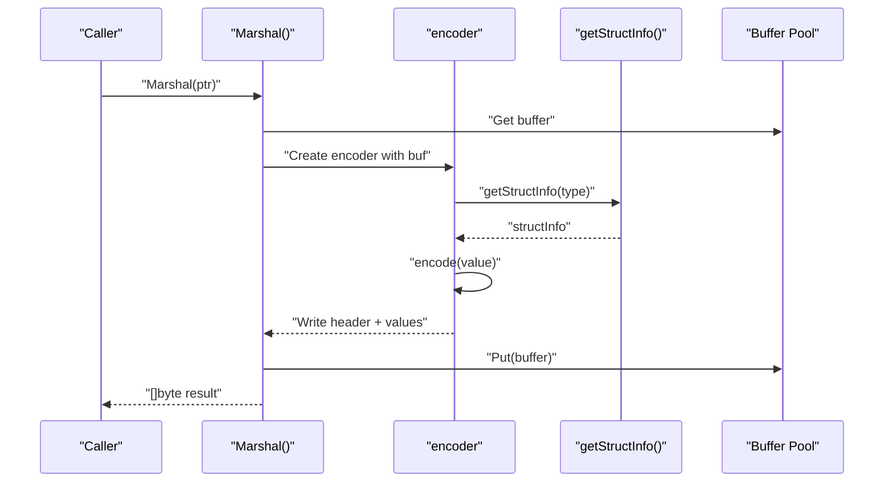
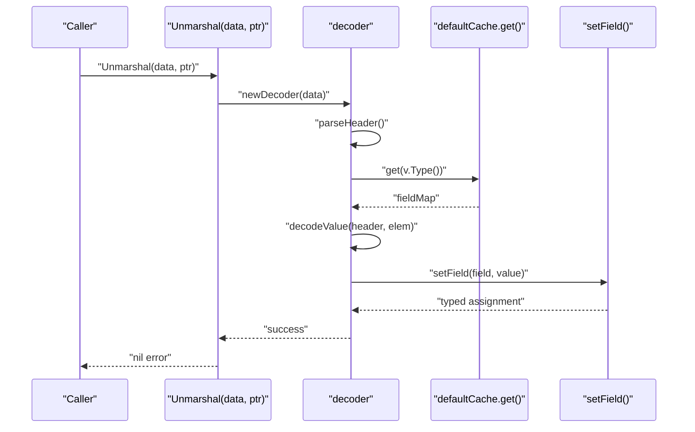
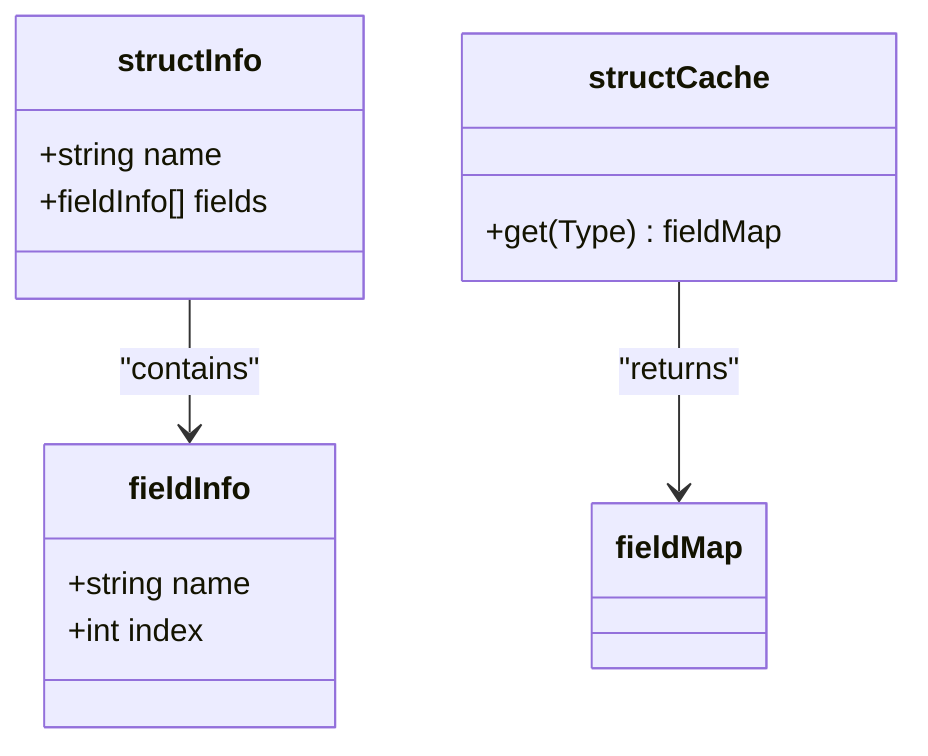
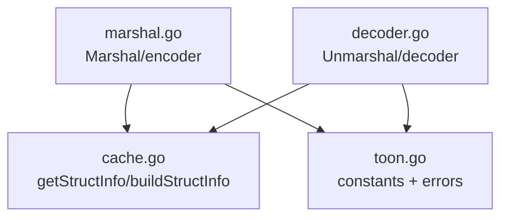

# Architecture Overview

<cite>
**Referenced Files in This Document**
- [marshal.go](file://marshal.go)
- [decoder.go](file://decoder.go)
- [cache.go](file://cache.go)
- [toon.go](file://toon.go)
- [marshal_test.go](file://marshal_test.go)
- [decoder_test.go](file://decoder_test.go)
- [cache_test.go](file://cache_test.go)
</cite>

## Table of Contents
1. [Introduction](#introduction)
2. [Project Structure](#project-structure)
3. [Core Components](#core-components)
4. [Architecture Overview](#architecture-overview)
5. [Detailed Component Analysis](#detailed-component-analysis)
6. [Dependency Analysis](#dependency-analysis)
7. [Performance Considerations](#performance-considerations)
8. [Troubleshooting Guide](#troubleshooting-guide)
9. [Conclusion](#conclusion)

## Introduction
This document presents the architecture overview of go-toon, a compact, zero-dependency serialization library for Go. The system is composed of four main components:
- Parser: a streaming, recursive-descent header and field scanner
- Encoder: a deterministic output generator that writes TOON v3.0 format
- Decoder: a streaming unmarshaler that populates structs and slices from TOON data
- Cache: a concurrent field-mapping optimizer that accelerates reflection-heavy operations

The architecture emphasizes streaming I/O, memory efficiency via buffer pooling and in-place parsing, and a strict zero-dependency design philosophy. Data flows through a clear pipeline: input bytes are parsed into structured headers, then decoded into Go values, while the encoder produces deterministic textual representations for structs and slices.

## Project Structure
The repository is intentionally minimal, with a single package containing the core logic and tests:
- marshal.go: Encoder and marshaling entry points
- decoder.go: Decoder and unmarshaling entry points
- cache.go: Struct metadata caching and field mapping
- toon.go: Constants and error definitions
- Tests: marshal_test.go, decoder_test.go, cache_test.go validating behavior and performance characteristics



**Diagram sources**
- [marshal.go](file://marshal.go#L1-L172)
- [decoder.go](file://decoder.go#L1-L303)
- [cache.go](file://cache.go#L1-L92)
- [toon.go](file://toon.go#L1-L19)

**Section sources**
- [marshal.go](file://marshal.go#L1-L172)
- [decoder.go](file://decoder.go#L1-L303)
- [cache.go](file://cache.go#L1-L92)
- [toon.go](file://toon.go#L1-L19)

## Core Components
This section introduces the four components and their roles in the system.

- Parser (Streaming Header Scanner)
  - Purpose: Reads TOON headers from a byte stream and extracts structural metadata (name, optional size, field list).
  - Implementation highlights: Position-aware reader with next/peek semantics, whitespace skipping, and header parsing with delimiter constants.
  - Zero-dependency: Uses only standard library primitives for scanning and parsing.

- Encoder (Deterministic Output Generator)
  - Purpose: Serializes Go values (structs and slices) into TOON v3.0 format with deterministic ordering and compact representation.
  - Implementation highlights: Recursive traversal of reflect.Value, buffer pooling for zero-allocation scenarios, and structured header emission followed by field values.

- Decoder (Struct/Slice Unmarshaler)
  - Purpose: Parses TOON data and writes values into pre-allocated Go values (pointers to structs or slices).
  - Implementation highlights: Streaming scanner with header parsing, CSV-like field extraction, and type-specific value conversion.

- Cache (Field Mapping Optimization)
  - Purpose: Memoizes struct metadata (names, indices) to avoid repeated reflection overhead during encoding and decoding.
  - Implementation highlights: Concurrent cache backed by sync.Map, lazy construction of structInfo, and compatibility shim for legacy APIs.

**Section sources**
- [decoder.go](file://decoder.go#L24-L115)
- [marshal.go](file://marshal.go#L17-L93)
- [decoder.go](file://decoder.go#L175-L267)
- [cache.go](file://cache.go#L21-L38)

## Architecture Overview
The go-toon architecture follows a streaming pipeline with clear component boundaries and deterministic data transformations. The system avoids external dependencies and minimizes allocations through buffer pooling and cached metadata.

```mermaid
graph TB
subgraph "Input Stream"
Bytes["TOON bytes"]
end
subgraph "Parser"
P["parseHeader()<br/>next()/peek()<br/>skipWhitespace()"]
end
subgraph "Cache"
Cache["getStructInfo()<br/>buildStructInfo()"]
end
subgraph "Encoder"
E["Marshal()<br/>encoder.encode*()"]
end
subgraph "Decoder"
D["Unmarshal()<br/>decoder.decode*()"]
end
Bytes --> P
P --> Cache
E --> Cache
Cache --> E
Cache --> D
D --> Cache
```

**Diagram sources**
- [decoder.go](file://decoder.go#L71-L115)
- [cache.go](file://cache.go#L24-L74)
- [marshal.go](file://marshal.go#L18-L93)
- [decoder.go](file://decoder.go#L9-L22)

## Detailed Component Analysis

### Parser (Streaming Header Scanner)
The Parser component is responsible for extracting the TOON header, which includes the type name, optional size, and field list. It operates on a byte stream with minimal allocations.

Key behaviors:
- Scans forward until encountering delimiters: size brackets, field block, or header terminator
- Skips whitespace and supports robust error signaling for malformed input
- Emits a header object containing name, size, and field names

```mermaid
flowchart TD
Start(["parseHeader entry"]) --> Scan["Scan bytes until delimiter"]
Scan --> Delim{"Delimiter?"}
Delim --> |Size '['| ExtractName["Set name before '['"]
Delim --> |Fields '{'| ExtractFields["Parse fields inside '{}'"]
Delim --> |Header ':'| Done["Return header"]
ExtractName --> ReadSize["Read digits until ']'"]
ReadSize --> Done
ExtractFields --> Done
Delim --> |EOF| Error["Return malformed error"]
```

**Diagram sources**
- [decoder.go](file://decoder.go#L71-L115)
- [decoder.go](file://decoder.go#L118-L139)
- [decoder.go](file://decoder.go#L142-L173)

**Section sources**
- [decoder.go](file://decoder.go#L71-L115)
- [decoder.go](file://decoder.go#L118-L139)
- [decoder.go](file://decoder.go#L142-L173)

### Encoder (Deterministic Output Generator)
The Encoder transforms Go values into TOON v3.0 format. It uses a pooled buffer to minimize allocations and emits deterministic headers and values.

Key behaviors:
- Validates target pointer and dispatches based on Kind
- Emits struct headers with field lists and values
- Emits slice headers with size and per-element values separated by newlines
- Supports nested slices and primitive types with appropriate formatting



**Diagram sources**
- [marshal.go](file://marshal.go#L18-L38)
- [marshal.go](file://marshal.go#L46-L65)
- [marshal.go](file://marshal.go#L67-L93)
- [marshal.go](file://marshal.go#L95-L137)
- [cache.go](file://cache.go#L24-L38)

**Section sources**
- [marshal.go](file://marshal.go#L18-L38)
- [marshal.go](file://marshal.go#L46-L65)
- [marshal.go](file://marshal.go#L67-L93)
- [marshal.go](file://marshal.go#L95-L137)

### Decoder (Struct/Slice Unmarshaler)
The Decoder reads TOON data and writes values into pre-allocated Go values. It leverages cached field mappings and streaming parsing to avoid allocations.

Key behaviors:
- Validates target pointer and constructs a decoder positioned at the start of the stream
- Parses headers and maps field names to struct indices via cache
- Streams field values and converts them to the appropriate Go types
- Handles slices by iterating rows and constructing elements



**Diagram sources**
- [decoder.go](file://decoder.go#L9-L22)
- [decoder.go](file://decoder.go#L24-L50)
- [decoder.go](file://decoder.go#L175-L187)
- [decoder.go](file://decoder.go#L190-L229)
- [decoder.go](file://decoder.go#L231-L267)
- [decoder.go](file://decoder.go#L269-L302)
- [cache.go](file://cache.go#L77-L84)

**Section sources**
- [decoder.go](file://decoder.go#L9-L22)
- [decoder.go](file://decoder.go#L175-L187)
- [decoder.go](file://decoder.go#L190-L229)
- [decoder.go](file://decoder.go#L231-L267)
- [decoder.go](file://decoder.go#L269-L302)
- [cache.go](file://cache.go#L77-L84)

### Cache (Field Mapping Optimization)
The Cache component stores struct metadata to accelerate reflection-heavy operations. It provides thread-safe access and a compatibility shim for older APIs.

Key behaviors:
- Stores structInfo keyed by reflect.Type
- Builds structInfo lazily and caches it for reuse
- Provides fieldMap for fast lookup during decoding



**Diagram sources**
- [cache.go](file://cache.go#L9-L19)
- [cache.go](file://cache.go#L86-L92)

**Section sources**
- [cache.go](file://cache.go#L21-L38)
- [cache.go](file://cache.go#L40-L74)
- [cache.go](file://cache.go#L76-L84)

## Dependency Analysis
The components exhibit low coupling and clear data flow. The Encoder and Decoder both depend on the Cache for struct metadata, while the Parser and Decoder share the same header grammar and constants.



**Diagram sources**
- [toon.go](file://toon.go#L10-L18)
- [cache.go](file://cache.go#L24-L74)
- [marshal.go](file://marshal.go#L17-L93)
- [decoder.go](file://decoder.go#L8-L22)

**Section sources**
- [toon.go](file://toon.go#L10-L18)
- [cache.go](file://cache.go#L24-L74)
- [marshal.go](file://marshal.go#L17-L93)
- [decoder.go](file://decoder.go#L8-L22)

## Performance Considerations
- Buffer pooling: The Encoder reuses a pooled buffer to reduce allocations during encoding. The buffer is reset and returned to the pool after use.
- Reflection caching: Struct metadata is cached to avoid repeated reflection work during encoding and decoding.
- Streaming I/O: Both Parser and Decoder operate on byte streams without loading entire payloads into memory, enabling efficient processing of large datasets.
- Zero-dependency: The design avoids external libraries, minimizing binary size and potential runtime overhead.

[No sources needed since this section provides general guidance]

## Troubleshooting Guide
Common issues and their likely causes:
- Malformed TOON syntax: Errors occur when headers lack terminators, sizes contain invalid characters, or field blocks are improperly formed.
- Invalid target: Functions require pointers to structs or slices; passing scalars or non-pointers triggers validation errors.
- Unknown fields: During decoding, fields not present in the struct are ignored, which can lead to missing data if tags differ.

Validation and tests demonstrate expected behavior:
- Header parsing correctness under various inputs
- Round-trip marshaling/unmarshaling fidelity
- Concurrency safety of the cache

**Section sources**
- [toon.go](file://toon.go#L5-L8)
- [decoder_test.go](file://decoder_test.go#L27-L94)
- [marshal_test.go](file://marshal_test.go#L88-L117)
- [cache_test.go](file://cache_test.go#L55-L71)

## Conclusion
Go-toon’s architecture balances simplicity and performance through a clear separation of concerns:
- Parser focuses on robust, allocation-free header scanning
- Encoder produces deterministic, compact output using buffer pooling
- Decoder efficiently maps streamed data into Go values with cached metadata
- Cache optimizes reflection costs via concurrent memoization

This design enables streaming I/O, strong memory efficiency, and a zero-dependency footprint, making it suitable for high-throughput, resource-constrained environments.