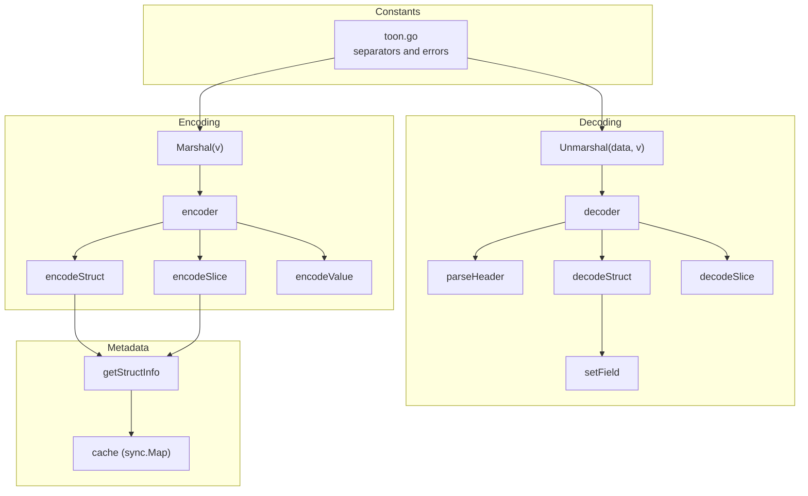
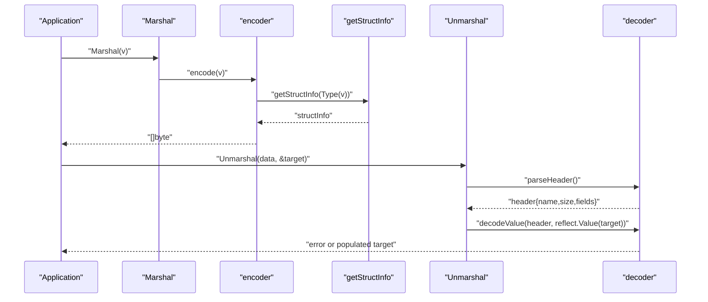
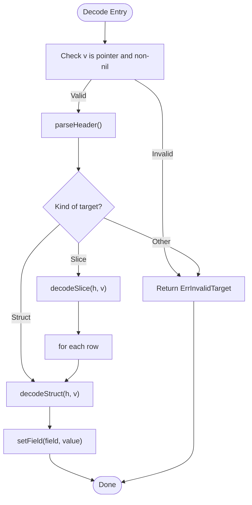
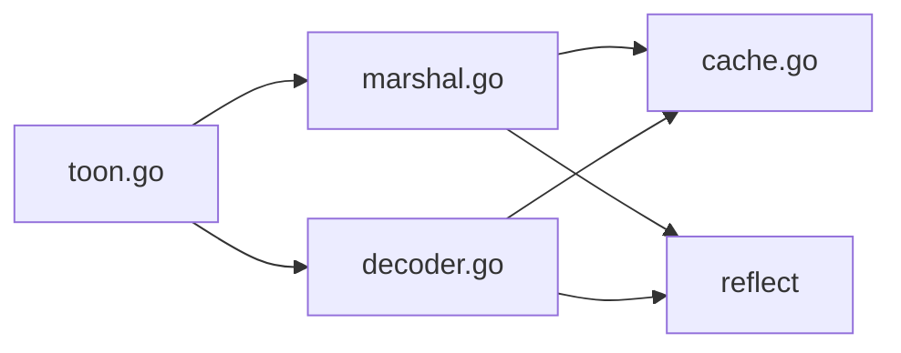

# Core Concepts and Data Types

<cite>
**Referenced Files in This Document**
- [toon.go](file://toon.go)
- [marshal.go](file://marshal.go)
- [decoder.go](file://decoder.go)
- [cache.go](file://cache.go)
- [marshal_test.go](file://marshal_test.go)
- [decoder_test.go](file://decoder_test.go)
</cite>

## Table of Contents
1. [Introduction](#introduction)
2. [Project Structure](#project-structure)
3. [Core Components](#core-components)
4. [Architecture Overview](#architecture-overview)
5. [Detailed Component Analysis](#detailed-component-analysis)
6. [Dependency Analysis](#dependency-analysis)
7. [Performance Considerations](#performance-considerations)
8. [Troubleshooting Guide](#troubleshooting-guide)
9. [Conclusion](#conclusion)

## Introduction
This document explains TOON’s core data model and how it maps to Go’s native types. TOON v3.0 encodes structured data as human-readable, compact text with a header that describes the type name, optional size, and field list, followed by comma-separated values. The library supports marshaling/unmarshaling of structs and slices, with special handling for pointers and nested arrays. While TOON itself does not define a dedicated Value union type, the decoding process uses Go’s reflection to interpret values according to the target Go types. This document focuses on the practical data model exposed by the library: Struct, Slice, String, Int, Uint, Float, Bool, and Nil (represented by a tilde), along with the header grammar and parsing behavior.

## Project Structure
The repository provides a compact implementation of TOON v3.0 encoding and decoding:
- Encoding: marshal.go defines the Marshal function and the encoder that writes headers and values.
- Decoding: decoder.go defines Unmarshal and the decoder that parses headers and populates Go values via reflection.
- Metadata caching: cache.go caches struct field metadata to avoid repeated reflection overhead.
- Constants and errors: toon.go centralizes constants for separators and error conditions.
- Tests: marshal_test.go and decoder_test.go demonstrate supported types and usage patterns.

**Diagram sources**
- [marshal.go](file://marshal.go#L17-L38)
- [marshal.go](file://marshal.go#L45-L65)
- [marshal.go](file://marshal.go#L67-L93)
- [marshal.go](file://marshal.go#L95-L137)
- [marshal.go](file://marshal.go#L139-L171)
- [decoder.go](file://decoder.go#L8-L22)
- [decoder.go](file://decoder.go#L24-L32)
- [decoder.go](file://decoder.go#L70-L115)
- [decoder.go](file://decoder.go#L189-L229)
- [decoder.go](file://decoder.go#L231-L267)
- [decoder.go](file://decoder.go#L269-L302)
- [cache.go](file://cache.go#L24-L38)
- [cache.go](file://cache.go#L40-L74)
- [toon.go](file://toon.go#L10-L18)

**Section sources**
- [marshal.go](file://marshal.go#L1-L172)
- [decoder.go](file://decoder.go#L1-L303)
- [cache.go](file://cache.go#L1-L92)
- [toon.go](file://toon.go#L1-L19)

## Core Components
- TOON v3.0 header grammar: name[size]{field1,field2,...}:
  - name: lowercase struct type name
  - [size]: optional cardinality for slices
  - {fields}: comma-separated exported field names
  - : terminator
- Encoding rules:
  - Struct: header followed by values in field order
  - Slice: header with size, then rows separated by newline
  - Values: string, integer, float, boolean (+ for true, - for false), nested arrays [v1,v2,...], nil represented by ~
- Decoding rules:
  - Unmarshal requires a pointer to struct or slice
  - Decoder parses header, skips whitespace, and feeds values into setField
  - setField converts strings to Go-native types using strconv
- Caching:
  - Struct metadata is cached to accelerate repeated marshaling/unmarshaling

Practical data types exposed by the library:
- Struct: composite record with named fields
- Slice: ordered collection with optional size
- String: textual values
- Int/Uint: signed and unsigned integers
- Float64: floating-point values
- Bool: boolean values (+ or -)
- Nil: represented by ~ for pointers and empty slices

**Section sources**
- [toon.go](file://toon.go#L10-L18)
- [marshal.go](file://marshal.go#L50-L65)
- [marshal.go](file://marshal.go#L139-L171)
- [decoder.go](file://decoder.go#L8-L22)
- [decoder.go](file://decoder.go#L175-L187)
- [decoder.go](file://decoder.go#L269-L302)
- [cache.go](file://cache.go#L24-L38)

## Architecture Overview
The encoding and decoding pipeline relies on reflection to map TOON headers and values onto Go types. The encoder builds a header from struct metadata and writes values in order. The decoder parses the header, maps field names to indices, and assigns values using setField. Metadata caching avoids repeated reflection work.

**Diagram sources**
- [marshal.go](file://marshal.go#L17-L38)
- [marshal.go](file://marshal.go#L50-L65)
- [marshal.go](file://marshal.go#L67-L93)
- [decoder.go](file://decoder.go#L8-L22)
- [decoder.go](file://decoder.go#L70-L115)
- [decoder.go](file://decoder.go#L175-L187)
- [cache.go](file://cache.go#L24-L38)

## Detailed Component Analysis

### TOON Grammar and Binary Representation
- Header: name[size]{fields}:
  - name: lowercase struct name
  - [size]: decimal number for slice length
  - {fields}: comma-separated field names
  - : terminator
- Values:
  - String: raw characters
  - Int/Uint: base-10 digits
  - Float64: decimal representation
  - Bool: + (true), - (false)
  - Nil: ~
  - Nested array: [v1,v2,...]
- Slices: rows separated by newline after header

Examples of encoded forms (described):
- Struct: "user{id,name}:42,John"
- Slice with size: "user[2]{id,name}:1,Alice\n2,Bob"
- Bool true: "+"
- Bool false: "-"
- Nil pointer: "~"
- Empty slice: "~"
- Nested array: "[1,2,3]"

These examples are derived from tests and encoder behavior.

**Section sources**
- [toon.go](file://toon.go#L10-L18)
- [marshal.go](file://marshal.go#L67-L93)
- [marshal.go](file://marshal.go#L95-L137)
- [marshal.go](file://marshal.go#L139-L171)
- [decoder_test.go](file://decoder_test.go#L96-L143)
- [marshal_test.go](file://marshal_test.go#L18-L73)

### Type Checking and Navigation
- Target validation: Unmarshal requires a pointer; otherwise ErrInvalidTarget is returned.
- Kind-based dispatch: encoder.encode and decoder.decodeValue branch on reflect.Kind to handle struct, slice, pointer, and primitive values.
- Field mapping: decoder uses cached field names to index into struct fields.
- Slice iteration: decoder iterates rows and fields; encoder writes newline-separated rows for slices.

**Diagram sources**
- [decoder.go](file://decoder.go#L8-L22)
- [decoder.go](file://decoder.go#L175-L187)
- [decoder.go](file://decoder.go#L189-L229)
- [decoder.go](file://decoder.go#L231-L267)
- [decoder.go](file://decoder.go#L269-L302)

**Section sources**
- [decoder.go](file://decoder.go#L8-L22)
- [decoder.go](file://decoder.go#L175-L187)
- [decoder.go](file://decoder.go#L189-L229)
- [decoder.go](file://decoder.go#L231-L267)
- [decoder.go](file://decoder.go#L269-L302)

### Relationship Between TOON Types and Go Types
- Struct: maps to Go struct; exported fields become fields; unexported fields are ignored.
- Slice: maps to Go slice; rows are decoded into slice elements.
- String: maps to Go string.
- Int/Uint: maps to Go signed/unsigned integers.
- Float64: maps to Go float64.
- Bool: maps to Go bool; encoded as + or -.
- Nil: encoded as ~ for pointers and empty slices.

This mapping is enforced by setField and encoder.encodeValue.

**Section sources**
- [decoder.go](file://decoder.go#L269-L302)
- [marshal.go](file://marshal.go#L139-L171)
- [marshal.go](file://marshal.go#L95-L99)

### Constructor Functions and Access Patterns
- Constructors: There are no explicit Value constructors in the codebase. Instead, values are constructed implicitly during decoding or passed as pointers to Marshal/Unmarshal.
- Access patterns:
  - Struct fields: accessed by name via cached field indices.
  - Slice elements: accessed by index via reflect.Value.Index.
  - Length: reflect.Value.Len used for slices.
  - Nil checks: reflect.Value.IsNil for pointers.

These patterns are visible in encoder.encodeSlice, encoder.encodeStruct, and decoder.decodeSlice/decodeStruct.

**Section sources**
- [marshal.go](file://marshal.go#L95-L137)
- [marshal.go](file://marshal.go#L67-L93)
- [decoder.go](file://decoder.go#L231-L267)
- [decoder.go](file://decoder.go#L189-L229)

## Dependency Analysis
The core dependencies are:
- marshal.go depends on cache.go for struct metadata and uses reflect for encoding.
- decoder.go depends on cache.go indirectly via field mapping and uses reflect for decoding.
- toon.go provides shared constants and errors.

**Diagram sources**
- [marshal.go](file://marshal.go#L1-L172)
- [decoder.go](file://decoder.go#L1-L303)
- [cache.go](file://cache.go#L1-L92)
- [toon.go](file://toon.go#L1-L19)

**Section sources**
- [marshal.go](file://marshal.go#L1-L172)
- [decoder.go](file://decoder.go#L1-L303)
- [cache.go](file://cache.go#L1-L92)
- [toon.go](file://toon.go#L1-L19)

## Performance Considerations
- Zero-allocation encoding: buffer pooling via sync.Pool reduces allocations during Marshal.
- Reflection caching: struct metadata is cached in a sync.Map to minimize reflection overhead.
- Streaming-like decoding: decoder scans byte streams without intermediate allocations for header parsing.
- Practical tips:
  - Reuse buffers for repeated marshaling when possible.
  - Prefer preallocating slices when decoding large datasets.
  - Keep struct tags concise to reduce tag parsing overhead.

**Section sources**
- [marshal.go](file://marshal.go#L10-L15)
- [marshal.go](file://marshal.go#L17-L38)
- [cache.go](file://cache.go#L21-L38)
- [decoder.go](file://decoder.go#L52-L61)

## Troubleshooting Guide
Common issues and resolutions:
- ErrInvalidTarget:
  - Occurs when Marshal/Unmarshal receives a non-pointer or nil pointer.
  - Ensure you pass a pointer to a struct or slice.
- ErrMalformedTOON:
  - Occurs when the header or values are syntactically invalid (e.g., missing colon, invalid size).
  - Verify the header follows name[size]{fields}: and values match expected types.
- Unexpected field values:
  - Decoder ignores unexported fields and fields tagged with "-" in struct tags.
  - Confirm struct tags and exported fields align with expectations.

**Section sources**
- [toon.go](file://toon.go#L5-L8)
- [decoder.go](file://decoder.go#L8-L22)
- [decoder.go](file://decoder.go#L175-L187)
- [decoder.go](file://decoder.go#L269-L302)
- [cache.go](file://cache.go#L55-L65)

## Conclusion
TOON v3.0 provides a compact, readable serialization format centered on a header grammar and comma-separated values. The library leverages Go’s reflection and metadata caching to efficiently marshal and unmarshal structs and slices, while representing primitives and nil values with simple, unambiguous encodings. Understanding the header structure, value encodings, and reflection-driven mapping helps you use TOON effectively and troubleshoot common issues.