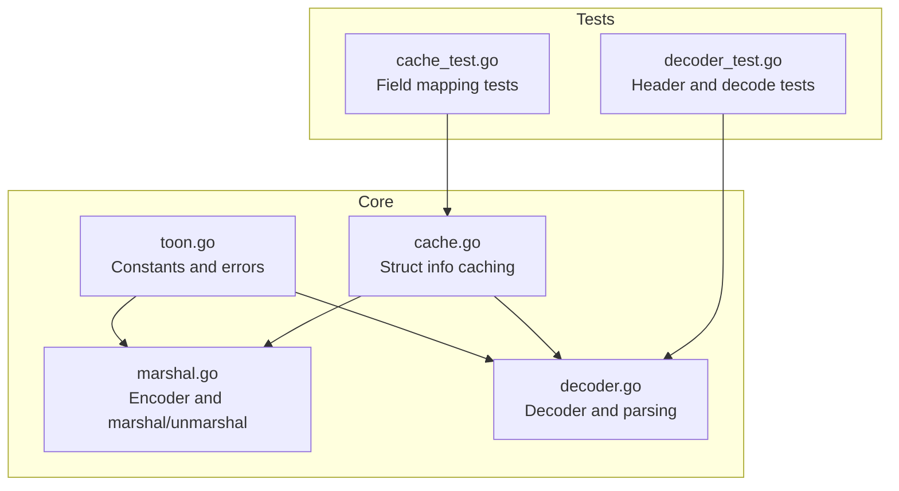
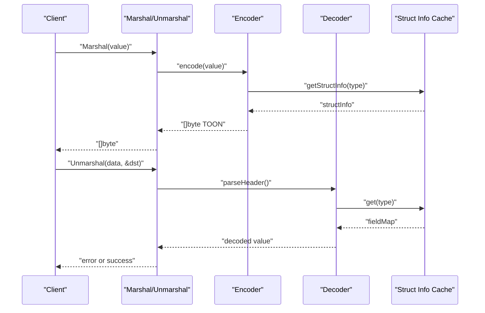
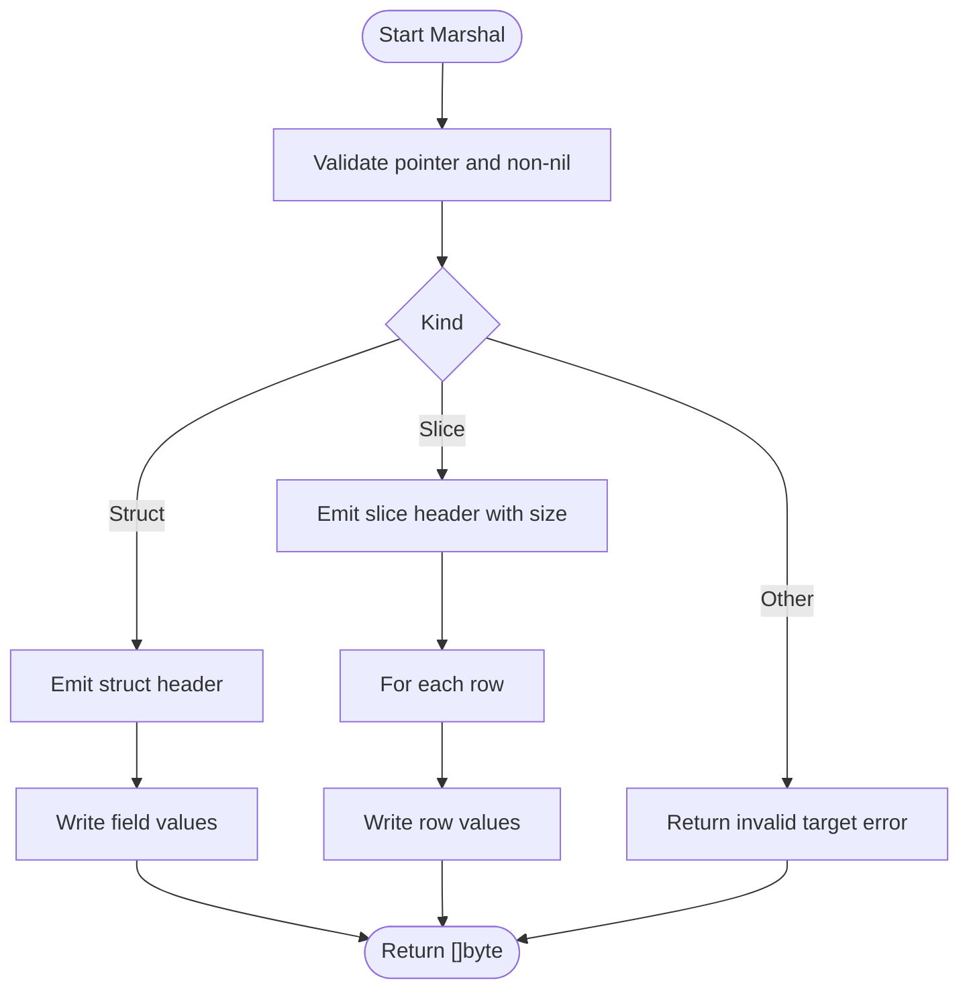
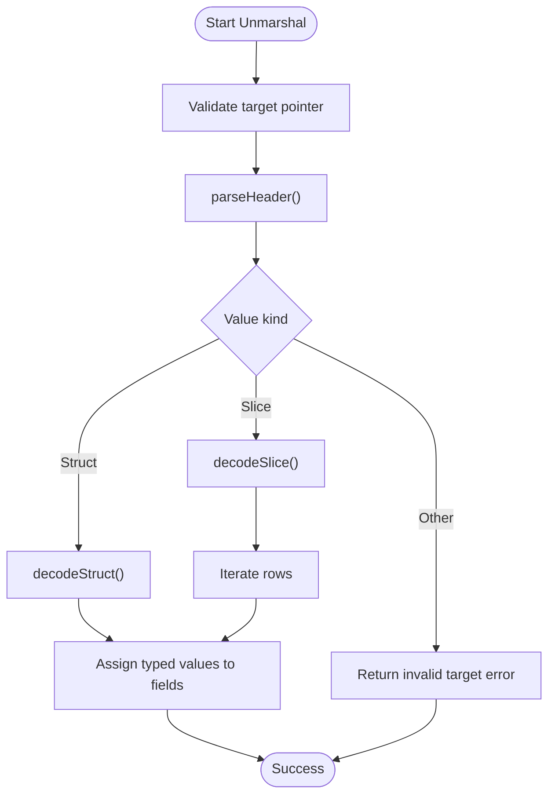
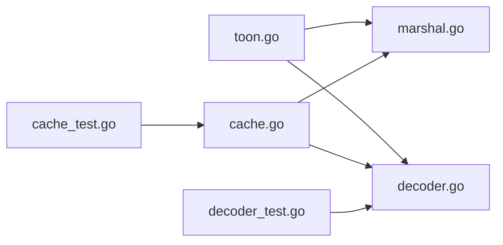

# Introduction to TOON Format

<cite>
**Referenced Files in This Document**
- [toon.go](file://toon.go)
- [marshal.go](file://marshal.go)
- [decoder.go](file://decoder.go)
- [cache.go](file://cache.go)
- [decoder_test.go](file://decoder_test.go)
- [cache_test.go](file://cache_test.go)
</cite>

## Table of Contents
1. [Introduction](#introduction)
2. [Project Structure](#project-structure)
3. [Core Components](#core-components)
4. [Architecture Overview](#architecture-overview)
5. [Detailed Component Analysis](#detailed-component-analysis)
6. [Dependency Analysis](#dependency-analysis)
7. [Performance Considerations](#performance-considerations)
8. [Troubleshooting Guide](#troubleshooting-guide)
9. [Conclusion](#conclusion)

## Introduction
TOON (Token-Oriented Object Notation) is a compact, binary-oriented serialization format designed to optimize token efficiency for Large Language Model (LLM) applications and systems that process structured data at scale. Unlike traditional text-based formats such as JSON, TOON uses a concise, delimiter-driven structure to represent typed data with minimal overhead. It targets scenarios where reducing token count improves throughput, lowers latency, and decreases bandwidth costs—particularly in distributed systems, model training pipelines, and real-time inference workloads.

Key characteristics of TOON include:
- Binary nature: The format is optimized for bytes rather than human-readable text, enabling smaller payloads and faster parsing.
- Header-driven structure: Each value begins with a header specifying the type name, optional size, and field list, followed by comma-separated values.
- Zero-allocation encoding: The encoder leverages a buffer pool to minimize garbage collection pressure during serialization.
- Field mapping via reflection: Struct fields are mapped using Go’s reflection with optional tag-based customization for field names.
- Robust decoding: The decoder supports structs and slices, with strict validation and error signaling for malformed inputs.

Benefits for LLM applications and data-intensive systems:
- Up to 40% token efficiency improvement over comparable text-based formats, primarily due to reduced delimiters, compact numeric encodings, and absence of whitespace.
- Predictable parsing behavior with minimal memory allocations, improving throughput in high-throughput environments.
- Compact representation of arrays and nested structures, beneficial for streaming and batch processing.

Practical examples:
- A simple struct with two fields encodes to a header followed by comma-separated values.
- A slice of structs encodes with a header containing the element count, followed by newline-separated rows of values.
- Nil pointers and empty slices are represented with a placeholder character, ensuring consistent behavior across languages and platforms.

Target audience and use cases:
- LLM data pipelines requiring efficient storage and transmission of structured prompts, responses, and intermediate artifacts.
- Real-time systems needing fast, allocation-free serialization and deserialization.
- Distributed systems exchanging typed data between microservices, especially when minimizing token counts is critical.
- Training datasets and model artifacts where compactness and speed matter more than human readability.

## Project Structure
The repository implements a minimal yet complete TOON v3.0 encoder and decoder in Go, along with caching and tests that demonstrate the format’s behavior.

**Diagram sources**
- [toon.go](file://toon.go#L1-L19)
- [marshal.go](file://marshal.go#L1-L172)
- [decoder.go](file://decoder.go#L1-L303)
- [cache.go](file://cache.go#L1-L92)
- [decoder_test.go](file://decoder_test.go#L1-L157)
- [cache_test.go](file://cache_test.go#L1-L60)

**Section sources**
- [toon.go](file://toon.go#L1-L19)
- [marshal.go](file://marshal.go#L1-L172)
- [decoder.go](file://decoder.go#L1-L303)
- [cache.go](file://cache.go#L1-L92)
- [decoder_test.go](file://decoder_test.go#L1-L157)
- [cache_test.go](file://cache_test.go#L1-L60)

## Core Components
- Constants and errors define the TOON v3.0 syntax tokens and standardized error conditions for malformed or invalid targets.
- Encoder: Implements zero-allocation marshaling using a buffer pool, emitting headers and values according to the v3.0 specification.
- Decoder: Parses headers, validates structure, and populates Go structs or slices with typed values.
- Cache: Provides thread-safe, reflection-based struct metadata caching to accelerate repeated encodes and decodes.

**Section sources**
- [toon.go](file://toon.go#L1-L19)
- [marshal.go](file://marshal.go#L17-L65)
- [decoder.go](file://decoder.go#L8-L22)
- [cache.go](file://cache.go#L21-L38)

## Architecture Overview
The TOON library exposes a simple API surface with two primary functions:
- Marshal: Encodes a Go value into a TOON byte sequence.
- Unmarshal: Decodes a TOON byte sequence into a destination pointer to a struct or slice.

Internally, the encoder builds headers and values, while the decoder parses headers and feeds typed values into the destination via reflection. A cache stores struct metadata to avoid repeated reflection work.

**Diagram sources**
- [marshal.go](file://marshal.go#L17-L65)
- [decoder.go](file://decoder.go#L8-L22)
- [cache.go](file://cache.go#L24-L38)

## Detailed Component Analysis

### TOON v3.0 Specification Elements
TOON v3.0 defines a concise header grammar and value encoding rules:
- Header: name[size]{field1,field2,...}:
  - name: lowercase type name
  - [size]: optional cardinality for slices
  - {fields}: ordered field list
  - : terminator
- Values: Comma-separated values per field order; nested slices are bracketed lists.
- Special values: Nil pointers are encoded as a placeholder; empty slices are encoded as a placeholder.

These rules are enforced by the encoder and decoder, with constants and error values defined centrally.

**Section sources**
- [toon.go](file://toon.go#L10-L18)
- [marshal.go](file://marshal.go#L67-L137)
- [decoder.go](file://decoder.go#L71-L115)

### Encoding Workflow
The encoder traverses the input value:
- For structs: emits the header with field names and then serializes each field in order.
- For slices: emits a header with the length, then each row separated by newlines.
- For scalars: emits the appropriate textual representation; booleans use single-character markers.

Zero-allocation behavior is achieved by reusing a pooled buffer and copying the final result.

**Diagram sources**
- [marshal.go](file://marshal.go#L17-L65)
- [marshal.go](file://marshal.go#L67-L137)
- [marshal.go](file://marshal.go#L139-L171)

**Section sources**
- [marshal.go](file://marshal.go#L17-L65)
- [marshal.go](file://marshal.go#L67-L137)
- [marshal.go](file://marshal.go#L139-L171)

### Decoding Workflow
The decoder:
- Parses the header to extract type name, optional size, and field list.
- Skips whitespace and reads values until separators or end-of-row.
- Converts string values to the appropriate Go types and assigns them to struct fields.
- Supports slices by iterating rows and constructing elements.

Field mapping is resolved via cached metadata for performance.

**Diagram sources**
- [decoder.go](file://decoder.go#L8-L22)
- [decoder.go](file://decoder.go#L71-L115)
- [decoder.go](file://decoder.go#L175-L229)
- [decoder.go](file://decoder.go#L231-L267)

**Section sources**
- [decoder.go](file://decoder.go#L8-L22)
- [decoder.go](file://decoder.go#L71-L115)
- [decoder.go](file://decoder.go#L175-L229)
- [decoder.go](file://decoder.go#L231-L267)

### Practical Examples
Examples below illustrate how TOON encodes common structures. Replace the placeholders with the actual byte sequences and JSON equivalents as shown in the tests.

- Simple struct encoding:
  - Header: type name with field list
  - Values: comma-separated values in field order
  - Example reference: [decoder_test.go](file://decoder_test.go#L96-L116)

- Slice of structs encoding:
  - Header: type name, size, field list
  - Values: newline-separated rows of comma-separated values
  - Example reference: [decoder_test.go](file://decoder_test.go#L118-L143)

- Header parsing:
  - Name-only, with size, with fields, and full header variants
  - Example reference: [decoder_test.go](file://decoder_test.go#L27-L94)

- Field mapping and tags:
  - Exported fields, tagged fields, and unexported fields
  - Example reference: [cache_test.go](file://cache_test.go#L8-L42)

**Section sources**
- [decoder_test.go](file://decoder_test.go#L27-L94)
- [decoder_test.go](file://decoder_test.go#L96-L143)
- [cache_test.go](file://cache_test.go#L8-L42)

### Target Audience and Use Cases
- LLM data pipelines: Efficiently serialize prompts, completions, and artifacts with minimal token overhead.
- Streaming analytics: Compact representation of event streams and telemetry data.
- Microservices: Fast, allocation-free serialization for inter-service communication.
- Training datasets: Smaller storage footprint and faster I/O for large-scale datasets.

## Dependency Analysis
The core components interact as follows:
- Constants and errors are shared across encoder and decoder.
- Encoder depends on cache for struct metadata and uses a buffer pool for zero-allocation behavior.
- Decoder depends on cache for field mapping and uses reflection to populate values.
- Tests exercise both encoding and decoding paths, validating header parsing and field mapping.

**Diagram sources**
- [toon.go](file://toon.go#L1-L19)
- [marshal.go](file://marshal.go#L1-L172)
- [decoder.go](file://decoder.go#L1-L303)
- [cache.go](file://cache.go#L1-L92)
- [decoder_test.go](file://decoder_test.go#L1-L157)
- [cache_test.go](file://cache_test.go#L1-L60)

**Section sources**
- [toon.go](file://toon.go#L1-L19)
- [marshal.go](file://marshal.go#L1-L172)
- [decoder.go](file://decoder.go#L1-L303)
- [cache.go](file://cache.go#L1-L92)
- [decoder_test.go](file://decoder_test.go#L1-L157)
- [cache_test.go](file://cache_test.go#L1-L60)

## Performance Considerations
- Zero-allocation encoding: Buffer pooling minimizes GC pressure; final copy ensures safety.
- Reflection caching: Struct metadata is cached to avoid repeated reflection overhead.
- Compact representation: Fewer delimiters and whitespace reduce payload size and parsing cost.
- Practical guidance: Prefer preallocating buffers for very large payloads; reuse destinations when decoding into existing slices.

## Troubleshooting Guide
Common issues and resolutions:
- Invalid target errors: Ensure the destination for Unmarshal is a pointer to a struct or slice.
- Malformed TOON errors: Verify headers, sizes, and delimiters conform to v3.0 syntax.
- Unexpected field values: Confirm struct tags and field visibility match expectations; unexported fields are ignored.

**Section sources**
- [toon.go](file://toon.go#L5-L8)
- [decoder.go](file://decoder.go#L10-L22)
- [decoder.go](file://decoder.go#L269-L302)
- [cache.go](file://cache.go#L40-L74)

## Conclusion
TOON v3.0 offers a compact, allocation-efficient serialization format tailored for LLM applications and data-intensive systems. Its header-driven design, zero-allocation encoder, and reflection-backed decoder deliver predictable performance and strong interoperability. By reducing token overhead and simplifying parsing, TOON enables faster, more scalable data exchange across modern distributed architectures.