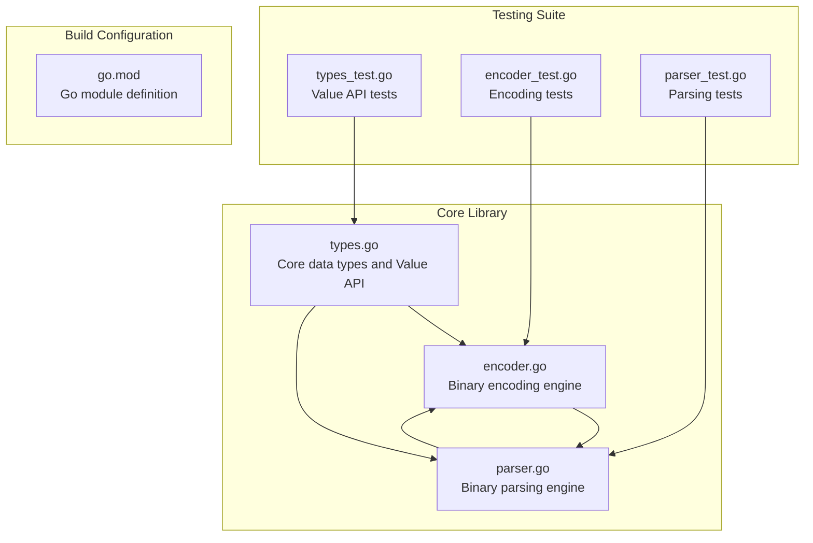
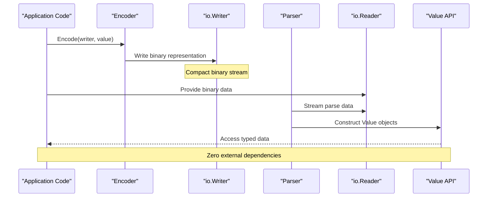
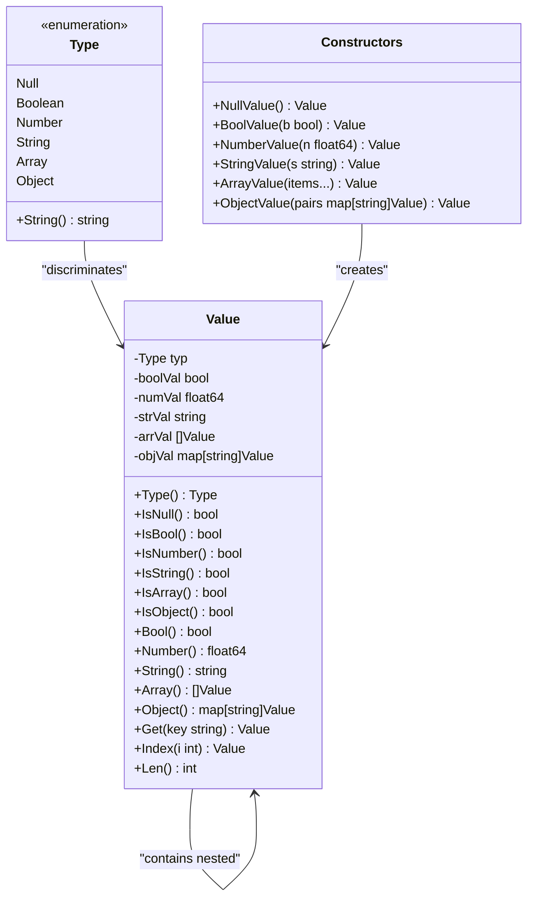
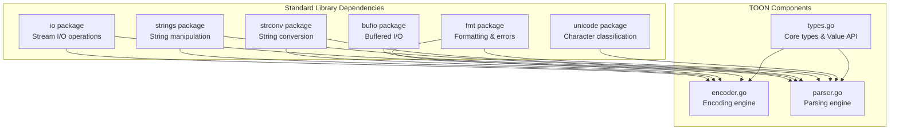

# Project Overview

<cite>
**Referenced Files in This Document**
- [encoder.go](file://encoder.go)
- [parser.go](file://parser.go)
- [types.go](file://types.go)
- [go.mod](file://go.mod)
- [encoder_test.go](file://encoder_test.go)
- [parser_test.go](file://parser_test.go)
- [types_test.go](file://types_test.go)
</cite>

## Table of Contents
1. [Introduction](#introduction)
2. [Project Structure](#project-structure)
3. [Core Components](#core-components)
4. [Architecture Overview](#architecture-overview)
5. [Detailed Component Analysis](#detailed-component-analysis)
6. [Dependency Analysis](#dependency-analysis)
7. [Performance Considerations](#performance-considerations)
8. [Troubleshooting Guide](#troubleshooting-guide)
9. [Conclusion](#conclusion)

## Introduction

go-toon is a high-performance binary serialization library designed specifically for Large Language Model (LLM) applications. The project implements Token-Oriented Object Notation (TOON), a compact binary format that achieves up to 40% reduction in token usage compared to JSON, making it ideal for LLM training datasets, inference pipelines, and model storage.

Unlike traditional text-based formats like JSON or Protocol Buffers, TOON is optimized for token efficiency in LLM contexts. The format uses minimal punctuation and whitespace, relying on simple delimiters and separators that compress well in tokenization schemes commonly used by modern LLMs.

The library provides a complete implementation with streaming I/O support, deterministic output generation, and zero external dependencies. It targets Go applications that need efficient serialization for machine learning workflows, particularly where token economy matters for cost optimization and performance.

## Project Structure

The go-toon project follows a clean, modular architecture with three primary components:



**Diagram sources**
- [types.go](file://types.go#L1-L209)
- [encoder.go](file://encoder.go#L1-L192)
- [parser.go](file://parser.go#L1-L411)

**Section sources**
- [go.mod](file://go.mod#L1-L4)

## Core Components

### Value System and Data Types

The foundation of TOON lies in its unified Value system that encapsulates all supported data types. The library defines six fundamental types that mirror JSON's core primitives:

- **Null**: Represents absence of value using a single character marker
- **Boolean**: Efficiently encoded with single-character indicators for true/false
- **Number**: Supports both integers and floating-point values with scientific notation
- **String**: UTF-8 compatible with comprehensive escape sequence support
- **Array**: Ordered collections of Values with flexible typing
- **Object**: Key-value mappings with identifier optimization

Each Value maintains internal type safety with explicit conversion methods that panic when attempting invalid type conversions, ensuring runtime safety and preventing silent errors.

### Encoding Engine

The Encoder component transforms Go Values into compact binary representations. It employs several optimization strategies:

- **Minimal Punctuation**: Uses simple delimiters ([, ], {, }) and single-space separators
- **Identifier Optimization**: Keys that match identifier rules are written without quotes
- **Deterministic Output**: Arrays and objects are processed in sorted order for consistent serialization
- **Efficient Number Encoding**: Integers are written as decimal strings without fractional parts

### Parsing Engine

The Parser reconstructs Values from TOON-encoded data streams. It provides robust error handling and supports:

- **Streaming I/O**: Processes data incrementally without buffering entire documents
- **Whitespace Handling**: Ignores arbitrary whitespace between tokens
- **Escape Sequence Processing**: Full support for Unicode and control character escapes
- **Type Ambiguity Resolution**: Smart parsing that distinguishes between booleans and numbers

**Section sources**
- [types.go](file://types.go#L9-L25)
- [types.go](file://types.go#L47-L59)
- [encoder.go](file://encoder.go#L10-L13)
- [parser.go](file://parser.go#L12-L16)

## Architecture Overview

The TOON library implements a classic client-server architecture pattern optimized for streaming data processing:



**Diagram sources**
- [encoder.go](file://encoder.go#L15-L19)
- [parser.go](file://parser.go#L18-L33)

The architecture emphasizes streaming I/O operations, allowing the library to process large datasets without loading entire documents into memory. Both Encoder and Parser use buffered I/O internally while exposing streaming interfaces to applications.

## Detailed Component Analysis

### Type System Design

The Value type serves as the central abstraction for all TOON data. It implements a discriminated union pattern with explicit type checking:



**Diagram sources**
- [types.go](file://types.go#L9-L25)
- [types.go](file://types.go#L47-L59)
- [types.go](file://types.go#L178-L209)

The type system ensures compile-time safety while maintaining runtime flexibility. Each constructor method validates input and sets appropriate internal state, preventing malformed Values from entering the system.

### Encoding Implementation

The encoding process transforms Values into their binary representation through a recursive descent approach:

```mermaid
flowchart TD
Start([Start Encoding]) --> CheckType{"Value Type?"}
CheckType --> |Null| WriteNull["Write '~'"]
CheckType --> |Boolean| CheckBool{"Boolean Value?"}
CheckType --> |Number| EncodeNumber["Format Number"]
CheckType --> |String| EncodeString["Process String"]
CheckType --> |Array| EncodeArray["Process Array"]
CheckType --> |Object| EncodeObject["Process Object"]
CheckBool --> |True| WritePlus["Write '+'"]
CheckBool --> |False| WriteMinus["Write '-'"]
EncodeNumber --> WriteNumber["Write Formatted Number"]
EncodeString --> ProcessEscapes["Process Escapes & Quotes"]
ProcessEscapes --> WriteString["Write '\"' + Content + '\"'"]
EncodeArray --> WriteOpenBracket["Write '['"]
WriteOpenBracket --> LoopItems{"More Items?"}
LoopItems --> |Yes| EncodeItem["Encode Item"] --> AddSeparator["Write Space"] --> LoopItems
LoopItems --> |No| WriteCloseBracket["Write ']'"]
EncodeObject --> WriteOpenBrace["Write '{'"]
WriteOpenBrace --> CheckKeys{"More Keys?"}
CheckKeys --> |Yes| CheckIdentifier{"Is Identifier?"}
CheckIdentifier --> |Yes| WriteKey["Write Key"]
CheckIdentifier --> |No| EncodeKeyString["Encode Key String"]
CheckKeys --> |No| WriteCloseBrace["Write '}'"]
WriteNull --> End([End])
WritePlus --> End
WriteMinus --> End
WriteNumber --> End
WriteString --> End
WriteCloseBracket --> End
WriteCloseBrace --> End
```

**Diagram sources**
- [encoder.go](file://encoder.go#L31-L51)
- [encoder.go](file://encoder.go#L96-L113)
- [encoder.go](file://encoder.go#L115-L163)

The encoding algorithm prioritizes determinism by sorting object keys and using consistent formatting rules. This ensures identical input produces identical output, crucial for caching and reproducibility in ML workflows.

### Parsing Implementation

The parsing engine reverses the encoding process with sophisticated lookahead and error handling:

```mermaid
flowchart TD
Start([Start Parsing]) --> SkipWS["Skip Whitespace"]
SkipWS --> PeekChar{"Next Character"}
PeekChar --> |'~'| ParseNull["Parse Null"]
PeekChar --> |'+'| ParseBoolean["Parse Boolean"]
PeekChar --> |'-'| ParseBoolean
PeekChar --> |'"'| ParseString["Parse String"]
PeekChar --> |'['| ParseArray["Parse Array"]
PeekChar --> |'{'| ParseObject["Parse Object"]
PeekChar --> |Digit| ParseNumber["Parse Number"]
PeekChar --> |'. '| ParseNumber
PeekChar --> |EOF| ErrorEOF["Return EOF Error"]
PeekChar --> |Other| ErrorInvalid["Return Invalid Token Error"]
ParseNull --> ValidateNull{"Is '~'?"}
ValidateNull --> |Yes| CreateNull["Create Null Value"]
ValidateNull --> |No| ErrorNull["Return Parse Error"]
ParseBoolean --> ReadSign["Read Sign"]
ReadSign --> CreateBool["Create Boolean Value"]
ParseString --> ReadQuote["Read '\"'"]
ReadQuote --> LoopChars{"More Characters?"}
LoopChars --> |Escape| ProcessEscape["Process Escape Sequence"]
LoopChars --> |Quote| CreateString["Create String Value"]
LoopChars --> |Other| AppendChar["Append Character"]
ProcessEscape --> LoopChars
AppendChar --> LoopChars
ParseArray --> ReadOpen["Read '['"]
ReadOpen --> LoopArray{"More Elements?"}
LoopArray --> |']'| CreateArray["Create Array Value"]
LoopArray --> |Other| ParseElement["Parse Element"] --> LoopArray
ParseObject --> ReadOpenBrace["Read '{'"]
ReadOpenBrace --> LoopObject{"More Pairs?"}
LoopObject --> |'}'| CreateObject["Create Object Value"]
LoopObject --> |Other| ParseKey["Parse Key"] --> ParseValue["Parse Value"] --> LoopObject
CreateNull --> End([End])
CreateBool --> End
CreateString --> End
CreateArray --> End
CreateObject --> End
ErrorEOF --> End
ErrorInvalid --> End
ErrorNull --> End
```

**Diagram sources**
- [parser.go](file://parser.go#L40-L70)
- [parser.go](file://parser.go#L255-L283)
- [parser.go](file://parser.go#L285-L323)

The parser implements robust error recovery and provides detailed error messages for debugging. It handles edge cases like unterminated strings, invalid escape sequences, and malformed structures gracefully.

**Section sources**
- [encoder.go](file://encoder.go#L31-L51)
- [parser.go](file://parser.go#L40-L70)
- [types.go](file://types.go#L47-L59)

## Dependency Analysis

The go-toon library maintains strict zero-dependency policy, relying only on Go's standard library:



**Diagram sources**
- [encoder.go](file://encoder.go#L3-L8)
- [parser.go](file://parser.go#L3-L10)
- [types.go](file://types.go#L5-L7)

This minimal dependency footprint provides several advantages:
- **Reduced Attack Surface**: Fewer external dependencies mean fewer potential security vulnerabilities
- **Faster Builds**: No external compilation steps or dependency resolution
- **Portability**: Works across all Go environments without additional setup
- **Maintenance Burden**: Easier to update and maintain with fewer moving parts

**Section sources**
- [encoder.go](file://encoder.go#L3-L8)
- [parser.go](file://parser.go#L3-L10)
- [go.mod](file://go.mod#L1-L4)

## Performance Considerations

### Memory Efficiency

The TOON library optimizes for memory usage through several mechanisms:

- **Streaming Architecture**: Both encoding and parsing operate as streaming processors, avoiding intermediate buffers for large documents
- **Deterministic Allocation**: Object keys are sorted during encoding, enabling predictable memory allocation patterns
- **Compact Representation**: Binary format eliminates whitespace and reduces overhead compared to text-based formats
- **Zero-Copy Operations**: String processing uses efficient string builders with minimal copying

### Token Economy

For LLM applications, TOON provides significant token savings:

- **Reduced Punctuation**: Uses minimal delimiters compared to JSON's verbose syntax
- **Identifier Optimization**: Unquoted keys that meet identifier criteria reduce token count
- **Consistent Formatting**: Deterministic output enables better compression and caching
- **Binary Nature**: Eliminates escape sequences and formatting overhead

### Deterministic Output Generation

The library ensures reproducible serialization through:

- **Sorted Object Keys**: Keys are processed in lexicographic order for consistent output
- **Standardized Number Formatting**: Numbers use canonical representations without locale-dependent formatting
- **Controlled Whitespace**: Uses consistent single-space separators throughout
- **Predictable Escape Sequences**: Standardized escape handling prevents variations

**Section sources**
- [encoder.go](file://encoder.go#L120-L133)
- [encoder.go](file://encoder.go#L53-L58)
- [parser.go](file://parser.go#L366-L377)

## Troubleshooting Guide

### Common Issues and Solutions

**Encoding Problems**
- **Unexpected Type Errors**: Ensure you're using the correct constructor functions for each data type
- **Memory Issues**: For large documents, consider streaming approaches rather than building entire structures in memory
- **Performance Degradation**: Verify that object keys are simple identifiers to benefit from unquoted key optimization

**Parsing Problems**
- **EOF Errors**: Check that input streams are properly closed and contain complete documents
- **Invalid Token Errors**: Validate that TOON syntax follows the specification (no extra commas, proper quoting)
- **Memory Leaks**: Ensure proper resource cleanup when using streaming parsers

**Debugging Strategies**
- **Round-trip Testing**: Verify that encoded data can be parsed back correctly
- **Type Checking**: Use the IsX methods before type conversion to avoid panics
- **Error Messages**: Pay attention to detailed error messages for quick problem identification

**Section sources**
- [encoder_test.go](file://encoder_test.go#L322-L375)
- [parser_test.go](file://parser_test.go#L401-L413)
- [types_test.go](file://types_test.go#L169-L196)

## Conclusion

go-toon represents a specialized solution for LLM-centric applications requiring efficient binary serialization. Its design prioritizes token economy, streaming capabilities, and deterministic output generation while maintaining simplicity through zero external dependencies.

The library successfully bridges the gap between human-readable text formats and machine-efficient binary representations, offering up to 40% token savings compared to JSON. Its streaming architecture makes it suitable for large-scale ML workflows, while the comprehensive test suite ensures reliability across diverse use cases.

For developers working with LLM applications, go-toon provides a compelling alternative to traditional serialization formats, particularly when token efficiency and streaming performance are critical factors in system design.