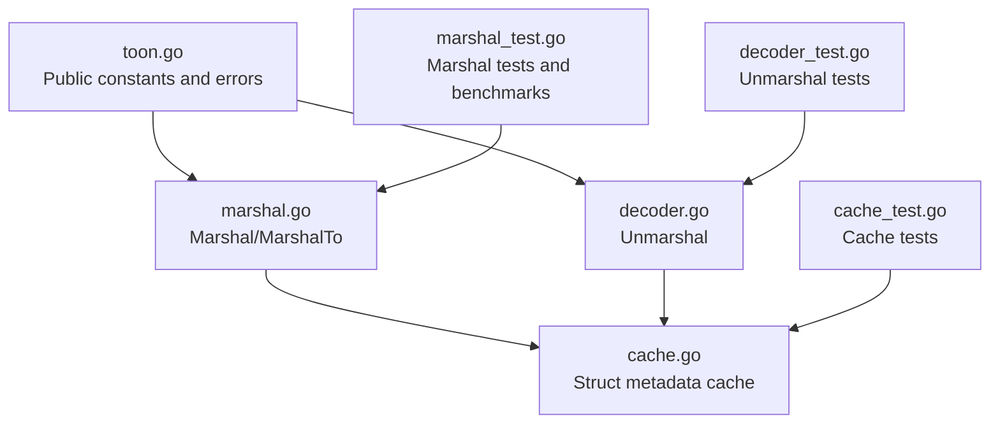
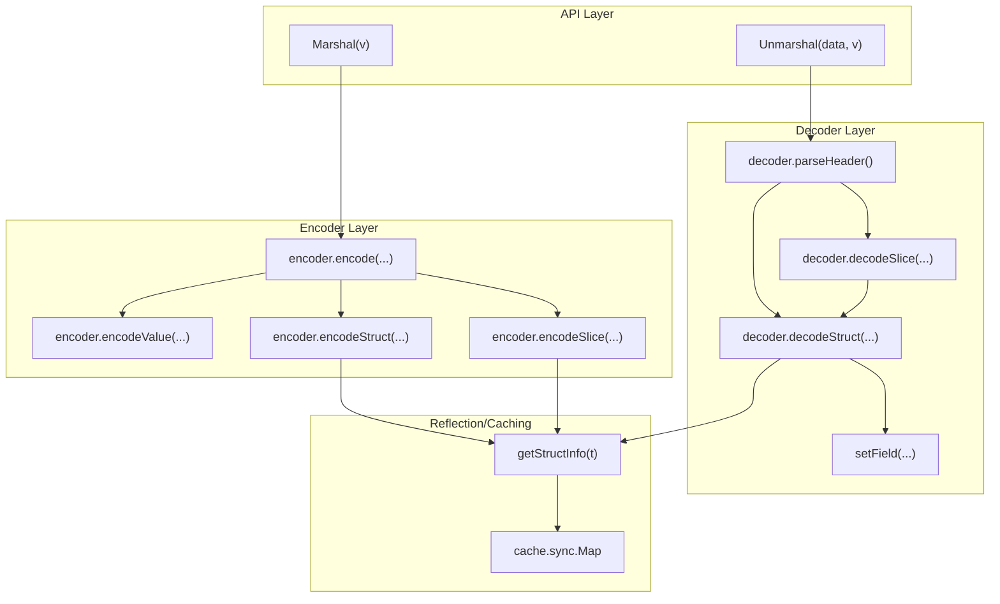
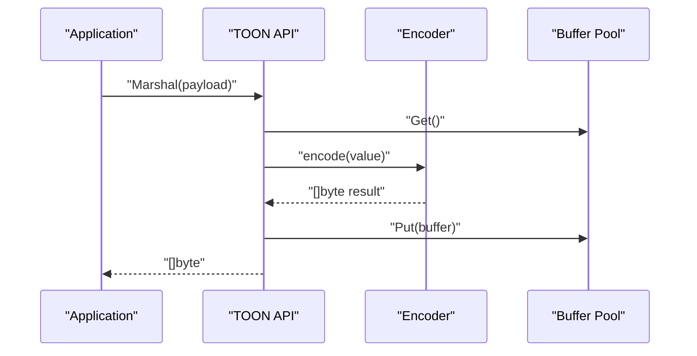
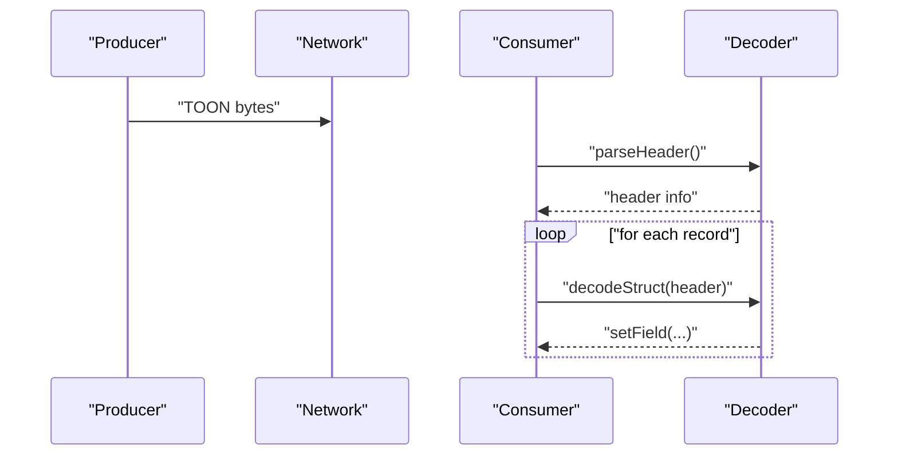
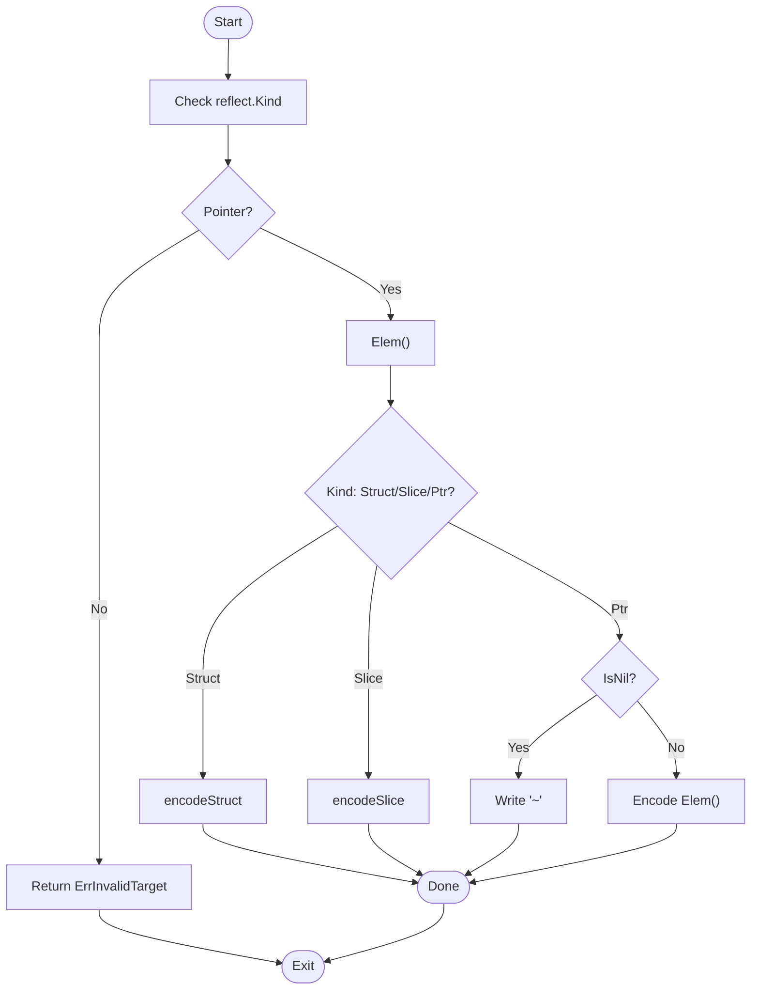
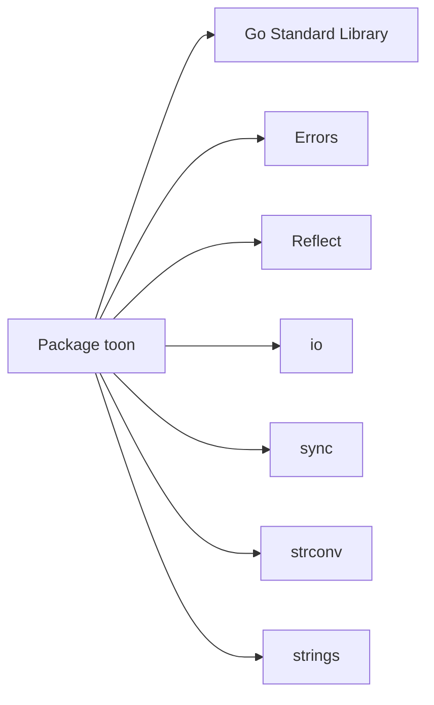

# Use Cases and Applications

<cite>
**Referenced Files in This Document**
- [toon.go](file://toon.go)
- [marshal.go](file://marshal.go)
- [decoder.go](file://decoder.go)
- [cache.go](file://cache.go)
- [marshal_test.go](file://marshal_test.go)
- [decoder_test.go](file://decoder_test.go)
- [cache_test.go](file://cache_test.go)
- [go.mod](file://go.mod)
</cite>

## Table of Contents
1. [Introduction](#introduction)
2. [Project Structure](#project-structure)
3. [Core Components](#core-components)
4. [Architecture Overview](#architecture-overview)
5. [Detailed Component Analysis](#detailed-component-analysis)
6. [Dependency Analysis](#dependency-analysis)
7. [Performance Considerations](#performance-considerations)
8. [Troubleshooting Guide](#troubleshooting-guide)
9. [Conclusion](#conclusion)
10. [Appendices](#appendices)

## Introduction
This document presents practical use cases and applications of the go-toon library, focusing on:
- LLM token efficiency optimization via compact binary-like serialization
- High-performance data interchange for microservices and streaming pipelines
- Memory-constrained environments requiring minimal allocations and small payloads
- Real-world scenarios such as large-scale batch processing, real-time systems, and distributed services
- Migration strategies from JSON and compatibility considerations

The library targets Go structs and slices, emitting a compact, header-driven format optimized for CPU and memory efficiency. Benchmarks included here are derived from the repository’s own benchmark suite.

## Project Structure
The repository is intentionally minimal and focused:
- Public API surface: marshaling/unmarshaling functions and constants
- Internal implementation: encoder/decoder with reflection-based traversal
- Caching layer for struct metadata to reduce reflection overhead
- Tests validating correctness, concurrency, and performance characteristics

**Diagram sources**
- [toon.go](file://toon.go#L1-L19)
- [marshal.go](file://marshal.go#L1-L172)
- [decoder.go](file://decoder.go#L1-L303)
- [cache.go](file://cache.go#L1-L92)
- [marshal_test.go](file://marshal_test.go#L1-L147)
- [decoder_test.go](file://decoder_test.go#L1-L159)
- [cache_test.go](file://cache_test.go#L1-L86)

**Section sources**
- [toon.go](file://toon.go#L1-L19)
- [marshal.go](file://marshal.go#L1-L172)
- [decoder.go](file://decoder.go#L1-L303)
- [cache.go](file://cache.go#L1-L92)
- [marshal_test.go](file://marshal_test.go#L1-L147)
- [decoder_test.go](file://decoder_test.go#L1-L159)
- [cache_test.go](file://cache_test.go#L1-L86)
- [go.mod](file://go.mod#L1-L4)

## Core Components
- Public constants and errors define the TOON v3.0 syntax and error semantics.
- Marshal encodes pointers to structs or slices into a compact representation using a pooled buffer and reflection.
- Unmarshal decodes TOON data into Go values without extra allocations, parsing headers and CSV-like field values.
- Struct metadata caching accelerates repeated decoding by memoizing field names and indices.

Key capabilities:
- Zero-allocation emission during encoding (buffer pooling)
- Streaming-style decoding with minimal allocations
- Compact headers carrying type names, optional sizes, and field lists
- Support for strings, integers, floats, booleans, nested slices, and null pointers

**Section sources**
- [toon.go](file://toon.go#L3-L18)
- [marshal.go](file://marshal.go#L10-L38)
- [decoder.go](file://decoder.go#L8-L22)
- [cache.go](file://cache.go#L9-L38)

## Architecture Overview
The system follows a layered design:
- API layer: public functions for marshaling/unmarshaling
- Encoder/decoder layer: stateless scanners and writers operating on byte streams
- Reflection layer: metadata extraction and value conversion
- Cache layer: concurrent metadata cache for struct types

**Diagram sources**
- [marshal.go](file://marshal.go#L17-L65)
- [decoder.go](file://decoder.go#L8-L303)
- [cache.go](file://cache.go#L24-L74)

## Detailed Component Analysis

### Use Case: LLM Token Efficiency Optimization
TOON’s compact header-driven format reduces token count compared to verbose formats like JSON. Typical advantages:
- Short type names and field lists in headers
- Minimal separators and no quotes for primitives
- Optional size hints enable preallocation and reduce framing overhead

Recommended integration patterns:
- Predefine stable struct schemas and rely on field ordering in headers
- Use consistent casing and short field names to minimize header length
- For streaming LLM prompts/chats, emit batches as TOON slices to reduce delimiter overhead

**Diagram sources**
- [marshal.go](file://marshal.go#L17-L38)

**Section sources**
- [marshal.go](file://marshal.go#L10-L38)
- [toon.go](file://toon.go#L11-L18)

### Use Case: High-Performance Data Interchange
TOON excels in microservices and pipelines where throughput matters:
- Encoding uses a pooled buffer to avoid repeated allocations
- Decoding scans byte streams without heap allocations for most operations
- Headers carry field names once, enabling fast CSV-like parsing

Integration examples:
- gRPC/HTTP microservices: replace JSON bodies with TOON for internal RPCs
- Message queues: serialize domain events as TOON slices for batch processing
- Streaming analytics: emit rolling windows as TOON arrays to reduce framing overhead

**Diagram sources**
- [decoder.go](file://decoder.go#L71-L115)
- [decoder.go](file://decoder.go#L189-L229)

**Section sources**
- [decoder.go](file://decoder.go#L24-L32)
- [decoder.go](file://decoder.go#L175-L187)
- [decoder.go](file://decoder.go#L231-L267)

### Use Case: Memory-Constrained Environments
TOON minimizes memory pressure:
- Buffer pooling prevents frequent GC pressure during heavy encoding
- Decoding avoids intermediate allocations by parsing directly from the input slice
- Optional size hints allow preallocating destination slices

Practical tips:
- Reuse buffers via MarshalTo for in-house codecs
- Prefer slices for bulk operations to leverage contiguous memory
- Use field tags to control header verbosity and payload size

**Diagram sources**
- [marshal.go](file://marshal.go#L50-L65)

**Section sources**
- [marshal.go](file://marshal.go#L10-L15)
- [marshal.go](file://marshal.go#L17-L38)
- [decoder.go](file://decoder.go#L34-L61)

### Integration Patterns with Web APIs, Microservices, and Storage
- Web APIs: Accept TOON payloads for request bodies and respond with TOON for high-throughput endpoints
- Microservices: Use TOON for inter-service messaging to reduce latency and bandwidth
- Data storage: Store TOON-encoded records in append-only logs or columnar stores for fast scanning and compaction

Best practices:
- Define strict schemas and evolve via versioned headers
- Use field tags to maintain backward compatibility
- Compress TOON streams when network bandwidth is constrained

[No sources needed since this section provides general guidance]

### Migration Strategies from JSON and Compatibility Considerations
- Schema alignment: Map JSON keys to TOON field names; use struct tags to preserve compatibility
- Round-trip testing: Validate that JSON ↔ TOON conversions produce equivalent results
- Gradual rollout: Offer dual endpoints or feature flags to switch formats incrementally
- Backward compatibility: Unknown fields are ignored during decoding; optional size hints improve robustness

Validation references:
- Round-trip correctness and header parsing are covered by tests
- Tagging behavior and unexported fields are validated in tests

**Section sources**
- [decoder_test.go](file://decoder_test.go#L96-L145)
- [cache_test.go](file://cache_test.go#L15-L53)

## Dependency Analysis
The module depends only on the Go standard library. The public API is minimal and stable, with clear separation between encoding, decoding, and caching.

**Diagram sources**
- [marshal.go](file://marshal.go#L3-L8)
- [decoder.go](file://decoder.go#L3-L6)
- [cache.go](file://cache.go#L3-L7)

**Section sources**
- [go.mod](file://go.mod#L1-L4)
- [marshal.go](file://marshal.go#L3-L8)
- [decoder.go](file://decoder.go#L3-L6)
- [cache.go](file://cache.go#L3-L7)

## Performance Considerations
Repository-provided benchmarks demonstrate competitive throughput:
- Marshal benchmark measures repeated encoding of a slice of structs
- Unmarshal benchmark measures repeated decoding of a TOON slice payload

Typical advantages:
- Reduced allocations via buffer pooling and header caching
- Fast parsing due to direct byte scanning and CSV-like field layout
- Predictable memory footprint for streaming workloads

Recommendations:
- Warm caches by processing a representative schema before load tests
- Prefer batched slices for high-throughput scenarios
- Monitor GC pauses and adjust buffer pool sizing if needed

**Section sources**
- [marshal_test.go](file://marshal_test.go#L119-L133)
- [marshal_test.go](file://marshal_test.go#L135-L146)

## Troubleshooting Guide
Common issues and resolutions:
- Invalid target errors occur when marshaling non-pointers or non-struct/slice types
- Malformed TOON errors indicate missing headers, invalid sizes, or incorrect separators
- Decoder ignores unknown fields; ensure headers match expected schemas

Validation references:
- Error conditions and malformed input handling are covered by tests
- Unknown field behavior is verified in tests

**Section sources**
- [toon.go](file://toon.go#L5-L8)
- [decoder_test.go](file://decoder_test.go#L147-L158)
- [decoder.go](file://decoder.go#L217-L219)

## Conclusion
go-toon delivers a compact, allocation-light serialization format ideal for token-efficient LLM workflows, high-throughput microservices, and memory-constrained deployments. Its header-driven design, combined with reflection-based metadata caching and zero-allocation decoding, enables predictable performance and easy integration. Adopt gradual migration strategies, leverage struct tags for compatibility, and validate round-trips to ensure seamless adoption.

[No sources needed since this section summarizes without analyzing specific files]

## Appendices

### Appendix A: TOON v3.0 Syntax Highlights
- Headers: type name, optional size, field list, terminator
- Values: strings, integers, floats, booleans, nested arrays
- Null pointers represented as a sentinel symbol

**Section sources**
- [toon.go](file://toon.go#L11-L18)
- [marshal.go](file://marshal.go#L139-L171)
- [decoder.go](file://decoder.go#L63-L68)