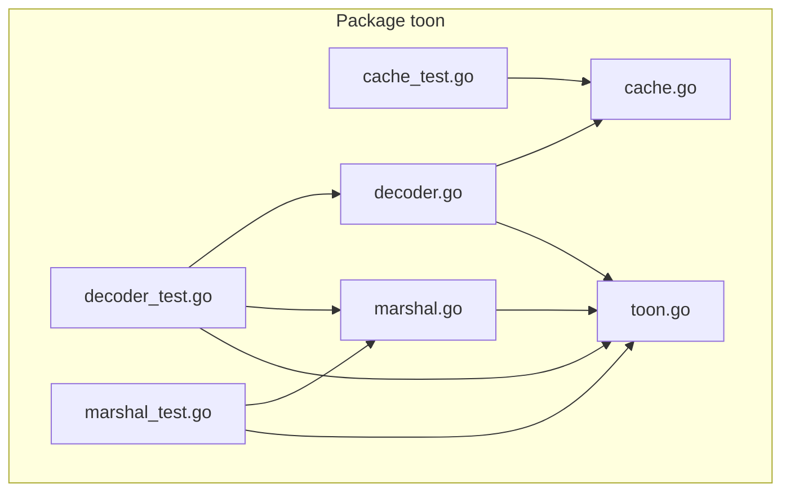
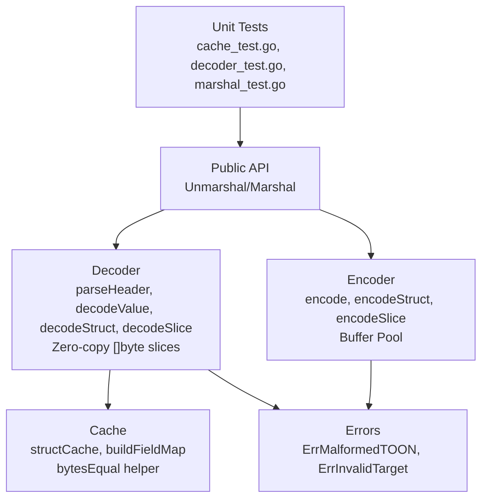
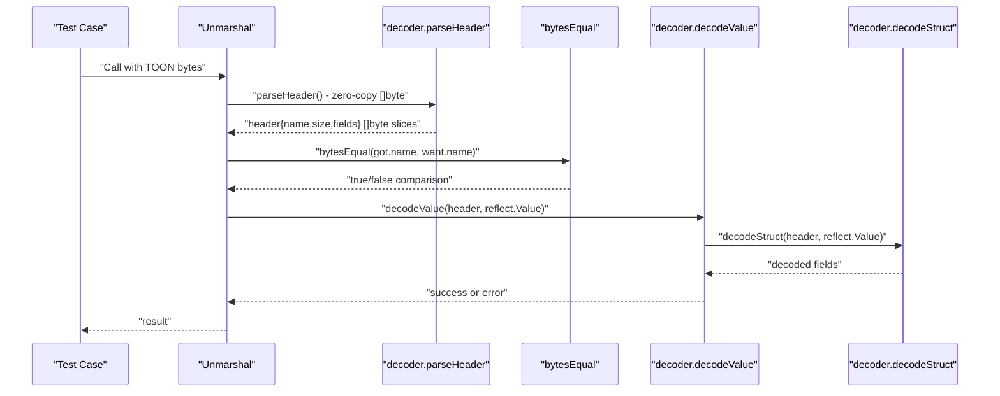
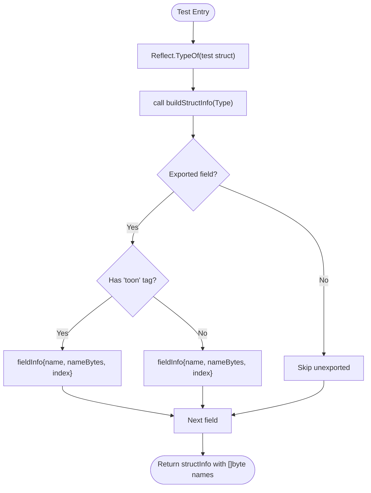
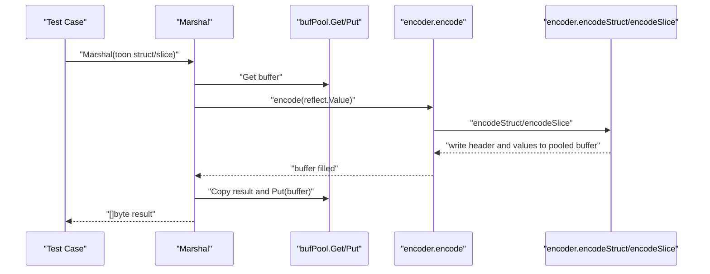
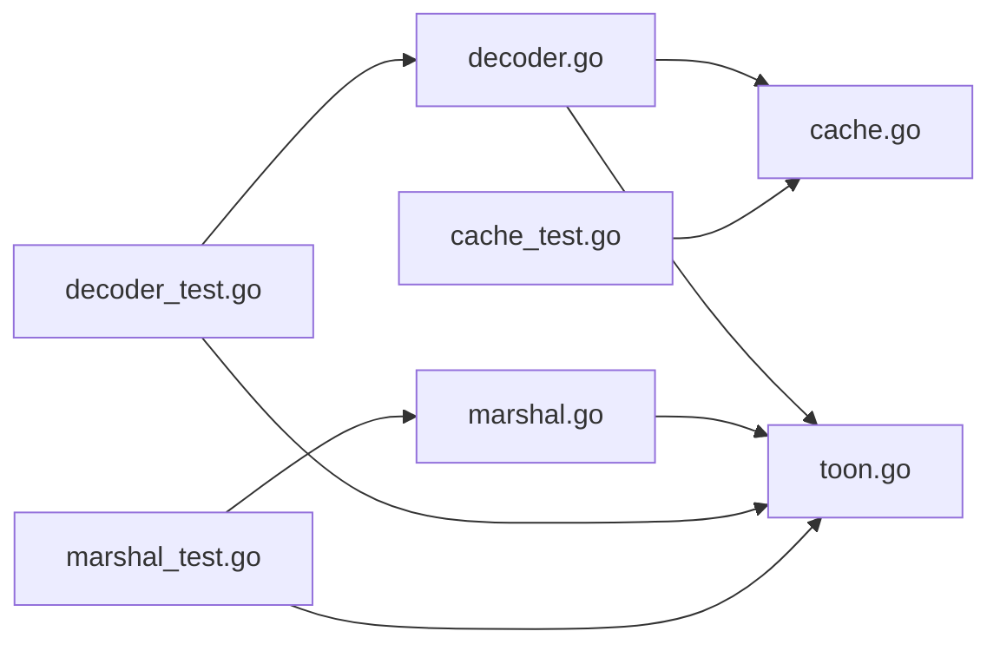

# Testing and Quality Assurance

<cite>
**Referenced Files in This Document**
- [cache_test.go](file://cache_test.go)
- [decoder_test.go](file://decoder_test.go)
- [marshal_test.go](file://marshal_test.go)
- [cache.go](file://cache.go)
- [decoder.go](file://decoder.go)
- [marshal.go](file://marshal.go)
- [toon.go](file://toon.go)
</cite>

## Update Summary
**Changes Made**
- Updated decoder and cache test sections to reflect zero-copy functionality implementation
- Added documentation for bytesEqual helper function and its usage in comparison logic
- Enhanced testing methodology for []byte header parsing results validation
- Updated performance considerations to highlight zero-allocation benefits

## Table of Contents
1. [Introduction](#introduction)
2. [Project Structure](#project-structure)
3. [Core Components](#core-components)
4. [Architecture Overview](#architecture-overview)
5. [Detailed Component Analysis](#detailed-component-analysis)
6. [Dependency Analysis](#dependency-analysis)
7. [Performance Considerations](#performance-considerations)
8. [Troubleshooting Guide](#troubleshooting-guide)
9. [Conclusion](#conclusion)
10. [Appendices](#appendices)

## Introduction
This document describes the testing strategies and quality assurance practices for the go-toon library. It explains how the test suite is organized, outlines unit test patterns for each component, and proposes integration testing approaches for end-to-end functionality. It also covers methodologies for validating parsing accuracy, encoding consistency, and unmarshaling reliability, along with performance testing, benchmarking, regression testing, coverage requirements, mocking strategies for I/O operations, and continuous integration practices. Finally, it provides contributor guidelines for writing effective tests and maintaining code quality.

## Project Structure
The repository is organized around a small set of core packages implementing TOON v3.0 encoding and decoding. Tests are co-located alongside implementation files, following Go conventions.

**Diagram sources**
- [cache_test.go](file://cache_test.go#L1-L86)
- [decoder_test.go](file://decoder_test.go#L1-L163)
- [marshal_test.go](file://marshal_test.go#L1-L147)
- [cache.go](file://cache.go#L1-L112)
- [decoder.go](file://decoder.go#L1-L417)
- [marshal.go](file://marshal.go#L1-L172)
- [toon.go](file://toon.go#L1-L19)

**Section sources**
- [cache_test.go](file://cache_test.go#L1-L86)
- [decoder_test.go](file://decoder_test.go#L1-L163)
- [marshal_test.go](file://marshal_test.go#L1-L147)
- [cache.go](file://cache.go#L1-L112)
- [decoder.go](file://decoder.go#L1-L417)
- [marshal.go](file://marshal.go#L1-L172)
- [toon.go](file://toon.go#L1-L19)

## Core Components
- Decoder and parsing: Validates header parsing, whitespace handling, and field extraction using zero-copy []byte slices; ensures robustness against malformed inputs.
- Cache and reflection: Ensures field map caching correctness and tag-based field selection with efficient []byte comparison using bytesEqual helper.
- Encoder and marshaling: Validates deterministic header generation and value encoding for supported types with zero-allocation buffer pooling.
- Error handling: Centralized error constants and validation of invalid targets.

Key testing patterns:
- Table-driven tests for parsing and unmarshaling scenarios with []byte validation.
- Unit tests for internal helpers (decoder primitives, cache building, bytesEqual comparison).
- Integration-like tests via public APIs (Unmarshal/Marshal) to validate end-to-end behavior.
- Zero-copy validation ensuring []byte slices reference original data without allocations.

**Section sources**
- [decoder_test.go](file://decoder_test.go#L26-L98)
- [decoder_test.go](file://decoder_test.go#L100-L163)
- [cache_test.go](file://cache_test.go#L15-L85)
- [cache.go](file://cache.go#L76-L97)
- [marshal_test.go](file://marshal_test.go#L18-L86)

## Architecture Overview
The testing architecture mirrors the implementation: tests exercise public APIs and internal helpers to ensure correctness across parsing, caching, and encoding with zero-copy optimizations.

**Diagram sources**
- [decoder_test.go](file://decoder_test.go#L1-L163)
- [cache_test.go](file://cache_test.go#L1-L86)
- [marshal_test.go](file://marshal_test.go#L1-L147)
- [decoder.go](file://decoder.go#L62-L111)
- [cache.go](file://cache.go#L76-L97)
- [marshal.go](file://marshal.go#L10-L38)
- [toon.go](file://toon.go#L5-L18)

## Detailed Component Analysis

### Decoder and Parsing Tests
Focus areas:
- Byte-by-byte navigation and peek semantics with zero-copy []byte slice validation.
- Header parsing with optional size and field lists using bytesEqual comparison.
- Struct and slice unmarshaling with CSV-like values and []byte field name matching.
- Error propagation for malformed inputs and invalid targets.

Recommended patterns:
- Use subtests to enumerate success and failure cases for header parsing with []byte validation.
- Validate position advancement and whitespace skipping with zero-copy semantics.
- Verify field ordering and presence in headers using bytesEqual helper function.
- Ensure unknown fields are safely skipped during decoding with efficient []byte comparison.

**Updated** Enhanced validation of []byte header parsing results using bytesEqual helper function for reliable comparison without allocations.

**Diagram sources**
- [decoder_test.go](file://decoder_test.go#L26-L98)
- [decoder_test.go](file://decoder_test.go#L100-L163)
- [decoder.go](file://decoder.go#L62-L111)
- [cache.go](file://cache.go#L86-L97)
- [decoder.go](file://decoder.go#L180-L225)

**Section sources**
- [decoder_test.go](file://decoder_test.go#L26-L98)
- [decoder_test.go](file://decoder_test.go#L100-L163)
- [decoder.go](file://decoder.go#L62-L111)
- [decoder.go](file://decoder.go#L180-L225)
- [cache.go](file://cache.go#L86-L97)

### Cache and Reflection Tests
Focus areas:
- Field map construction respects exported fields and "toon" tags with []byte optimization.
- Cache correctness under concurrent access using sync.Map.
- Deterministic field index mapping with efficient bytesEqual comparison.
- Zero-copy []byte slice usage for field name comparisons.

Recommended patterns:
- Build a test struct with mixed exported/unexported fields and tags.
- Verify cache hits reuse the same underlying map instance conceptually.
- Validate tag precedence over field names using bytesEqual for []byte comparisons.
- Test concurrent access patterns with multiple goroutines.

**Updated** Enhanced field map testing with bytesEqual helper function for efficient []byte slice comparison and validation of zero-copy []byte field names.

**Diagram sources**
- [cache_test.go](file://cache_test.go#L15-L53)
- [cache.go](file://cache.go#L39-L74)

**Section sources**
- [cache_test.go](file://cache_test.go#L15-L85)
- [cache.go](file://cache.go#L39-L74)
- [cache.go](file://cache.go#L76-L97)

### Encoder and Marshaling Tests
Focus areas:
- Deterministic header generation with optional size and field lists using buffer pooling.
- Value encoding for supported scalar types and nested slices with zero-allocation behavior.
- Nil pointer and empty slice handling with buffer pool management.
- Round-trip validation ensuring encoding/decoding consistency.

Recommended patterns:
- Compare produced bytes against expected TOON fragments using string conversion.
- Validate header composition and value separators with buffer pool efficiency.
- Ensure MarshalTo compatibility for streaming I/O with zero-copy optimizations.
- Test round-trip scenarios to validate encoding/decoding consistency.

**Updated** Enhanced validation of zero-allocation buffer pooling behavior and round-trip encoding/decoding consistency.

**Diagram sources**
- [marshal_test.go](file://marshal_test.go#L18-L86)
- [marshal.go](file://marshal.go#L17-L38)
- [marshal.go](file://marshal.go#L50-L137)

**Section sources**
- [marshal_test.go](file://marshal_test.go#L18-L117)
- [marshal.go](file://marshal.go#L17-L38)
- [marshal.go](file://marshal.go#L50-L137)

### Error Handling and Edge Cases
Focus areas:
- Invalid target validation for both Marshal and Unmarshal with specific error constants.
- Malformed syntax detection during parsing with ErrMalformedTOON.
- Type conversion failures during unmarshaling with efficient []byte parsing.
- Zero-copy error handling for []byte slice operations.

Recommended patterns:
- Assert specific error constants for invalid inputs using error comparison.
- Validate that partial progress does not occur on errors with zero-copy safety.
- Ensure robustness against trailing whitespace and missing separators with []byte parsing.
- Test edge cases with empty []byte slices and boundary conditions.

**Section sources**
- [decoder.go](file://decoder.go#L7-L21)
- [decoder.go](file://decoder.go#L312-L416)
- [toon.go](file://toon.go#L5-L8)

## Dependency Analysis
The decoder depends on the cache for field mapping and on shared error constants. The encoder depends on shared constants and uses a buffer pool. Tests depend on the public API and internal helpers with enhanced zero-copy validation.

**Diagram sources**
- [decoder.go](file://decoder.go#L1-L417)
- [cache.go](file://cache.go#L1-L112)
- [marshal.go](file://marshal.go#L1-L172)
- [toon.go](file://toon.go#L1-L19)
- [decoder_test.go](file://decoder_test.go#L1-L163)
- [cache_test.go](file://cache_test.go#L1-L86)
- [marshal_test.go](file://marshal_test.go#L1-L147)

**Section sources**
- [decoder.go](file://decoder.go#L1-L417)
- [cache.go](file://cache.go#L1-L112)
- [marshal.go](file://marshal.go#L1-L172)
- [toon.go](file://toon.go#L1-L19)
- [decoder_test.go](file://decoder_test.go#L1-L163)
- [cache_test.go](file://cache_test.go#L1-L86)
- [marshal_test.go](file://marshal_test.go#L1-L147)

## Performance Considerations
- Zero-allocation encoding: Buffer pooling reduces allocations; tests should verify correctness without asserting on allocation counts.
- Zero-copy parsing: Decoder uses []byte slices directly from input data; tests should validate []byte slice references without copying.
- Efficient comparison: bytesEqual helper function provides fast []byte comparison for field name matching; tests should validate comparison accuracy.
- Reflection caching: Field map caching avoids repeated reflection overhead; tests should validate cache hit semantics indirectly by ensuring consistent field mapping.
- Parsing efficiency: Decoder uses minimal allocations and in-place scanning; tests should validate behavior on large inputs without excessive memory churn.

Benchmarking recommendations:
- Benchmark Unmarshal and Marshal for typical struct and slice sizes with zero-copy validation.
- Measure throughput and latency across different payload compositions with []byte slice operations.
- Include benchmarks for hot paths: header parsing, field mapping, value conversion, and bytesEqual comparison.
- Test buffer pool utilization and zero-allocation behavior under load.

**Updated** Enhanced performance considerations for zero-copy functionality and bytesEqual helper optimization.

## Troubleshooting Guide
Common issues and resolutions:
- Unexpected errors on unmarshal: Verify target is a pointer to struct or slice; ensure input conforms to header syntax with []byte validation.
- Field mismatches: Confirm "toon" tags match header field names; unknown fields are ignored with bytesEqual comparison.
- Encoding inconsistencies: Validate that supported scalar types are encoded deterministically; nested slices are bracketed with buffer pool efficiency.
- Zero-copy validation failures: Ensure []byte slices reference original data correctly without unintended copying.
- bytesEqual comparison issues: Verify []byte length and content matching for field name comparisons.

**Updated** Added troubleshooting guidance for zero-copy functionality and bytesEqual helper issues.

**Section sources**
- [decoder.go](file://decoder.go#L7-L21)
- [decoder.go](file://decoder.go#L180-L225)
- [decoder.go](file://decoder.go#L312-L416)
- [marshal.go](file://marshal.go#L17-L38)
- [cache.go](file://cache.go#L86-L97)

## Conclusion
The go-toon library employs focused unit tests that validate parsing, caching, and encoding behavior with zero-copy optimizations. The existing tests cover core functionality, error conditions, and zero-allocation performance characteristics. Extending the suite with performance benchmarks, integration-style tests, and stricter coverage policies will further strengthen quality assurance, particularly for the new zero-copy functionality and bytesEqual helper optimization.

## Appendices

### Testing Methodologies and Coverage
- Parsing accuracy: Use table-driven tests to cover valid and invalid headers, sizes, and field lists with []byte validation.
- Encoding consistency: Compare produced bytes against canonical TOON fragments; validate header composition and value separators with buffer pool efficiency.
- Unmarshaling reliability: Test struct and slice decoding, unknown fields, and type conversions with zero-copy []byte operations.
- Coverage: Aim for high statement and branch coverage; prioritize critical paths (parsing, field mapping, type conversion, bytesEqual comparison).
- Zero-copy validation: Ensure []byte slices reference original data without allocations and validate bytesEqual helper accuracy.

**Updated** Enhanced testing methodologies for zero-copy functionality and bytesEqual helper validation.

### Mocking Strategies for I/O Operations
- For MarshalTo compatibility, mock io.Writer to capture encoded bytes and assert content with zero-copy efficiency.
- For performance tests, avoid real I/O by focusing on in-memory buffers and buffer pooling behavior with []byte slice operations.
- Test round-trip scenarios to validate encoding/decoding consistency without external dependencies.

**Updated** Enhanced mocking strategies for zero-copy buffer pooling and []byte slice operations.

### Continuous Integration Practices
- Run unit tests and race detector on pull requests with zero-copy validation.
- Enforce minimum coverage thresholds and fail builds below targets.
- Include benchmarks in CI to detect regressions; establish baselines for key workloads with zero-allocation metrics.
- Validate bytesEqual helper performance and zero-copy functionality in CI pipeline.

**Updated** Enhanced CI practices for zero-copy functionality validation.

### Contributor Guidelines
- Write table-driven tests for parsers and unmarshaling logic with []byte validation.
- Keep tests focused and deterministic; avoid external dependencies.
- Validate error conditions explicitly using error constants.
- Add benchmarks for performance-sensitive paths; update baselines when changing behavior.
- Test zero-copy functionality thoroughly with []byte slice validation and bytesEqual helper usage.
- Ensure backward compatibility when modifying zero-copy optimizations.

**Updated** Enhanced contributor guidelines for zero-copy functionality and bytesEqual helper usage.