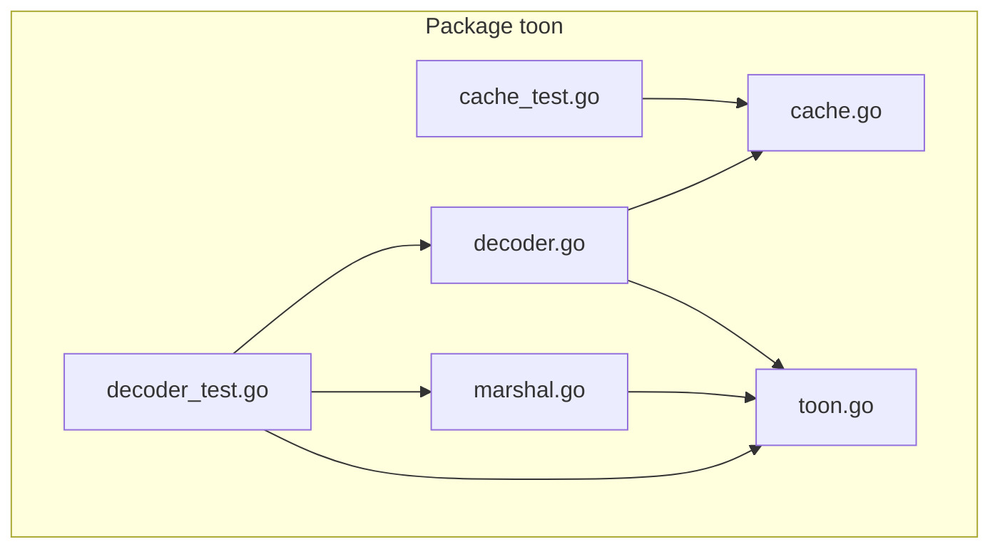
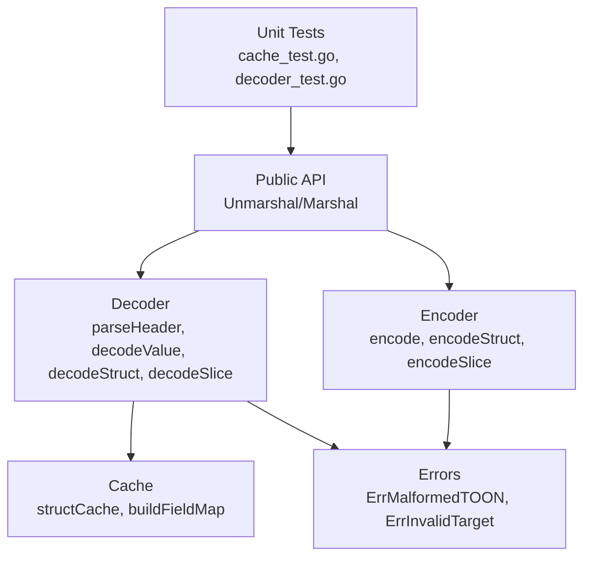
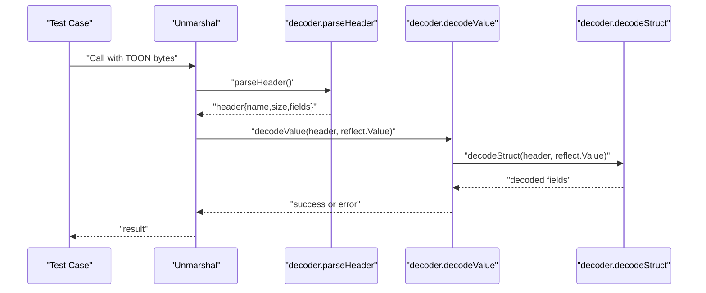
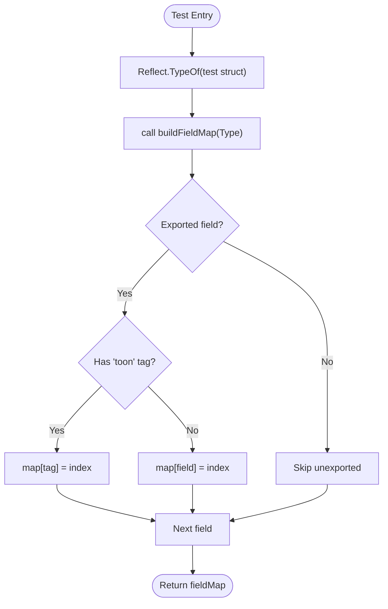
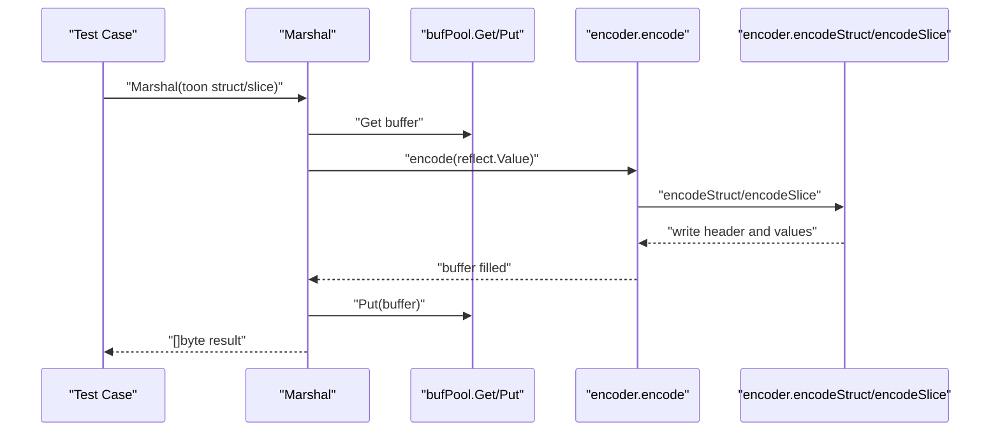
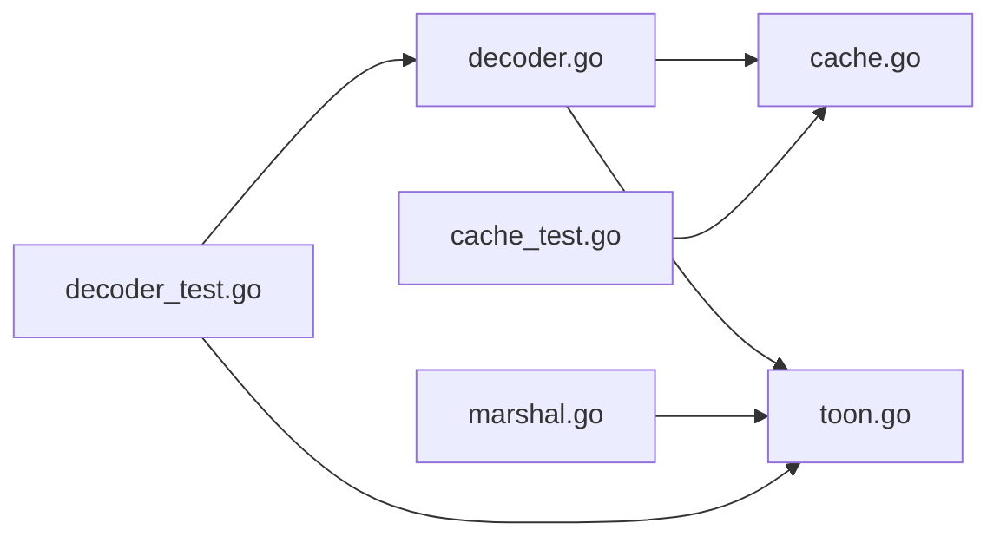

# Testing and Quality Assurance

<cite>
**Referenced Files in This Document**
- [cache_test.go](file://cache_test.go)
- [decoder_test.go](file://decoder_test.go)
- [cache.go](file://cache.go)
- [decoder.go](file://decoder.go)
- [marshal.go](file://marshal.go)
- [toon.go](file://toon.go)
</cite>

## Table of Contents
1. [Introduction](#introduction)
2. [Project Structure](#project-structure)
3. [Core Components](#core-components)
4. [Architecture Overview](#architecture-overview)
5. [Detailed Component Analysis](#detailed-component-analysis)
6. [Dependency Analysis](#dependency-analysis)
7. [Performance Considerations](#performance-considerations)
8. [Troubleshooting Guide](#troubleshooting-guide)
9. [Conclusion](#conclusion)
10. [Appendices](#appendices)

## Introduction
This document describes the testing strategies and quality assurance practices for the go-toon library. It explains how the test suite is organized, outlines unit test patterns for each component, and proposes integration testing approaches for end-to-end functionality. It also covers methodologies for validating parsing accuracy, encoding consistency, and unmarshaling reliability, along with performance testing, benchmarking, regression testing, coverage requirements, mocking strategies for I/O operations, and continuous integration practices. Finally, it provides contributor guidelines for writing effective tests and maintaining code quality.

## Project Structure
The repository is organized around a small set of core packages implementing TOON v3.0 encoding and decoding. Tests are co-located alongside implementation files, following Go conventions.

**Diagram sources**
- [cache_test.go](file://cache_test.go#L1-L60)
- [decoder_test.go](file://decoder_test.go#L1-L157)
- [cache.go](file://cache.go#L1-L68)
- [decoder.go](file://decoder.go#L1-L303)
- [marshal.go](file://marshal.go#L1-L172)
- [toon.go](file://toon.go#L1-L19)

**Section sources**
- [cache_test.go](file://cache_test.go#L1-L60)
- [decoder_test.go](file://decoder_test.go#L1-L157)
- [cache.go](file://cache.go#L1-L68)
- [decoder.go](file://decoder.go#L1-L303)
- [marshal.go](file://marshal.go#L1-L172)
- [toon.go](file://toon.go#L1-L19)

## Core Components
- Decoder and parsing: Validates header parsing, whitespace handling, and field extraction; ensures robustness against malformed inputs.
- Cache and reflection: Ensures field map caching correctness and tag-based field selection.
- Encoder and marshaling: Validates deterministic header generation and value encoding for supported types.
- Error handling: Centralized error constants and validation of invalid targets.

Key testing patterns:
- Table-driven tests for parsing and unmarshaling scenarios.
- Unit tests for internal helpers (decoder primitives, cache building).
- Integration-like tests via public APIs (Unmarshal/Marshal) to validate end-to-end behavior.

**Section sources**
- [decoder_test.go](file://decoder_test.go#L8-L94)
- [decoder_test.go](file://decoder_test.go#L96-L157)
- [cache_test.go](file://cache_test.go#L15-L60)
- [cache.go](file://cache.go#L45-L67)
- [marshal.go](file://marshal.go#L17-L38)

## Architecture Overview
The testing architecture mirrors the implementation: tests exercise public APIs and internal helpers to ensure correctness across parsing, caching, and encoding.

**Diagram sources**
- [decoder_test.go](file://decoder_test.go#L1-L157)
- [cache_test.go](file://cache_test.go#L1-L60)
- [decoder.go](file://decoder.go#L1-L303)
- [marshal.go](file://marshal.go#L1-L172)
- [cache.go](file://cache.go#L1-L68)
- [toon.go](file://toon.go#L5-L18)

## Detailed Component Analysis

### Decoder and Parsing Tests
Focus areas:
- Byte-by-byte navigation and peek semantics.
- Header parsing with optional size and field lists.
- Struct and slice unmarshaling with CSV-like values.
- Error propagation for malformed inputs and invalid targets.

Recommended patterns:
- Use subtests to enumerate success and failure cases for header parsing.
- Validate position advancement and whitespace skipping.
- Verify field ordering and presence in headers.
- Ensure unknown fields are safely skipped during decoding.

**Diagram sources**
- [decoder_test.go](file://decoder_test.go#L8-L94)
- [decoder_test.go](file://decoder_test.go#L96-L157)
- [decoder.go](file://decoder.go#L8-L22)
- [decoder.go](file://decoder.go#L70-L115)
- [decoder.go](file://decoder.go#L175-L229)

**Section sources**
- [decoder_test.go](file://decoder_test.go#L8-L94)
- [decoder_test.go](file://decoder_test.go#L96-L157)
- [decoder.go](file://decoder.go#L8-L22)
- [decoder.go](file://decoder.go#L70-L115)
- [decoder.go](file://decoder.go#L175-L229)

### Cache and Reflection Tests
Focus areas:
- Field map construction respects exported fields and "toon" tags.
- Cache correctness under concurrent access.
- Deterministic field index mapping.

Recommended patterns:
- Build a test struct with mixed exported/unexported fields and tags.
- Verify cache hits reuse the same underlying map instance conceptually.
- Validate tag precedence over field names.

**Diagram sources**
- [cache_test.go](file://cache_test.go#L15-L42)
- [cache.go](file://cache.go#L45-L67)

**Section sources**
- [cache_test.go](file://cache_test.go#L15-L42)
- [cache.go](file://cache.go#L45-L67)

### Encoder and Marshaling Tests
Focus areas:
- Deterministic header generation with optional size and field lists.
- Value encoding for supported scalar types and nested slices.
- Nil pointer and empty slice handling.
- Zero-allocation behavior via buffer pooling.

Recommended patterns:
- Compare produced bytes against expected TOON fragments.
- Validate header composition and value separators.
- Ensure MarshalTo compatibility for streaming I/O.

**Diagram sources**
- [marshal.go](file://marshal.go#L17-L38)
- [marshal.go](file://marshal.go#L50-L137)
- [marshal.go](file://marshal.go#L10-L15)

**Section sources**
- [marshal.go](file://marshal.go#L17-L38)
- [marshal.go](file://marshal.go#L50-L137)
- [marshal.go](file://marshal.go#L10-L15)

### Error Handling and Edge Cases
Focus areas:
- Invalid target validation for both Marshal and Unmarshal.
- Malformed syntax detection during parsing.
- Type conversion failures during unmarshaling.

Recommended patterns:
- Assert specific error constants for invalid inputs.
- Validate that partial progress does not occur on errors.
- Ensure robustness against trailing whitespace and missing separators.

**Section sources**
- [decoder.go](file://decoder.go#L8-L22)
- [decoder.go](file://decoder.go#L269-L302)
- [toon.go](file://toon.go#L5-L8)

## Dependency Analysis
The decoder depends on the cache for field mapping and on shared error constants. The encoder depends on shared constants and uses a buffer pool. Tests depend on the public API and internal helpers.

**Diagram sources**
- [decoder.go](file://decoder.go#L1-L303)
- [cache.go](file://cache.go#L1-L68)
- [marshal.go](file://marshal.go#L1-L172)
- [toon.go](file://toon.go#L1-L19)
- [decoder_test.go](file://decoder_test.go#L1-L157)
- [cache_test.go](file://cache_test.go#L1-L60)

**Section sources**
- [decoder.go](file://decoder.go#L1-L303)
- [cache.go](file://cache.go#L1-L68)
- [marshal.go](file://marshal.go#L1-L172)
- [toon.go](file://toon.go#L1-L19)
- [decoder_test.go](file://decoder_test.go#L1-L157)
- [cache_test.go](file://cache_test.go#L1-L60)

## Performance Considerations
- Zero-allocation encoding: Buffer pooling reduces allocations; tests should verify correctness without asserting on allocation counts.
- Reflection caching: Field map caching avoids repeated reflection overhead; tests should validate cache hit semantics indirectly by ensuring consistent field mapping.
- Parsing efficiency: Decoder uses minimal allocations and in-place scanning; tests should validate behavior on large inputs without excessive memory churn.

Benchmarking recommendations:
- Benchmark Unmarshal and Marshal for typical struct and slice sizes.
- Measure throughput and latency across different payload compositions.
- Include benchmarks for hot paths: header parsing, field mapping, and value conversion.

[No sources needed since this section provides general guidance]

## Troubleshooting Guide
Common issues and resolutions:
- Unexpected errors on unmarshal: Verify target is a pointer to struct or slice; ensure input conforms to header syntax.
- Field mismatches: Confirm "toon" tags match header field names; unknown fields are ignored.
- Encoding inconsistencies: Validate that supported scalar types are encoded deterministically; nested slices are bracketed.

**Section sources**
- [decoder.go](file://decoder.go#L8-L22)
- [decoder.go](file://decoder.go#L175-L229)
- [decoder.go](file://decoder.go#L269-L302)
- [marshal.go](file://marshal.go#L139-L171)

## Conclusion
The go-toon library employs focused unit tests that validate parsing, caching, and encoding behavior. The existing tests cover core functionality and error conditions. Extending the suite with performance benchmarks, integration-style tests, and stricter coverage policies will further strengthen quality assurance.

[No sources needed since this section summarizes without analyzing specific files]

## Appendices

### Testing Methodologies and Coverage
- Parsing accuracy: Use table-driven tests to cover valid and invalid headers, sizes, and field lists.
- Encoding consistency: Compare produced bytes against canonical TOON fragments; validate header composition and value separators.
- Unmarshaling reliability: Test struct and slice decoding, unknown fields, and type conversions.
- Coverage: Aim for high statement and branch coverage; prioritize critical paths (parsing, field mapping, type conversion).

[No sources needed since this section provides general guidance]

### Mocking Strategies for I/O Operations
- For MarshalTo compatibility, mock io.Writer to capture encoded bytes and assert content.
- For performance tests, avoid real I/O by focusing on in-memory buffers and buffer pooling behavior.

[No sources needed since this section provides general guidance]

### Continuous Integration Practices
- Run unit tests and race detector on pull requests.
- Enforce minimum coverage thresholds and fail builds below targets.
- Include benchmarks in CI to detect regressions; establish baselines for key workloads.

[No sources needed since this section provides general guidance]

### Contributor Guidelines
- Write table-driven tests for parsers and unmarshaling logic.
- Keep tests focused and deterministic; avoid external dependencies.
- Validate error conditions explicitly using error constants.
- Add benchmarks for performance-sensitive paths; update baselines when changing behavior.

[No sources needed since this section provides general guidance]